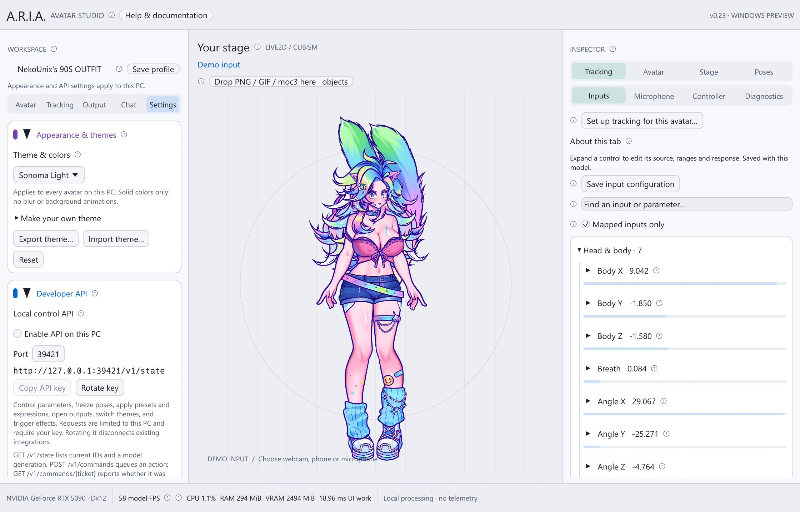

# A.R.I.A. — Avatar Studio

[](https://github.com/NekoUnix/A.R.I.A/actions/workflows/windows.yml)
[](https://github.com/NekoUnix/A.R.I.A/actions/workflows/repository.yml)

[User guides](docs/README.md) · [Contribute](CONTRIBUTING.md) ·
[Code review and releases](docs/development.md) · [Report a bug](https://github.com/NekoUnix/A.R.I.A/issues/new/choose)

A Windows-first avatar app built in Rust with egui and wgpu. Run **Live2D**, **VRM
0.x / 1.0**, or **PNG/GIF** avatars, connect tracking, build expressions and effects,
and send compact-preview, full-resolution canvases to OBS.


## New in v0.23

- **Webcam tracking:** local MediaPipe facial inference, camera discovery, rate /
  resolution controls, setup and repair, and integration with per-avatar calibration.
- **NVIDIA RTX tracking integration:** an optional FaceExpressions SDK adapter and
  build/setup tools. Requires separately installed NVIDIA SDK features. Native RTX
  execution is not yet validated; see the exact [setup and validation boundary](docs/webcam.md).
- **Themes:** six palettes, editable colors, saved custom themes and JSON import/export.
- **Control API:** authenticated local HTTP for parameters, poses, presets, expressions,
  outputs, themes and effects, with command-result tickets and avatar-switch protection.
- **Updated illustrated documentation** using the owner's supplied Odette artwork.

## Start on Windows

1. Download the **aria-windows-x64** artifact from a successful [Windows workflow](https://github.com/NekoUnix/A.R.I.A/actions/workflows/windows.yml).
2. Extract the artifact, then extract `aria-0.23.0-windows-x64.zip` inside it.
3. Run `aria-desktop.exe`. The built-in Mica puppet needs no extra files.
4. Open **Avatar → Avatar & appearance → Import avatar** and choose PNG/GIF,
   Live2D or VRM. Follow the guided import. Live2D needs your official Cubism Core
   x64 DLL plus exported model files; VRM and images do not.
5. Open **Tracking** and choose webcam, NVIDIA RTX, VTube Studio on iPhone,
   external ARIA JSON, local microphone/manual input, or Demo. Camera tracking
   requires its optional runtime installation; RTX additionally requires NVIDIA's SDK.
6. Run **Guided tracking setup**, review the learned motion and save for this avatar.
7. Open **Output** to enable landscape 16:9, portrait 9:16 and/or Freeform. Use
   the named Spout sender in OBS for the configured full-resolution canvas.

Detailed [Windows installation and build instructions](docs/windows.md),
[illustrated documentation index](docs/README.md), and [compatibility / validation](docs/validation.md).

## Your workspace

Left pages: **Avatar / Tracking / Output / Chat / Settings**. The Inspector groups
model-specific tools into **Tracking / Avatar / Stage / Poses**. Categories collapse;
only relevant controls appear for the selected avatar type. Hover a circled **?**
for a short explanation, or click it for searchable offline help in a separate window.



| Feature | Guide |
| --- | --- |
| Webcam / optional NVIDIA RTX inference | [Camera setup](docs/webcam.md) |
| iPhone VTube Studio / external JSON | [Tracking sources and protocol](docs/tracking.md) |
| Personal neutral pose and movement ranges | [Guided calibration](docs/tracking-setup.md) |
| Xbox, PlayStation, Switch and mapped gamepads | [Controller support](docs/controllers.md) |
| Parameter ranges, stepping, holds and presets | [Input controls](docs/input-controls.md) |
| Live2D imports, SDK and limitations | [Live2D](docs/live2d.md) |
| VRM imports, expressions and spring bones | [VRM](docs/vrm.md) |
| Nested model folders and movable/pinned objects | [Model folders and pins](docs/model-folders-and-pins.md) |
| Physics tuning, per avatar and per group | [Physics](docs/physics.md) |
| Expression files and custom hotkeys | [Expressions](docs/expressions.md) |
| OBS resolution, transparency and chroma colors | [Outputs](docs/obs-output.md) |
| Twitch / YouTube login and chat appearance | [Streaming chat](docs/streaming-chat.md) |
| Themes, palettes, custom colors and sharing | [Themes](docs/themes.md) |
| Script control and plugin development | [HTTP API](docs/api.md) |
| Throws, sprays, sounds, deformation and templates | [Effects templates](templates/effects/README.md) |
| GIF/PNG actions, talking, transitions and animation | [Image templates](templates/images/README.md) |
| All contextual control explanations | [Offline help](docs/in-app-help.md) |

Avatar preferences, mappings, physics, presets, expressions and stage objects save
per model. Themes, API credentials, SDK paths and Windows priority are PC settings.
The status bar reports frame rate, VRAM, CPU and memory. High priority is optional;
it can reduce scheduling contention but cannot fix GPU overload.

## Development

Work on a short-lived branch and open a pull request. Follow the
[contribution guide](CONTRIBUTING.md) for setup, validation and independent review,
and the [development policy](docs/development.md) for CI, release steps and the
current GitHub-plan limit on enforced branch protection. Design discussions belong
in [Discussions](https://github.com/NekoUnix/A.R.I.A/discussions); reproducible
problems and proposed features belong in Issues.

Use the pinned Rust toolchain and Windows C++ build prerequisites described in
[docs/windows.md](docs/windows.md). From this checkout:

```powershell
cargo run --locked -p aria-desktop
cargo fmt --all --check
cargo clippy --locked --workspace --all-targets --all-features -- -D warnings
cargo test --locked --workspace --all-features
./scripts/build-windows.ps1
```

The package includes executables, instructions, examples, runtime setup scripts,
tracking adapters and dependency licenses. Camera inference is optional and runs
in a managed Python process; the application and render pipeline remain Rust.
See [architecture](docs/architecture.md), [API examples](templates/api/README.md)
and [validation](docs/validation.md). Source is MIT; third-party runtimes and
avatar art retain their separate licenses. Read [THIRD_PARTY.md](THIRD_PARTY.md).

## Artwork and compatibility

Documentation screenshots use the owner's supplied NekoUnix / Odette Live2D,
GIF and VRM models with permission for this documentation update. Screenshot
permission does **not** grant rights to reuse the artwork. Raw avatar files,
textures, account credentials and Cubism/NVIDIA SDK binaries are not distributed.
See [screenshot provenance](docs/images/README.md).

This is a development build. Live2D motion3/pose3 playback and Cubism advanced
offscreen blending remain unsupported. Read the model-specific guides for other
limits; no engine can automatically correct missing or incorrectly authored rigs.
