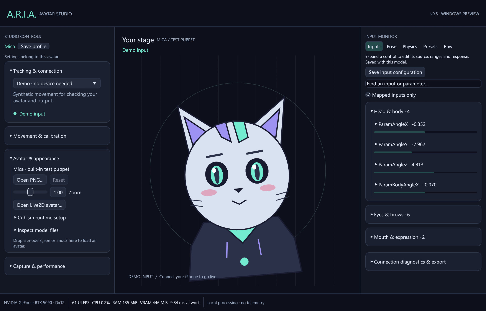
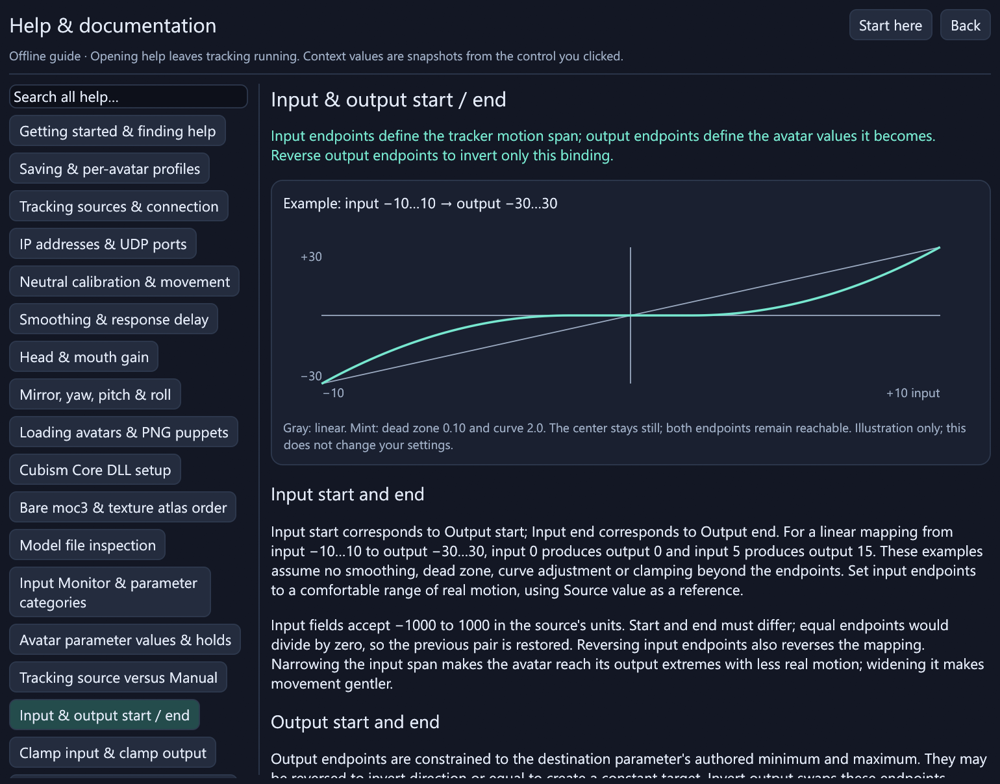
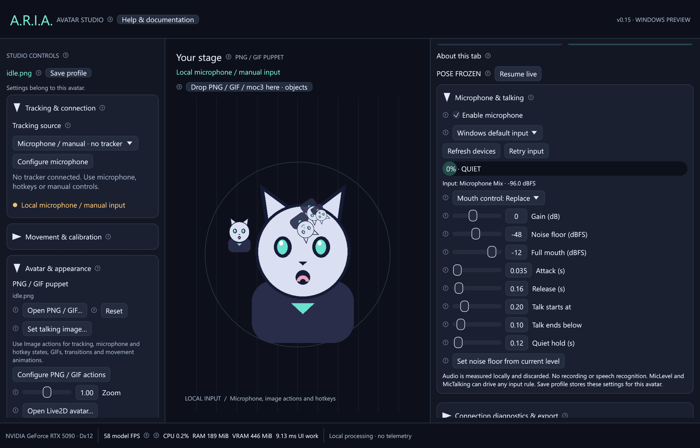
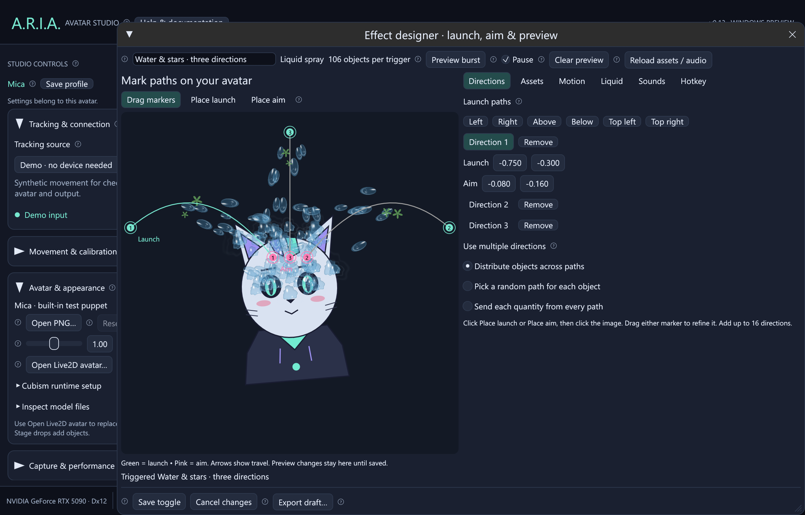
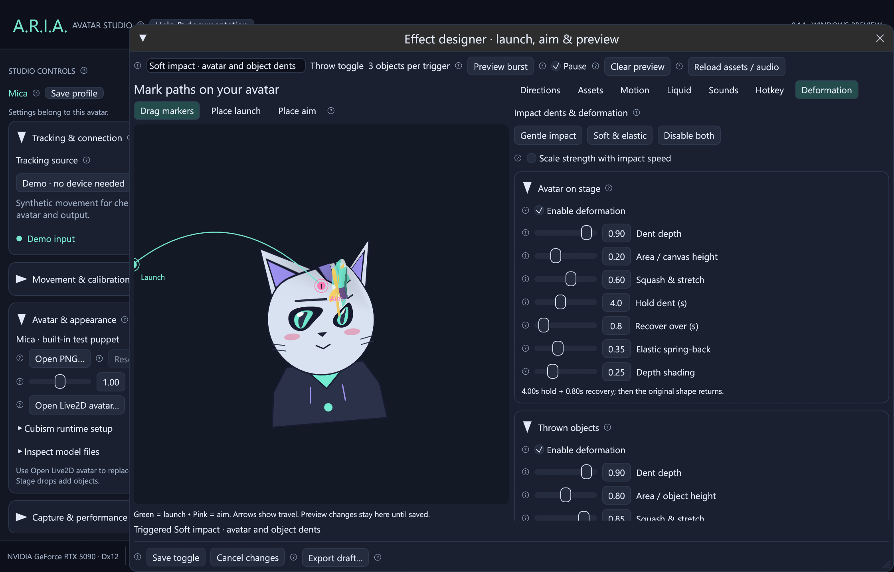
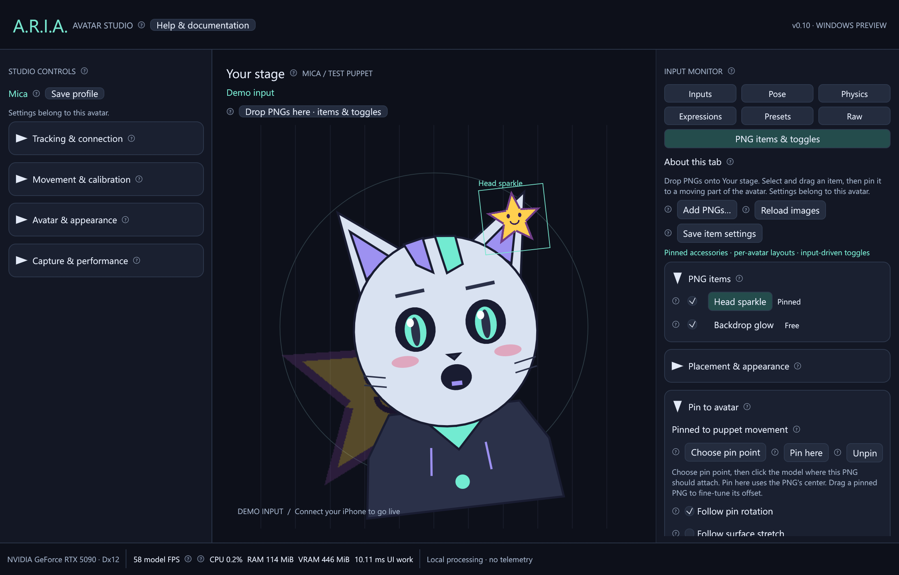

# A.R.I.A.

A Windows-first, native Rust foundation for a modular avatar runtime. This first
development build connects directly to **VTube Studio on iPhone**, maps facial
tracking into avatar parameters, and animates **Live2D `.moc3` avatars**, a built-in
2D test puppet, or your PNG/GIF artwork. The UI and preview run on **egui + wgpu**,
without Unity or Godot.

> **v0.15:** adds PNG/GIF action states and Windows microphone talking input.
> Assign artwork to tracking/parameter ranges or hotkeys, configure fades and
> shake/jump/blip/pulse/wobble/bob animations, and tune GIF speed and looping.
> Microphone sensitivity, smoothing and talk/quiet thresholds save per avatar.
> GIFs also work as stage accessories and thrown assets.
> Includes configurable impact dents and deformation for the avatar and
> each thrown object. Set depth, area, squash, hold, recovery, spring-back and shading
> independently in the visual effect designer. Responses follow the hit surface,
> pause for screenshots and reset cleanly. Existing designs remain opt-in.
> Drag launch and aim markers, use up to 16 directions, and choose exact quantities
> of each PNG, independent Live2D or static 3D asset. Preview a draft before saving.
> Configure speed, gravity, resistance, bounce, stick probability, scene duration,
> fade, sounds and a custom hotkey. Settings remain per design and per avatar.
> Anime water has transparent depth, white highlights, splash crowns and adjustable
> gloss, clarity, viscosity, drips, stretch and color, with water/paint/slime presets.
> Includes editable templates and the existing local API for stream-tool events.
> Independent pinnable Live2D/PNG stage objects retain their own settings and toggles.
> Question-mark buttons are half their previous size, with hover explanations,
> and a separate searchable offline help window with examples and diagrams.
> Contextual help includes the loaded avatar's parameters, ranges, physics groups
> and expression values. Includes landscape, portrait and Freeform outputs with compact previews,
> selectable full-resolution Spout output to OBS, dragging and mouse-wheel scaling.
> Includes GPU/buffer reuse and an opt-in Windows High priority setting.
> Live2D expressions, custom shortcuts and output layouts save per avatar.
> Includes editable input response, frozen poses, presets, Windows hotkeys and PNG export.
> Supply the official **Cubism Core x64 DLL** and your exported avatar assets.
> Motion3/pose3 playback and Cubism 5.3 advanced/offscreen
> blending remain future work. SDK binaries and model art are not bundled.
> [Live2D setup and compatibility →](docs/live2d.md)



Hover a **circled ?** beside a control for its explanation. Click it for the full
guide in a separate resizable window, or open **Help & documentation** from the
header. Search covers all help text; Back returns to previous topics. Keyboard:
Tab to focus a question mark, then Enter or Space. Help works offline and leaves
tracking running. Capture output windows stay free of help overlays.

The [bundled control reference](docs/in-app-help.md) documents tracking, individual
input ranges and stepping, pose holds, expressions, presets, physics, OBS, saving
and performance. Avatar-specific context is captured when you click the control;
reopen its question mark to refresh those values.



## PNG/GIF avatars and microphone input



1. Choose **Avatar & appearance → Open PNG / GIF** for the base artwork.
2. Open **PNG / GIF actions** in the Input Monitor. Add Talking, Quiet, Blink,
   custom input-range or manual/hotkey states. Higher priority wins; Idle is a fallback.
3. Configure **Fade & transition**, **Animation on change**, and **GIF playback**
   for each action. Use **Activate / hold image** to try it and **Resume automatic
   actions** to return. An assigned hotkey toggles the same manual selection.
4. For voice control, open **Microphone**, enable a device, and tune the live meter.
   **Microphone / manual · no tracker** removes demo movement without needing a phone.
   Use Replace or Combine to drive a Live2D mouth, or route MicLevel/MicTalking into
   arbitrary inputs and stage-object toggles. Audio is measured locally and discarded.
5. **Save actions** saves the library per avatar. **Pose → Freeze** holds tracking,
   GIFs, fades and motion for transparent PNG export. All three OBS outputs use
   the same animated scene. PNG/GIF stage objects and throws are supported too.

The [editable image starter pack](templates/images/README.md) includes idle/talking/
blink PNGs, an animated GIF, an SVG drawing template and an importable action library.
Export actions creates your own reusable JSON. Reopening a base image restores its
profile; the last image avatar also reopens on startup.

Up to 128 actions per avatar; 4096×4096 images and 32 MiB files. GIFs have limits of
256 frames/128 MiB decoded and collections have a 256 MiB decoded budget. See the
[offline help](docs/in-app-help.md) for all controls, units and microphone setup.

## Throws, liquid sprays and stream events



Open **Throws & liquid sprays → New throw / New spray**, or select an existing
design and click **Edit toggle / directions…**. A popup shows your live avatar.

1. In **Directions**, add launch paths and drag the green launch and pink aim markers.
   Use **Place launch / Place aim** to set either point with a click on the image.
   Distribute objects across paths, randomize paths, or send each quantity from every path.
2. In **Assets**, select multiple files and set the quantity of each. Zero skips an asset.
3. In **Motion**, set speed, flight arc, spin, gravity, resistance, recoil and bounce.
   **Stick probability** blends bouncing and surface attachment from 0% to 100%.
   Set **Stay after impact** (up to 120 seconds) and a separate fade-out time.
4. For sprays, use **Liquid** to choose color/opacity and water, paint or slime styling.
   **Sounds** selects launch/impact clips; **Hotkey** assigns your shortcut.
5. In **Deformation**, enable **Avatar on stage** and/or **Thrown objects**. Tune
   dent depth, area, squash, hold, recovery, elasticity and shading independently.
   New throws start with Gentle impact; existing designs keep their current behavior.
6. Click **Preview burst**, then **Save toggle**. Cancel discards the draft. Preview
   effects remain in the editor; saved designs play on the stage and all OBS outputs.

Settings belong to the current avatar. Frozen poses pause stage effects for PNG export.
Existing designs load with their old counts and fade; opening an old pooled design
converts its count into explicit quantities while keeping the total. One hotkey press
emits one burst. The full burst is limited to 1,000 objects and 256 can be active at once.
Water is a detailed anime particle effect with surface pins; it does not simulate
volumetric fluid or refract the avatar texture. Rebounds use a 2D aim-plane check.

The [effect template kit](templates/effects/README.md) includes editable SVG/PNG,
OBJ/MTL, GLB/glTF/FBX, a Live2D export layout, WAV audio and JSON design examples.
[Plugin setup](templates/effects/plugins/README.md) covers buttons, hotkeys,
Streamer.bot/Twitch events, Touch Portal and a versioned authenticated local API.
Stream tools handle their own service login; ARIA does not connect directly to Twitch.
3D imports are static props, without skeletal/VRM animation or specialized shaders.
Effects audio uses Windows' default output; capture ARIA audio separately in OBS.
Detailed limits and every control are explained in the [offline help](docs/in-app-help.md).

## Impact dents and deformation



Open **Throws & liquid sprays → Edit toggle / directions… → Deformation**.
Use **Gentle impact** or **Soft & elastic** as a starting point, then configure
the avatar and thrown objects separately. **Scale strength with impact speed**
makes faster throws hit harder. Each object has its own response, including copies
of the same PNG, Live2D or 3D asset. A temporary avatar dent follows the animated
hit surface and can finish recovering after the thrown object disappears.

**Hold dent** controls time at peak strength; **Recover over** controls the return
to the original shape. **Elastic spring-back** adds a damped wobble, and **Depth
shading** controls the visual depth. Pause or Freeze holds the response; Clear
active effects removes it. Save toggle stores the settings per design and per avatar.

The effect warps the rendered 2D geometry, including the appearance of 3D props.
Source meshes, rig parameters and texture files are unchanged. Up to 24 localized
avatar dents coexist, with bounded overlap. See the [in-app control reference](docs/in-app-help.md)
for units, limits, recovery examples and independent object timing.

## Live2D objects, PNG accessories and toggles



Drop PNG/GIF, `.moc3` or `.model3.json` files onto **Your stage**, then open
**Stage objects & toggles** in the right
panel. Drag an item into place and choose **Pin here**, or **Choose pin point**
and click the avatar. Live2D pins follow the selected mesh's animated vertices;
Mica and PNG puppet pins follow head movement. Configure size, offsets, rotation,
opacity, front/back layers, drag locking and optional rotation/stretch/visibility following.

Each item gets a name and master visibility toggle. Use **Input toggle** to show
it while a tracking input or final model parameter is in a chosen range, or to
toggle once on entry. Hysteresis prevents boundary flicker. **Keyboard toggle**
accepts a custom shortcut. Frozen pose presets preserve accessory visibility;
manual toggles remain available for screenshots. Movement and pose presets
store layouts per avatar. Keep object files in a stable folder: profiles reference
their paths and do not embed the artwork. See the [complete item guide](docs/in-app-help.md).

For Live2D objects, keep the matching `.model3.json` and texture folders beside
the `.moc3`. A bare export can use **Live2D object → Object texture setup** to
set the atlas PNGs in index order. Use **Object parameters** to pose that object;
its controls do not change the main avatar. **Animate object from tracking**
enables its own mappings and optional physics. Use **Open Live2D avatar** in the
left panel when you want to replace the main avatar. See the
[Live2D object guide](docs/live2d.md#pinnable-live2d-objects).

## Run on Windows

**Without a Rust installation:** open [Windows build artifacts](https://github.com/NekoUnix/A.R.I.A/actions/workflows/windows.yml),
select a successful run for `main`, download `aria-windows-x64`, and extract both
the artifact ZIP and the app ZIP inside it. Run `aria-desktop.exe`. GitHub requires
sign-in to download workflow artifacts. Artifacts expire after 30 days; a new
workflow run creates a new one.

**From source:** install Rust and the Visual Studio **Desktop development with
C++** workload, including MSVC x64 tools and a Windows SDK. Then open PowerShell:

```powershell
git clone https://github.com/NekoUnix/A.R.I.A.git
cd A.R.I.A
cargo run --locked --release -p aria-desktop
```

Cargo installs the compiler pinned in `rust-toolchain.toml` through rustup on first
use. Initial compilation downloads dependencies and takes several minutes.

**[Detailed Windows installation, build, OBS and troubleshooting guide →](docs/windows.md)**

## Connect an iPhone

1. Put the Windows PC and iPhone on the same trusted local network. Ethernet on
   the PC and Wi-Fi on the phone are fine if they share that network.
2. In VTube Studio on iPhone, start face tracking and enable **3rd Party PC
   Clients** in the first settings tab. Find the phone's IPv4 address and request
   port in the app. The documented default request port is `21412`.
3. In A.R.I.A., choose **iPhone · VTube Studio**, enter that phone address, leave
   **PC receive port** at `11125` unless another app uses it, and select **Connect
   tracking**. Permit the app on **Private networks** if Windows asks.
4. Wait for **Tracking live**, look straight ahead, and select **Calibrate neutral
   pose**. Blink, open your mouth and turn your head to check the preview and meters.

This uses the documented [VTube Studio third-party UDP protocol](https://github.com/DenchiSoft/VTubeStudioBlendshapeUDPReceiverTest),
not its desktop WebSocket plugin API. VTube Studio on the PC, Steam, a VTS plugin
token, and USB pairing are not required. This integration uses LAN networking;
it does not implement VTS's proprietary USB transport.

**[Tracking setup, ports, protocol, simulator and troubleshooting →](docs/tracking.md)**

## Load a Live2D avatar

1. Download and extract the official [Cubism Native SDK](https://www.live2d.com/en/sdk/download/native/)
   under its applicable terms. No C++ bridge build is required.
2. Expand **Cubism runtime setup** in the Avatar panel. Choose
   `Core/dll/windows/x86_64/Live2DCubismCore.dll` with **Select Core DLL…**.
3. Select **Open Live2D avatar…** and choose your exported `.model3.json` or `.moc3`.
   Keep the complete model folder, including its texture atlases, together.
4. Demo input animates the rig immediately. Connect your iPhone to use live tracking;
   **Input Monitor → Inputs** edits sources, ranges, stepping and response.
5. Use **Pose** to hold the avatar and export a transparent PNG. **Presets** saves
   movement setups or complete screenshot poses, with optional Windows hotkeys.
6. Open **Expressions**, toggle the avatar's `.exp3.json` files, and select a name
   to assign your own modifier/key combination. The same shortcut toggles it off.

**[Expression files, blending and custom shortcuts →](docs/expressions.md)**

**[Input tuning, pose controls, presets and hotkeys →](docs/input-controls.md)**

**[Global/group physics and independent model profiles →](docs/physics.md)**

**[OBS outputs, Freeform sizing and custom key colors →](docs/obs-output.md)**

A `.moc3` selection finds its matching manifest beside it. Without a manifest,
the import dialog lets you select/reorder the required texture atlases explicitly.
The same avatar is rendered in the studio and the OBS output window.
See [the detailed import guide](docs/live2d.md) for limits and troubleshooting.

## Included in this first copy

- Native desktop app with an original animated test puppet, PNG/JPEG/GIF artwork, microphone input and
  configurable image action states, neutral-pose calibration, smoothing, gains and axis correction.
- Actual `.moc3` model loading, texture atlas rendering, regular/inverted clipping,
  multiply/screen colors, parameter range clamping and editable tracking assignments.
- Automatic adjacent `.vtube.json` assignment import, including custom mouth/cheek
  controls and authored ranges; `.cdi3.json` parameter names and `.physics3.json`
  particle chains for hair, ears, tail and clothing, with breathing and motion controls.
- Direct VTS iOS UDP subscription and renewal; all incoming blendshapes retained
  for inspection, with 12 standard Cubism-style parameters mapped for the preview.
- Versioned **ARIA JSON v1** UDP input for other tools and custom bridges.
- **16:9 landscape**, **9:16 portrait**, and resizable **Freeform** outputs, usable
  together, with independent dragging, wheel scaling, background and on-top controls.
  Compact previews and separate OBS canvas resolutions up to 3840×2160 / 2160×3840;
  Freeform allows 64–4096 pixels per axis. Full-resolution GPU sharing requires the
  separately installed OBS Spout2 plugin; Window Capture sees the small preview.
  Color keys accept hex colors or suggest one from the avatar's artwork.
- Connection diagnostics, packet age/rate, input validation, disconnect recovery,
  GPU adapter/backend information, model update rate, process CPU %, resident RAM,
  and measured local GPU memory on the rendering Direct3D 12 adapter.
- Frame-capped simulation, reusable CPU/GPU buffers, static Live2D pose caching,
  and an explained Windows **High process priority** option (off by default).
- Resizable input monitor with editable ranges, stepping, curves and dead zones;
  full/partial pose holds, transparent PNG export, per-model configuration and
  movement/pose presets with JSON import/export and Windows global hotkeys.
- Live2D manifest/asset presence inspection and mapped-parameter JSON export.
- Expression discovery and import, Add/Multiply/Overwrite blending with fades,
  and independent toggles with configurable Windows global shortcuts per model.
- Saved connection/mapping/output preferences, model controls and presets.
  Connections require an explicit click after startup. The Cubism DLL path is
  saved locally; open the avatar to restore its controls and held pose.
- Headless CLI, local phone simulator, automated tests, Windows build scripts and CI.

The footer samples process resources every second. Hover for measurement details;
unavailable counters show N/A. GPU load %, per-model VRAM accounting, webcam tracking,
and a stable public plugin SDK remain future work. Spout GPU sharing is included;
its OBS receiver plugin is installed separately.
The atlas MiB display estimates decoded texture storage; it excludes renderer,
driver and staging allocations.

## Test without a phone

The default **Demo** source needs no other process. To exercise the real UDP
subscription path, run this in a second PowerShell terminal:

```powershell
cargo run --locked -p aria-cli -- simulate-vts --seconds 120
```

In the desktop app select **iPhone · VTube Studio**, set the phone address to
`127.0.0.1`, request port `21412`, receive port `11125`, then connect. The simulator
only sends frames while it has a valid subscription, just like the phone protocol.

For a packaged build, use `./aria-cli.exe simulate-vts --seconds 120` instead.

## Development

```powershell
cargo fmt --all --check
cargo clippy --locked --workspace --all-targets -- -D warnings
cargo test --locked --workspace
cargo build --locked --release --workspace
```

To build a portable bundle with its documentation:

```powershell
powershell -NoProfile -ExecutionPolicy Bypass -File .\scripts\build-windows.ps1
```

The script runs tests and writes `dist/aria-0.15.0-windows-x64.zip`. See
[architecture](docs/architecture.md) for crate boundaries and
[validation](docs/validation.md) for what has actually been exercised.

## License

A.R.I.A.'s source and original test puppet are [MIT licensed](LICENSE). Dependencies
keep their own licenses. The MIT license does not cover the Live2D SDK or user
artwork. [Third-party notes](THIRD_PARTY.md) identify the main libraries and protocol
references.
