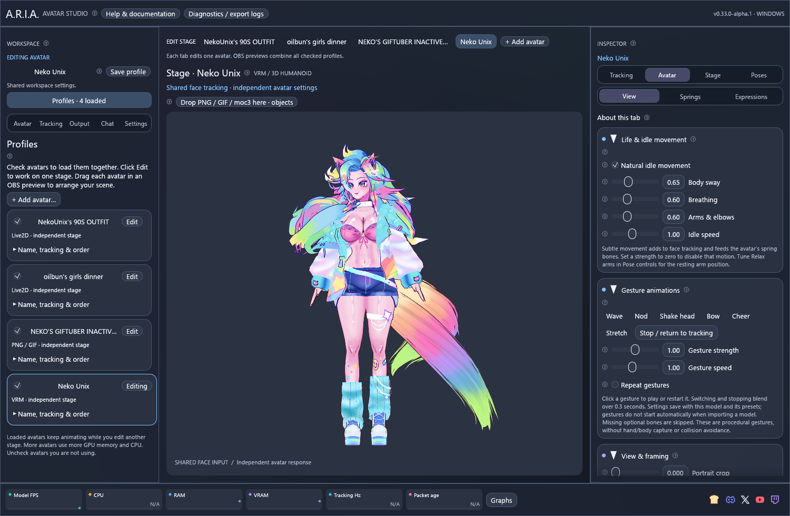

# A.R.I.A. — Avatar Studio (Alpha)

Bring your **Live2D, VRM, GLB and PNG/GIF avatars** to life, tune how it follows you, and
arrange them together in OBS. ARIA runs on Windows, Linux and macOS. You can start with the
included Mica puppet before importing a model or connecting a camera.

**[Download v0.35 Alpha](https://github.com/NekoUnix/A.R.I.A/releases/tag/v0.35.0-alpha.1)** ·
[What's new](#whats-new) · [First-time setup](#first-time-setup) ·
[Help when something goes wrong](#help-when-something-goes-wrong)

ARIA is still **Alpha**, so some features and device combinations need more
real-world testing. **VTube Studio import, VBridger import, VRC/GLB import and generated spring chains are Experimental.** Your avatar files and any
required third-party tracking app or runtime are supplied separately.

## What's new

**v0.35 Alpha adds visual Live2D mounts and smoother, more reliable VRM/GLB physics.**

- **Join two Live2D models:** open **Stage → Objects → Add & mount Live2D…**.
  Pick a mesh point on each model, then choose **Mount together**. Both receive
  tracking through their own mappings and physics. Adjust rotation, size and
  offsets, and choose whether the attached model sits in front or behind.
  [Mounting guide](docs/in-app-help.md#model-mount--mount-two-live2d-models--choose-a-point-on-each-model-to-join-them-while-both-receive-tracking).
- **Smoother hair, clothing and body motion:** small spring rotations now respond
  on both sides. Medium defaults, changing frame rates and stronger arm idle
  settings are handled more smoothly. [Physics controls](docs/secondary-motion.md).
- **More flexible GLB rigs:** review inferred chains, add unusual roots and tune
  generated collision envelopes per avatar. Authored VRM colliders remain intact.
  Generated collisions are approximations, not full mesh self-collision or Unity
  PhysBones. [GLB compatibility](docs/glb-avatars.md).

Existing Live2D, PNG/GIF and VRM profiles stay available. Use **Profiles →
+ Add avatar** to load more, then click the stage tab for the avatar you want to
configure. All checked profiles appear together in OBS.

[Profiles](docs/profiles.md) · [Tracking setup](docs/tracking-setup.md) ·
[OBS guide](docs/obs-output.md) · [Complete changelog](CHANGELOG.md)

## First-time setup

### 1. Download the right file

Open the [v0.35 Alpha release](https://github.com/NekoUnix/A.R.I.A/releases/tag/v0.35.0-alpha.1)
and expand **Assets** if the downloads are hidden. Choose the file for your computer:

| Your computer | Download |
| --- | --- |
| Windows 10/11, 64-bit Intel or AMD | `aria-0.35.0-alpha.1-windows-x64.zip` |
| Mac with an M-series chip | `aria-0.35.0-alpha.1-macos-arm64.zip` |
| Mac with an Intel processor | `aria-0.35.0-alpha.1-macos-x64.zip` |
| Ubuntu 24.04, 64-bit Intel or AMD | `aria-0.35.0-alpha.1-linux-x64.tar.gz` |
| Fedora 44, 64-bit Intel or AMD | `aria-alpha-0.35.0.alpha.1-1.x86_64.rpm` |
| Current Arch Linux, 64-bit Intel or AMD | `aria-alpha-0.35.0alpha.1-1-x86_64.pkg.tar.zst` |

On a Mac, **Apple menu → About This Mac** tells you whether it has an Apple chip
or an Intel processor. Linux ARM, Windows ARM, `.deb`, AppImage and Flatpak/Snap
packages are not provided in this release. The two downloads named **Source code**
are for developers; they are not the ready-to-run app.

The release also includes **SHA256SUMS.txt**, which lets you check a download has
not changed. The installation guide for each system explains that check. Fedora
and Arch have separate optional `aria-obs-canvas` packages; download those only if
you want the native OBS source described below.

### 2. Install and open ARIA

**Windows**

1. Open Downloads in File Explorer. Right-click the downloaded ZIP and choose
   **Extract All**. Pick a folder you can write to, such as Documents\ARIA.
2. Open the extracted folder. Double-click **aria-desktop.exe**. Do not run it
   from inside the ZIP, and keep its accompanying files and folders together.
3. The first window should show Mica moving. This is **Demo** input, so movement
   here does not mean your phone or camera is connected yet.
4. The Alpha executable is unsigned. If Windows displays a warning, verify the
   file came from this repository and matches the release checksum before deciding
   whether to allow it. ARIA normally runs as your regular user, not administrator.

**macOS**

1. Open the ZIP for your chip type. Extract **ARIA Alpha.app** and place it in a
   folder you own, such as Applications.
2. Open the app. It is an Alpha build with an ad-hoc signature, not Apple notarization.
   If macOS blocks it, follow the [macOS opening instructions](docs/platforms.md#install-an-alpha-release)
   for this trusted download. Do not disable system-wide protection.
3. Keep the app bundle intact. The first launch uses Mica and Demo input.

**Linux**

Follow the matching step-by-step guide: [Ubuntu](docs/linux.md#ubuntu-installation),
[Fedora](docs/linux.md#fedora-installation) or [Arch](docs/linux.md#arch-installation).
It includes the exact commands to install required libraries, verify the download,
open the application and add its OBS source. A graphical desktop and working GPU
driver are needed. Run ARIA as your normal desktop user.

### 3. Choose your avatar

Click **Profiles → + Add avatar…** on the left. Choose
the type you want to use; ARIA walks you through the files it needs and shows the
controls relevant to that avatar.

| Avatar type | What to select | What to expect |
| --- | --- | --- |
| PNG/GIF | Your image or animated GIF | Set up idle/talking states, transitions and movement. A static image does not need a 3D or Live2D runtime. |
| Live2D | An exported `.model3.json`, matching `.vtube.json`, model folder, or `.moc3` with its supporting files nearby | Keep the model folder, textures and supporting files together. ARIA asks for the official Cubism Core library needed to run it. |
| VRM | A `.vrm` file | Load a VRM 0.x or 1.0 avatar with expressions, Medium spring physics and gestures. |
| VRC / GLB · Experimental | A skinned `.glb` export | Import bones and facial shapes, review tracking assignments and tune flexible hair/accessories. No Unity or Cubism runtime is needed. |

Repeat the import to add more avatars. Each successful import is added to your
profile list with its saved settings. Click **Edit** or a stage tab to work on one;
all checked profiles appear together in OBS. To use just one avatar, uncheck the
others. Read [Profiles](docs/profiles.md) for tracking sharing and saved layouts.

For Live2D, **Cubism Core** is the separate library that evaluates the model. Use
its Windows DLL on Windows, its macOS library on Mac, or its Linux library on Linux;
one operating system's library cannot replace another's. Follow the import guide's
official download link and select the matching library. Avatar art and Core binaries
are not bundled with ARIA. An editor project such as `.cmo3` must first be exported
by its creator as a runtime model.

#### Live2D only: download and select Cubism Core

**PNG/GIF, VRM and the built-in puppet do not need this step.** For Live2D, use
the official link for your platform below. All four links intentionally open the
same **Cubism SDK for Native** download page; the SDK contains the platform
libraries. The table tells you which file ARIA needs after extraction.

| Your ARIA build | Official Cubism download | Library inside the extracted SDK |
| --- | --- | --- |
| Windows x64 | [Download Cubism Core for Windows](https://www.live2d.com/en/sdk/download/native/) | `Core/dll/windows/x86_64/Live2DCubismCore.dll` |
| Mac with Apple Silicon | [Download Cubism Core for Apple Silicon](https://www.live2d.com/en/sdk/download/native/) | `Core/dll/macos/arm64/libLive2DCubismCore.dylib` |
| Intel Mac | [Download Cubism Core for Intel Mac](https://www.live2d.com/en/sdk/download/native/) | `Core/dll/macos/x86_64/libLive2DCubismCore.dylib` |
| Linux x64, including Ubuntu/Fedora/Arch | [Download Cubism Core for Linux](https://www.live2d.com/en/sdk/download/native/) | `Core/dll/linux/x86_64/libLive2DCubismCore.so` |

Some Native SDK versions provide one universal Mac library at
`Core/dll/macos/libLive2DCubismCore.dylib` instead of chip-specific folders.
**Choose extracted SDK folder** in ARIA handles both layouts. Live2D's
[official library list](https://github.com/Live2D/CubismNativeSamples/blob/develop/Core/README.md#library-list)
documents the current platform folders. macOS uses `.dylib` and Linux uses `.so`;
the `.dll` is the Windows library.

1. Open the appropriate official link **on your computer**. Check that the page
   says **Cubism SDK for Native**.
2. Read Live2D's license terms, complete the download form as appropriate for
   your use, and choose the current regular download. This is an SDK archive;
   you do not need to compile its examples or install a game engine for ARIA.
3. Extract the whole archive. On Windows use **Extract All**. Keep the extracted
   folder somewhere permanent, such as Documents\Live2D SDK, rather than inside
   the ZIP or a temporary folder.
4. In ARIA open **Avatar → Avatar & appearance → Import avatar**, choose
   **Live2D**, and select your model's exported files.
5. At **Cubism Core runtime**, click **Choose extracted SDK folder…** and select
   the top-level extracted folder, usually named `CubismSdkForNative-…`.
   ARIA looks for the library matching the current operating system and CPU.
6. Alternatively, click **Choose Cubism Core library…** and select the file from
   the table. On Windows choose **x86_64**, not the 32-bit **x86** folder.
   `.lib` and `.a` files are not the library files this picker uses.
7. Click **Review import →**, check the model details, and finish the import.
   If the library cannot load, check the OS/CPU choice and that all files were
   extracted. The [Live2D guide](docs/live2d.md) explains compatibility errors.
8. Keep the SDK folder in place. ARIA remembers its location for this computer;
   if you move it later, choose the new folder in ARIA before loading Live2D again.

Start with one avatar. Test head motion, blinking and mouth movement before adding
props or effects. A model can only perform movements that its artwork and rig support.

### 4. Choose how you want to control it

Click **Tracking**, then open the source menu. Only one face-tracking source drives
the main avatar at a time. You can also use the microphone, manual holds and mapped
controller inputs where appropriate.

**iPhone with iFacialMocap — new in v0.28**

1. Open iFacialMocap on the phone. Allow camera and **Local Network** access and
   check that its face preview follows you.
2. Put the phone and computer on the same trusted router. The PC may use Ethernet;
   the phone may use Wi-Fi. Avoid a guest network that isolates devices.
3. In ARIA select **iPhone · iFacialMocap**. Copy the phone's IPv4 address into ARIA's
   address box. Do not enter the example address or your computer's address.
4. Start with both port boxes set to **49983**, keep the phone in live UDP mode,
   and click **Connect tracking**. Close another PC receiver if it already uses
   that port. No desktop bridge is required.
5. Wait for **Tracking live**, then blink and open your mouth. If data does not
   arrive, use the circled **?** or the [illustrated iFacialMocap guide](docs/ifacialmocap.md).

**iPhone with VTube Studio**

1. Open VTube Studio on the phone and confirm its camera preview finds your face.
2. Enable **3rd Party PC Clients** in its settings and allow Local Network access.
3. In ARIA select **iPhone · VTube Studio** and enter the phone's IPv4 address.
4. Use the phone's request port, normally **21412**, and ARIA's receive port,
   normally **11125**. Click **Connect tracking** and wait for **Tracking live**.
5. The VTube Studio desktop app is not required for this connection.

**Webcam**

Select **Webcam · MediaPipe**, open **Install / repair camera runtime**, and follow
its prompts. The first setup needs internet and the supported Python runtime;
the [camera setup guide](docs/webcam.md) explains each prerequisite. Find and select
your camera, start at **640 × 480 / 30 FPS**, then click **Start camera**. Allow
camera access in your operating system and close another app if it owns the camera.
NVIDIA RTX tracking is an optional **Experimental** adapter requiring NVIDIA's SDK;
it is not needed for ordinary webcam tracking.

**PNG/GIF talking or manual poses**

Choose **Microphone / manual · no tracker**, then open the microphone controls.
Select your microphone, enable it and tune the talking threshold while speaking.
Use your image avatar's states to choose which picture or GIF appears when talking.
For a still screenshot, use the pose controls and hold the desired parameters.

### 5. Make the motion comfortable

1. Sit where you normally stream, with the phone/camera facing you. Confirm the
   tracking status is live. Click **Calibrate neutral pose** while relaxed.
2. Open **Guided tracking setup**. Follow one exercise at a time: rest, turn, nod,
   lean, blink, mouth and other available inputs. Watch the illustrated face.
3. Retake an exercise if the result looks wrong. Compare the available takes and
   review the suggested ranges before saving for this avatar.
4. Test up/down, left/right and lean separately. Correct only the reversed axis
   with its inversion control; there is no need to swap axes.
5. Under **Mouth response**, start with **Quick**. Choose **Instant** for less
   smoothing or **Soft** for steadier motion. This changes ARIA's response, not the
   physical capture rate of the phone.

If you have a VBridger configuration, open **Import / edit VBridger config**, choose
it and review the outputs before **Apply**. **This feature is Experimental.** It
uses its own input calibration/curves for imported channels; tune those in its
editor, or disable the imported config to use the normal guided range wizard.
[The VBridger guide](docs/vbridger.md) explains missing inputs, presets and exports.

### 6. Put your avatar in OBS

1. Click **Output** in ARIA. Enable **Landscape 16:9** for a wide canvas,
   **Portrait 9:16** for a tall canvas, or **Freeform** for a custom shape.
   More than one output may be active.
2. Set the canvas resolution. Start with **1920 × 1080** for landscape or
   **1080 × 1920** for portrait, then reduce it if your computer struggles.
3. Keep the preview window small on your desktop. The native OBS source receives
   the configured full-resolution canvas; the preview does not need to fill your screen.
4. Drag the avatar in that output to position it. Use the mouse wheel over the
   avatar to change its size. Choose its name in the preview menu if avatars overlap.
5. Choose **Transparent**, **Studio**, or **Green screen / color key**. For a color
   key you may enter a hex color or use **Detect safer color**, then match that
   color in OBS's Chroma Key filter.
6. In OBS add the native source matching your system:

| System | OBS source |
| --- | --- |
| Windows | Spout2 source; choose the ARIA sender shown by the output controls |
| macOS | Syphon source; choose the ARIA server |
| Linux | ARIA Canvas source from the matching optional OBS plugin |

Install the needed OBS source plugin if it is not in OBS's list. Follow the
[OBS setup guide](docs/obs-output.md) for the plugin links, names and transparency
settings. **Window Capture** is also available as a fallback, but its size and
transparency behavior depend on the capture method; the full-resolution canvas
instructions above refer to native output.

### 7. Save, customize and make screenshots

The right **Inspector** organizes tools under **Tracking, Avatar, Stage and Poses**.
Expand only the category you need. Hover a circled **?** for a short explanation;
click it for the complete offline help window.

- **Tracking:** adjust each input's range, stepping and response, or set a value
  manually and hold it. Saved settings belong to the selected avatar.
- **Avatar:** tune model physics, expressions and supported appearance controls.
  Use **Select layers…** to open the frozen Live2D picker; click or draw boxes
  to select artwork, then hide or restore it. The Layers inspector also offers fading and tints.
  **Avatar → Customize** organizes exported outfit and hair controls; save appearance
  looks without replacing tracking. See the [appearance guide](docs/live2d-customization.md).
- **Stage:** add and pin images or independent Live2D accessories; create reusable
  throw and spray effects with assets, sound, direction and impact settings.
  **Objects → Add & mount Live2D…** lets you click a
  mount point on each of two models and join them. Both receive current tracking
  through their own mappings. See the [two-model mounting guide](docs/in-app-help.md#model-mount--mount-two-live2d-models--choose-a-point-on-each-model-to-join-them-while-both-receive-tracking).
- **Poses:** freeze the model for a screenshot, export an image, and save named
  movement presets. Assign a supported hotkey to recall a preset or expression.
- **Settings:** choose a theme, edit colors and save your own palette.

Use **Save profile** after editing and close ARIA normally so app preferences are
written. Reopen the same avatar to recall its settings. Keep avatar folders in a
stable location; moving or renaming files may require importing them again.
Export important configurations before experimenting with a new Alpha build.

## Help when something goes wrong

| Problem | First things to check |
| --- | --- |
| ARIA will not open | Extract the complete package, use the right CPU/OS download and update the graphics driver. Read the error dialog and your installation guide. |
| Clicking an online link does nothing | Install this updated v0.35 Alpha build. Set a default browser in your operating system and check behind ARIA for a new tab or window. If it still fails, use **Diagnostics / export logs** and describe the link you clicked. |
| A phone connects but no motion arrives | Check **Tracking live**, the current phone IP, matching ports, Local Network permission, firewall and same LAN. Demo motion does not confirm a phone connection. |
| Cannot bind the tracking port | Close the other application receiving on that port, or configure matching custom ports on both sides. |
| Mouth feels slow | Try **Quick** or **Instant** mouth response; check the tracking-rate and packet-age graphs. Phone sampling and network delay remain outside that setting. |
| Parts of an avatar look wrong or do not move | Try Mica, check your model's exported files and source assignments, and read the model compatibility guide. Advanced rendering features are not universally supported. |
| OBS cannot find the avatar | Enable the ARIA output, install the correct native OBS source plugin and select its displayed sender/server name. |
| OBS background is green | Choose Transparent for a compatible native source, or add a Chroma Key filter using ARIA's chosen color. |
| Low FPS or high memory use | Reduce canvas resolution, close unused outputs and check large avatar textures and competing apps. A small preview alone does not reduce the canvas workload. |
| An imported VTS action needs repair | Open **Import VTube Studio → Repair / guide…**, choose the intended ARIA behavior, locate its files, then Apply and test. |
| A saved effect cannot find its picture/model | Check that the asset file still exists in its original location and choose it again if it moved. |

Hover the colorful bottom graphs to see the sample, latest value and this session's
low/high. Click **Graphs** for more counters. **N/A** means that counter is unavailable,
not zero. Some operating-system/GPU counters currently work only on Windows.

Click **Diagnostics / export logs**, describe the problem and export a report.
After export, use **Create GitHub issue** or **Discord · create a ticket** and
attach the `.txt` file. Review it first: it includes useful rig IDs, ranges,
mesh/physics metadata and recent errors, while excluding avatar artwork and
credentials. Export does not upload it. [Report guide](docs/diagnostics.md).

For more help, read the [user guide index](docs/README.md) or
[report a bug](https://github.com/NekoUnix/A.R.I.A/issues/new/choose). Include the ARIA
version, operating system, avatar type, steps to reproduce and relevant error text.
Do not attach passwords, API keys, account tokens or private avatar files.

## Updating from an older Alpha

Download the new package for your system, close ARIA normally, and extract/install
it using that system's guide. On Windows, use a new folder for the complete package
instead of mixing new executables with old support files. Keep the old package
until you have checked your avatars and exports. Fedora/Arch update commands are
in the Linux guide. ARIA does not require building Rust code to use a release.

## What works and what is still in progress

| Area | Current status |
| --- | --- |
| Live2D, PNG/GIF and VRM avatars | Available; model-format and advanced shader limits apply |
| Multiple avatars and Profiles | Available in Alpha; mix avatar types, edit separate stages and save independent shared OBS layouts |
| iFacialMocap and VTube Studio phone inputs | Available; physical device/network acceptance varies |
| Webcam, microphone and controllers | Available; camera runtime/device setup required |
| VTube Studio customization import | **Experimental**; native actions and an in-app repair guide for missing/incompatible entries |
| Avatar-aware diagnostic exports | Available; readable local report, recent errors and rig metadata with support-ticket links |
| VBridger config import/editor | **Experimental**; exact third-party motion is not guaranteed |
| NVIDIA RTX tracking | **Experimental** adapter; requires separate SDK and GPU validation |
| Native OBS outputs | Alpha on Windows, Linux and macOS; plugin/GPU compatibility varies |
| Live2D drag selection and customization | Available; authored appearance controls, tints, layer groups and appearance-only presets |
| Physics, pins, expressions, effects and presets | Available; broader asset/device testing continues |
| Twitch/YouTube chat | Available; live-account validation remains pending |
| Developer-signed apps and macOS notarization | Planned; GitHub Verified source commits do not sign downloads |

The [full feature grid](docs/README.md#current-and-planned-features) explains known
limits, including unsupported advanced Cubism rendering and incomplete VRM shader
compatibility. Screenshots show the owner's Odette artwork with permission; that
permission does not grant model download or reuse rights. ARIA's code is MIT licensed.

## Technical guides and development

These references are for deeper troubleshooting, integrations and contributors.
The ready-to-run packages above do not require a compiler.

| Reference | Contents |
| --- | --- |
| [Architecture](docs/architecture.md) | Runtime, renderer, models and component boundaries |
| [Tracking protocols](docs/tracking.md) / [iFacialMocap protocol](docs/ifacialmocap.md#developer-protocol-and-validation) | Packet formats, ports and CLI diagnostics |
| [Control API](docs/api.md) / [examples](templates/api/README.md) | Authenticated local scripting and integrations |
| [VTube Studio import and repair](docs/vtube-studio-import.md) / [support reports](docs/diagnostics.md) | Experimental native customization import, repair walkthrough and diagnostic contents |
| [VBridger compatibility](docs/vbridger.md#compatibility-and-limits) | Experimental equations, modifiers, supported exports and bounds |
| [Live2D](docs/live2d.md) / [VRM](docs/vrm.md) | Import requirements and rendering limitations |
| [Native platform packages](docs/platforms.md) / [validation](docs/validation.md) | Build instructions, test evidence and hardware acceptance limits |
| [Contributing](CONTRIBUTING.md) / [review and releases](docs/development.md) | Development workflow and review gates |
| [Security](SECURITY.md) / [third-party notices](THIRD_PARTY.md) | Reporting and runtime/dependency licenses |
| [Every package and version](THIRD_PARTY.md#find-every-package-and-version) / [engine performance](docs/performance.md) | Full dependency indexes, locked versions and measured runtime changes |
| [Image templates](templates/images/README.md) / [effects templates](templates/effects/README.md) | Custom artwork, actions, throws and sprays |
| [Screenshot provenance](docs/images/README.md) / [changelog](CHANGELOG.md) | Documentation artwork permissions and version history |
