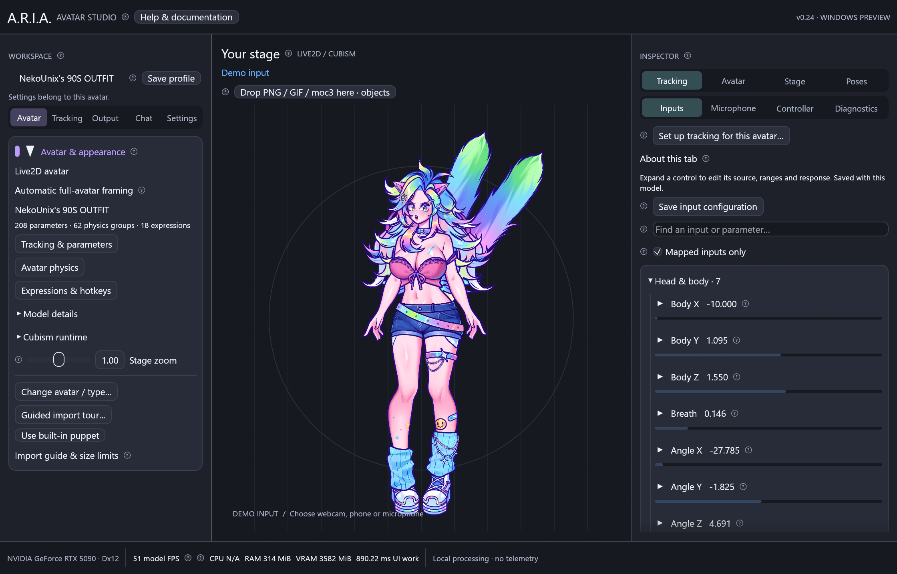

# ARIA documentation — v0.24

Start with [Windows setup](windows.md), import your avatar, then follow
[personal tracking setup](tracking-setup.md). The left navigation is **Avatar /
Tracking / Output / Chat / Settings**. Inspector tools stay grouped by tracking,
avatar, stage and poses. Hover or click any circled **?** for offline explanations.

| I want to… | Open this guide |
| --- | --- |
| Use a webcam or NVIDIA RTX facial inference | [Webcam tracking](webcam.md) |
| Connect iPhone VTube Studio or a tracking tool | [Tracking protocol](tracking.md) |
| Match tracking to my face and rig | [Personal calibration](tracking-setup.md) |
| Use a gamepad with my avatar | [Controllers](controllers.md) |
| Tune ranges, hold parameters, create presets | [Input controls](input-controls.md) |
| Load exported Live2D files | [Live2D](live2d.md) |
| Import and tune a 3D VRM | [VRM](vrm.md) |
| Choose from nested model folders or pin items | [Folders and pins](model-folders-and-pins.md) |
| Configure secondary motion | [Physics](physics.md) |
| Use expressions and hotkeys | [Expressions](expressions.md) |
| Capture landscape, portrait or Freeform in OBS | [Outputs](obs-output.md) |
| Sign into Twitch / YouTube chat | [Streaming chat](streaming-chat.md) |
| Change colors or share a custom theme | [Themes](themes.md) |
| Control ARIA with code | [API](api.md) |
| Make throws, sprays and sound effects | [Effect templates](../templates/effects/README.md) |
| Animate talking PNG/GIF states | [Image templates](../templates/images/README.md) |
| Read every contextual explanation | [In-app help reference](in-app-help.md) |
| Understand code or verified limitations | [Architecture](architecture.md), [validation](validation.md) |
| Contribute code or review a pull request | [Contribution guide](../CONTRIBUTING.md), [development workflow](development.md) |

The workspace screenshot shows v0.24. Other images show the v0.23 interface
with the owner's supplied avatars; v0.24 retains those controls.
They demonstrate UI layout; camera configuration screens do not imply an active
camera connection. [Artwork provenance and reproduction notes](images/README.md).
