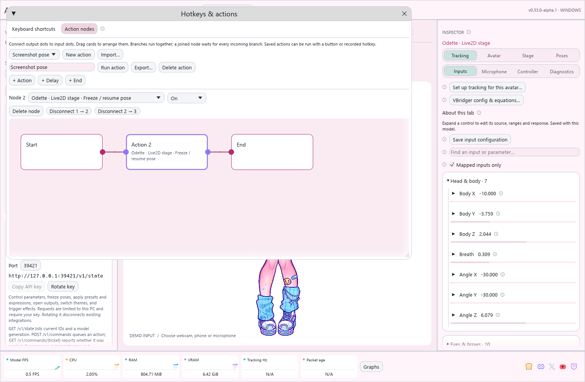
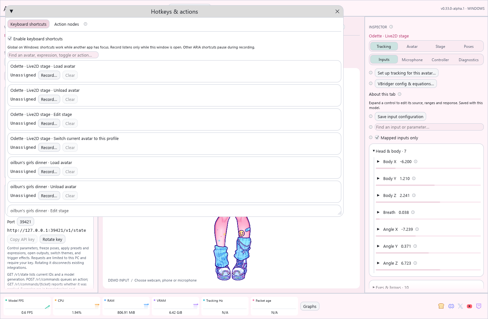

# Hotkeys and visual actions

Available in v0.34 Alpha. Older downloads keep their previous hotkey interface.

Open **Hotkeys & actions…** in ARIA's top bar. **Keyboard shortcuts** records keys;
**Action nodes** combines avatar controls. The same window is linked from
expressions, layer groups, objects, images, effects and presets.



## Record a shortcut



1. Load the avatar in **Profiles**. Save any new expression, layer group, object,
   movement preset or throw design before assigning its key.
2. Open **Keyboard shortcuts** and search for the avatar or action name.
3. Click **Record…** and press your chosen combination, such as **Ctrl+Shift+H**.
   The recorder displays the captured keys.
4. Click **Save shortcut**. **Record again** retries; **Cancel recording** or
   Escape abandons recording. ARIA pauses its other shortcuts while recording.
5. Test the shortcut. If Windows reports that another program owns it, record a
   different combination. Registration errors appear in this window.

Windows shortcuts work while OBS or another application has focus. On macOS and
Linux they currently work while ARIA is focused; system-wide registration on those
platforms is not implemented. F12 is reserved by Windows. Modifier combinations
are usually less disruptive than a plain letter that also intercepts typing.
The recorder listens only while recording in ARIA; it does not log ordinary typing.

**Clear** removes a shortcut without deleting its action. **Enable keyboard
shortcuts** disables or restores all keyboard triggers. Existing assignments are
retained, including shared legacy shortcuts. New recordings reject duplicates
across available actions. Imported VTube Studio actions retain their hold/release
and timed behavior. Buttons and API triggers remain usable when keys are disabled.
A frozen pose can prevent an expression from visibly changing the model.

## Build a connected action

Example: apply a layer group, enable an expression, wait, then restore both.

1. Open **Action nodes → New action** and give it a name.
2. The initial graph contains **Start → Action 2 → End**. Click **Action 2**.
3. Above the canvas, choose your avatar's layer group and set its mode to **On**.
   On applies the group's saved opacity: a zero-opacity group hides its layers.
4. Click **+ Action**. Select that card and choose an expression, mode **On**.
5. Add a **Delay**, such as 2 seconds. Add two more Action cards for the expression
   and layer group, both in **Off** mode.
6. Select Action 2 and click **Disconnect 2 → 3** to remove the original path.
   Click a card's **right output dot**, then the next card's **left input dot**.
   Connect every card in order, finishing at End. Drag cards to arrange them.
7. Resolve any validation message and click **Run action**. Assign the saved graph
   a recorded shortcut from the Keyboard shortcuts tab when ready.

```text
Start → Group ON → Expression ON → Wait 2s → Expression OFF → Group OFF → End
```

Each action card names its avatar explicitly. Nodes can toggle or set expressions,
layer groups, object visibility, image states and frozen poses; apply movement or
appearance presets; trigger throws/sprays or imported actions; play VRM gestures;
or load, unload and switch avatars. **Toggle** reverses the state. **On/Off** sets it
explicitly, making repeated performances predictable. Image Off releases that image's
manual hold; automatic talking/blinking rules resume when no hold remains.

## Branches, timing and avatar changes

Connect one output to several inputs to run branches together. A node with several
incoming connections waits for all of them. Each node executes once per run. Delays
start after preceding steps finish and never block tracking or rendering. A trigger
finishes when applied; a throw or animation may continue playing afterward. Add a
Delay if the next step should wait for it.

**Load avatar** loads a saved profile before downstream steps execute. **Unload
avatar** removes it from the live scene while retaining its saved settings. **Edit
stage** selects its editor. **Switch current avatar to this profile** loads the
replacement first, then unloads the avatar being edited when that node started;
other loaded avatars remain. Failed loads and a 60-second wait timeout stop the
run with a repair message.

Load a profile once to choose its expressions and model-specific targets in the
editor. A saved graph can subsequently load that profile before using them.
Renaming a stage/profile preserves its action and shortcut references. Deleted
objects, presets or profiles require a new target in affected nodes.

## Save, share and recover

Graphs and recorded shortcuts autosave in the local workspace; **Save profile**
also requests a save. Closing the editor keeps the graph. **Export…** writes a
JSON template containing layout, steps and connections. **Import…** restores those
and clears action targets so you can choose the receiving workspace's avatars.
No artwork, SDK files or executable code is included. Start with the
[example template](../templates/actions/screenshot-pose.aria-action.json).

**Stop all actions** cancels pending steps; changes already applied and effects
already launched remain. A run uses a snapshot, so editing cards does not alter it.
Repeated presses do not restart the same active graph. Loops and incomplete graphs
are rejected. Missing targets stop at the affected node with a repair message.

Limits: 128 saved graphs; 256 nodes and 1,024 connections per graph; 300 seconds per
Delay; 16 simultaneous runs; 1 MiB imported JSON. Graphs cannot call other graphs.
The editor uses ARIA's existing egui renderer with no new rendering dependency.
Developers can trigger `run_action` and `stop_actions` through the [local API](api.md).
