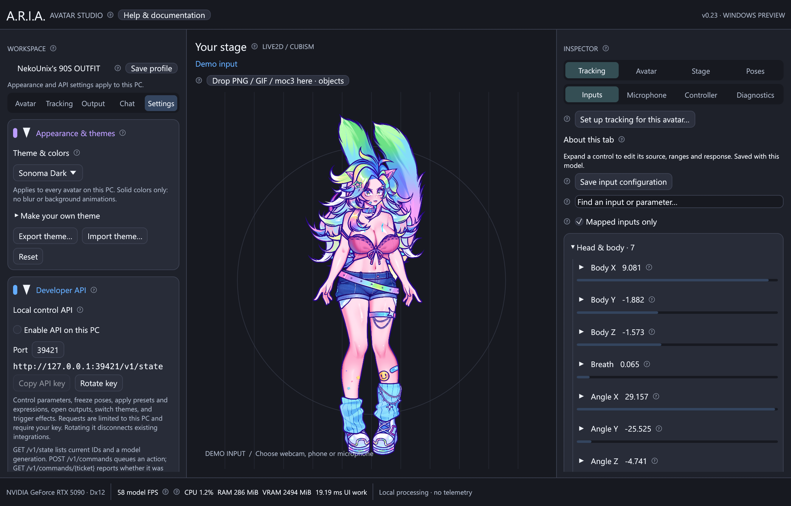

# Developer control API



Enable **Settings → Developer API → Enable API on this PC** and click **Copy API key**.
Default base URL: `http://127.0.0.1:39421`. Every request requires
`Authorization: Bearer YOUR_KEY`. The listener is loopback-only and off by default.
Rotate the key to revoke access; changing port/key restarts the server and clears
its queue/results. Keys are stored with local app preferences and are not exposed
by status endpoints. Do not put them in repositories or public chat.

The API is HTTP/1.1 with JSON request/response bodies. Browser Origin headers are
rejected; desktop scripts and stream integrations are supported. There is no
arbitrary file loading, command execution, model import or remote network listener.

## Discover, queue, confirm

1. `GET /v1/capabilities` returns protocol/app version, actions and limits.
2. `GET /v1/state` returns `version`, `generation` and `state`. State includes native
   parameter IDs, ranges and current values; live inputs; pose/source/status;
   preset indices; expression IDs; output settings; and available themes.
3. `POST /v1/commands` with the returned generation and an action queues a command.
4. A **202** response includes a `ticket`. Poll `GET /v1/commands/{ticket}` until
   status is `applied` or `rejected`. Queuing is not proof of execution.

```json
{"version":1,"generation":1,"action":{"type":"pose","frozen":true}}
```

The generation changes with the current avatar. Fetch a fresh state before a new
operation; **409** means the generation is stale or state is initializing. Queued
commands are checked again on the UI thread. State is refreshed at roughly 10 Hz
while enabled. An initial **503** means the first state is not available yet.

## Actions

| `type` | Other fields | Behavior |
| --- | --- | --- |
| `set_parameters` | `values`: object of ID → number | Atomically validates 1–64 native values against actual min/max, then holds them in partial override mode. |
| `release_parameters` | `ids`: array of IDs | Releases selected holds; `[]` releases all. Empty holds resume Live mode. |
| `pose` | `frozen`: boolean | Captures final current values or resumes Live mode. |
| `preset` | `index`: integer | Applies a currently saved preset. Indices come from state, and may change after editing the library. |
| `expression` | `id`: string, `enabled`: boolean | Enables/disables an expression belonging to the current avatar. Frozen mode must be resumed to see changes. |
| `output` | `index`, `open`, optional `zoom`, `position` | Indices 0 landscape, 1 portrait, 2 freeform. Zoom 0.25–3; position `[x,y]` each −1 to 1. All fields validate before mutation. |
| `theme` | `name`: string | Selects a built-in or saved custom theme by exact name. |
| `save_profile` | none | Requests the normal per-avatar profile save. |

Requests reject unknown fields, unsupported action names and invalid values.
Parameter changes enter the same pose/mapping path as UI controls; no out-of-range
native writes are possible. Settings can persist during normal application autosave;
use release/resume to return to live movement after a script finishes.

## Existing effects integrations

`GET /v1/effects` still lists saved effect IDs. `POST /v1/effects/trigger` still accepts
`{"version":1,"id":7}` and returns 202 when queued. Responses now also include a
ticket, so integrations can check execution. It binds the effect to the current
avatar at receipt and rechecks that avatar before applying it.

## Limits and errors

- 20 requests/second, 32 queued commands, 4 KiB request bodies and 8 KiB headers.
- Only the last 128 results are retained; unknown/expired tickets return 404.
- 400: malformed request, missing/invalid key, browser Origin or unsupported framing.
- 404: unknown route, effect or result; 409: stale generation; 429: rate/queue limit.
- An accepted command can later report `rejected` with an `error` message. Retry only
  after checking current state; blindly repeating a trigger can duplicate effects.
- No WebSocket stream; poll state at 5 Hz or slower and budget command/result polls
  within the same 20-request limit. Tokens belong in headers, never query strings.

Start with the runnable [Python client](../templates/api/aria_client.py) or
[PowerShell example](../templates/api/control.ps1). The [request schema](../templates/api/command.schema.json)
documents the action contract. [Effects plugin examples](../templates/effects/plugins/README.md)
remain compatible.
