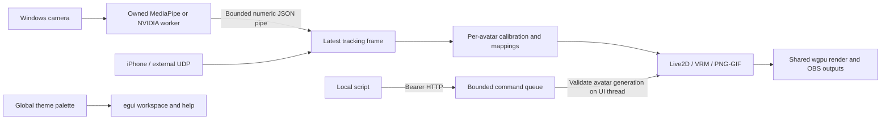

# Architecture and next steps


## Guided avatar import and bounded GIF playback (v0.18)

The sections below preserve subsystem history. v0.24 adds
`aria-live2d::host::HostedModel`: the app keeps Rust mesh/parameter data while a
separate child process owns `CubismModel`, native allocations and the Core library.
Private versioned pipes carry parameter frames and dynamic geometry. Static
topology transfers once, textures stay in the main GPU renderer, and worker exits
or timeouts become model errors. Native-library discovery handles SDK layouts for
Windows, Linux and macOS; this is process isolation, not a Windows emulator. See
[platform architecture and limits](platforms.md).

Custom PNG/GIF throws now use `media::LoadJob` too. A burst remains pending until
all selected assets load; file-specific errors, cancellation and retry avoid
decoding large animations on the UI thread. Other v0.23 additions are:



`webcam.rs` owns camera worker lifetime, bounded stdout/stderr readers, device
enumeration, optional runtime installation and freshness. It never buffers video
in the rendering process. Camera/source changes release capture; setup subprocesses
are grouped in a Windows kill-on-close Job Object. `tracking/worker.py` performs
MediaPipe inference; `tracking/nvidia.py` calls the optional SDK-compiled C++ bridge.
NVIDIA headers, feature binaries and models are external dependencies.

`effect_api.rs` retains effects routes and adds typed commands and state snapshots.
The network thread handles framing/auth/queueing; avatar mutations occur on the UI
thread after generation and range validation. State updates at roughly 10 Hz only
while enabled. Bounded results distinguish queued from applied. See [API contract](api.md).

`theme.rs` stores serialized RGB palettes and applies egui styles only on changes.
Shared accessors also style custom cards; fonts are installed once. Themes and
runtime paths belong to the machine; camera capture settings are per avatar.

`avatar_import::Wizard` separates type choice, file preparation, review and
completion. PNG/GIF selection can populate an action library from a folder,
suggests roles from names, requires one base, and previews playback dimensions
and retained texture usage. Live2D selection checks the export and Core path.
The selected primary avatar drives the Avatar and Inspector controls; independent
accessories are available regardless of that selection. Profile identity still
comes from the source artwork or moc3, never the fitted texture size.

`media::inspect` scans GIF frame metadata without decoding all pixel data. A
square-root fit selects a playback size using frame count, device limits and the
avatar's serialized `images.playback_mib`. `LoadJob` composites, fits and uploads
one source frame at a time on a cancellable worker. A shared gate serializes image
import workers. GIF disposal and transparency use image-rs; the decoder's working
limit allows its three compositing buffers after independently checking the source
canvas. Completed GIFs retain immutable fitted frame textures and their timing.
The base replaces the old avatar only after success; other actions load sequentially
with progress and per-file errors. Playback reuses textures without frame decoding.
Raising source ceilings allocates nothing until an asset is imported.

The default 256 MiB budget fits each tested 3500 × 2500, 63-frame GIF to 1221 × 872.
This trades playback resolution for bounded retained memory; it does not promise
that arbitrary full-resolution animations fit in VRAM. Temporary source buffers,
old fallback artwork during reload and GPU staging add to reported texture bytes.
Saved avatar budgets survive reopening; changing one rebuilds its action cache.

## Import budgets and compact workspace (v0.17)

`aria-core::asset_limits` defines shared import ceilings. The PNG/GIF loader,
Cubism FFI boundary, manifest/sidecar readers, stage objects and throw caches use
them consistently. Source file, decoded-byte and dimension budgets apply together;
none reserves memory at startup. PNG/GIF source identity is computed before fitting,
so per-avatar profiles survive changes in the GPU's maximum texture size.
`media::fit_texture` performs one bounded import-time resize only when necessary;
model atlas notes expose the fitted dimensions. Actual uploaded dimensions drive
retained texture accounting. The normal playback path continues to reuse textures.

The left Workspace and right Inspector have stationary segmented navigation and
separate scroll state per page. Only the selected settings page is laid out;
connection diagnostics render under Tracking → Diagnostics. Existing profile
storage, input processing and simulation are independent from navigation.
The graphite palette uses existing egui primitives and the installed Windows font.
UI tweening and window/popup shadows are disabled; no additional font, image asset,
blur pass, dependency or render loop is introduced for styling.

## Streaming chat companion (v0.16)

`aria-desktop/src/chat` contains the native companion UI, bounded plain-text
protocol parsers, desktop OAuth helpers and one cancellable network worker per
service. Twitch uses Public device authorization plus TLS IRC WebSockets;
YouTube uses desktop authorization-code OAuth with PKCE/state validation, a
loopback-only callback, and the read-only Data API. HTTP requests have timeouts,
response budgets and retry backoff. Cancelled workers cannot publish into a new
connection's feed; at most four active/closing workers can exist during rapid
reconnects. Network work never runs in the rendering callback.

Each feed holds at most 200 messages and handles provider moderation events.
Credential fields in app settings contain only current-user Windows DPAPI blobs.
Access tokens refresh in the worker; replacements reach persistent settings via
the normal app save path. A service connects only after the user's Sign in or
Connect action. Remote chat is never evaluated as markup or avatar commands.

`OutputSettings.chat` holds per-avatar appearance. Global `Settings.chat_accounts`
holds provider setup and protected credentials separately from rig presets.
The chat viewport follows the portrait's actual outer rectangle when docked,
hides with its minimized/closed parent, and uses independent alpha/color per
service. It is never included in the avatar `Scene` or Spout render texture.
See [streaming-chat.md](streaming-chat.md) for operational limits and API sources.

## PNG/GIF actions and microphone input (v0.15)

`aria-core::image_actions` stores action triggers, priorities, motion, playback and
transition settings in `RigConfig`. Its deterministic player selects states from
tracking/parameter inputs or a manual hotkey override, and preserves current blend
weights when a transition is interrupted. `SavedRig` owns microphone device and
gate settings. Legacy serialized profiles default to disabled new features.

Desktop `media` bounds encoded files and decoded frame memory, then uses image-rs
for PNG/JPEG and composed GIF frames. Immutable frame textures are shared by clones.
Action GIFs use the action/global clock; stage GIFs use the stage clock; thrown GIFs
use each particle's age. The same selected texture and transforms reach the stage,
PNG export and Spout. Frozen poses stop image/transition clocks while the microphone
meter remains live. Artwork caches retain failures until the user reloads assets.

Desktop `microphone` opens a cpal input stream using a stable device ID. The callback
reduces interleaved samples to RMS and discards them, publishing only atomics for the
UI thread. A smoothed core envelope and hysteretic gate produce MicLevel, MicTalking
and Talking. Mouth routing replaces or maximizes the existing MouthOpen input before
normal rig evaluation. Device errors stop the stream and expose a retry control;
missing samples decay to silence. No voice recording, networking or speech recognition
is part of this path. Local input mode avoids synthetic demo movement without a tracker.

## Current flow

```text
iPhone VTS UDP / ARIA JSON / deterministic demo
                    |
             aria-tracking
       validation + latest-frame mailbox
                    |
                aria-core
       calibration -> mapping -> smoothing
                    |
       rig bindings -> breath -> physics
                    |
       aria-live2d -> Cubism Core DLL
          owned animated mesh data
                    |
          wgpu ArtMesh renderer
       transparent shared render target
           /                   \
  studio preview       3 compact preview windows
                    + full-resolution canvases -> Spout2 -> OBS
```

| Package | Responsibility |
| --- | --- |
| `aria-core` | Tracking/parameter data, calibration, VTS profiles, response/ranges, stepping, fixed-step physics3, serializable configurations and poses |
| `aria-tracking` | VTS/ARIA decoding, subscription renewal, bounded latest-frame snapshot |
| `aria-model` | Bounded model3 parsing, path validation, moc-to-manifest discovery, ordered textures and optional rig sidecars |
| `aria-live2d` | Private Core ABI, explicit DLL loading, aligned memory ownership, consistency/version checks, parameter metadata and owned mesh output |
| `aria-desktop` | Rig UI/import, wgpu renderer/PNG export, process metrics/priority/hotkeys, three output viewports and Spout GPU senders |
| `aria-cli` | Simulator, JSON sender, headless receiver and manifest inspector |

One worker serves each active tracking receiver. The UI consumes the most recent
frame without queuing old frames. Read timeouts allow prompt shutdown/reconnect.
The CLI shares the receiver and mapping without requiring a GPU or the SDK.

## Native model boundary

`aria-live2d::CubismModel` owns model storage, moc storage, and the loaded library
in that destruction order. Allocations satisfy Core's 16/64-byte alignment requirements.
Before revival, the loader checks the header, size, moc version and Core consistency.
The object is intentionally neither Send nor Sync. No raw Core pointers cross the
crate's public API; updates copy mesh data into owned Rust vectors.

DLLs are executable code and must come from the official SDK. The Windows loader
uses a canonical absolute path and limits dependency searches to the DLL folder and
System32. Core itself is a trusted native parser; these checks are not process isolation.
API symbols and counts are checked, including both old/new render-order entry points.
Unsupported offscreen parts and advanced blend modes fail explicitly.

Tracking binds by exact output ID, preferring adjacent VTS profile assignments.
Each update starts from native defaults/manual overrides, applies named tracking and
breathing through each binding's ranges/filter, layers active expressions, then
evaluates authored physics. Partial holds apply before and after physics.
Physics uses the rig's fixed FPS, input interpolation and previous/current output
interpolation, preserving group order for chained dependencies. Particle state retains
velocity; pause gaps and re-enabling reset it. Values clamp to native parameter limits
before resetting drawable flags, evaluating Core and rendering. Expression fades
are per-model transient state; selections live in RigConfig and shortcuts/import
paths in SavedRig. The Expressions panel discovers metadata and feeds the same
runtime from buttons and shortcut actions. Full frozen poses bypass this entire
pipeline. Motion3/pose3 sequencing remains future work. Rig math uses owned Rust parameter data, independent
of native ABI pointers, so unit tests need neither Core nor licensed assets.

Optional profile, physics and display-info reads are bounded to 2 MiB each and
stay within the model directory. Invalid optional data produces a visible warning;
the avatar still loads. Physics group/particle/input/output counts and numerical
ranges are validated before constructing runtime chains.

## GPU rendering

`cubism_render.rs` uploads atlas textures once and reuses geometry/style buffers.
Each update writes positions and per-drawable colors/opacity. Drawing follows Core's
render order, including changes caused by parameters. A mask pass combines texture
alpha from all referenced meshes, using their culling but ignoring their opacity and
visibility. A following pass applies the regular/inverted mask and the proper
blend state. Adjacent compatible draws share a pass. The mask target is reused, so
many mask groups do not allocate many full-size textures.

Colors are composed in gamma space using a premultiplied RGBA8 target, matching
egui's native-texture convention. Multiply/screen colors are applied before alpha.
The resulting 2048px-longest-side texture is registered with egui and displayed in
the native windows. Its registration is freed on model replacement/unload.
Separate deferred landscape (16:9), portrait (9:16), and Freeform viewports allow
concurrent previews. `output.rs` owns shared, independently configured canvas state.
Native drag events update normalized offsets, and wheel events update scale;
generation checks and viewport-scoped IDs prevent stale or cross-window drags.
Layouts persist in per-avatar preferences, with migration of legacy settings.
All viewports sample the existing avatar render texture. Fixed-aspect resolution
menus control the OBS canvas independently of compact preview pixels; Freeform
also supports custom dimensions and native window resizing with letterboxing.

`broadcast.rs` composites full-resolution canvases using the shared egui texture
registrations. It submits each canvas before the renderer reuses streaming buffers.
`spout.rs` wraps those DX12 resources through D3D11On12 on the same command queue,
copies them to legacy DXGI shared textures, and publishes Spout2 metadata, mutexes
and frame-count semaphores. Explicit COPY_SRC transitions keep wgpu's tracker and
the native wrapper consistent. Sending involves no CPU readback or image encoding.
A busy receiver skips a frame rather than blocking the model loop. Failed senders
have visible status and explicit retry. Each closed output unregisters its sender.

`chroma.rs` collects compact RGB occupancy from atlas pixels as they load. A user
requested analysis adds the current transparent render, then chooses a saturated
candidate maximizing minimum Cb/Cr distance. Normal frames do not read textures back.
Sprite color tables include idle and talking artwork. This is an explained heuristic,
not a guarantee of lossless OBS chroma keying.

This renderer uses one reusable mask target and reuses its CPU mesh copies,
parameter metadata, vertex/style staging and draw-order buffers. Visible model
bounds are cached during rendering. A frame gate caps simulation independently of
UI input/repaint frequency; unchanged evaluated Live2D parameters skip Core and
model rendering. Unchanged canvas/pose pairs also skip offscreen compositing.
Settings writes and capture-resolution reallocations are debounced during edits.
Mask atlasing, dirty-geometry uploads, asynchronous imports, device-loss recovery,
model-render quality controls and measured resource budgeting remain follow-up work.

## Windows process metrics

The footer samples once per second. GetProcessTimes supplies combined kernel/user
100-ns ticks; delta time divided by elapsed monotonic time and available processor
count yields process CPU %. GetProcessMemoryInfo supplies working-set/private bytes.
For Direct3D 12, a scoped wgpu HAL adapter guard exposes the exact DXGI adapter for
read-only QueryVideoMemoryInfo calls (local usage/budget and non-local usage, node 0).
No arbitrary GPU matching, retained raw object, WMI subprocess or system-wide counter
is used. Failed queries and non-DX12 backends have explicit unavailable values.

`performance.rs` also applies the opt-in `HIGH_PRIORITY_CLASS` to ARIA's current
process, verifies it, and restores Normal when disabled. It is saved as a machine
preference outside per-model profiles, like the SDK path. Realtime and GPU priority
changes are not exposed; the UI explains CPU-contention benefits and tradeoffs.

## Next milestones

- Motion3 and pose3 playback alongside the existing expression/physics order.
- Animated preset transitions and richer shortcut customization.
- Cubism 5.3 offscreen parts and advanced color/alpha blending.
- Per-model resource budgeting, async import, minimized-window limits and performance work.
- Broader Spout/driver compatibility, GPU selection UI and device-loss recovery.
- Additional tracking adapters and opt-in recording/replay.
- Linux/macOS verification and platform output transports.

Rust's binary ABI is not a stable plugin contract. Future plugins should use versioned
IPC, a C ABI or a sandboxed interface. The current ARIA JSON protocol is the first
extension point, not a general plugin host.

## Dependencies

The desktop uses eframe 0.33.0 and wgpu 27, resolved in Cargo.lock. Windows defaults
to Direct3D 12; `WGPU_BACKEND=vulkan` selects the available fallback. The toolchain
is pinned in rust-toolchain.toml. CI builds on Windows MSVC without proprietary
assets. Core and model files are supplied at runtime under their separate licenses.

## Input configuration and pose boundary

The Input Monitor owns a serializable `SavedRig`: active `RigConfig`, named presets,
and the model's hotkey enable setting. A stable moc-content fingerprint separates
avatars without writing to their folders. PNG/JPEG sprites use separate decoded
image-content identities; Mica keeps the built-in preview identity.
Model switches remember the outgoing rig. Explicit saves and preset edits flush
eframe storage immediately; regular app autosave/close also saves the active controls.
Preset files validate version, model identity, IDs, limits and finite ranges before
changing the list. Import clears the shortcut and does not apply the preset.

ModelPreferences stores tracking source/ports/address, calibration, mapping gains,
output preferences, zoom and target FPS for each model identity alongside SavedRig.
Switches restore the incoming profile and disconnect the old tracking receiver.
The SDK path remains a machine preference. Old serialized rig settings use serde
defaults for newly added physics tuning; the original v0.4 field layout is preserved.

PhysicsSettings contains overall controls and a map of GroupSettings keyed by actual
physics group ID. Metadata comes from PhysicsSettings plus Meta.PhysicsDictionary,
with ID fallback. Output amplitude, mobility, particle response and restoring force
use overall × group multipliers; wind offsets add. Mobility is capped at 1. Disabled
groups do not write outputs; re-enabled chains initialize without stale momentum.
Authored group order and dependencies are retained. Unknown saved groups remain
inactive and are reported in the UI. No physics/model sidecar is modified.

Live evaluation is defaults/manual values → bindings/response/smoothing → holds and
stepping → physics → held-output enforcement/stepping → Core. Partial holds therefore
drive unheld physics without letting physics overwrite held parameters. Full freeze
takes a separate branch: restore all final parameters exactly and skip filters and
physics. Breathing time also stops. Mode changes reset particle momentum. Movement
presets release a full freeze; pose presets restore complete frozen values.

Transparent PNG export copies the existing render texture to a padded readback buffer,
waits with a bounded GPU timeout, removes row padding and converts premultiplied RGB
to straight-alpha RGBA before encoding PNG. The export is processed after model update
so the latest pose edits reach the saved image.

Windows global shortcuts use an owned thread and RegisterHotKey/WM_HOTKEY. A command
channel replaces registrations; generation numbers reject stale events. MOD_NOREPEAT
prevents repeated triggering while a key is held. Conflicts are surfaced in the UI;
shutdown joins the worker after unregistering only its own shortcuts. The message
thread requests an egui repaint when a shortcut arrives, including with another app
focused. It does not use keyboard hooks or record arbitrary key input.

## Live2D appearance and stage selection

`aria-model::DisplayInfo` reads bounded CDI names and nested parameter folders,
guarding missing parents and cycles. The model supplies IDs/ranges; user-curated
appearance controls persist in `RigConfig::customization` with serde defaults
for old profiles. Locked values are applied before physics and again after final
holds, and overlay frozen poses. Releasing a lock preserves the original binding.

`PresetKind::Appearance` stores values and `layers::Config`; applying it merges
only those fields into the current rig. Control labels/catalog, mapping, physics,
pose state and other subsystems remain current. Shared preset identity checks
and shortcut conflict validation still apply.

`layer_selection` projects current native ArtMesh triangles using the same view
canvas, placement, rotation and impact deformation as the stage. SAT rectangle
intersection supports marquee selection; click picking respects render order.
Pointer gestures snapshot the original selection for modifiers and cancellation.
Picking only runs in explicit selection mode; layer lists use visible-row
virtualization. Overlays use the editor painter, outside shared avatar textures.
Imported masks are retained when hiding visible artwork.

## Avatar layer and motion state

`aria-core::layers::Config` stores ArtMesh opacity and named visibility groups in
each `RigConfig`. Stable native drawable/parent-part IDs travel in Cubism worker
protocol version 2's initial metadata; per-frame transport still carries only
dynamic mesh state. The color pass applies opacity while the mask pass retains
authored coverage. Layer-only changes invalidate rendering even on frozen poses.

`SavedRig::layer_hotkeys` joins the shared action registry and conflict validation.
Preset data includes layer definitions/states; avatar shortcuts remain separate.
Object tracking uses each accessory's own rig with the shared input stream.
Anchor editing computes the inverse attachment transform to preserve the image
placement while changing its surface reference.

`vrm::motion::Player` generates bounded additive humanoid angles with eased
gesture transitions. Rest-pose parent axes and VRM front orientation transform
those angles before spring simulation. The profile holds motion tuning, not
running clip state. Frozen poses store sampled motion offsets separately from
tracking parameters and spring rotations, so editing frozen head parameters
remains possible without restarting the animation.

## Speech and performance state (v0.26)

`RigConfig::mouth_response` is model-owned and serialized with movement presets.
For responsive speech, the common pipeline and personal-calibration filter leave
supported mouth channels unsmoothed. `speech::Filter` then applies one time-based
filter before rig mapping; responsive bindings bypass their additional filter
without overwriting authored settings. Turning the option off restores the old
pipeline. Holds, frozen poses and physics retain their existing ordering. Attached
model rigs share the filtered input stream.

Tracking snapshots are consumed only on simulation ticks. `FrameClock` advances
scheduled deadlines rather than resetting a full interval after a late wake-up;
missed slots are skipped and actual elapsed time is retained for diagnostics.
Initial app import is excluded, while later stalls remain visible. Live2D renderers
cache the effective per-drawable opacity until visibility configuration changes.

`Metrics` samples Windows process/system and DXGI counters at 1 Hz, using explicit
IDs from owned Cubism, accessory, effect and camera workers. No process-tree scan
or background telemetry service is introduced. Read-only process handles close
after sampling; creation times and monotonic counters prevent reuse/reset spikes.
Frame history holds at most 120 intervals. The footer builds extended details only
while its popup is open; the optional authenticated API receives the same snapshot.

## Experimental VTube Studio customization adapter

`aria-core::vts` parses bounded local sidecars into model-owned settings;
`vts_panel` previews and applies a validated candidate with Undo. The native action
executor drives expressions, motion3 curves, framing, physics and `vts_items` scenes.
`vts_repair` keeps unrecognized actions and missing assets editable through three
local steps. PNG/JPG frame directories use the bounded media playback cache.

Cubism workers use private protocol v3 to transfer part opacity alongside parameters.
Motion model-opacity is transient rendering state; no motion script is executed.
No VTS application bridge, account transfer or external executor is included.

`diagnostics` holds a bounded event ring and an asynchronous local log queue.
The app samples changing component health at 1 Hz; expensive avatar snapshots are
collected only while the report panel is open. Export creates a human-readable
text file with versioned JSON, recent/previous events and sanitized rig metadata.
Report upload and ticket submission remain explicit user actions.
