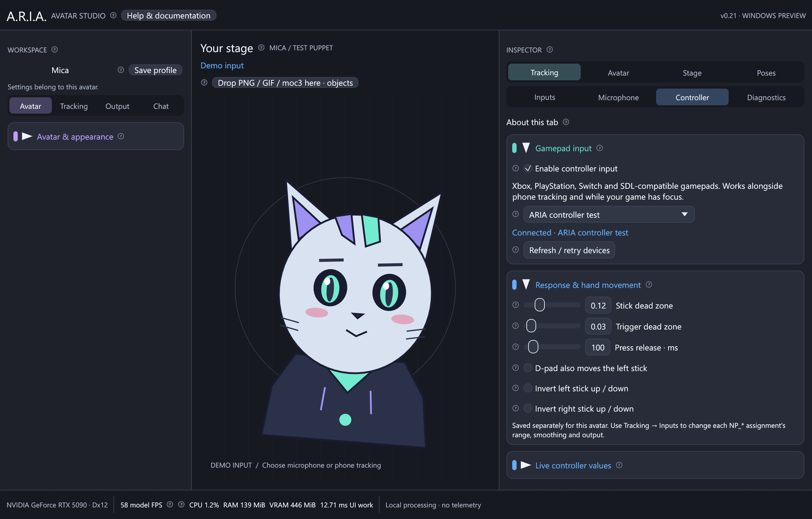

# Controllers and Live2D gamepad rigs

ARIA 0.21 reads gamepads directly, alongside iPhone face tracking and microphone
input. A Nyarupad plugin or a running desktop VTube Studio instance is not needed.
The old “Unsupported profile input NP_…” warnings meant ARIA had rejected the
controller assignments; changing their ranges could not fix that missing reader.

The documentation image uses Mica and a process-local test controller.

## Connect and use

1. Connect your controller over USB, or pair it in Windows Bluetooth settings.
2. Import the avatar's `.model3.json`, keeping its adjacent `.vtube.json` file.
   The VTS profile supplies the artist's exact parameter names and input/output
   ranges. Reopen an already imported avatar after updating ARIA.
3. In the right Inspector select **Tracking → Controller**. Controller input is
   enabled by default. **Auto** keeps the first available controller; choose a
   named device if several are connected. **Connected** confirms the reader.
4. Expand **Live controller values**. Press a button and move each stick. `NP_ON`
   becomes 1 while the selected controller is connected and enabled. The model's
   controller appears when its rig maps that input to its visibility parameter.
   If **Avatar controller poses** appears, enable the matching expression as well.
   For the supplied Vespera model this is **ControllerArms**; its separate arm-set
   switch must be on even when `NP_ON` is already 1. These shortcuts use the same
   saved expressions as **Avatar → Expressions**, including existing hotkeys.
5. In **Tracking → Inputs**, search `NP_`, the parameter name, or open
   **Controller & hands**. Change source ranges, output ranges, smoothing, response
   curves and stepping there. Use **Poses** to hold values for screenshots.

The app continues reading while a game or OBS has focus. It does not create a
virtual controller, inject buttons into a game, or send rumble. Phone face loss
does not disconnect a gamepad. Frozen poses and manual holds still take precedence.
The same live inputs are available to independent Live2D stage items and to image
actions; the avatar needs suitable artwork/rig parameters to display a controller.

## Supported hardware and layouts

The bundled SDL2 reader uses Windows XInput, DirectInput/Raw Input and HID support
to cover Xbox-compatible pads, PlayStation DualShock/DualSense, Switch Pro/Joy-Con,
and other mapped USB/Bluetooth gamepads. Actual availability depends on the
controller, connection mode, Windows driver and SDL's device support. “All” cannot
guarantee every proprietary device, adapter, steering wheel or future controller.
USB and Bluetooth may expose different identities, requiring device reselection.

For an unrecognized joystick, expand **Other controllers & custom layouts**.
Its name and GUID appear under **Needs mapping**. Import a Windows SDL2
`gamecontrollerdb.txt` or a `.map` text file for that device. For unusual equipment,
create a layout with SDL's `controllermap` utility or another SDL2-compatible
mapping tool. Map its physical controls to the standard gamepad axes/buttons.
Mappings can include axis inversions; no proprietary protocol is inferred.
Files are limited to 1 MiB, stored locally with this avatar, and loaded again on
startup. **Restore built-in controller layouts** removes that avatar's override.
SDL3 mapping files with incompatible syntax should be converted to SDL2 format.

Buttons use positions: A = bottom, B = right, X = left, Y = top, regardless of
the letters printed on the pad. Thus PlayStation Cross and the bottom Switch
button drive `NP_ButtonA`. **D-pad also moves the left stick** supports rigs which
only animate a stick; diagonal movement is normalized to avoid oversized travel.

If the game works but ARIA sees no device, check **Connected** and the selected
device first. Refresh/retry after reconnecting. Steam Input, controller emulators,
exclusive-mode drivers and device-hiding tools can expose a virtual pad or hide
the physical one from other applications. Select the exposed pad or make the
physical device available to ARIA. Avoid duplicate physical + emulated inputs.

## Response controls

| Control | Effect |
| --- | --- |
| Stick dead zone | Removes drift around the center, then rescales the remaining travel. Default 0.12; range 0–0.5. Uses a circular dead zone. |
| Trigger dead zone | Removes tiny resting trigger readings and rescales to 0–1. Default 0.03; range 0–0.5. |
| Press release | Decay time of a new-button-press pulse, independent of FPS. Default 100 ms; 0 makes a one-frame pulse. Held-button inputs remain separate. |
| Invert left/right Y | Reverses that stick's vertical direction. Off by default: right/up are positive; X and Y never exchange roles. |
| Device | Auto or a particular connected controller. A selected missing device stays neutral instead of borrowing another player's pad. |

Selections, dead zones, inversions and custom layouts save separately for each
avatar. Identical devices without serial numbers use connection ordinals; reconnect
them in the same order or select the desired one again. Disable controller input to
close its reader and return all `NP_*` values to zero. Disconnecting also clears
button pulses and remembered hand positions so they cannot stick on the model.

## Nyarupad-compatible signals

| Input family | Values and meaning |
| --- | --- |
| `NP_ON` | 0/1, selected controller available and enabled. |
| `NP_LStickX/Y`, `NP_RStickX/Y` | −1…1; X = horizontal, Y = vertical. |
| `NP_LButtonDown`, `NP_RButtonDown` | 0/1, any D-pad direction / any face button held. |
| `NP_LButtonPress`, `NP_RButtonPress` | New-press pulse, including the corresponding stick click and Back/Start button; decays using Press release. |
| `NP_LThumbX/Y`, `NP_RThumbX/Y` | −1…1, last pressed D-pad/face-button direction. This is an inferred animation, not finger tracking. |
| `NP_LOnStick`, `NP_ROnStick` | Last thumb activity was stick movement/click (1) or D-pad/face buttons (0). |
| `NP_L1`, `NP_R1` | 0/1, left/right bumper held. |
| `NP_L2`, `NP_R2` | 0…1, left/right trigger travel. |
| `NP_LIndexPos`, `NP_RIndexPos` | Last index-finger target: bumper = 0, trigger = 1. Bumper wins if both are held. |
| `NP_ButtonA/B/X/Y`, `NP_ButtonLS/RS` | Individual face buttons and stick clicks, 0/1. |
| `NP_DPadUp/Down/Left/Right` | Individual D-pad directions, 0/1. |
| `NP_SelectDown`, `NP_StartDown` | Back/Select and Start/Menu, 0/1. |

## Existing profiles and face inputs

The first load upgrades old saved avatar configurations and presets by inserting
only newly supported, missing `NP_*`, `JawOpen`, `TongueOut` and `BrowInnerUp`
assignments from the avatar's profile. Existing customized bindings, ranges,
physics, expressions, objects and presets are preserved. The upgrade runs once;
removing a mapping afterward does not cause it to return on every launch.

The three face aliases now read their corresponding raw phone blendshapes (0–1).
They return to zero when tracking is lost. Tongue tracking requires a sender that
actually provides that blendshape; adding an alias cannot invent missing data.
Other unknown plugin-specific input names still produce an explicit warning.

Protocol and implementation references:
[Nyarupad input definitions](https://github.com/maruseu/Nyarupad-VTS/blob/main/src/main.rs),
[Rust SDL2 controller API](https://docs.rs/sdl2/0.38.0/sdl2/controller/index.html),
[SDL background controller input](https://wiki.libsdl.org/SDL2/SDL_HINT_JOYSTICK_ALLOW_BACKGROUND_EVENTS),
[SDL controller mappings](https://wiki.libsdl.org/SDL2/SDL_GameControllerAddMapping).
