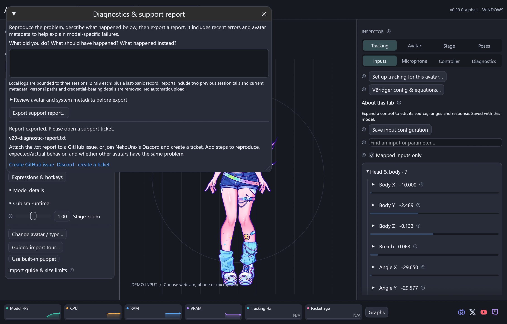

# Diagnostic reports and support tickets

You do not need to find a log folder or understand programming to report a problem.

1. Keep ARIA open and reproduce the issue once. Note which avatar and tracking
   source were active and what you clicked immediately before it happened.
2. Click **Diagnostics / export logs** in the top bar.
3. Write what you expected, what happened instead, and steps to reproduce it.
   Mention whether another avatar or the included Mica puppet works correctly.
4. Expand the metadata preview if you want to review it. Click **Export support
   report…** and save the `.txt` file somewhere easy to find.
5. The confirmation offers **Create GitHub issue** and **Discord · create a ticket**.
   Choose either, create a ticket, and attach the exported file. Reports are never
   uploaded automatically.

GitHub: [ARIA issue form](https://github.com/NekoUnix/A.R.I.A/issues/new/choose).
Discord: [NekoUnix community](https://discord.gg/79GfpWtpct).

## What the report contains

The beginning is a readable explanation. A JSON block below it can be inspected by
developers and coding assistants. The schema is `aria-support-report/v1`.

- App version, operating system, CPU architecture, GPU description and resource counters.
- Tracking source/status and packet/error counts; no raw camera or microphone recording.
- Recent component errors/status changes, import/action notices and a previous panic
  record when available. Each event has a stable code, severity, UTC Unix timestamp
  and milliseconds since this app session started.
- Avatar metadata: format/content identity, real parameter IDs/ranges and mappings,
  expressions and missing destinations, Live2D Core/canvas/mesh/mask/texture/part
  information, physics groups and tuning. VRM reports include bone, skin, geometry,
  morph, texture and spring counts. Attached item failures and pin metadata help
  diagnose differences between models.

The report excludes artwork, `.moc3`/VRM binaries, SDK libraries, full account/app
settings, camera/audio recordings and account credentials. Personal absolute paths
and credential-bearing text are removed. Parameter and model IDs may still identify
your rig. Review before sharing; do not attach avatar files unless redistribution
is permitted. VTube Studio import and VBridger import are labelled Experimental in
the report to make compatibility issues easier to recognize.

## Local log retention and crashes

ARIA keeps a bounded in-memory history and writes events on a background worker.
It retains three local sessions of up to 2 MiB each, plus a last-panic JSON record.
Repeated unchanged component messages are collapsed. A report includes the current
session and up to 256 entries from each of two earlier sessions. An abrupt native
driver/process termination may not produce a Rust panic or complete final log.

Logs are under `A.R.I.A/diagnostics` in Windows Local AppData, `aria/diagnostics`
under the Linux XDG state directory (normally `~/.local/state`), or
`~/Library/Logs/aria/diagnostics` on macOS. A custom `ARIA_PROFILE_DIR` keeps its
diagnostics underneath that profile. No network logging service is involved.

If the app cannot start, retain the launcher error and newest local log for your
ticket. If it can start after the failure, export a report to include earlier logs.

Live2D reports also include appearance locks and control definitions, authored
parameter-folder paths and layer opacity/color/group overrides. These help identify
model-specific outfit and visibility conflicts; avatar artwork is not attached.
