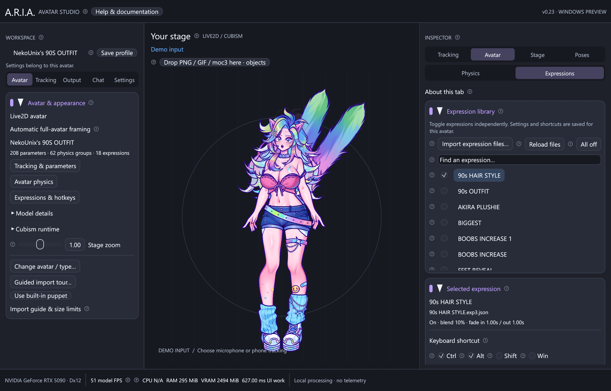

# Expressions and custom hotkeys

ARIA v0.6 loads Live2D `.exp3.json` expressions, including JSON expression files
named `.exp3`. Expressions can control facial features, clothing, accessories or
any other parameters exported in the avatar. The controls use each loaded model's
files and parameter IDs; they are not tied to the development test avatar.

## Load and toggle expressions

1. Open the avatar's `.model3.json` or `.moc3` as usual.
2. Open **Inspector → Avatar → Expressions**. ARIA reads the manifest's named expression
   references and discovers unlisted `.exp3.json` / `.exp3` files in the avatar
   folder and its subfolders. The same file appears only once.
3. Check an expression to turn it on; uncheck it to fade it out. Select its name to
   see its file, blend amount, fade times and parameter values. Multiple expressions
   can be enabled together. **All off** releases them all.
4. Use **Import expression files…** for exports stored elsewhere. You may select
   several files. ARIA remembers those file paths for this avatar. Keep the files
   at those paths; ARIA does not modify or copy the author's files.
5. After editing an existing expression on disk, choose **Reload files**. This
   rereads the listed files and restarts their fades. Reopen the avatar to discover
   newly added files in its folder, or import the new files directly.

Missing or malformed files appear under **Files needing attention**. They do not
prevent the avatar or its other expressions from loading. Unknown parameter IDs
are displayed under the selected expression and skipped. An expression needs
matching parameter IDs to affect a model; an arbitrary expression from another
avatar will not necessarily work.

## Assign your own keyboard shortcut

Open **Hotkeys & actions → Keyboard shortcuts**, find the avatar's expression,
click **Record…**, press the desired combination, then **Save shortcut**. Press it
once to turn the expression on and again to turn it off. **Clear** removes its
binding. Windows registrations work outside ARIA; other platforms currently use
focused shortcuts. Registration errors and duplicate assignments appear in the
dedicated window. See [the shortcut and action guide](actions.md).

The same expression can be used in a visual action graph with explicit On/Off
steps and delays. Imported VTube Studio desktop actions use the same recorder
while retaining their hold/release semantics. Phone tracking hotkey diagnostics
are separate from desktop keyboard shortcuts.

## Blending, movement and screenshots

ARIA applies the file's **Add**, **Multiply** and **Overwrite** parameter operations,
following the [Cubism expression model](https://docs.live2d.com/en/cubism-sdk-manual/expression/).
An omitted Blend uses Add. Omitted FadeInTime/FadeOutTime values use one second;
zero means immediate. Fades ease smoothly, and toggling during a fade starts the
new transition from the current blend amount.

Each frame starts from the avatar's default/manual values and current tracking.
Expression layers then apply in the displayed file order, before authored physics.
This lets changed driver parameters push secondary movement. Values clamp to the
rig's limits, and Add/Multiply values do not accumulate from one frame to the next.
If expressions overlap, later layers can change the result of earlier ones;
later Overwrite layers take priority as their blend reaches 100%.

Individual held parameters keep priority over expressions and physics. A full
**Frozen** pose preserves the exact final appearance and pauses expression fades.
Expression toggles are disabled while frozen; press **Resume live** before changing
them. To make an image, turn on the desired expressions, let the fades settle,
then freeze the pose and export a transparent PNG from **Pose**.

## Saved profiles and presets

On/off selections, expression file paths and shortcuts save with the avatar's
existing profile. Loaded profiles keep their shortcuts when changing editor tabs.
Unloading a profile releases its live action registrations. Reopening the same model restores its selections;
active expressions fade in again unless its saved pose is frozen.

Movement presets include the active expression selection. Pose presets capture
the final appearance, including expressions, and freeze it. Shortcut assignments
and imported expression paths belong to the model profile, so applying a preset
does not replace them. Exported preset JSON includes expression identities, not
the expression files themselves. Keep the matching files with the same avatar.

Discovery is bounded to 4,096 directory entries and eight subfolder levels, and
does not follow files outside the model directory. Up to 256 expressions are
loaded per avatar, with a 1 MiB limit per file and 4,096 parameter entries per
expression. Motion3 and pose3 playback remain separate, unimplemented features.
