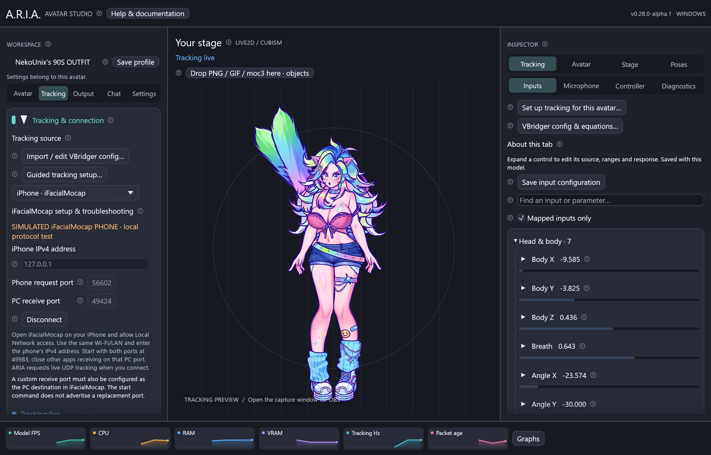

# Set up iFacialMocap with ARIA

Available in **v0.28.0-alpha.1**. This connects live iFacialMocap face tracking
directly to ARIA over your local network. Keep iFacialMocap running on your phone;
you do not need its desktop bridge or the VTube Studio desktop app.



This screenshot uses a visibly labeled local simulator and temporary ports for
validation. For your physical phone, follow the **49983** defaults below.

## Before you connect

- Install and open iFacialMocap on a compatible iPhone. Check its face preview
  responds when you blink or open your mouth before changing anything in ARIA.
- Connect the phone and computer to the same trusted router. The computer can
  use Ethernet while the phone uses Wi-Fi. A guest network may block communication.
- Allow the phone app's camera and Local Network permissions. If the latter was
  denied, enable it in iOS Settings for iFacialMocap and reopen the app.
- Close any other PC tracking receiver using UDP port **49983**. One application
  should own that receive port. Your running OBS scene does not need to be closed.

## Connect one step at a time

1. Open ARIA and load your avatar. You can first use the built-in Mica puppet to
   confirm the connection without dealing with avatar files.
2. Click **Tracking** on the left. In the tracking source menu choose
   **iPhone · iFacialMocap**.
3. Find the phone's IPv4 address in iFacialMocap. Enter that address in ARIA's
   **iPhone IPv4 address** box. It looks like `192.168.1.42`; use your phone's
   actual address, not that example or the computer's address.
4. Leave **Phone request port** and **PC receive port** at **49983** initially.
   Keep the phone in live UDP mode. Do not select recorded-animation transfer.
5. Click **Connect tracking**. If Windows asks about network access, allow ARIA
   on your trusted **Private** network.
6. Wait for **Tracking live**. Open and close your mouth, then blink. The input
   monitor and model should respond. A connection attempt alone is not proof that
   data has arrived; the status and packet counters confirm incoming frames.
7. Keep the phone upright and look forward comfortably. Click **Calibrate neutral
   pose**, then use **Guided tracking setup** to tune one movement at a time.
8. Test a head turn, a nod and a lean separately. The three head axes are separate.
   If one direction feels reversed, invert that axis in movement controls and
   recalibrate. Changing one axis never swaps up/down with left/right.
9. Save your profile. The iFacialMocap address and ports belong to this avatar;
   VTube Studio keeps its separate saved connection details.

The circled **?** beside **iFacialMocap setup & troubleshooting** opens the same
essential guidance offline. [Personal tracking setup](tracking-setup.md) explains
retakes and the illustrated face preview.

## Use your VBridger configuration

Connect the phone first, then open **Import / edit VBridger config**. Review the
outputs and click **Apply supported outputs to this avatar**. Existing imported
equations can use the iFacialMocap ARKit channels. A config does not add a channel
that the phone is not sending or a movement your avatar was not rigged to make.

**VBridger import remains Experimental.** It replaces ARIA's ordinary gain and
personal input calibration for the imported channels. Tune its input curves in
the [VBridger editor](vbridger.md), or disable it to use the standard guided range
wizard. Model parameter ranges, physics and mouth response still apply.

## If something does not work

| What you see | What to do |
| --- | --- |
| Cannot bind port | Close another iFacialMocap/VBridger/face-tracking receiver using 49983, then reconnect. |
| Waiting for data | Check the phone's current address, same LAN, Local Network permission, UDP mode and firewall. Keep the phone app in the foreground. |
| Signal lost | Bring the phone app back to the foreground and check Wi-Fi. ARIA retries the start request while the signal is stale. |
| Input numbers move but the avatar does not | Check the selected avatar, frozen pose, source assignments and imported output ranges. Try Mica to separate connection and model issues. |
| One head direction is reversed | Correct that individual inversion setting and recalibrate neutral pose. |
| Tracking stops when another app connects | Close that receiver or explicitly configure a separate destination in the phone. Both PC applications cannot own the same receive port. |
| Address changed after restarting the router | Enter the new phone address and save the avatar profile. |

If you intentionally change **PC receive port**, also set the phone app's PC
destination to the same port. ARIA's initialization message does not advertise a
replacement receive port. Start with defaults when troubleshooting. No internet
port forwarding is needed. On Windows the optional scoped firewall helper can be
used with `-Port 49983`; see [Windows network setup](windows.md#windows-firewall).

## Developer protocol and validation

ARIA implements the [official iFacialMocap UDP specification](https://www.ifacialmocap.com/for-developer/).
It sends the documented initialization command with `sendDataVersion=v2` and
accepts both legacy `name-value` and v2 `name&value` fields. Coefficients are
converted from percentages to ARIA's 0–1 range; `_L`/`_R` become left/right names.
Head and eye coordinates retain degrees, and position is retained. At the adapter
boundary, ARIA pitch/yaw/roll is `(-headX, -headY, headZ)` so imported
`headRotX/Y/Z` equations receive the original iFacialMocap coordinates.

Packets are limited to 16 KiB and 128 blendshapes. Invalid, duplicate, nonfinite
or incomplete packets never replace the last good frame. Only the selected
sender IP is accepted. The live format has no sender timestamp or face-confidence
flag, so ARIA uses local packet arrival age and treats valid packets as available
tracking. If the phone keeps transmitting a frozen pose, this protocol cannot
distinguish it from a still face. UDP has no reliable ordering guarantee.

This version does not implement TCP, Bluetooth, recorded-animation transfer or
body tracking for iFacialMocap. Physical phone, network and direction/latency
acceptance remains separate from the parser, loopback and native-render checks.

For a local diagnostic without a phone, use two terminals from the source tree:

```sh
cargo run --locked -p aria-cli -- simulate-ifacial --port 49984 --seconds 120
```

```sh
cargo run --locked -p aria-cli -- listen --ifacialmocap --sender 127.0.0.1 --request-port 49984 --listen-port 49983 --seconds 20
```

For a physical phone, use `listen --ifacialmocap --sender PHONE_IP`; both ports
default to 49983. The simulator's separate request port avoids a loopback port
collision and its output is explicitly synthetic. It is not a camera or benchmark.
