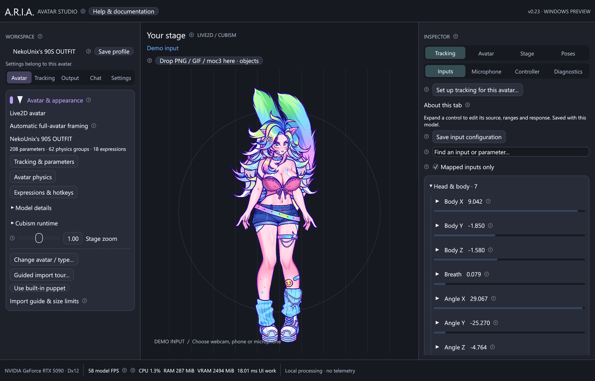

# ARIA in-app help

This guide is bundled into the application and works offline. The topic headers also provide the short hover descriptions for the circled question-mark buttons.

## webcam | Webcam & NVIDIA RTX tracking | Track your face locally with a camera, then calibrate it to this avatar.

Choose Tracking > Tracking source > Webcam (MediaPipe) or Webcam (NVIDIA RTX). Camera access starts only when you press Start camera. Switching source, switching avatar or closing ARIA releases the camera. Frames are processed locally; ARIA does not record or upload them. Only movement numbers reach the Rust renderer.

Open Install / repair camera runtime, install Python 3.12 x64 with its launcher, and click Install webcam runtime. This downloads pinned Python dependencies and Google's face-landmarker model into %LOCALAPPDATA%/ARIA/tracking. Internet is required during installation; tracking works offline afterward. Existing installations can be selected with their Scripts/python.exe. Use Find cameras and choose the physical or virtual camera. Windows Settings > Privacy & security > Camera must allow desktop apps. Close other apps that exclusively own the same camera.

Start with 640 × 480 at 30 FPS. Higher resolutions increase capture and inference cost; actual camera modes depend on the driver. Confidence (MediaPipe only) controls how certain detection must be before reporting a face: lower it if tracking drops in good lighting, raise it if background objects are mistaken for faces. It does not change the strength of model movement. Camera settings are saved per avatar; interpreter and SDK paths belong to the PC.

NVIDIA RTX uses the optional NVIDIA AR SDK FaceExpressions feature on a compatible Tensor Core GPU. NVIDIA Broadcast virtual camera can be selected by either backend, but Broadcast itself is not the AR SDK. Download SDK Core and FaceExpressions, LandmarkDetection and FaceBoxDetection features for your GPU from NVIDIA, then build the supplied ARIA bridge using tracking/nvidia/CMakeLists.txt. Select the SDK root here. NVIDIA access, licenses, drivers and matching feature versions are required; details are in docs/webcam.md. Missing SDKs produce an error and do not silently switch engines.

After Start camera reports Tracking live, click Guided tracking setup. Capture a relaxed neutral pose, turn and tilt your head, blink and smile, open your mouth, and move your eyes. Review the preview before saving. Each avatar retains its own calibration, so the same face can drive very different rigs. X is vertical pitch; Y is horizontal yaw in raw camera packets. Check axis inversion in Movement if your rig moves backwards. Tongue tracking is not supplied by these camera backends. Face loss returns the model toward its resting pose instead of holding stale tracking.

## themes | Themes & custom colors | Pick a palette or make a reusable theme for the entire interface.

Open Settings > Appearance & themes. Choose Sonoma Dark, Sonoma Light, Sakura, Ocean, Forest or High Contrast. The palette changes panels, cards, controls, headings, help windows and category accents immediately. It applies globally across avatars. These are solid colors with no blur, animation or extra render textures. The Studio background follows the palette; transparent and chroma-key outputs retain their chosen backgrounds.

Expand Make your own theme, give it a name, and edit each color with its swatch. The color picker includes numeric values; the hex value beside it helps match branding. Light controls selects light or dark built-in icons. Text, secondary text and borders should remain readable against cards and panels; a low-contrast notice appears when the main text is difficult to distinguish. Save custom theme stores a reusable palette (up to 32). Editing the active theme applies immediately and persists on normal app exit. Delete removes the named saved copy; Reset returns to Sonoma Dark. Export and Import exchange a small JSON palette containing only a name and RGB colors; it cannot contain scripts or assets.

## api | Developer control API | Let scripts control the current avatar through authenticated local HTTP.

Open Settings > Developer API and enable the API. It listens only at 127.0.0.1 on the chosen port (default 39421). Copy API key and keep it private: anyone holding it on this PC can control ARIA while the API is enabled. Rotate key immediately invalidates the old key. The key is never included in status responses or printed in the interface. Browser-origin requests are refused; use desktop integrations, Python, PowerShell, Node.js or Streamer.bot.

GET /v1/state returns a version, the current model generation, live input and parameter values, allowed parameter ranges, presets, expressions, output settings and available themes. Send POST /v1/commands with version 1, that generation and a typed action. The returned ticket means queued, not completed: GET /v1/commands/{ticket} reports applied or rejected. Fetch state again after switching avatars. A stale generation is rejected and a queued command is rechecked on the UI thread. Commands cannot launch programs, open arbitrary files or import models. At most 20 HTTP requests per second, 4 KiB per request body and 32 queued commands are allowed; only the last 128 command results remain available.

SetParameters holds specified native parameters in partial override mode after checking their real limits. ReleaseParameters releases selected holds; an empty list releases all. Pose freezes the rendered values or resumes live movement. Preset applies a saved preset by its current index. Expression enables or disables a known expression ID. Output opens or closes one canvas and optionally adjusts zoom and position. Theme selects a built-in or saved custom palette. SaveProfile saves current per-avatar controls. Settings may also persist during normal application autosave. Full examples and schemas are in docs/api.md and templates/api. Existing /v1/effects and /v1/effects/trigger integrations remain supported.

## guided-import | Guided avatar import | Choose PNG/GIF or Live2D, prepare its files, review the import and follow the next steps. Once loaded, Avatar and Inspector controls match the primary avatar type.

### Choose and prepare

Open Avatar & appearance. For a new session choose Import PNG / GIF avatar or Import Live2D avatar. Change avatar / type opens the type picker later. Guided import tour opens preparation for the current type. The old avatar stays active until the new import succeeds. Closing or cancelling an in-progress image import keeps the old avatar and its profile.

PNG/GIF: select one file, several files or an artwork folder. Folder import includes its immediate PNG/GIF files, not unrelated project files. Mark exactly one file Idle / base. Talking responds to MicTalking when the microphone is enabled, otherwise the mouth input; Blink follows eye input or auto-blink. Quiet reacts when talking stops. Manual / hotkey files display only when activated. Names containing inactive or idle suggest the base; talking suggests Talking; muted or deafened files suggest Manual. ARIA does not read Discord mute/deafen status. Assign those actions hotkeys or your own input rules after import.

Live2D: select the exported model3.json or its matching moc3 and choose the official Cubism Native Core x64 DLL. Keep relative atlas, physics and expression paths intact. The review summarizes the export. A bare moc3 can be paired with ordered atlas textures in the follow-up dialog. Import restores this model's own parameter settings, groups, expressions and saved profile.

### Review, import and create

Image review shows estimated playback texture dimensions for the current graphics device and memory setting. Frame timing, source files and artwork identity are retained. Large GIFs are composited one source frame at a time in a background worker, then fitted for playback. A progress bar reports completed frames; the stage stays responsive. Extra image states continue loading in the background after the base is ready. Invalid files remain visible as errors and do not erase the working avatar. Reimporting the same base restores its profile and adds new selected artwork without clearing existing triggers and hotkeys.

After image import, use Artwork, actions & transitions for roles, fades, movement and hotkeys, or Microphone & talking to select an audio device. After Live2D import, use Tracking & parameters, Avatar physics, and Expressions & hotkeys. The Inspector hides Cubism physics/expressions for image avatars and hides PNG/GIF avatar actions for Live2D. Stage accessories, throws, outputs and microphone inputs remain available to both types because they are independent scene tools.

## gif-memory | GIF detail and memory budget | Large animations are fitted once to a configurable playback budget instead of loading every full-resolution frame. Source artwork and frame timing remain unchanged.

### Source limits versus playback memory

PNG/GIF files may be up to 512 MiB on disk, with source edges up to 40960 pixels and up to 4096 MiB decoded per source canvas. GIFs may contain 4096 frames and up to 256 GiB of accumulated source-frame data. Every limit applies together. These ceilings cover files ten times the size of the tested 42.1 MiB, 3500 × 2500, 63-frame GIFs. Huge source canvases still require enough RAM to decode and composite one frame and working buffers.

The tested animations expand to about 2103 MiB each at original resolution. At the default 256 MiB playback budget, ARIA fits their frames to approximately 1221 × 872; it does not retain all of the original 3500 × 2500 frames. All 63 frames keep their original timing. Resizing preserves transparency and the original display aspect ratio. Normal small animations bypass resizing. Files and profile identity are not modified.

Choose 64, 128, 256, 512 or 1024 MiB per GIF in Avatar & appearance or PNG/GIF actions. Higher values keep more detail and use more RAM/VRAM. The image-action, stage-image and throw-image collections each allow up to 2560 MiB of retained textures; total usage also includes working buffers and the rendered stage. A higher setting may not fit many different GIFs at once. Lower the budget or remove artwork when a collection is full. The selected action shows its actual playback dimensions, frame count and texture usage.

Changing the budget reloads the action library in the background. Only one image import worker decodes at a time; cancellation stops at a frame boundary. Playback, fading, pinning and throws reuse immutable fitted frame textures. They do not decode or resize the original GIF every frame. An invalid file reports its error beside the action. Save profile and image-action presets retain this avatar's chosen playback budget.

## workspace | Finding controls in the workspace | Left: Avatar, Tracking, Output and Chat setup. Right: Tracking, Avatar, Stage and Poses tools. Category buttons remain visible while their settings scroll.

### Studio setup on the left

Avatar opens PNG/GIF artwork or Live2D exports and contains Cubism runtime, model details and stage zoom. Tracking contains phone/network connection, source selection, calibration and movement mapping. Output contains landscape, portrait and freeform canvases, OBS/Spout settings, chroma color, frame rate and Windows priority. Chat contains Twitch and YouTube account setup and chat appearance.

### Inspector on the right

Tracking → Inputs edits ranges, steps, smoothing and parameter mappings. Tracking → Microphone sets the audio device and talking gate. Tracking → Diagnostics shows raw packets and exports mapped values. Avatar → Physics contains overall and per-group simulation settings. Avatar → Expressions contains exp3 files and hotkeys. Avatar → PNG / GIF contains image actions, artwork, triggers, fades and animation.

Stage → Objects contains pinned PNG/GIF and independent Live2D accessories, input toggles and object settings. Stage → Throws & sprays contains reusable throw/liquid designs, assets and the visual aim/physics editor. Poses → Pose controls freezes or manually positions the avatar. Poses → Presets saves named movement and screenshot configurations with shortcuts.

Each page scrolls separately and remembers its scroll position. The navigation stays at the top so you can change pages without scrolling back. The Inspector's inner edge can be dragged to change its width. Collapsible sections keep detailed configuration close to the feature it controls. Save profile is always at the top left. All model-specific settings still belong to the loaded avatar; changing categories does not reset them.

The graphite palette, blue accent and compact controls use the existing native renderer and installed Windows font. There are no blur passes, animated interface transitions, new font downloads or decorative image textures. Only the selected page's controls are laid out.

## asset-limits | Large PNG, GIF and Live2D imports | Import size ceilings are 10× larger. PNG/GIF: 512 MiB files and 40960px source edges. Live2D: 1280 MiB moc3 files and 81920px atlas edges. Oversized textures are fitted once to your GPU.

### Images and animation

PNG/GIF artwork may be up to 512 MiB on disk and 40960 pixels on either source edge, with a 4096 MiB decoded RGBA budget per source canvas. The dimension and byte limits both apply: a full 40960 × 40960 RGBA canvas is larger than that memory budget. GIFs allow up to 4096 frames and 256 GiB of accumulated source frames; their retained playback textures are fitted to the selected memory budget. Each image-action, stage-image or throw-image collection has a 2560 MiB budget. Animated budgets count every frame. These are import ceilings, not preallocated memory.

### Live2D exports

A moc3 may be up to 1280 MiB. Model manifests, physics, tracking profiles and display-information JSON may be up to 20 MiB; expression files may be up to 10 MiB. Native model allocation is allowed up to 5120 MiB, subject to Cubism's own supported model format and allocation size. A model may reference 1–32 atlases. Each atlas file may be up to 1280 MiB compressed, 81920 pixels per source edge and 5120 MiB decoded. Retained atlas textures may total up to 10 GiB for the main model, or per independent object/throw model collection. Existing object counts and mesh-index limits still apply.

### Fitting artwork to your GPU

Your graphics device has a maximum texture edge independent of ARIA's file limits. When a source exceeds it, ARIA resizes the texture once while importing, preserving its aspect ratio, transparency and Live2D UV mapping. For example, a 16384 × 8192 atlas becomes 8192 × 4096 on a device with an 8192-pixel limit. The source file remains unchanged; details above the uploaded resolution are reduced. Live2D Model details lists fitted atlas sizes. The source image's identity is retained so saved avatar settings work across GPUs.

Normal-size images bypass resizing. Uploaded textures and animation frames are reused during playback; moving, pinning or zooming an asset does not decode it again. Raising the ceilings does not reserve additional RAM or VRAM. Actually loading bigger artwork can use more memory and take longer, and the PC must have room for decoding, GPU copies and rendering buffers. The bottom bar shows current usage. An invalid export, missing atlas or unsupported Cubism version still needs to be corrected even when it fits the new size limits.

## image-actions | PNG and GIF image actions | Give each action its own PNG or GIF, trigger, priority and hotkey. Talking, quiet, blinking and custom input ranges select artwork automatically; manual controls hold an image for capture.

### Start a PNG or GIF avatar

Use Avatar & appearance → Import PNG / GIF avatar to select your base artwork. ARIA creates an Idle action for a new image and restores that image's saved profile when reopened. The last image avatar reopens on startup unless you launch a different model explicitly. PNG/GIF image actions belong to the base avatar's content identity, so switching avatars restores separate settings. Live2D keeps its own rendered avatar; microphone and stage-object inputs also work there.

Choose PNG / GIF actions in the Inspector. Add images accepts several PNG/GIF files; each becomes a named action. Talking image and Blink image create useful trigger defaults. Select an action in the library to configure its artwork, trigger, transition, movement and GIF playback. Replace a missing file with Choose PNG / GIF. Reload artwork rereads changed or previously missing files. A broken file is reported and skipped, allowing another valid action to show.

### Choose an action

Idle is an always-eligible fallback. Talking uses the microphone talking gate when enabled; otherwise it uses MouthOpen above 0.18. Quiet uses the opposite condition. Blink reacts to either tracked eye below 0.3 or the built-in periodic AutoBlink signal. Use a custom range on an eye input if you only want tracked blinking. Manual / hotkey only never wins automatically. Higher numeric Priority wins among eligible states; ties prefer the larger action ID, usually the more recently added action. Give idle a low priority and special reactions a higher one.

Tracking or parameter range lets you select any available signal, including MicLevel, MicTalking, head angles, mouth, expressions' resulting parameter values or custom ARKit inputs. You can also type a signal name. Both range endpoints are inclusive. Hysteresis widens the exit range after entry so a noisy signal does not flicker. Missing inputs make that action inactive. Minimum state hold prevents automatic replacement until its hold time expires. An explicit manual activation takes precedence.

### Hold, hotkeys and save

Activate / hold image displays that action until Resume automatic actions. An assigned hotkey selects the action; pressing it again returns to automatic selection. Hold affects the image choice; use Pose → Freeze to hold tracking, GIF frames, fades and movement exactly for screenshots. Assigning a valid shortcut enables global hotkeys for this avatar. Conflicts with expressions, effects, items and presets are rejected. Remove action deletes only that configuration, not its image file.

Save actions stores this library for the current avatar. Movement/pose presets include image action settings. Export actions writes a reusable JSON configuration; images are referenced, not embedded. Import actions replaces this avatar's image action library and clears imported hotkeys/manual selection to avoid conflicts. Relative artwork paths resolve beside the JSON file. The templates/images directory contains editable artwork and an example configuration. Up to 128 actions can be configured per avatar.

## image-transitions | Image fades and transitions | Set how long each image takes to appear and disappear, choose a cut, crossfade, fade through transparency or slide, and hold states briefly to avoid rapid flicker.

### Transition timing

Cut switches immediately. Crossfade gradually overlays the incoming artwork while fading the outgoing artwork. Fade through transparent fades the outgoing artwork during the first half and brings in the incoming artwork during the second half. Slide & fade shifts the incoming artwork from the right and sends the outgoing image to the left while their opacity changes. These are visual transitions; they do not change the source PNG or GIF files.

Fade in and Fade out range from 0 to 10 seconds. The incoming action supplies the transition style and its fade-in time; each outgoing action uses its own fade-out time. Different times can create a deliberate overlap or gap. Transparent regions remain transparent; a dissolve can also reduce the composite opacity. Set both times to zero or choose Cut for an instant swap. A new trigger during a fade starts from the currently displayed weights instead of snapping back to the prior image.

Minimum state hold is 0–10 seconds and keeps automatic selection from replacing the active state immediately. It is independent of GIF duration and motion duration. Manual action selection overrides the minimum hold. Pose → Freeze pauses the transition at its current point and preserves that frame in PNG export and OBS. Settings are saved for each image action and follow the current avatar's profile.

## image-motion | Image animation on change | Animate each new image with shake, jump, blip/pop, pulse, wobble or bob. Control strength, duration, frequency and whether the motion repeats while the action stays active.

### Motion choices

None keeps the artwork steady apart from normal tracking. Shake moves sideways. Jump makes one upward arc and returns. Blip is a brief squash/pop that springs back to normal size. Pulse expands and contracts, Wobble rotates, and Bob moves vertically. Motion restarts when the action becomes active. A changing GIF frame does not restart the action animation, so the two motions can run together.

Strength ranges from 0 to 0.5. Position offsets use a fraction of the fitted image height, scale motions use relative size, and Wobble uses radians. A small strength such as 0.03–0.08 is a useful starting point. Duration is 0.05–10 seconds. Frequency controls oscillations per second from 0.1 to 30 Hz for Shake, Pulse, Wobble and Bob; Jump and Blip use their own one-shot envelope. Non-repeating motion settles exactly to the normal pose at the end.

Repeat while action is active keeps the motion running. Disable it for a single reaction when talking starts or an emote activates. Jump repeats its arc; oscillations continue at the selected frequency. The motion scales with avatar zoom and output resolution. Freeze pose pauses the animation clock, GIF and fades together. Source artwork is never edited.

## gif-playback | GIF playback and asset limits | Animated GIFs work as avatars, image actions, stage objects and throw/spray assets. Each image action controls speed, looping and restart behavior, with synchronized frames in stage, export and OBS.

### Playback controls

GIF speed ranges from 0.05× to 4×. Loop GIF repeats continuously; disable it to play once and hold the final frame. Restart GIF when action activates starts at frame one on each entry. Turn it off to select the frame using the avatar action clock, so returning to a state continues on the shared timeline. Original frame delays are respected, with a 20 ms minimum to avoid zero-delay spinning. GIF transparency and frame disposal are decoded before playback.

Stage objects play from the avatar's stage clock. Each thrown GIF uses that particle's own age, so objects emitted at different times have independent playback. Pause effects stops thrown GIFs; Pose → Freeze also holds stage GIFs and image-action GIFs. Immutable frame textures are shared between copies, and only the selected frame is drawn. Deformation, tint, pinning and alpha output continue to work on animated artwork.

Images may be up to 40960×40960 source edges with a 512 MiB file limit. GIFs are limited to 4096 frames and 256 GiB of accumulated source RGBA frames, fitted to a configurable playback memory budget; each avatar-action, stage-item or throw-image collection has a 2560 MiB decoded budget. All size and memory limits apply together; source textures above the GPU edge limit are fitted once on import. These limits count all GIF frames, not just the compressed file size. Resize or shorten a large GIF if needed. Standard GIF palettes usually provide binary transparency; use PNG for smooth semi-transparent static edges. No GIF audio is played. Missing or invalid files show an error without replacing the main avatar.

## microphone | Microphone input and talking | Choose a Windows input device, meter its volume, tune sensitivity and a stable talking gate, then drive PNG/GIF actions, Live2D mouths or arbitrary input mappings without recording audio.

### Connect a microphone

Choose Microphone / manual · no tracker for a stationary puppet without phone tracking. Enabling the microphone while Demo is selected switches to this local mode. Open the Microphone tab and enable microphone input. Choose Windows default input or a named device. Refresh devices updates the list; Retry input reopens a disconnected or failed device. A missing explicitly selected device produces an error instead of silently choosing another microphone. If Windows blocks access, enable microphone access and access for desktop apps in Windows Settings → Privacy & security → Microphone, then Retry. Device selection and sensitivity settings save with this avatar. Disabling input or switching avatars closes the current audio stream.

The meter shows a normalized 0–1 level and TALKING/QUIET state. Raw dBFS is the measured RMS volume before gain: values closer to 0 are louder. Gain adds sensitivity in decibels. Noise floor maps quiet sound to zero, and Full mouth maps a louder level to one. The full-mouth value must remain above the floor. Set noise floor from current level samples the current meter plus 6 dB; remain quiet when pressing it, then test normal speech. This is an amplitude detector and can respond to music or room noise; it is not speech recognition.

### Smooth the talking control

Attack controls how quickly the level rises; Release controls how quickly it falls. Talk starts at opens the talking gate, Talk ends below closes it, and Quiet hold requires that quieter level to last for the chosen time before closing. The closing threshold cannot exceed the opening threshold. Increase Quiet hold if short gaps between words flicker; lower it for quicker mouth closure. Excessive gain or a floor below room noise can leave the gate open.

Replace tracking mouth drives MouthOpen and ParamMouthOpenY with the microphone envelope. Combine uses the larger of tracking and microphone levels. Image actions / inputs only leaves the tracked mouth unchanged while keeping microphone signals available. The Talking image action uses the microphone gate whenever input is enabled. An input loss releases the meter to silence; Retry is required after a device error. Pose → Freeze keeps the rendered mouth and images held while the live microphone meter continues measuring.

MicLevel is the normalized envelope, MicTalking is 0 or 1, and MicEnabled reports an open enabled stream. These signals can drive any tracking-input binding, image range, or stage-object toggle. Talking also supplies the current microphone gate or, without a microphone, the tracked mouth level. Audio samples are reduced to an amplitude measurement locally and immediately discarded. ARIA does not record, transmit, recognize speech or monitor the audio through your speakers. Capture voice separately in OBS if desired.

## effect-deformation | Impact dents and deformation | Configure the avatar and thrown objects separately: dent depth, affected area, squash, hold, recovery, elastic spring-back and shading. Preview the impact, then save it per avatar.

### Enable and preview

Open Throws & liquid sprays, select a design, choose Edit toggle / directions, then open Deformation. New throw starts with Gentle impact. Existing saved designs keep deformation disabled until you enable it. Avatar on stage and Thrown objects each have their own Enable deformation switch and settings. Both throws and sprays can use these responses. Gentle impact restores moderate settings; Soft & elastic increases depth, squash and spring-back; Disable both turns off the responses while preserving your numbers.

Preview burst shows the settings on the live avatar and each emitted object. Changes affect the next burst. Pause holds the current response for inspection, while the avatar can keep tracking. Clear preview removes dents and objects. Save toggle stores the configuration for this design and this avatar. Cancel changes discards the draft. In normal playback, Pause effects holds dent timers, Freeze pose holds the model too, and Clear active effects restores the original shape immediately. Switching avatars clears transient dents.

### Shape and strength

Dent depth ranges from 0 to 1. It pushes a localized area inward along the incoming impact direction on the avatar, and compresses the contact side of the thrown object in the opposite direction. Zero removes that displacement. Squash & stretch independently compresses and widens the affected region; thrown objects also squash as a whole, while the avatar response stays localized. Set both to zero for no geometry displacement. Disable Depth shading too if you want no visible response.

Area / canvas height sets the avatar dent radius from 0.02 to 0.6 of its full canvas height, including transparent padding. An area of 0.1 affects a radius of 10 percent of that height. Area / object height sets each thrown object's dent radius from 0.1 to 1.5 of that object's height. Small areas make focused dents; large areas soften a wider region. All values scale with output resolution and avatar zoom. Dents follow the hit Live2D surface as it moves; attached props and accessories follow the displaced attachment point.

Scale strength with impact speed multiplies the response by travel distance divided by actual flight time, clamped between 0.25 and 2. Faster throws hit harder; turn it off to use the same configured strength at every speed. Depth shading darkens the indentation without changing texture alpha, from 0 for pure geometry to 1 for pronounced depth. Clear backgrounds remain transparent in PNG and OBS output.

### Hold, recovery and spring-back

Hold dent (s) keeps the peak response for 0–10 seconds after impact. Recover over (s) returns the shape over 0.05–10 more seconds. Elastic spring-back ranges from 0 for a smooth return to 1 for a damped wobble that can briefly bulge outward. At the end of recovery the original shape is restored exactly. Avatar and object timing are independent. For example, hold 0.2 seconds and recover over 1 second makes a 1.2-second response. Pause and Freeze stop these timers.

Object deformation ends when that object disappears, even if its recovery was longer. Avatar dents finish their own recovery and can outlast the thrown object's scene lifetime. Motion → Stay after impact and Fade-out time still control how long the object is present; deformation timing controls its shape. Use separate short object recovery and longer avatar hold for a soft ball that springs back while leaving a temporary dent.

### Rendering and limits

This is reversible 2D display deformation of the rendered avatar and each rendered prop. Live2D and PNG texture geometry is subdivided and warped; Mica's vector geometry also responds. 3D props receive dents in their rendered appearance; their source 3D geometry is unchanged. Avatar tracking parameters, Cubism rig data and source texture files are unchanged. Surface checks use the original animated geometry for stable impacts; misses do not create Live2D dents. Mica and PNG use their puppet attachment coordinates.

Up to 24 avatar dents can coexist; a newer impact replaces the oldest when full. Overlapping displacement and shading are bounded to keep large bursts stable. Deformation only adds mesh detail while a response is active. Every copy has its own impact and recovery; shared artwork is not deformed for other copies. The same result appears in the studio, designer preview, transparent PNG export and all three OBS canvases. A draft preview is isolated from stage/OBS playback.

## effect-editor | Visual throw and spray designer | Create a toggle in a popup with your avatar, draw launch-to-aim paths, choose exact asset quantities, preview it locally, then save the design to this avatar.

### Create, preview and save

New throw and New spray open the Effect designer. Select an existing design and click Edit toggle / directions to reopen it. The left side shows your current avatar; the right side has Directions, Assets, Motion, Liquid, Sounds, Hotkey and Deformation tabs. Changes stay in a draft until Save toggle. Cancel changes or the window's close button discards the draft. Loading another avatar closes it so one avatar's draft cannot overwrite another's settings. Duplicate opens a copy with a new ID and no shortcut.

Preview burst plays the current draft in the editor only. The main stage and OBS outputs keep their existing effects. Pause holds preview particles while your avatar can continue moving; Clear preview removes them. Editing a value affects the next preview burst. Reload assets / audio clears the preview, reloads modified visual files on the next preview, and retries audio. Preview sound uses the avatar's master volume and mute setting; Listen is an explicit audio audition. The avatar image remains live, so use the main Pose controls if you need to hold its face while designing.

Save toggle validates the design, installs its hotkey when assigned, and saves it in this avatar's library. One button/hotkey press triggers one burst. The existing local API also works with the saved ID. Export draft writes a portable design file referencing your artwork and audio, without changing the saved library. Shared templates and their schema are in templates/effects. Asset files remain separate; keep them in a stable folder.

## effect-directions | Draw multiple launch and aim paths | Green markers are launch points and pink markers are aim points. Drag them directly over the avatar preview or click to place them, and choose how multiple directions share the burst.

### Place and edit markers

Directions starts with the design's existing launch and aim points. Left, Right, Above, Below, Top left and Top right add paths from those sides aimed toward the avatar's upper center. You can have up to 16 paths. Select a numbered direction in the list or click its marker. Drag markers moves either endpoint. Place launch and Place aim let you click anywhere in the preview to place the selected endpoint. Arrows show travel toward the aim, including the flight arc.

Each direction has numeric Launch and Aim X/Y values for precision or offscreen positions. Values are measured in avatar canvas heights from the canvas center: positive X goes right and positive Y goes down. Native model canvases may include transparent padding. Aim on visible artwork if you want an attached object or liquid splat. Remove deletes a path while keeping at least one. The preview is scaled down to leave room around the avatar for incoming paths; output resolution and avatar zoom do not change the saved coordinates.

### Distribute quantities across directions

Distribute objects across paths walks directions in order while emitting the quantities from Assets. Pick a random path chooses a direction for each object while keeping the same total quantities. Send each quantity from every path multiplies each asset quantity by the number of directions. For example, 3 stars and 2 balls across two paths is 5 objects when distributing, or 10 when using every path. The total at the top of the editor includes that multiplication. The entire burst must contain 1–1,000 objects; the existing limit of 256 active particles queues the remainder as space becomes available.

Launch/aim paths are saved with the design and used by buttons, hotkeys and stream events. An old single-path design opens with its existing points. Old Random/Cycle pool counts convert to explicit quantities divided across the assets; All preserves the number of copies per asset. A zero quantity skips an asset without deleting it. Assets emit in list order with the configured interval.

## effect-impact | Speed, physics, sticking and scene lifetime | Choose how fast the objects arrive, how they rebound, their probability of attaching, and exactly how long each remains after impact before disappearing.

### Flight and bounce

Speed multiplier divides Base flight time: a 1-second base at 2× speed reaches the aim plane in half a second. Emission interval is the gap between objects and does not change with speed. Flight arc curves the path upward when positive. Spin is clockwise degrees per second. Size and Size variation control scale; Aim spread adds independent randomness around each direction's aim point. Set spread to zero for exact marker placement.

Bounce strength controls how far a free object rebounds after reaching its aim plane. Gravity accelerates it downward; zero removes the downward acceleration. Air resistance damps the rebound. These controls shape a stylized 2D impact, not a 3D rigid-body collision engine. Avatar recoil gives the whole avatar composition a brief damped push without changing your rig's parameters. A burst can be triggered from any number of saved paths up to the 16-path limit.

### Attach and expire

Stick probability ranges from 0 (always bounce) to 1 (always attempt to attach). Intermediate values choose independently for each emitted object: 0.5 gives approximately half sticking over many bursts, not a guaranteed half in every small burst. Attachment requires a model surface beneath the aim point when the object arrives. Missing it lets the object fall away. Attached PNG, Live2D and 3D props follow that surface's movement and keep their impact rotation. They do not replace the main avatar or become permanent stage objects. Sprays can also bounce instead of sticking when you reduce their probability.

Stay after impact ranges from 0.1 to 120 seconds for each object, including its fade. Fade-out time controls the final part of that period, up to 30 seconds; it is capped to the stay duration. A zero fade removes it at expiry. For example, stay 10 seconds and fade 2 seconds holds the object for 8 seconds, then fades for 2. Flight time is additional, and later emissions expire later. These lifetimes use simulation time, so Pause/Freeze holds them until resumed. A bounced object can leave the visible canvas before its lifetime expires. Clear active effects removes current objects and liquid immediately.

## anime-liquid | Detailed anime water, paint and slime | Replace flat droplets with transparent depth, white specular glints, rim lighting, caustic bands, splats and splash crowns. Tune color, thickness, dripping and highlights in the visual editor.

### Material and color

New spray uses the built-in Anime water asset. Liquid's Clear water, Thick paint and Slime buttons set useful color and material starting points. The RGBA picker controls color and overall opacity. Hex color accepts six RGB digits with an optional #; opacity remains in the picker. White highlights stay white as the liquid color changes. Built-in droplet assets in older spray designs also receive this upgraded material. Custom PNG/Live2D/3D artwork retains its own image and uses your multiplicative tint.

Gloss / highlights changes the bright specular spots, rim and lower caustic band. Clarity makes the center more transparent while preserving the colored edge. Viscosity slows dripping and creates a thicker coating. Drip speed sets the downward drift in avatar-canvas-height units per second; zero keeps splats still. Stream stretch elongates moving droplets along their flight direction. Foam / splash crown controls expanding pale rings during the first moments of a stuck impact. Splat expansion grows the irregular wet patch after landing.

### Preview and performance

Preview burst rebuilds materials for the draft's current settings. Each material shares three small textures across all droplets and all outputs. Up to 32 liquid materials can be cached together; additional material variants use the basic artwork until cleared. Clearing playback resets the material cache. This is a detailed anime-inspired particle material, not physically simulated fluid or true refraction of the model's texture. It does not modify the original artwork. Transparency, highlights and motion create its glassy appearance.

Choose Motion to control spray speed, interval, spread, gravity, stick probability, lifetime and fade. Choose Sounds to replace launch and impact clips. For a smooth water jet use short intervals, small droplets, high clarity and moderate stretch; paint works well with lower clarity, higher viscosity and larger splats. All material settings are per design and per avatar. Liquid appears in PNG exports and every OBS canvas, with alpha edges preserved in transparent output.

## effects | Throws & liquid sprays | Create reusable effect designs for the current avatar, then trigger them with a button, your own shortcut, or an event from a stream tool. Pause playback for screenshots.

### Start with a design

Open Throws & liquid sprays in the right panel. Every avatar starts with Star toss, Soft ball volley, 3D cube tumble, Water spray and Paint splash. Select a name, then Edit toggle / directions to edit that design; the Throw or Spray button beside it immediately queues it. Search filters names. New throw and New spray open drafts; Save toggle adds them with new IDs. Duplicate copies the selected design and clears its hotkey. Delete design removes only the saved definition; Clear active effects stops particles, recoil and sounds already playing.

The name is your label, up to 80 characters. Mode chooses a bouncing thrown object or a liquid particle that attempts to stick on impact. Multiple designs can play together. There is no fixed count limit on saved designs. Each trigger emits at most 1,000 particles, up to 256 particles can exist at once, and up to 32 bursts can wait in the queue. When playback is full, emission waits for space. Cooldown can reject rapid repeat triggers of the same design. Status text reports missing assets, cooldowns and queue limits.

### Save, pose and capture

Edits save with this avatar after editing settles. Save effects writes immediately. Loading another avatar restores its own library, volumes and shortcuts, and clears the previous avatar's transient effects. Moving or renaming an asset file requires updating its reference or importing a corrected design. The default Mica puppet and PNG avatars also have separate profiles.

Pause effects holds particles and recoil while the avatar can keep moving; attached splats still follow its surface. Freeze pose in Pose holds both avatar and effect playback. Use either before Save transparent PNG for an image containing the current effects. Movement and pose presets store avatar poses and stage objects; they do not serialize a transient particle timeline. All three OBS outputs include effects, with each output's framing, zoom and background. Effect audio needs separate OBS audio capture.

## effect-assets | Throw and spray artwork | Mix transparent PNG artwork, complete Live2D exports and static 3D props in a design. Asset selection controls which file is emitted and how many copies are made.

### Exact quantities in the designer

Assets → Choose files accepts multiple files at once. Each row has Quantity; zero disables that row without loading its file. Add built-in Star, Ball, Cube or Anime water without a file. Remove deletes a row, leaving at least one. Save rejects an all-zero burst or a total above 1,000. Every path multiplies the sum by the number of paths. Distribute and Random keep the sum unchanged. Custom 3D and Live2D remain independent of the main avatar.

Older designs with no asset_counts use the pool rules below until edited. The editor divides their total across assets (or keeps count per asset for old All mode), so review quantities before saving an old randomized pool. New designs always use explicit quantities.

### Files and selection

Add asset files accepts PNG, moc3 or model3.json, GLB, glTF, VRM, FBX and OBJ. Select multiple files to build a pool. Star, Ball, 3D cube and Droplet add built-in artwork. Up and Down change the pool order; Remove removes a reference, leaving its file untouched. Keep at least one asset. Random chooses from the pool for each particle. Cycle walks the pool in order until Number to emit is reached. All emits Copies of every asset; for example, 3 assets and 4 copies produces 12 particles. Each design holds up to 256 asset references and each trigger is limited to 1,000 total particles.

PNG artwork should be tightly cropped with transparent padding where needed. Maximum dimensions are 40960 × 40960 source edges (subject to the per-image decoded limit), with a combined active PNG budget of 2560 MiB decoded. A moc3 needs its matching model3.json and all referenced atlas PNGs beside it; select Cubism Core under Avatar setup first. Live2D throw props use independent instances at their authored default pose. They never replace or reconfigure the main avatar. Up to four different Live2D throw assets can be loaded together, with a combined 10 GiB atlas budget. Repeated particles of the same asset share its rendered image.

### 3D import and resource limits

GLB/glTF and VRM use glTF triangle geometry; FBX and OBJ use the native ufbx importer. These are static prop imports: mesh transforms, UVs, normals and base-color materials render with simple lighting and a tumble animation. Skeletal animation, blendshape playback, VRM spring bones, MToon, full PBR and proprietary material graphs are not evaluated. Export the desired rest pose and bake complex materials to a PNG or JPEG base-color texture. Unsupported compressed geometry should be exported as ordinary triangles. A .blend, .max or .ma project must be exported to a supported interchange format first.

Keep local buffer, MTL and texture companions within the asset folder. Remote texture URLs and references outside it are rejected. Use at most 200,000 triangles, 256 material batches, 128 MiB per model file and 4096 pixels per texture edge. Active 3D resources have a 512 MiB budget; each prop is rendered to a shared 512 × 512 transparent texture. All copies share that asset's 3D orientation, with individual flight and screen-space spin. Reload assets / audio clears playback and retries edited or missing files. Small exports load faster and consume less VRAM.

Use Replace assets to choose only your own artwork, or Add assets to keep the existing pool. Selected paths are checked before saving. Large PNG/GIF imports show loading progress and finish before the burst starts; Clear cancels pending loading. Errors name the failing file. Keep cloud files downloaded, repair missing companion files, then Reload assets and retry. A design stores paths, not embedded copies of your artwork.

## effect-motion | Emission, flight and impact | Set the burst count, trajectory, size, timing and recoil. Positions are measured relative to the avatar canvas so a design scales with every output resolution.

### Coordinates and size

Launch position and Aim position are X/Y pairs in avatar-canvas-height units, measured from its center. X increases rightward and Y downward. An origin of (-0.8, -0.25) starts 0.8 canvas heights left and 0.25 above center. An aim of (0, -0.16) targets the upper center. Target spread adds random horizontal and vertical offsets around that point, up to one canvas height. Aim at visible artwork for sprays to find a surface. Transparent padding belongs to the avatar canvas too.

Item size is the particle image's height divided by avatar canvas height: 0.10 means one tenth of that height. Size variation adds a random fractional variation, so 0.25 gives 75–125 percent of the chosen size. Aspect ratio is preserved. These values scale with the model when the mouse wheel changes zoom in any output.

### Timing and response

Interval is the time between emissions, from 0 to 5 seconds. Zero starts a rapid burst, subject to the particle limit. Flight time is seconds from launch to the aim plane. Flight arc adds upward curvature when positive and downward curvature when negative; zero flies straight. Spin is degrees per second in screen space, with negative values reversing direction. Bounce strength controls rebound opposite the incoming direction. Gravity and Air resistance shape its fall. Stay after impact sets visibility duration from 0.1 to 120 seconds; Fade-out time controls the final 0–30 seconds, capped at that duration. Zero fade removes the object immediately at expiry.

Avatar recoil applies a damped displacement to the avatar composition after impacts, then settles back to zero. It moves the avatar and its accessories together without overwriting your tracking parameters or rig physics. Zero disables it. Impact timing is a 2D aim-plane effect, not a 3D collision simulation; bouncing and sticking additionally check the avatar surface when the particle lands. Cooldown is the minimum real time between accepted triggers of this design, up to 60 seconds. Pause/Freeze stops simulation time. A fixed-step simulation keeps normal 15–120 FPS playback consistent; long suspend gaps are discarded to avoid a burst of overdue work.

## sprays | Liquid spray, splats and color | Spray particles fly toward the avatar, expand into splats on a visible mesh, follow that surface, then drip and fade. Customize the artwork and tint for water, paint or your own liquid.

### Make a spray

Choose Water spray or Paint splash, or click New spray. Use the built-in Anime water asset for shaded liquid with white glints and splash crowns, or select your own droplet PNG. The Liquid tab contains material presets, hex color and the RGBA picker. RGB multiplies custom artwork's color channels and A controls transparency; built-in water retains white highlights. White with full alpha preserves the original artwork. Dark or colored artwork cannot become brighter just by tinting it. This tint also works for thrown assets.

Splat expansion adds growth just after impact: 0 keeps the incoming size and 1 doubles it. Expansion ranges from 0 to 2. Time after impact determines how long the coating lasts. Smaller Item size, more particles, short intervals and some Target spread create a stream; larger particles and higher expansion create paint blobs. Launch and impact clips can be replaced separately. Disable the impact sound for a continuous spray if individual splat sounds become too busy.

### Surface attachment and limits

On landing, ARIA looks for a rendered Live2D triangle beneath the aim point and stores a surface pin. The splat then follows that triangle while slowly drifting downward and fading. A particle that misses the mesh falls away. For Mica and PNG puppets, attachment follows the puppet's coordinate system. Pins live only for this effect's lifetime and do not add permanent Stage objects. This is a stylized particle coating, not a fluid solver, texture painting system or wet-material shader; it does not edit the avatar's texture files.

Pause effects keeps the current coating visible while tracking continues. Freeze pose stops both for an image. Clear active effects removes all current coating and recoil immediately. The same coating appears in landscape, portrait and freeform outputs and transparent PNG export. Use transparent output for soft alpha edges; colored liquid may conflict with a chroma key. Choose a key after checking the colors in your effects as well as the avatar.

## effect-sounds | Replaceable launch and impact audio | Choose local WAV, MP3, Ogg Vorbis or FLAC clips for each effect, preview them, and mix their volume. OBS captures this audio separately from the video canvas.

### Select and mix clips

Launch sound plays once when the burst begins emitting. Impact sound plays once per particle at the aim plane. In Sounds, Choose clip selects a file, Listen plays the selected clip at design and master volume, and Silent disables that event. Built-in whoosh, pop, spray and splat buttons restore synthesized starter sounds. Design volume multiplies Master volume. Mute effects silences playback, and Pause effects, Freeze pose and Clear active effects stop current sounds. Preview is an explicit audition even when automatic effects are muted.

Clips may be mono or stereo, up to 192 kHz, 10 seconds and 16 MiB per compressed file. WAV PCM, MP3, Ogg Vorbis and FLAC are supported. ARIA normalizes decoded clip peaks and limits simultaneous voices to 16; new sounds retire the oldest voice when full. It caches up to 64 MiB of decoded audio. Use a short, quiet impact clip for large volleys. Missing clips or unavailable devices show an error while visual playback continues. Reload assets / audio retries the audio device and rereads edited clips.

### Windows and OBS

Playback uses Windows' default audio output when the audio device is first opened. Choose the desired device in Windows before starting ARIA. In OBS, add Application Audio Capture for ARIA, or use Desktop Audio for that device. Avoid capturing both at once because this doubles the sound. Spout shares only the image texture and carries no audio. Test a quiet built-in preview while watching OBS's meter before going live. The template kit contains an editable WAV and synthesis script; you can replace it with your own recording without changing code.

## effect-designs | Editable designs and asset templates | Import and export a design as JSON, duplicate it for variations, and use the bundled artwork, 3D, Live2D layout, audio and plugin templates to create your own effects.

### Save and share a design

Export draft in the editor writes an .aria-effect.json file with aria_effect version 1 and a design object. It stores the selected asset paths, sounds, count, timing, movement and color. It does not embed the assets. For a portable kit, put files in a folder beside the design JSON and replace absolute paths with relative paths such as assets/star.png. Import design resolves those paths relative to the JSON file. Built-in references such as builtin:star and builtin:whoosh work without companion files.

Import gives the design a new local ID and clears its hotkey, preventing someone else's assignment from replacing your shortcuts. IDs are displayed in the design list and used by the plugin API. Use names for people and IDs for automation. Duplicate similarly creates a new ID with no hotkey. Changes save in the current avatar profile, independently of movement presets. Keep a backup export before restructuring a library used by stream events.

### Template kit

Open the templates/effects folder beside the portable executable, or in the repository. Its README explains the editable SVG and transparent PNG artwork, OBJ/MTL, GLB/glTF and FBX prop examples, WAV audio, JSON designs, schema and plugin adapters. generate_templates.py regenerates the sample assets from their source. You can use the starter artwork under ARIA's MIT license and replace it with your own design.

Live2D templates provide the folder layout and a model3.json template, not a fabricated moc3. Export your own model from Cubism, keep its atlases and manifest together, then select it as a visual asset. The 3D templates are small static props; export VRM characters from a VRM-capable tool when needed. The import renderer uses their rest geometry. Design files allow paths to local assets only; the event API selects an already saved design and cannot import files or run commands.

## effect-api | Stream events and plugin bridge | Enable the local API to trigger saved effects from Streamer.bot, Touch Portal or a custom tool. Use the supplied adapters to connect Twitch events without changing ARIA's code.

### Enable and connect

Expand Stream events & plugins and enable the local plugin API. ARIA generates a random API key. Copy API key puts it on the clipboard; paste it into your local tool's configuration. The default address is http://127.0.0.1:39421. Loopback TCP port changes the port if another program uses it. Generate new key replaces the current key, so update each adapter afterward. The API binds only to this PC and starts disabled. It is separate from iPhone tracking and does not require a tracking firewall rule.

Send Authorization: Bearer YOUR_KEY on every request. GET /v1/effects returns the loaded avatar's design IDs, names and kinds. POST /v1/effects/trigger accepts a JSON body containing version: 1 and id: the saved design ID. HTTP 202 means queued, not guaranteed playback: cooldown, resource limits or missing assets may still reject it, with details in the ARIA panel. The bridge accepts up to 20 requests per second and queues up to 32 commands. Changing avatars discards commands queued for the old profile; query the catalogue again because the new avatar can use the same ID for a different effect.

### Bind stream and desktop events

The templates/effects/plugins folder contains a Streamer.bot Execute C# Code adapter, a PowerShell client and request examples. In Streamer.bot, set the ariaKey, ariaPort and ariaEffectId arguments before the C# sub-action, then attach any event you want: channel-point redemption, cheer, subscription, chat command, timer or another installed integration. Streamer.bot owns the Twitch login, permissions and event conditions. ARIA receives only the resulting local trigger; it does not connect directly to Twitch or store a Twitch token.

For Touch Portal, configure an HTTP POST action with the same endpoint, Authorization and Content-Type: application/json headers, and JSON body. A custom plugin can list IDs and send the identical request. The adapters run on the same PC as ARIA. Browser-origin requests, remote network access, arbitrary asset paths and command execution are not supported. Keep the key in local settings, out of shared screenshots, public action exports and repositories. Error responses distinguish invalid requests, unknown effects and queue/rate limits. Detailed copyable examples are in the bundled guide.

## png-items | Stage objects & avatar accessories | Drop PNG images or Live2D exports onto Your stage to add accessories. Each item has its own placement, pin, visibility toggle and optional input rule, saved with this avatar.

### Add and select items

Drag .png, .moc3 or .model3.json files from File Explorer into the central stage, or open Stage objects & toggles in the right panel and click Add objects. Stage drops add accessories to the current avatar. Use Avatar & appearance to replace the main avatar. See Pinnable Live2D objects for model texture setup and independent parameter controls.

Click an accessory or its name in the item list to select it. Drag its rectangle on the stage to position it. Transparent padding is part of that rectangle, so tightly cropped PNGs are easier to handle. The highlighted border and name are editing aids; they do not appear in clean outputs or exported images. Hidden items remain selectable in the list. The checkbox beside a name controls master visibility.

### Files, performance and saving

Use a stable local folder for your objects. Profiles and presets reference the asset path; they do not embed or copy the file. If an image is moved, choose Replace object / locate file. Reload assets retries missing files and rereads edited artwork. Removing an item removes its settings and shortcut, leaving the original file on disk.

Each avatar can have up to 32 items, including at most four Live2D objects. Each PNG image must be a real PNG, at most 40960 pixels in either source dimension and 512 MiB on disk. The combined decoded PNG image budget is 2560 MiB, counting shared paths once. Texture assets are cached; moving or toggling an item does not decode or upload the PNG again. Changes save locally after editing settles; Save item settings saves immediately. Missing or oversized files show an error beside the selected item without preventing other items from working.

### Presets, screenshots and outputs

Movement and pose presets include the item list, placement, pins, visibility and input rules. Shortcut assignments belong to the avatar's profile; importing a preset does not install someone else's shortcuts. A shortcut is active only when its item is present in the current layout. Deleting an item clears its shortcut even if an older preset still contains the item.

All three output canvases include the same accessories, with each canvas's framing, zoom and background. Mouse-wheel avatar scaling in an output scales its accessories too. The automatic key-color suggestion includes loaded object colors, including hidden items; Live2D object colors are sampled from their current rendered pose. Save transparent PNG in Pose saves the avatar and visible accessories on the model's rendering canvas (maximum model edge 2048 pixels); Mica and PNG puppets use a 1200 × 1400 image. Artwork outside that canvas is clipped. Selection outlines and the studio grid are excluded.

## model-items | Pinnable Live2D objects | Drop a moc3 or model3.json onto Your stage to add an independent Live2D object. It has its own pose and can follow a pin without replacing the main avatar.

### Drop an export

Drag the .moc3 into Your stage, or use Stage objects & toggles → Add objects. Keep the matching .model3.json beside it and preserve all referenced texture folders. ARIA finds the manifest that references that exact moc3 and loads its atlases in the authored order. Dropping the .model3.json itself works too. Drop only one of those two files to create one object; dropping both creates two independent objects. A moc3 contains compiled geometry and parameters, not the texture images.

Each object has a separate Cubism instance, parameter list and optional physics simulation. Adding, removing or posing it does not replace the main avatar, change the main profile identity, or edit its mappings, expressions or physics. The Cubism Core DLL selected under Avatar & appearance → Cubism runtime is shared as a runtime library. Set that DLL once before loading models. Main-avatar selection still uses Import Live2D avatar in the left panel.

### Bare moc3 texture setup

If no unique matching manifest is found, select the object in the list and expand Live2D object → Object texture setup. Add atlas PNGs in the model's texture-index order: index 0 first, then index 1, and so on. Up and Down reorder the pending list; Remove removes an entry from this pending list, leaving the file untouched. Apply texture order commits the list and reloads only this object. Use matching manifest instead clears the explicit list and retries automatic discovery.

Atlas order comes from the export or its creator; ARIA does not guess from filenames. Missing atlases or incorrect order can cause errors or mismatched artwork. Manual atlas loading provides geometry and textures; optional tracking, physics and display metadata require a complete manifest export. Atlas PNGs added here are textures inside this Live2D object. Dropping those PNGs directly on the stage would create separate image accessories.

### Object pose and movement

Animate object from tracking starts off. In this mode the object uses its authored defaults plus the values in Object parameters. It can still follow its pin on a moving main avatar. Enable animation to feed the current processed tracking inputs through this object's own imported or standard mappings. Use object's physics enables this object's imported physics file and secondary motion while animation is on. This checkbox does not change the main avatar's physics settings. Missing optional files are reported in the object's status.

Object parameters lists this object's actual IDs, labels and authored limits. Search filters IDs and labels. Check Override to hold the current value, or drag the slider to choose and hold a new value. A slider edit enables the override automatically. Uncheck Override to return that parameter to its authored default in static mode, or to its normal evaluation in animated mode. Overrides take precedence over tracking and physics. Reset object parameters clears all overrides; in a frozen pose it also clears the stored object snapshot back to defaults. Turning animation off returns unheld values to authored defaults.

Freeze pose in the Pose tab freezes the main avatar and the final parameter values of its objects. Object overrides can still be edited for screenshots. Movement and pose presets store object files, texture order, overrides, animation/physics options, pins, placement and visibility. A frozen preset restores its object pose even while tracking changes. Resume pose restores each object's selected animation mode. Shortcut assignments remain per-avatar settings.

### Pin, show and capture

Select and drag the object on Your stage. Use Pin here at its center, or Choose pin point and click the main avatar. Pinning follows the chosen main-model surface; it moves the object's entire canvas while its own internal deformation remains independent. The same size, opacity, layer, rotation, stretch and visibility-follow controls work for PNG and Live2D objects. Model canvases can include substantial transparent padding, which counts toward object size and hit testing. Increase Size if the visible artwork is small.

Input toggle reads the main avatar's processed tracking inputs or final parameters, and controls this object's visibility. Keyboard toggle gives the object a user-defined visibility hotkey. All three outputs, full-resolution Spout canvases and transparent PNG export include visible objects. Their selection outlines stay in the editor. Pinned objects and the main avatar share each output's framing and wheel zoom.

### Resources and recovery

There can be at most four Live2D objects within an avatar's 32-object limit. Object atlases have a combined retained atlas budget of 10 GiB, separate from the main avatar and PNG accessory budgets. Each model instance has its own atlases; using the same file twice still consumes two instances' memory. GPU targets, masks and other working memory add to atlas usage. Use lower-resolution exports for small accessories. Static unchanged objects reuse their rendered image; animated objects update from their own parameter changes. Hidden objects remain loaded so toggling them does not reload artwork.

Files are referenced locally, not embedded in profiles or presets. Keep the full export in a stable folder. Replace object / locate file changes the selected asset and resets its object-specific pose and texture setup, while preserving placement and pin controls. Reload this object retries an error or rereads edited files for just this object. Reload assets reloads all accessories. A failed object remains in the list with its error and is omitted from rendering; it does not unload the main avatar. Remove item removes its settings and shortcut, leaving original files on disk.

## png-placement | Object size, position & layers | Position accessories by dragging or editing their offsets. Size is relative to the avatar canvas height, so the same layout follows every output resolution and zoom.

### Size, rotation and opacity

Size is the object's image/canvas height divided by the main avatar canvas height. For example, 0.20 means one fifth of that height; it does not mean 20 pixels. The object keeps its aspect ratio. Rotation is an added clockwise angle in screen space, between -180 and 180 degrees. Opacity ranges from 0 (invisible) to 1 (fully visible); the object's own alpha still applies.

X offset increases toward the right; Y offset increases downward. Both use canvas-height units, independent of desktop DPI or OBS resolution. A free item's offset is measured from the avatar canvas center (Mica uses its drawing origin). A pinned item's offset is measured from its pin. Follow pin rotation rotates this offset with the surface; Follow surface stretch scales it with the surface. Dragging a pinned item edits the offset without removing its pin. Reset offset returns it to the pin, or to the canvas origin if it is free.

### Layers and locking

Behind the avatar draws the item before the avatar. Otherwise it draws after the avatar. Backward and Forward change its order relative to other items on the same side of the avatar; later items are in front. Accessories cannot be inserted between individual Live2D ArtMeshes in this version. Lock stage dragging prevents accidental movement while leaving sidebar editing, toggles and pin following available. Size, rotation and visibility still work when dragging is locked.

Free items stay in the avatar's canvas framing but do not follow face motion. Pin an item when it should follow a head, hair strand or other animated part. Changing the output's position or wheel zoom moves the complete avatar-and-accessory composition.

## png-pins | Pin an object to a moving surface | Pin here attaches at the item's center. Choose pin point lets you click a moving part of the avatar. Live2D and VRM pins follow mesh animation; PNG/GIF pins follow artwork movement.

@diagram pin

### Pick a surface

Select the object. Choose pin point, then click the model where its center should attach. The object moves to that point and its offset becomes zero. Pin here uses the current object center; place it over the avatar first. Escape or Cancel pin leaves the existing placement unchanged. After pinning, drag the accessory to adjust its offset.

Live2D picking selects the frontmost visible triangle at the clicked location. A pin stores that triangle's vertices and a weighted position inside it. Each frame, the updated mesh supplies the anchor, including changes caused by tracking, expressions and physics. ArtMesh numbers identify the selected mesh in this avatar. Picking uses mesh triangles, not individual texture alpha or clipping-mask pixels; if the wrong layer moves the item, try a nearby point on the intended part. Invisible and zero-opacity meshes are skipped during selection.

### Following options

Follow pin rotation uses the triangle's longest edge as an orientation reference at pin time. Turning it off keeps the object and its offset upright while its center still follows the anchor. Follow surface stretch changes accessory size and offset with that edge's length; its multiplier is limited to 0.25–4 to prevent extreme deformation. This is rigid attachment movement, not a warp of the accessory itself. A Live2D object still renders its own internal deformation independently.

Follow surface visibility multiplies item opacity by the selected mesh's visibility and opacity. Disable it to keep an accessory visible when an expression hides that mesh. This does not apply that mesh's clipping mask to the accessory. If a pin's geometry is missing or collapsed, the accessory is hidden until a usable surface returns or you repin it.

PNG/GIF pins follow the incoming artwork state, tracking translation/rotation and action animations such as shake, jump and blip. Follow surface stretch uses the geometric mean of the image's two scale axes; follow visibility includes its action opacity and fade. Crossfades attach to the incoming layer. Mica pins follow its head movement. VRM pins follow the nearest projected mesh triangle through skeletal animation, morphs and camera changes. Selection is triangle-based, so transparent texture holes can require choosing another point. VRM accessories are flat overlays; front/behind ordering is available, but per-pixel 3D occlusion is not applied. Unpin keeps the accessory's current position, scale and orientation, then stops motion following. The pin is stored with this avatar's content-based profile, not with the test model or a global mapping.

## png-toggles | Named toggles, input rules & hotkeys | Each object has a named visibility toggle. Show it manually, assign a custom keyboard shortcut, or use a tracking input or model parameter to drive its visibility.

@diagram item-toggle

### Choose a behavior

Rename Toggle name to describe the action, such as Sunglasses or Talking sparkle. Manual / hotkey uses the master checkbox and assigned shortcut. Visible while in range shows the item only while master visibility is on and the chosen signal is inside the range. Toggle on entering range flips master visibility once when the signal enters the range from outside. Staying inside does not keep flipping it.

Select Tracking input for a processed input such as MouthOpen, FaceAngleX or EyeOpenLeft. Select Model parameter for an actual parameter on the current avatar, including the final effects of mappings, expressions, held values and physics. The list comes from the current signals or model. You can type an exact custom ID; spelling and case matter. The current signal value helps choose thresholds. If an ID is unavailable, a range-gated item hides and a latched toggle keeps its last master state. ARIA's standard tracking inputs may return neutral values when tracking disconnects, so use thresholds appropriate to those values.

### Ranges, stepping and hysteresis

Start and End are inclusive and use the selected signal's units. For a sparkle that appears while talking, choose MouthOpen, Visible while in range, Start 0.35, End 1.0 and Hysteresis 0.05. The signal enters at 0.35, but must fall below 0.30 (or rise above 1.05) to leave. This margin reduces flicker near a threshold. It does not change the signal or the avatar mapping.

To toggle sunglasses with a blink, use EyeOpenLeft, Toggle on entering range, Start 0, End 0.2 and Hysteresis 0.05. A first sample establishes the baseline; opening a profile or reconnecting an unavailable signal does not fabricate a toggle. Leave the range before entering it again. For stepped model-parameter triggers, configure that parameter's Step in Inputs; the rule reads its final stepped value. The rule itself uses the inclusive range and hysteresis, without an extra stepping filter.

### Keyboard shortcuts and frozen poses

Choose Ctrl, Alt, Shift or Win modifiers and a main key, then Assign shortcut. ARIA rejects duplicates assigned to expressions, presets, other objects or the reserved pose shortcut. Enable global hotkeys applies to all actions for this avatar. Clear shortcut removes only this item's assignment. A shortcut flips master visibility; in Visible while in range mode, the input condition must also match. A key without modifiers can intercept normal typing in other applications. Windows reserves F12, and another application can own a shortcut; registration failures appear in the panel.

Freeze pose pauses input rules and captures the current gated visibility with the pose preset. Manual master toggles and hotkeys still work so you can choose accessories for screenshots without moving the model. Resume live reevaluates the input conditions. Save a pose or movement preset to keep multiple accessory layouts for the same avatar.

## welcome | Getting started & finding help | Hover a circled question mark for a quick explanation. Click it to open a separate, searchable help window without pausing your avatar.

### Your first session

1. Leave Tracking & connection on Demo to check that the built-in Mica puppet moves.
2. Open Avatar & appearance to load your own PNG or Live2D export. Live2D requires the official x64 Cubism Core DLL.
3. Choose your tracking source and connect. Face the camera naturally and calibrate a neutral pose.
4. In the Inspector, adjust mappings, pose controls, physics or expressions for this avatar.
5. Open an output under Capture & performance. For a full-resolution OBS source with a small desktop preview, use Spout2 Capture.
6. Use Save profile to preserve the current avatar's settings. Use presets to keep named movement or pose variants.

### How this interface is organized

The left Workspace contains Avatar, Tracking, Output and Chat setup. The center is your stage. The right Inspector groups tools into Tracking, Avatar, Stage and Poses. Navigation stays visible while pages scroll. Collapse sections to make room and resize the Inspector by its inside edge. See Finding controls in the workspace for every tool location. Categories work with all models.

Every question mark opens a topic here. Search matches words in the full guide, not just titles. Back returns to the previous topic and any context captured with it. Close this window to return to the studio; tracking and output windows keep running. Use Tab to focus a question mark, then Enter or Space to open it. Diagrams are illustrations, not controls.

## profiles | Saving & per-avatar profiles | Save profile stores this avatar's current studio settings and rig. Presets store named movement or pose variants; machine runtime settings are shared.

### What is saved

Save profile stores the active avatar's tracking source, IP and ports, mapping and calibration, FPS target, studio zoom, input bindings, manual values, steps, pose, physics groups, expression state, shortcuts, presets and output layouts locally. Output layouts include each canvas's resolution, background, framing and preview size. Opening or closing an output is session state; previews start closed on launch.

The Core DLL path and Windows process priority belong to this PC rather than an individual avatar. Saving a profile does not copy model assets, textures, expression files or the Core DLL into a portable project. Keep referenced files available. Live2D identity is based on moc3 content and image-puppet identity on decoded image content, so moving unchanged artwork preserves its identity. Replacing that content may create a different profile identity; external expression references still need usable paths.

### When to save

Edits take effect immediately unless a control says Apply or Assign. Explicit Save buttons write the profile; presets, expression assignments and output changes also request saves. Output dragging is debounced so it does not write to disk every frame. Normal shutdown and periodic application persistence also save settings, but use Save profile before experimenting or force-closing the app. A crash can lose changes not yet written.

### Profiles versus presets

A profile is the current workspace for one avatar. A movement preset saves rig tuning, mapping, physics and active expressions; a pose preset also captures the final parameter values. Presets do not include connection settings, output layouts, SDK paths or the complete model asset folder. Export a preset to share a compatible configuration, not an avatar.

## tracking | Tracking sources & connection | Choose local webcam inference, optional NVIDIA RTX inference, iPhone VTube Studio, external ARIA JSON, or local microphone/manual controls.

@diagram network

### Choose a source

Webcam · MediaPipe uses a local camera and the separately installed face-landmarker runtime. Webcam · NVIDIA RTX uses the optional NVIDIA AR SDK adapter with matching feature packages. Choose a camera and press Start camera; neither source starts capture automatically. Their setup instructions are in the Webcam & NVIDIA RTX help topic. No UDP ports or firewall changes are needed for these local camera sources.

Demo generates synthetic movement without a phone or network. It is useful for checking artwork, physics and capture, but does not represent your real face. iPhone · VTube Studio subscribes to the phone's tracking stream. External tool · ARIA JSON receives ARIA JSON v1 UDP packets; it is not a general OSC, VMC or VTube Studio desktop WebSocket endpoint.

### Connect an iPhone

Put the phone and PC on a network that lets them communicate. In VTube Studio on the phone, enable 3rd Party PC Clients and use its IPv4 address in ARIA. The default phone request port is 21412 and the default PC receive port is 11125. Match any ports you changed in your setup, then click Connect tracking. ARIA sends subscription requests and listens for replies. Keep VTube Studio tracking your face.

### Connection controls and status

Connect starts the receiver; Disconnect releases it. Address and port fields are disabled while connected, so disconnect before editing them. Changing the source resets the receiver and tracking pipeline. A connected socket does not by itself mean that valid face data is arriving: check the face status, packet counters and age in Connection diagnostics & export.

If the model does not move, try Demo first, then check the sender address, phone setting, network isolation and Windows firewall access for ARIA on your intended network. Another app may already own the receive port. Do not assume forwarding ports on your router is necessary for local tracking. Missing, stale or face-lost input eases toward neutral rather than holding an old face indefinitely.

## network | IP addresses & UDP ports | The sender IPv4 identifies the phone or external tool. The phone request port and PC receive port are separate destinations, each from 1 to 65535.

### Address fields

iPhone IPv4 address means the phone's local IPv4 address, not the PC's address, a web URL or a public internet address. Allowed sender IPv4 limits accepted external packets to that sender. Use 127.0.0.1 for a tool running on the same PC. If DHCP gives a device a new address, disconnect, update the field and reconnect.

### Ports

Phone request port is where ARIA sends VTube Studio subscription requests; 21412 is the default. PC receive port is where ARIA listens for tracking packets; 11125 is the default. The JSON source only needs the receive port. Values must be whole numbers between 1 and 65535. Changing a port in ARIA does not reconfigure the sending tool or a firewall.

### Diagnose a connection

If Connect fails immediately, read the status text for an invalid address, unavailable port or socket error. If requests increase but valid packets do not, verify the phone's address and third-party client setting. Ignored packets can come from a different sender; rejected packets failed validation. Check both devices' network access and any firewall prompt. Disconnect before editing fields or retrying a different receive port.

## json | External tools: ARIA JSON packets | External tools can send UTF-8 ARIA JSON v1 tracking over UDP. Select the allowed sender IP, connect ARIA, and send to its PC receive port.

### Required packet fields

Required fields are version, face_found, rotation and blend_shapes. For a local sender, use allowed IP 127.0.0.1 and send each JSON object as one UDP datagram to 127.0.0.1:11125, or your selected receive port. Example:

{"version":1,"face_found":true,"rotation":{"x":4,"y":-10,"z":2},"blend_shapes":{"jawOpen":0.7,"eyeBlinkLeft":0,"eyeBlinkRight":0}}

Rotation uses degrees: X is pitch/up-down, Y is yaw/left-right and Z is roll/tilt. Blendshape names are case-insensitive after decoding and weights are clamped to 0…1. Missing weights act as zero. ARIA JSON uses its own schema; other tracking protocols need an adapter. This mode does not send phone subscription requests.

### Optional fields and validation

Optional fields include timestamp as unsigned Unix milliseconds, position, eye_left and eye_right as x/y/z objects, and hotkey as an integer. Omitting timestamp or using zero disables sender-order checking. Position and eye rotations retain sender coordinates; raw eye rotation is diagnostic while current gaze mapping uses blendshapes. The packet hotkey field does not automatically trigger ARIA's keyboard actions.

Packets are limited to 16 KiB, 128 blendshapes and names of 1–64 bytes; numbers must be finite. Unknown fields are tolerated. Only the configured sender IP is accepted, but source ports may vary. Check Connection diagnostics & export for rejected or ignored packets. For a local test, the bundled command aria-cli.exe send-json --target 127.0.0.1:11125 --seconds 120 generates a stream. Stop that tool when finished.

## calibration | Neutral calibration & movement | Calibrate while facing forward to define your neutral head rotation. Global mapping affects tracking before individual avatar bindings are evaluated.

### Calibrate neutral pose

Look naturally at the camera with your head centered, wait for a detected face, then click Calibrate neutral pose. ARIA records the current rotation as the center for future head motion. The button is unavailable without valid face tracking. Recalibrate after moving your phone or changing your seated position. Calibration does not rearrange the model's artwork, change its authored parameter limits or swap its axes.

### Mapping controls

Smooth ms filters the common tracking values. Head gain scales calibrated head rotation; Mouth gain scales mouth opening. Mirror movement reverses horizontal motion and swaps paired eye/brow tracking where appropriate. Individual Inputs bindings then choose which signal drives each avatar parameter. A binding can add its own range, response curve and smoothing after these global controls.

Reset mapping and calibration restores the common mapping defaults and clears the neutral rotation and pipeline state. It does not delete your per-parameter bindings, physics groups or presets. Use Save profile to keep the calibration and mapping for this avatar.

@diagram pipeline

## smoothing | Smoothing & response delay | Smoothing reduces jitter by easing toward new values. Larger millisecond values look steadier but add more lag; 0 responds immediately.

### Global and individual smoothing

Movement & calibration offers global Smooth ms from 0 to 300 ms. Each mapped input also has Smoothing ms from 0 to 500 ms. The individual filter is applied after its range and curve mapping. If both are high, their delays accumulate. A useful starting point is moderate global smoothing and little extra smoothing on responsive controls such as eyes or mouth.

### What milliseconds mean

The value is an exponential filter time constant, not a fixed delay or an animation duration. With a stable new target, a filter reaches about 63% of the change after one time constant. At 100 ms, most of the change takes several tenths of a second to settle. A 0 ms setting removes that filter's easing.

If motion feels late, reduce smoothing before raising gain. If it jitters, verify tracking quality and add smoothing in small increments. Physics momentum is separate: smoothing steadies a driving signal, while physics lets authored parts react with secondary motion. Frozen pose bypasses live animation, so changing smoothing will not make a frozen model move.

## gain | Head & mouth gain | Gain multiplies tracking intensity before avatar mapping. 1 is unchanged, below 1 reduces movement, and above 1 amplifies it within supported limits.

### Head gain

Head gain ranges from 0.1 to 3.0. It scales calibrated head rotation and related body movement in the common pipeline. For example, a 10-degree turn with gain 1.5 produces a 15-degree head target before limits and per-input mapping. If a small turn immediately reaches the model's maximum, reduce gain or widen that binding's input range.

### Mouth gain

Mouth gain also ranges from 0.1 to 3.0. It scales the mouth-open signal after mouth-close compensation. Increase it if you must open your real mouth too far to open the avatar's mouth; reduce it if the avatar is always wide open. The supported common mouth-open value is still bounded, and the avatar's own range may be different.

Gain cannot create deformation that the artist did not rig. If one custom parameter needs different sensitivity, edit its Input start / end and Output start / end instead of changing gain for the whole avatar. Save these adjustments with the avatar's profile or a movement preset.

## axes | Mirror, yaw, pitch & roll | Yaw turns left/right, pitch looks up/down, and roll tilts the head. Invert flips a direction; it does not exchange two axes.

V0.12 corrects VTube Studio vertical direction at the input boundary: wire Y becomes negative internal pitch. ARIA JSON is unchanged. Existing VTS neutral-pitch offsets migrate once. If you previously compensated with Invert pitch, review it and recalibrate while facing forward. Your custom per-model mapping ranges and inversion settings are preserved.

### Correct directions

ARIA reads head yaw from the tracking rotation's Y component and pitch from X. FaceAngleX normally drives the avatar's left/right head angle; FaceAngleY drives up/down; FaceAngleZ drives tilt. Tracking component names and model parameter names therefore do not use identical axis naming conventions.

Mirror movement reverses horizontal head, gaze and mouth motion and swaps paired eye/brow tracking. Invert yaw, Invert pitch and Invert roll independently reverse those directions. Mirror and inversion can cancel one another for a given axis. Test one setting at a time while moving only that axis.

### When looking up moves the model sideways

Open Inputs, find the affected head parameter and inspect its Source. Verify the avatar's authored behavior with a manual or held value. Map its sideways deformation to a sideways signal and its vertical deformation to a vertical signal. Inversion alone cannot repair a wrong source assignment. Custom avatars can use arbitrary parameter IDs; use the actual model's behavior rather than guessing from the name.

## avatar | Loading avatars & PNG puppets | Open a Live2D model3 manifest or moc3 export, or use an image puppet. Controls and physics are discovered from the loaded avatar's data.

### Live2D exports

Prefer Import Live2D avatar with the exported .model3.json file. It describes the .moc3 geometry, texture atlases and optional physics, expressions and display metadata. Keep the exported folder structure intact. Dropping a .model3.json or .moc3 onto Your stage adds a separate pinnable object and preserves the main avatar. Use Import Live2D avatar to change the main model. A bare .moc3 can be used with its correct textures, but cannot provide all manifest metadata by itself.

Select the official Windows x64 Cubism Core DLL in Cubism runtime before loading Live2D. ARIA does not bundle the proprietary Core or your model. A .cmo3 editor project is not the same as a runtime .moc3 export. Re-export from Cubism when needed. The model's own metadata and supported VTS profile assignments populate the rig; unrecognized controls remain available for manual mapping.

### Image puppets

Import PNG / GIF avatar guides you through choosing PNG/GIF artwork and action roles. JPEG remains supported by command-line opening and action pickers. Use transparent PNG artwork for smooth alpha edges or GIF for frame animation. Set talking image creates a Talking action. The PNG / GIF actions tab configures additional images, triggers, fades, transitions and motion. Microphone input can control talking without a phone. Reopening the base image restores its profile and the last image avatar reopens on startup. Use built-in puppet returns to Mica without deleting artwork or saved profiles.

### Studio zoom and model details

Zoom from 0.5 to 1.5 changes the studio preview. Each output has its own Model scale and position. Model details reports meshes, tracked assignments, decoded atlas memory and Core version. Configure avatar physics opens that avatar's discovered groups; Model parameters opens Inputs. A model can have many parameters without all of them having tracking assignments.

## runtime | Cubism Core runtime setup | Select the official Core library for this OS, or select an extracted Native SDK folder in guided import. Each model runs in a separate runtime process.

### Select the runtime

Use Choose Core library or enter the complete path. Windows x64 uses Core/dll/windows/x86_64/Live2DCubismCore.dll. Linux x64 uses Core/dll/linux/x86_64/libLive2DCubismCore.so. macOS uses the SDK's macOS libLive2DCubismCore.dylib or matching architecture variant. Guided import can find the native library from the extracted SDK folder. Static .lib/.a archives and Android libraries do not work as desktop runtimes.

### What the container does

ARIA launches a separate, hidden runtime process for each Live2D model. The library and native model memory stay there; parameter values go in and mesh data comes back over private pipes. A worker crash or timeout reports an error for that model; reload it to start a new worker. The main app renders textures and owns your settings. No network service or SDK installation is performed automatically.

This is process isolation, not Windows emulation or a security sandbox. A Windows DLL alone cannot run on Linux or macOS. Use the official native library for that operating system and architecture. Only load an SDK you trust. ARIA does not distribute Core or your avatar files.

### Troubleshooting

Keep the model manifest, moc3 and atlases together. Select the correct native Core and reload after changing it. Missing symbols or unsupported moc versions require a compatible official SDK. A stopped worker must be reloaded; unsupported Cubism offscreen rendering cannot be enabled by changing libraries. See the bundled native platform guide for the experimental Linux/macOS build and hardware-validation limits.

## textures | Bare moc3 & texture atlas order | A bare moc3 needs its exported texture atlases in texture-index order. Prefer the matching model3 manifest whenever it is available.

### Supplying textures

Add texture atlases selects one or more PNG atlases. The list indices must match the model's exported texture indices: 0, 1, 2 and so on. Use Up and Down to reorder a selected file and Remove to take an incorrect entry out of this import list. Removing an entry does not delete the source image. Load avatar becomes available once textures have been supplied.

### Why order matters

Mesh UV coordinates refer to a particular atlas index. The wrong order can paint body parts with unrelated artwork even when every file loads successfully. An ordinary portrait image is not a replacement for an exported atlas. Keep original atlas sizes and content; do not crop or rearrange them.

If the avatar appears scrambled, verify index order against the exporter or open the matching .model3.json instead. A manifest also supplies references to physics, expressions and other model metadata. A bare import may therefore expose less information than the complete export. The dialog changes the active import only and does not rewrite the moc3 or generate a manifest.

## inspection | Model file inspection | Inspect model files lists referenced assets, sizes and file problems. It is a file check, not a render or moc3 compatibility test.

### Reading the report

Inspect Live2D .model3.json opens a report for that manifest. Type identifies the asset role, File shows its relative reference, and Result shows its size or a problem such as a missing file. Summary counts include textures, expressions and motions referenced by the export. Disk size is compressed file storage, not decoded RAM or VRAM.

### What it does not prove

The inspector does not load or draw the Cubism model, validate its internal moc3 data, or guarantee every optional file's runtime behavior. A manifest can list motions without the current ARIA UI offering a motion player. Use Import Live2D avatar for actual loading and rendering. Closing the inspector leaves your current avatar unchanged.

For missing assets, restore the expected exported folder structure or export the model again. Do not rename individual atlases without updating the manifest. The report is read-only and does not repair, copy or modify source assets.

## inputs | Inspector inputs & parameter categories | Inputs maps live signals to avatar parameters. Pose holds values, Physics tunes secondary motion, Expressions toggles files, Presets stores variants, and Raw inspects tracking.

### Find a control

Search matches the parameter ID, its display label and its assigned source, ignoring letter case. Mapped inputs only hides parameters with no tracking binding. Turn it off to discover custom clothing, accessory and expression controls. Clearing search restores the unfiltered categories. Head & body, Eyes & brows and other categories are inferred from labels for navigation only; they do not alter mappings or restrict supported avatars.

### Expand and edit

Expand a parameter to choose its source, input and output ranges, clamps, smoothing, dead zone, response curve and step. Its number and progress bar show the current resulting value relative to the avatar's authored range. Click its question mark for a snapshot of that exact parameter's ID, limits, default and value. Changes affect the active avatar immediately; Save input configuration persists them locally.

### Trace unexpected movement

Check the source value first, then its mapping, then active expressions, holds and physics. A moving source does not guarantee visible artwork if the parameter is held, frozen, overridden or not used by the rig. Raw shows the received packet before ARIA's mapping; Inputs shows the model-facing controls. Use Demo to separate network issues from rigging issues.

@diagram pipeline

## parameter | Avatar parameter values & holds | Each avatar supplies its own parameter IDs, minimum, maximum and default. A parameter's visual effect comes from its rig, not its display category.

### Reading the context

The context card records the control you clicked, including authored limits and its value at that moment. These numbers use the model's parameter units; a name containing Angle does not guarantee physical degrees. Reopen the question mark to refresh the snapshot after editing or switching models. ARIA never guesses a custom control's visual meaning from its ID alone.

### Editing values

In Inputs, choose Manual to replace the tracking binding with a constant value. In Pose, Freeze all lets you edit every parameter while the model remains still. With partial manual pose mode, check Hold for only the controls you want to override. Unheld controls remain live. The slider follows the authored minimum and maximum and any configured step.

Changing a value has an effect only if the model's artwork uses it. Expressions and physics may target the same parameter; holds are reapplied to keep held values stable. To test an unfamiliar control, capture a frozen pose, move one slider within its allowed range, then Resume live. Save the result as a pose preset when you want to reuse it.

## source | Tracking source versus Manual | A source binding drives this avatar parameter from a named input. Manual removes that binding and uses a constant value instead.

### Choosing a signal

The source list includes ARIA's common signals, model-facing common parameters and inputs discovered from tracking. FaceAngleX is left/right head rotation, FaceAngleY is up/down and FaceAngleZ is tilt. Eye, mouth and brow signals use their own ranges. ARKit-prefixed names are blendshapes present in received tracking; a source absent from the current input set reads as zero.

Selecting a new source creates a fresh binding with that source's default range and the destination parameter's authored range. Review ranges, smoothing and curve again after switching sources. Source value is the current signal before that individual binding's mapping, although common signals may already be calibrated and globally smoothed.

### Common signal ranges

FaceAngleX/Y/Z start with −30…30 angle ranges. EyeLeftX/Y and EyeRightX/Y use −0.5…0.5 gaze ranges. MouthX, MouthPressLipOpen and individual BrowLeftY/BrowRightY use −1…1. Many one-sided signals such as eye opening, mouth opening and cheek puff use 0…1. Standard Param-prefixed sources use their defined common parameter ranges. These defaults are starting points; imported profiles or your edits may use different endpoints.

Breath is a generated smooth four-second 0…1 breathing cycle. AutoBlink supplies periodic brief eyelid closures. These are animation signals rather than measurements from the phone and can continue when a face is lost. ARKit-prefixed weights expose decoded blendshapes directly. VTS named-input behavior is approximated from the public tracking stream; it does not include VTube Studio's private filtering algorithms.

### Manual and held controls

Manual removes the tracking binding and starts its constant value at the current parameter value. It is useful for persistent accessory choices or testing a rig. Physics and expressions can still affect that parameter. For a guaranteed final value, use Hold in partial pose mode or Freeze all for a still image. Choose a source again to restore tracking, then save the input configuration.

## ranges | Input & output start / end | Input endpoints define the tracker motion span; output endpoints define the avatar values it becomes. Reverse output endpoints to invert only this binding.

@diagram mapping

### Input start and end

Input start corresponds to Output start; Input end corresponds to Output end. For a linear mapping from input −10…10 to output −30…30, input 0 produces output 0 and input 5 produces output 15. These examples assume no smoothing, dead zone, curve adjustment or clamping beyond the endpoints. Set input endpoints to a comfortable range of real motion, using Source value as a reference.

Input fields accept −1000 to 1000 in the source's units. Start and end must differ; equal endpoints would divide by zero, so the previous pair is restored. Reversing input endpoints also reverses the mapping. Narrowing the input span makes the avatar reach its output extremes with less real motion; widening it makes movement gentler.

### Output start and end

Output endpoints are constrained to the destination parameter's authored minimum and maximum. They may be reversed to invert direction or equal to create a constant target. Invert output swaps these endpoints without changing the selected source. A smaller output span limits how much the avatar moves; it does not change the artist's rig.

For example, map a 0…1 smile input to a custom parameter's 0…0.6 interval if the full expression looks too strong. Test both endpoints, midpoint and intermediate positions. Save input configuration or a movement preset when satisfied. Pose holds and active expressions may mask the result until you resume live or release them.

## clamps | Clamp input & clamp output | Clamps prevent the mapped value from extrapolating beyond chosen endpoints. The model's final authored limits still apply even with both clamps off.

### Clamp input

With Clamp input enabled, tracker values beyond Input start / end are limited to that interval before the dead zone and curve. For input −10…10, a raw value of 20 behaves like 10. This prevents tracking spikes or larger-than-expected motion from overshooting the selected mapping.

### Clamp output

With Clamp output enabled, the mapped target is limited to the smaller and larger of the two output endpoints, even when the endpoints are reversed. Disabling both clamps permits extrapolation from the mapping, but ARIA still clamps the final model value to its authored parameter range. It cannot make the model deform beyond its export limits.

Keep clamps on for predictable calibration. If a value seems stuck at an endpoint, inspect the source range before disabling clamps. An equal output start and end intentionally creates a constant value. A hold, frozen pose, expression or physics output can also determine the final value independently of these controls.

## dead-zone | Dead zone around the midpoint | Dead zone ignores a fraction of the input span on each side of its midpoint, reducing small center movements. It is a fraction, not degrees.

### What the number means

The slider ranges from 0 to 0.45. Zero disables the dead zone. For input −10…10, a dead zone of 0.10 ignores input between −2 and +2: 10% of the full 20-unit span on either side of the midpoint. That entire region maps to the output midpoint. The remaining regions are rescaled so the output endpoints remain reachable.

### When to use it

A small dead zone can steady a neutral head or gaze. Increase it gradually while watching Source value. It is centered on the arithmetic midpoint of Input start / end, which may differ from the avatar's authored default. Adjust your input endpoints or calibration if the desired neutral position is not there.

Avoid a large dead zone on controls where subtle motion matters. On a one-sided 0…1 mouth signal, the midpoint is 0.5, so this setting flattens the middle of the mouth motion rather than suppressing tiny openings near zero. Smoothing addresses jitter over time; a dead zone changes the mapping itself.

@diagram mapping

## curve | Response curve | Curve 1 is linear. Above 1 softens motion near the midpoint; below 1 makes the center more sensitive while retaining the endpoints.

### Shape the response

Response curve ranges from 0.1 to 4.0 and applies symmetrically around the normalized input midpoint after the dead zone. For a −10…10 to −30…30 mapping without a dead zone, input 5 gives output 15 at curve 1, but 7.5 at curve 2. Full input 10 still reaches output 30. Reversed endpoints work with the same response shape.

### Choose a value

Use values above 1 when small face movements feel too strong but you still want the full range when turning farther. Values below 1 emphasize smaller motions and may reveal jitter. Begin at 1, calibrate endpoints, then adjust the curve in small steps. It is not a speed or time setting; smoothing controls how quickly the mapped target is reached.

Curve, dead zone and endpoints are saved per binding and included in movement presets. A frozen pose or held parameter can hide live mapping changes. Resume live before judging the movement response.

@diagram mapping

## step | Stepping & continuous values | Step 0 keeps movement continuous. A positive step snaps final values to increments measured from the parameter's authored minimum.

### How snapping works

For an authored range −30…30 and step 5, available values include −30, −25, −20 and so on. A mapped value of 12 snaps to 10. Steps are in the parameter's own units, not degrees unless its rig uses degrees. A step does not have to divide the range exactly; values remain clamped to the authored limits.

### Where it applies

The Step editor is shared between Inputs and Pose for this avatar parameter. It affects live resulting values and manual/held edits. Positive steps can create deliberate stop-motion movement or switch-like controls. For fluid face tracking, leave Step at 0 or use a very small increment. A large step can look like tracking stutter even when packets arrive smoothly.

Drag the number to adjust it or edit its numeric text. The allowed step extends from zero to the parameter's span. Reset it to zero to restore continuous movement. Save input configuration or a preset to retain the change. Stepping cannot add rigged states that the model does not contain.

## pose | Pose mode, freezing & Hold | Freeze captures all final parameter values for a still image. Partial pose mode holds selected controls while other tracking and physics remain live.

### Freeze a complete pose

Enable Pose mode / manual inputs to capture the current pose. Freeze all animation for a picture keeps tracking, expressions, breathing and physics from changing the captured parameter values. Adjust the sliders to compose a still image. Capture current pose takes a new full snapshot. Resume live returns to live evaluation and resets motion filters for the transition.

### Hold individual controls

With pose mode active, turn off Freeze all animation to use partial overrides. Check Hold on each parameter you want to pin; uncheck it to release that control. A newly held parameter begins at its current value. Unheld controls continue responding to tracking, expressions and physics. The final Hold is reapplied after physics, so secondary movement cannot dislodge a held parameter.

### Save or export

Save pose as preset opens Presets, where Save pose stores a named frozen snapshot along with the rig settings and stage objects. Ctrl+Alt+P toggles freeze/resume when global hotkeys are enabled. Save transparent PNG exports the rendered avatar and visible stage objects without studio UI or the selected output background. Use output framing and OBS when you need a particular composition or canvas format.

If expressions seem unavailable or physics is still, check for POSE FROZEN before changing mappings. Frozen mode intentionally pauses live animation. Holds and frozen values belong to the active avatar's rig and can be included in its saved profile.

## png | Saving a transparent avatar PNG | Save transparent PNG writes the current avatar and visible stage objects with alpha, excluding studio controls and output backgrounds.

### Make a still image

Capture a frozen pose, adjust the desired parameters and accessory visibility, then use Save transparent PNG. Choose a destination and PNG filename in the save dialog. Canceling the dialog leaves the app unchanged. The export composes visible accessories with the avatar; it is not a screenshot of the studio window or an independently framed OBS canvas.

### Transparency and availability

The PNG preserves transparent pixels around the model. Live2D exports use the model render target dimensions, with a maximum edge of 2048 pixels. Image puppets and the built-in Mica preview export to a 1200 × 1400 canvas. Neither the compact preview size nor a selected output resolution changes this export. Accessories outside the export canvas are clipped. Use OBS and an output canvas for a different framing or resolution.

For a posed landscape or portrait composition, frame an output and capture that source in OBS instead. A frozen pose makes repeated image exports predictable. Check the app's status if the destination cannot be written or GPU readback fails; choosing a path does not guarantee a successful save.

## presets | Movement & pose presets | Presets store named configurations for the active avatar. Movement keeps tuning for animation; Pose also captures the final model values as a frozen picture.

### Create a preset

Enter a unique name of up to 80 characters, choose No hotkey or Ctrl+Alt+F1–F11, then click Save movement or Save pose. Movement saves current input bindings, manual values, steps, mapping, physics, active expressions and stage-object layouts. It clears full frozen mode for live movement, but partial Hold overrides remain part of the rig. Pose captures the current final parameter values and accessory visibility and freezes them. Up to 128 presets can be stored per avatar.

### Use and edit the library

Click a preset row to select it; selection alone does not apply it. Apply selected replaces the current rig configuration and mapping with the preset. Replace selected writes your current settings over that entry while retaining its movement/pose kind. Rename / assign key changes the selected entry's name and shortcut without replacing its saved tuning. Delete selected removes that saved entry; it does not delete the avatar or undo values already applied.

### Import and export

Export selected preset writes an ARIA JSON preset containing its model identity and rig configuration. Import preset validates compatibility with the current avatar and adds it to the library; click Apply selected to activate it. Duplicate imported names gain a suffix and imported hotkeys are cleared so they do not unexpectedly intercept keys. Source textures, moc3 data, external expression files, output layouts and connection settings are not embedded in the preset.

Use Save profile for the entire avatar workspace. Presets are intended for variants such as gentle movement, energetic movement or portrait poses, rather than transferring unrelated avatars' parameter IDs.

## hotkeys | Global hotkeys & conflicts | Global shortcuts work while ARIA is unfocused. Presets use Ctrl+Alt+F1–F11; Ctrl+Alt+P freezes/resumes; expressions accept a chosen modifier/key combination.

### Enable and assign

Enable global hotkeys (Windows) controls preset, pose and expression shortcuts together for the active avatar. Assigning a preset key or expression shortcut enables the switch. Disabling it releases registrations while retaining assignments; closing ARIA also releases them. Only the active avatar's registrations are used.

In the expression editor, choose any desired Ctrl, Alt, Shift and Win modifiers and a main key, then Assign shortcut. Press once to toggle on and again to toggle off. Clear shortcut removes the assignment, not the expression. Selecting modifiers alone does not save a new shortcut. F12 is reserved by Windows and is not offered.

### Conflicts and typing

ARIA rejects a shortcut already assigned to another active-avatar preset or expression, and reserves Ctrl+Alt+P for pose mode. Windows can also refuse a combination already registered by another application; read the registration error and choose another key. Unmodified letters or digits intercept ordinary typing when globally registered. Modifier combinations reduce accidental activation.

If a key does nothing, check the global switch, active avatar, registration status and frozen pose. Expressions do not change a frozen model. The tracking packet's hotkey diagnostic field is separate from these Windows keyboard shortcuts. Buttons remain usable if global registration is unavailable.

## expressions | Expression files, blending & toggles | Expressions apply values from this avatar's .exp3.json or .exp3 files. Toggle several independently, inspect their parameters, and assign global shortcuts.

### Library and selection

ARIA loads expressions referenced by the manifest, discovers supported expression files in the avatar export, and retains files you import explicitly. Search matches display names and file IDs. The checkbox toggles an expression; clicking its name selects it for details and shortcut editing. All off clears active toggles. Reload files rereads files already known to the library and resets their blending player; reopen the model to rediscover newly added files or import them explicitly.

### How values blend

Expressions fade in and out using their exported times. Blend percentage shows the current weight during that transition. Add contributes an offset, Multiply scales the underlying value, and Overwrite moves it toward a specified value. Multiple expressions are applied in the displayed file-ID order, so overlapping parameter changes can produce different results from using each expression alone. Final values remain within the avatar's authored limits.

### Interaction with the rig

Tracking and manual base values are evaluated before expressions. Holds and physics can affect the same destinations afterwards. A full frozen pose pauses expression changes; Resume live before toggling. A missing parameter is reported and skipped, so an expression exported for another avatar may load without visibly changing this one. The parameter list shows the actual exported IDs, blend modes and values.

Expression toggles, imported file references and shortcut assignments are saved for this avatar. Active expression IDs are also part of movement/pose presets. ARIA does not edit the source expression file when you toggle it or assign a shortcut.

## expression-files | Importing & reloading expressions | Import expression files adds compatible .exp3.json or .exp3 exports by local path. File errors and missing parameters explain why an expression may not work.

### Import and reload

Use Import expression files to choose one or more files exported for this avatar. ARIA reads and validates each supported file and avoids duplicate entries. The library is limited to 256 expressions per avatar. File contents are bounded in size to avoid loading an unexpectedly large document as an expression. Reload files retries the known library after you edit or restore those files.

### References, not copies

Imported external files are referenced at their local paths; they are not copied into the avatar directory or embedded in presets. Moving or deleting one causes a load error until it is restored or imported from a usable path. The selected expression's file ID identifies it, and hovering the ID shows the source path. Changes to exported fade times or parameter values require reloading the file.

Files needing attention lists parse or file-access failures. Missing parameters in an otherwise valid expression are shown separately and skipped. Verify the destination IDs against this avatar's Inputs list with Mapped inputs only disabled. A similarly named expression from a different model is not necessarily compatible.

## physics | Overall avatar physics | Physics lets authored particle groups turn motion into secondary movement such as hair or clothing sway. Overall tuning combines with each group's settings.

@diagram physics

### What appears here

ARIA reads groups from the loaded avatar's physics3 export. Groups and their input/output parameter IDs come from that file, so different avatars show different controls. With no physics export, this panel explains how to load one; ARIA cannot infer a complete particle rig from artwork alone. Supported VTS profile multipliers may be imported with the avatar.

### Overall controls

Enable avatar physics switches the simulation's effect on or off. Strength adjusts output amplitude. Inertia changes retained momentum, Response speed changes particle response, Gravity changes the restoring force, and Wind adds horizontal force. Overall and per-group multipliers combine, while wind offsets add. Tuning cannot invent missing deformation or a connection the artist never authored.

### Save and reset

Save physics settings persists the overall controls and group overrides with this avatar. Save as preset opens Presets so you can save a complete movement or pose variant. Settle motion resets simulation/filter state to remove accumulated movement and lets it settle again; it does not rewrite tuning. Reset overall restores imported/default overall values while keeping per-group overrides. Reset all groups restores group defaults while keeping overall tuning.

Try subtle head motion, tune one property at a time and compare before/after. Excessive strength can drive parameters to their limits. A full frozen pose pauses physics, and held output parameters cannot be displaced by it. If movement is absent, check pose mode, overall and group switches, strength, and authored inputs/outputs.

## physics-group | Individual physics groups | A group contains authored input parameters, a particle chain and output parameters. Its overrides affect only that group and are saved with this avatar.

### Find and inspect a group

Search matches group names, IDs and connected parameter IDs. Only modified groups hides groups with neutral tuning. Each card shows enabled state and counts of inputs, outputs and particles. Click the question mark beside a group for its exact connections and imported multiplier. Authored inputs & outputs lists which parameters drive it and which parameters it moves.

### Tune and combine

Enable the overall physics switch and the group's checkbox to make its sliders active. Tune group exposes Strength, Inertia, Response speed, Gravity and Wind. Overall settings multiply each group's corresponding settings; wind is additive. Two groups can target the same output, so changing one may not be the only influence on the artwork. Parameter holds and final authored limits still apply.

### Group actions

Reset this group restores its imported/default override. Enable all and Disable all change every discovered group's switch. Reset all groups restores the group settings, leaving overall tuning intact. Overrides for absent group IDs are retained but inactive, so replacing a physics export does not silently attach them to unrelated groups. Use Save physics settings after editing; the original physics3 file is not modified.

## strength | Physics strength | Strength controls how much a physics group's output contributes. Overall strength × group strength × imported output scale determines amplitude.

### Range and effect

Both overall and group Strength range from 0 to 2. A value of 1 keeps that multiplier neutral, 0 removes its physics contribution, and 2 doubles it before other multipliers and final limits. Overall 0.5 and group 1.5 produce a 0.75 multiplier before the avatar's imported scale. This changes amplitude, not the rate of simulation.

### Tuning advice

Reduce strength when hair or accessories hit their parameter limits abruptly. Increase it gently when authored secondary motion is too subtle. If increasing it produces no change, inspect whether the group receives moving inputs, is enabled, has usable output parameters, or is blocked by pose holds. A static pose cannot demonstrate secondary motion.

Settings are local to this avatar and can be saved in a movement preset. Reset this group returns its tuning to the imported/default values; Reset overall changes the global multiplier without deleting group overrides. The artist's output scaling and parameter range also affect the visible result.

## inertia | Physics inertia | Inertia scales retained particle momentum. Lower values settle sooner; higher values tend to swing longer, subject to the authored particle mobility cap.

### Range and interaction

Inertia ranges from 0 to 2 at both overall and group levels. A value of 1 keeps that factor neutral. The factors combine with the particle's authored mobility, which remains capped at 1. Increasing the slider does not guarantee proportionally longer motion once that cap is reached.

### Tune with movement

Move the head, stop, and watch how long the affected hair, ears or accessory continues to move. Reduce inertia if it appears to drift or oscillate excessively. Increase it cautiously for a softer follow-through. Response speed and gravity also influence the resulting motion, so change one setting at a time.

Use Settle motion after large edits when stored momentum makes comparisons difficult. Full pose freeze stops the simulation path. A group must be enabled and have authored connections to visibly react. Save physics settings or a movement preset to retain the tuning for this avatar.

## response | Physics response speed | Response speed scales the particle chain's authored response. Below 1 reacts more slowly; above 1 reacts faster. It does not change the FPS target.

### Range and combination

Overall and per-group response each range from 0.25 to 2.0. A factor of 1 preserves the authored response at that level. Their factors combine, so an overall value of 1.5 and a group value of 0.5 yield 0.75 of the authored response scale. The resulting motion still depends on particle delay, inertia and forces.

### Practical use

Use a lower group response for an accessory that should follow the head gently. Raise it when a group trails too far behind the driving movement. This is a physics tuning factor rather than a frame-rate control, input smoothing duration or playback speed for the whole avatar.

If the rig appears unstable or too sharp, return to neutral tuning, settle motion, and make smaller adjustments. Check the group's authored inputs and outputs to make sure you are tuning the intended part. Save physics settings or a movement preset when the behavior is right.

## gravity | Physics gravity | Gravity scales the restoring force toward the avatar physics rig's gravity direction. It changes the simulation, not the avatar's position on the canvas.

### Range and effect

Overall and group Gravity range from 0 to 2, with 1 as the neutral multiplier. The factors combine with the authored particle force. Lower values weaken that restoring force; higher values strengthen it. Zero removes this contribution, but other forces and particle constraints can still affect the chain.

### Judge the result

Observe both a resting pose and movement. A stronger restoring force can change how rapidly an accessory returns toward its authored resting direction, but the exact result depends on the rig's delay, mobility, radius and input normalization. It is not a universal real-world gravity value and has no meter-per-second units.

Use Settle motion to clear accumulated motion during comparisons. Wind adds a different, horizontal force. Output framing is independent: to move the entire avatar down the canvas, drag it in an output window instead. Save the physics settings with the active avatar.

## wind | Physics wind | Wind adds a horizontal force to the rig's authored wind. Overall and group wind add together; 0 adds no extra force at that level.

### Signed values

Each Wind slider ranges from −1 to +1. Negative and positive values push in opposite horizontal directions in the simulation's coordinates. The visible direction can depend on the rig's input/output reflection and how the artist connected parameters, so verify the result on the loaded avatar rather than assuming screen-left or screen-right.

### Combining settings

Overall wind 0.2 and group wind −0.2 cancel ARIA's additional wind for that group; any authored wind remains. Wind is additive, unlike Strength, Inertia, Response speed and Gravity multipliers. Use small values first to avoid pushing outputs against their limits.

Wind can make a rig lean or react even without strong tracking motion, but it does not create random gusts or new physics connections. Frozen poses and held output parameters remain fixed. Save physics settings to retain the effect or capture it in a named movement preset.

## outputs | Landscape, portrait & Freeform outputs | Open up to three independent previews: landscape 16:9, portrait 9:16 and resizable Freeform. Each has its own framing, background and OBS resolution.

### Open and select

Open Landscape, Open Portrait and Open Freeform toggle independent native windows; all three can be active together. Edit selects which canvas the controls below affect. Selecting a canvas does not open or close it. Its settings are restored per avatar, while window-open state is temporary for the current session. Closing a preview stops that output's sender; minimizing it keeps the sender running.

### Keep previews small

Each output has a full-resolution canvas texture and a smaller desktop preview. Set OBS canvas resolution for recording detail, then use Preview size or Freeform window width/height for desktop space. Resizing a Freeform preview does not resize its OBS canvas. The preview fits the canvas without stretching; mismatched aspect ratios leave unused space around it.

### Choose a capture path

Enable Send full resolution to OBS (Spout), install the separate OBS Spout2 plugin, then add a Spout2 Capture source with the matching ARIA sender. Ordinary OBS Window Capture records only the visible small preview size. Use the full-resolution Spout path when you want a large recording canvas without a screen-filling window.

@diagram capture

## spout | Native full-resolution OBS capture | Windows uses Spout2, macOS uses Syphon and Linux uses the included ARIA Canvas OBS plugin. The OBS canvas stays full resolution while the preview stays small.

### Set up OBS

Open the desired output and enable Send full resolution to OBS (Spout). Install the OBS Spout2 plugin using the provided release link, restarting OBS if required by the plugin. In OBS, add Spout2 Capture and select ARIA Landscape, ARIA Portrait or ARIA Freeform. If another ARIA process owns a name, the live status may show a PID suffix; select the actual name in OBS. Copy sender copies the standard name shown in the controls.

### Resolution and alpha

The sender uses OBS canvas resolution even if the desktop preview is small or minimized. Window Capture cannot obtain this larger texture from the small preview. Keep both programs on the same graphics adapter. For a Transparent background, enable transparency in the source and use premultiplied alpha if offered. A color-key background instead needs a matching OBS Chroma Key filter.

### Missing or stalled source

Check the output's live status text, open switch and Send switch. Retry OBS output recreates sender resources after a failure; it may briefly interrupt all active senders. The Windows DirectX 12 renderer supports ARIA's current Spout bridge; a different backend may report that sharing is unavailable. Keep the output open while using it. Closing it releases its capture texture and sender, while minimizing preserves full-resolution frames.

### macOS and Linux

On macOS add Syphon Client in OBS, choose ARIA and the canvas name shown in the status. The complete Alpha app includes Syphon.framework. Enable alpha, and turn off transparency correction if offered because the canvas is already premultiplied. Metal copies stay on the GPU.

On Linux install the included aria-obs-canvas package or run install-obs-linux.sh from the portable folder, restart native OBS, and add ARIA Canvas (Alpha). Choose the live sender. Reopen properties to refresh senders; select the new PID after restarting ARIA. Resizing reconnects automatically. Run both apps as the same user. The plugin preserves alpha without chroma filtering and uses local shared memory; no network server is started.

Linux uses one asynchronous readback buffer per canvas, capped at 60 FPS. It uses more CPU/memory bandwidth than Spout or Syphon; try 1080p at 30 FPS on slower systems. A full /dev/shm reports an allocation error: lower the resolution and use Retry OBS output. Flatpak/Snap OBS requires a matching extension and is not supported by the bundled installer. The native source is independent of Wayland/X11 screen capture.

## resolution | Canvas resolution & resource cost | Canvas resolution sets the actual pixels sent to OBS. Preview size controls desktop space separately; increasing resolution raises GPU work and memory use.

### Fixed aspect ratios

Landscape stays 16:9 and portrait stays 9:16. Choose a resolution from the menu; supported long edges are 640, 960, 1280, 1920, 2560 and 3840 pixels. A 1920 long edge means 1920×1080 in landscape and 1080×1920 in portrait. Read the complete dimensions shown in the menu rather than treating the long edge as width in both formats.

### Freeform canvas

Freeform accepts an independent width and height from 64 to 4096 pixels each. These values define the sender texture and can differ from the preview window's dimensions. Resizing the window does not alter them. The preview fits the chosen canvas aspect without deforming the avatar.

### Performance tradeoffs

Doubling both dimensions creates four times as many pixels. Larger canvases and several simultaneous outputs increase GPU memory and compositing work. Start with the actual resolution you need in OBS; a larger canvas cannot restore artwork detail absent from the model textures. Resolution edits are briefly debounced to avoid reallocating GPU textures on every drag increment. Save output layouts retains the choice for this avatar.

## background | Studio, color key & transparency | Each output can use a studio background, an opaque custom color key, or transparent pixels. Choose the method that matches your OBS source.

### Three modes

Studio includes ARIA's studio-style background in that canvas. Green screen / color key fills the background with the selected RGB color; despite its name, the color can be any valid hex key. Transparent keeps alpha around the avatar so a compatible capture source can composite it directly over other content.

### Which to choose

Use Studio when you want its backdrop included. Use Transparent with Spout2 Capture for alpha without removing a color from the artwork. Enable transparency and premultiplied alpha in the OBS source if offered. Use a color key when your capture workflow expects an opaque background and an OBS Chroma Key filter. Desktop Window Capture transparency varies by capture method.

The background is saved independently for each output and each avatar. Changing it does not recolor the avatar's textures or change the PNG export background. Check translucent hair and clothing edges in your actual OBS composition; the desktop preview alone does not demonstrate how OBS is configured.

## chroma | Hex color key & automatic detection | Enter a six-digit RGB hex color or detect a color separated from the avatar's artwork. OBS must use the same custom key color to remove the background.

### Choose and apply a color

Use the color swatch picker or type a six-digit value such as #00FF00 and click Apply hex. The hash prefix is optional. Each pair represents red, green and blue from 00 to FF. The field is a draft until Apply succeeds; invalid text leaves the previous color unchanged. Copy hex copies the applied key rather than an invalid draft.

### Detect safer color

Detection scans nontransparent atlas colors, including hidden artwork, and the current rendered Live2D model. Image puppets include loaded action artwork and all decoded GIF frames; Mica has a built-in palette. ARIA searches saturated colors for the greatest chroma separation from the sampled artwork and applies its best candidate. This can be more expensive than a normal frame, so it runs only when requested.

### Match OBS and inspect edges

In OBS, add a Chroma Key filter, select Custom, paste the same hex color and begin with low similarity. Increase carefully while checking hair, eyes and clothing. Color separation is a best-fit suggestion, not a guarantee: translucency, antialiasing, later color effects and high filter similarity can still remove model detail. Recheck after changing artwork or expressions. A warning means no clearly separated candidate was found; consider Transparent with Spout instead.

## framing | Moving, scaling & locking an output | Drag the avatar to move it, scroll over the canvas to scale it, and double-click the avatar to center it. Each output keeps independent framing.

### Mouse controls

Start a primary-button drag on the avatar's bounds to move it. Wheel scrolling over the canvas changes its size between 0.25× and 3×; scrolling over a letterboxed area outside the actual canvas does not zoom. Double-click the avatar to center it. Position offsets are normalized to the canvas so they remain meaningful when its resolution changes.

### Framing controls

Model scale sets the same scale as the wheel. Center model resets position while preserving scale. Reset framing restores centered position and 1× scale. Lock model framing blocks drag and wheel interactions to protect a composition; explicit controls in the studio can still change its framing. Keep this output on top affects only that preview's desktop stacking order, not OBS resolution or process priority.

### Recovery and persistence

If the model is out of view, use Center model or Reset framing from the studio controls. It is possible to move part of the avatar off the canvas intentionally. Output framing is independent from Avatar & appearance's studio Zoom. Edits are saved per avatar with a short debounce; Save output layouts requests an explicit save. Output windows contain no help icons or control overlays, keeping capture artwork clean.

## preview | Compact preview & Freeform window size | Preview dimensions determine how much desktop space an output uses. They do not lower the full canvas resolution that Spout sends to OBS.

### Fixed previews

Landscape and portrait offer compact preview sizes with the same fixed aspect ratio as their canvas. These dimensions describe the preview's client area in physical pixels; Windows borders and the title bar add a little space. A small preview is convenient for framing, while OBS can still receive a much larger canvas.

### Freeform window

Set Freeform window width and height from 160 to 1600 pixels in the studio or resize the native window directly. The canvas is fitted inside it without stretching. When the window and canvas aspect ratios differ, empty preview margins are expected and do not become extra pixels in the Spout canvas.

Minimize a preview to keep the full-resolution sender active without occupying your desktop. Close it to stop that output and release its sender texture. Ordinary Window Capture sees only the small preview; choose Spout2 Capture for the independent full-resolution canvas. Changing a preview's size does not change the avatar's per-output scale setting.

## performance | FPS target & rendering efficiency | FPS target limits model simulation and rendering. Lower targets save work; higher targets need more CPU/GPU capacity and do not increase the phone's tracking rate.

### Choosing a target

Choose 30, 60 or 120 FPS. Start at 60 for smooth motion and reduce to 30 if resource use is too high. A 120 target is useful only if your hardware and capture pipeline can sustain it. This is a target, not a guarantee. The footer reports measured model FPS separately from the selected limit.

### Where work goes

Large avatar texture atlases use GPU memory even when the preview is small. High canvas resolutions and several simultaneous outputs add compositing work. ARIA limits simulation independently of UI events, reuses buffers, skips unchanged model updates and caches static canvas results. A frozen pose can therefore reduce model work even though UI windows remain responsive.

If FPS is low, inspect CPU, RAM and VRAM, reduce output resolution or close unused outputs, and check other GPU-heavy apps. Smaller preview windows mainly save desktop space; they do not shrink the full-resolution sender. High process priority addresses CPU scheduling contention and cannot fix a saturated GPU. Save profile retains the FPS target for this avatar.

## priority | Windows High process priority | High gives ARIA CPU scheduling preference over normal-priority apps during contention. It may reduce scheduling hitches but cannot guarantee smooth rendering.

### Enable or disable

The switch sets this ARIA process to Windows High priority and reports whether the change succeeded. Turning it off restores Normal. This preference is saved for ARIA on this PC, not separately for each avatar. If Windows refuses the change, the UI restores the previous selection and shows the error.

### What it can help

When multiple programs compete for CPU time, scheduling priority can give ARIA more opportunity to run. It does not increase hardware speed, reserve a CPU core, raise GPU priority or fix missing tracking packets, disk stalls, GPU overload or thermal throttling. Check the FPS and resource counters before and after changing it.

High is the strongest priority offered here. Realtime is not offered because it can starve Windows, input processing and OBS. Turn High off if other programs become less responsive. You can often improve overall streaming performance more effectively by choosing an appropriate FPS target, closing unused outputs and avoiding oversized canvases.

## metrics | CPU, RAM, VRAM & frame counters | The bottom bar reports ARIA's process usage and rendering-adapter memory once per second. N/A means unavailable, not zero usage.

### CPU and frame timing

CPU is ARIA's process CPU time normalized across available logical processors. 100% means all available processors are busy with ARIA; one saturated thread on a many-core CPU can show a much smaller percentage. Model FPS measures model update cadence. UI work is CPU time spent in the application update, not full GPU frame latency or a measurement of OBS encoding.

### RAM

RAM is ARIA's resident working set in MiB. The hover detail also shows private committed memory, which can include pages not currently resident. MiB means 1,048,576 bytes. Texture decoding, model data and native libraries contribute to memory use. Compressed files on disk can be much smaller than their decoded memory footprint.

### VRAM

VRAM reports this process's local GPU memory use on ARIA's rendering adapter via DXGI. Hover details include the budget and shared/non-local memory. The counter includes driver allocations; integrated GPUs may use system memory for local GPU allocations. It is not the entire GPU's utilization percentage or other applications' memory. N/A means the backend or driver cannot report the counter.

Large atlases and output textures can consume significant memory even with small preview windows. Compare counters while opening or closing outputs or changing resolution. The once-per-second sampling avoids expensive continuous polling, so brief spikes may not appear and numbers can lag a recent action.

## stage | The studio stage | The center stage previews the active avatar and connection state. Independent output windows provide movable, scalable compositions for OBS.

### What you see

The stage displays Mica, your PNG puppet or the loaded Live2D model with the current tracking and rig settings. Avatar & appearance's Zoom affects this studio view. The selected output's background can be reflected in the studio preview, while its framing remains independent. The connection status distinguishes demo movement from live tracking conditions.

### Studio versus outputs

To compose landscape, portrait or Freeform content, open that output under Capture & performance. Its canvas supports dragging the avatar, mouse-wheel scaling and double-click centering. The studio is a working interface, so capturing it includes controls; a dedicated output or Spout sender provides the clean composition.

If the model is static, check Demo/live source, valid face data, pose freeze and holds before changing the renderer. If a loaded avatar appears incorrect, review its texture order, file warnings and parameter assignments. Opening a help window leaves the stage and tracking running.

## diagnostics | Raw tracking, connection counters & export | Raw shows received tracking before avatar mapping. Diagnostics separates valid, rejected and ignored packets; Export mapped values writes a final parameter snapshot.

### Raw tab

Head values show decoded rotation in degrees before neutral calibration and avatar mapping: X is pitch, Y is yaw and Z is roll. The VTube Studio adapter converts the phone's wire axes into this convention, so these are not a byte-for-byte dump of its Rotation fields. Position is shown in the sender's coordinates; ARIA does not promise that every source uses the same physical units. Blendshape meters show named received weights, generally in 0…1. The hotkey value is a packet field and is separate from ARIA's Windows global shortcuts.

### Connection counters

Valid packets passed decoding and sender checks. Rejected packets failed validation. Ignored packets were not accepted for the configured source/sender. Requests counts outgoing subscription requests. Packets per second indicates input arrival rate, not render FPS. Last valid packet age uses the PC's monotonic clock so it remains meaningful even if the phone's timestamp differs.

### Export mapped values

Export mapped values writes a JSON object of parameter IDs and their current final values for inspection or another tool. It is a single snapshot, not a recording, preset or full configuration backup. Choose Import/Export preset under Presets for a restorable movement or pose configuration. File export errors appear in the app's status text.

When troubleshooting, compare Raw, Source value and the final parameter. This identifies whether motion was absent at the sender, changed by mapping, or overridden by expressions, holds or physics. A healthy network can still produce a frozen picture when pose freeze is active.

## stream-chat | Twitch & YouTube chat companion | Open either service or both below the portrait OBS preview. Accounts connect independently, with separate chat appearance controls.

### Open and arrange

In Streaming chat, choose Show Twitch chat and/or Show YouTube chat, then Open chats below portrait. This opens the 9:16 preview and a separate native window titled A.R.I.A. Chat — Twitch + YouTube. Both enabled panels stack vertically: Twitch first, YouTube second. Hiding one gives the remaining service its configured panel height. Use Chat width and each Panel height to choose a compact layout.

Follow portrait preview places the chat window immediately below the actual portrait window and follows it as it moves. When following, closing or minimizing the portrait hides the chat window. Restore/open the portrait to show chats again. Turn following off to drag the chat window independently. If there is little space under the portrait, move the portrait upward, reduce panel height, or undock the chat. Keep chat on top controls the companion window independently of output windows.

### Connect and read

Complete Account setup for each service, then Sign in to Twitch or Sign in to YouTube. Your normal browser opens the service's official sign-in page. Finish consent there and return to ARIA. Both services can connect simultaneously. Connect resumes a remembered login without asking for consent again when its tokens remain valid. After editing the channel/video target, disconnect and reconnect to apply it. Disconnect / cancel also stops a pending browser login. Sign out clears that service's local login and messages.

Messages show their author and plain text. Each service retains the latest 200 messages in memory and scrolls to new messages when already at the bottom. Scroll upward to read older retained messages. Moderation deletion and user-ban events remove matching retained messages. Chat text is not executed as HTML, commands, avatar actions or hyperlinks. Native emote images, badges, polls and moderation controls are not rendered; use Open official chat to type / moderate in the platform's browser chat.

### OBS and avatar independence

The chat window is a viewing companion, separate from the avatar's Spout texture. Opening chat does not change the portrait canvas resolution or add chat text to the avatar output. To broadcast this chat window, add it as a separate OBS Window Capture source. The native window title bar remains visible on the desktop; crop it in OBS if necessary. Capture-method alpha support varies; test it in your OBS scene. Closing or hiding the chat window keeps connected services receiving messages until Disconnect or app exit. Chat services keep running while the avatar pose is frozen.

Account setup and logins belong to the Windows user and are shared across avatars. Chat colors, sizes, visibility and docking preference are saved in each avatar's output layout. Switching models restores that model's layout without signing you out.

## chat-account | Streaming account sign-in & setup | ARIA uses browser OAuth with read-only chat permissions. Set up a Twitch Public application or Google Desktop OAuth client before the first login.

### Twitch setup

Open the Twitch developer console from Account setup, register an application, and select Public client type. Copy its Client ID into ARIA. If the console requires a redirect URI, use http://localhost; this device authorization flow does not use that redirect. Twitch may require two-factor authentication on the developer account. ARIA does not need a Twitch client secret.

Click Sign in to Twitch. ARIA shows a short device code and opens Twitch's activation page in your browser. Confirm the account and chat-read permission. If the browser does not open, use Continue sign-in in browser and the displayed code. Only approve a code generated by your own sign-in click. Codes expire; request a new one if necessary. A blank channel uses the signed-in account's Twitch channel. You can also enter another channel name or its HTTPS Twitch URL. ARIA requests chat:read and uses Twitch's secure IRC WebSocket service.

### YouTube setup

In Google Cloud, create or choose a project and enable YouTube Data API v3. Configure Google Auth Platform consent, create an OAuth client of type Desktop app, and download its credentials JSON. Import that file using Import Google Desktop credentials JSON. ARIA reads its client ID and protects its desktop client secret using Windows. Web application credentials do not work with this flow. When the consent app is in Testing, add the Google account you will use as a test user. Public distribution may require Google verification; this build includes no publisher-owned OAuth client.

Click Sign in to YouTube and choose the account/channel in your normal browser. ARIA requests youtube.readonly. A temporary callback listener binds only to 127.0.0.1 on an available port, checks a random state, and exchanges the authorization code using PKCE. The listener closes after completion, cancellation or five minutes. Google passwords and browser cookies never enter ARIA.

Leave Live video URL / ID blank to select your single active broadcast, or paste a live video's watch URL, youtu.be URL, /live/ URL, or eleven-character ID. Channel URLs are not video URLs. If several broadcasts are active, choose one explicitly. The video must have an active chat. Ended broadcasts and disabled chat produce a visible status instead of a fake connection.

### Remember, revoke and recover

Remember login stores only Windows DPAPI-protected token data in local app settings, tied to the current Windows account. Access and refresh tokens never appear in ordinary UI, templates or exported model presets. Google desktop client secrets are protected separately. Disable Remember login to remove the persisted token while keeping the current session usable. Connect is still required after restarting ARIA; opening a model alone does not contact the streaming services. Sign out cancels the worker and removes the local session. To revoke the app's permission at the provider as well, use Twitch Connections or Google's third-party connections page in your browser.

Expired access tokens refresh on the worker thread; rotating Twitch refresh tokens are saved immediately. Invalid or revoked permissions require Sign in again. A different PC or Windows account cannot reuse these saved protected tokens. Each account's connection and sign-out state is independent. Changing the OAuth client ID clears its old login. Do not paste passwords into Client ID or into chat; authenticate on the service's own page.

YouTube chat requests consume the selected Cloud project's API quota. ARIA follows the server's polling interval with a minimum five-second gap and stops on quota/permission errors. Slow connections retry with backoff; persistent failures require Connect. Test-account restrictions, API enablement, expired testing credentials, quota and live-chat availability are controlled by the provider. Twitch validates its token on connection and at least hourly. Sign-in against real accounts requires valid registered client credentials and user consent; offline preview examples are explicitly labeled.

## chat-style | Chat opacity, background & text | Each service has its own whole-chat opacity, background opacity, color picker, hex color, text size and panel height.

### Opacity

Whole chat opacity fades the entire panel's content: 1 is fully opaque and 0 makes its text and background invisible. Background opacity fades just the background, leaving text readable. The resulting background alpha is the product of both settings. For example, whole-chat opacity 0.8 and background opacity 0.5 produce a 40% opaque background, with text at 80%. These controls do not fade the avatar, affect the other service, or change received messages. At zero opacity, use the main Streaming chat controls or Reset appearance to restore visibility. The operating-system title bar is outside these content controls.

### Colors and readability

Use Background to pick any RGB color, or enter its six-digit #RRGGBB hex value. Complete valid hex values apply immediately. Text chooses the default author/message color. Use Twitch username colors uses the sender's supplied name color when available; disable it to use your selected text color for every author. Some username colors are difficult to read on a similar background, so test with messages. YouTube authors use your text color.

Text size ranges from 10 to 30 UI points. Panel height ranges from 140 to 600 points per service; Chat width ranges from 280 to 900 points. Both panels share that width and have independent scrolling. Windows display scaling determines their physical pixel sizes. Reset appearance restores only that service's default color, opacity, font and height. These settings automatically save with the current avatar's output layout; account credentials are separate.

## vrm-import | Import a VRM avatar | VRM 0.x and 1.0 humanoids bring their meshes, textures, facial expressions and spring bones into the studio.

Choose Avatar & appearance → Import VRM avatar, or Change avatar / type → VRM 3D avatar. Select a .vrm export, review the author and declared license, then Import. Dropping a VRM onto the stage starts the same guide. The original file stays unchanged. Import prepares textures and shared meshes in a background worker; cancellation leaves the previous avatar active. GPU resources are created after validation succeeds.

A VRM is a self-contained binary glTF avatar. No Unity install, Cubism DLL or paid runtime is needed. Supported exports have an embedded buffer, embedded textures, a humanoid skeleton and triangle meshes. File size is limited to 512 MiB; decoded textures to 2 GiB and 16384 pixels per side; unique geometry to two million vertices and six million triangle indices. Large textures are fitted to the GPU's limit, at most 8192 pixels. Invalid data produces an import message.

ARIA animates skinned meshes, facial morph expressions, bone/expression eye look and spring bones. Toon rendering handles base/shade/normal/emission/matcap textures, alpha cutout/blending and outlines. Appearance can differ from Unity's MToon renderer. Material-color and texture-transform expression binds, node constraints, embedded animation playback, UV animation, outline-width textures and full PBR rendering are not supported in this release. Model details lists detected expression/constraint limitations. A plain GLB without a VRM humanoid extension is not a primary VRM avatar.

Every avatar has a content-based profile. Tracking mappings, camera, spring groups, poses, expressions, shortcuts, microphone and output settings restore only for that avatar. Updating the file changes its identity. A source path remembered on this PC is reopened at launch; the file is not copied into ARIA or uploaded anywhere.

## vrm-view | VRM view and quality | Frame the avatar, orbit the camera and choose a shared render resolution for all outputs.

Portrait crop blends between full body (0) and head/shoulders (1). Camera orbit turns around the avatar in degrees; 0 faces the model and ±180 shows the back. Camera elevation looks from above or below. These camera controls do not change the tracking calibration. Reset framing returns all three controls to zero. Each output still has its own position and scale; drag to move and scroll to resize.

The avatar canvas is a transparent 3:4 image with four-sample anti-aliasing, rendered once and shared by the stage, landscape, portrait and freeform outputs. The quality selector sets its pixel height (512–4096); width is three quarters of height. Higher quality gives sharper enlarged avatars but increases rendering cost and GPU memory quadratically. Canvas color, anti-aliasing and depth attachments use about 36 bytes per pixel: approximately 61 MiB at 1152 × 1536 or 432 MiB at 3072 × 4096, plus the avatar's textures and meshes. Small preview windows still send the separately configured full OBS output resolution.

Toon lighting scales the lit/shaded colors; emissive materials keep their own glow. Authored outlines enables the widths/colors exported with the VRM. The renderer approximates MToon; world-space outlines and the main lighting controls are supported. See Model details for import notes.

Relax arms is a pose parameter: 0° uses the authored T-pose and 65° lowers the arms for streaming. Input monitor lets you remap, hold or step it like other parameters. Save profile persists camera/quality changes; movement and pose presets include them too.

## vrm-physics | VRM spring physics | Tune the current avatar's hair, clothes and accessory chains globally or by exported group.

Humanoid pose moves the spring roots. A fixed 60 Hz solver carries tail momentum, pulls each joint toward its authored direction, applies gravity/wind, preserves segment length and resolves sphere or capsule colliders. Rendering shares the resulting pose across outputs. Spring groups and their names come from each VRM, not from a test model.

Motion strength blends the simulated rotation with the posed skeleton. Zero disables the visible spring result; values above one are capped at the full simulated rotation. Inertia scales retained motion after the authored drag, with a stability cap. Stiffness / response scales the authored return force: increase it for a quicker return, lower it for softer motion. Gravity multiplier scales each joint's exported gravity vector and strength; a joint authored with zero gravity stays at zero. Side wind adds a small sideways force in model space. Global and group multipliers combine. Increasing these values changes motion, not the original file.

Enable spring bones controls all groups. A group's toggle affects only that chain. Settle motion clears momentum at the current pose. Restore authored physics resets global and group modifiers to one (wind zero); Reset this group affects only its modifiers. Click the small ? beside a group to see authored joint stiffness, drag, gravity and collision radii.

Save profile and presets store these settings per avatar. Frozen poses stop the spring simulation and keep the final joint rotations and blink state in saved presets for reproducible screenshots; changing a held driver still refreshes the model. Resume live restarts motion. Different VRM files can export different groups or none.

## vrm-expressions | VRM expressions and face tracking | Use embedded expressions from phone inputs, manual controls or your own keyboard shortcuts.

ARIA lists the preset and custom expressions embedded in the current VRM. A .exp3 file belongs to Live2D and is not used by a VRM avatar. Use the expression checkbox to toggle it, choose a key with optional Ctrl/Alt/Shift/Win, then Assign shortcut. Enable global shortcuts in the existing hotkey controls if they must work while OBS or another app is focused. Shortcuts and active expressions belong to this avatar; movement/pose presets also keep the expression selection.

Each expression exposes a VRMExpression parameter from 0 to 1 in Inputs and Pose controls. The visible label is the expression's exported name. Expressions combine weighted morph targets. Toggle transitions fade over 0.15 seconds; binary expressions switch at a weight above 0.5. VRM 1.0 blink, look and mouth overrides reduce or block the automatic channels while a conflicting expression is active.

Eye opening drives separate left/right blink presets when both exist, otherwise the combined blink. Mouth opening drives A (VRM 0.x) or aa (VRM 1.0). The microphone feeds this same input; it is amplitude-based talking, not phoneme recognition. Other vowels and emotions can be toggled or mapped manually. Gaze rotates eye bones or uses look expressions according to the export. Named ARKit custom morph expressions receive matching ARKit input assignments, avoiding duplicate jaw-open/blink/look drivers. Shapes absent from an avatar cannot be manufactured by the runtime.

Automatic blinking adds a short blink about every 4.2 seconds, useful with microphone-only talking. Turn it off when the phone already supplies your blinks. Frozen pose holds both expressions and eye state, with no timed blinking. Resume live before toggling expressions. Save profile persists these choices.

## live2d-folders | Import nested Live2D folders | Choose an extracted folder and select one of the .model3.json exports found inside its subfolders. Names, spaces and Unicode are preserved.

Choose Avatar & appearance → Change avatar / type → Live2D → Choose model folder.
You can choose an individual export folder or a library containing many models.
The guide lists relative paths so identical filenames in different folders remain
distinct. Select one result, review its textures and rig, then import. Dropping a
folder onto Your stage opens the same guide. A folder passed at launch opens it too.

Extract ZIP/RAR files first with your archive tool. Keep the exported directories,
atlas ordering and sidecar files intact. ARIA reads each manifest's relative paths;
it does not rename or flatten the model. For OneDrive, use Always keep on this
device and wait for its download to finish. A missing file is reported explicitly.
Scans stay inside the selected folder, resolve duplicate junctions and stop at
20,000 entries, 256 models or 16 nested levels; choose a smaller folder if needed.

## live2d-framing | Keep the full Live2D avatar visible | The transparent renderer fits the visible ArtMeshes instead of cropping them at the export's declared canvas edge.

On import, ARIA centers all visible geometry with a small margin. Hidden meshes
parked outside the canvas do not make the avatar tiny. When tracking, physics or
an expression reveals geometry beyond the current view, that view expands. It
does not shrink each frame, so normal movement cannot cause repeated zoom jitter.
Reimport the avatar to refit the current starting view. Mesh masks, attachment
picking and exports use the same fitted projection. The GPU canvas resolution
stays fixed, so this fix adds no extra render targets.

Stage/OBS zoom and position are separate controls. Zooming in or dragging an avatar
beyond an output edge can intentionally crop that output; reduce zoom or reset
its placement to show the whole avatar. Automatic framing cannot restore missing
artwork or parts hidden by the model's own opacity parameters or clipping masks.

## controller | Connect a gamepad | Read Xbox, PlayStation, Switch and other SDL-compatible controllers alongside phone tracking. Settings save per avatar.

Connect USB or pair Bluetooth in Windows, then enable controller input. Auto keeps
the first available gamepad; choose a named controller if several are connected.
Connected confirms the reader. Refresh / retry detects new devices or retries a
failed start. A deliberately selected missing device stays neutral until it returns.
Identical controllers without a serial number use connection order; select again
if you reconnect them in a different order. USB/Bluetooth identities can differ.

The phone continues driving the face while the controller drives NP_* assignments.
Input works while another application has focus. ARIA does not inject game buttons
or send rumble. Disable input to release the reader. Disabled/disconnected inputs
return to zero, including NP_ON, which often hides the rig's controller artwork.

Keep the avatar's .vtube.json beside its .model3.json on import. The artist's
controller mappings and ranges are imported automatically. Existing profiles gain
previously rejected mappings once, preserving your customized assignments. This
does not add controller artwork to a model that has none. Independent Live2D stage
items and image actions can also use these inputs. Frozen poses and held values
override live movement until you resume live mode.

Some avatars also need an expression to show their controller arms. Avatar
controller poses offers shortcuts to imported expressions whose names or targets
refer to a controller/gamepad. Enable the intended pose there; the Vespera export
uses ControllerArms. These toggles are shared with Avatar → Expressions, where
you can assign hotkeys. ARIA suggests available expressions and leaves the choice
to you, since expressions may conflict or show different sets of artwork.

Expand Live controller values to see all 33 NP_* signals. Move one axis at a time:
left/right changes X; up/down changes Y. Buttons and triggers should return to zero
on release. NP_ON is 1 only with an enabled, connected selection. Under Tracking →
Inputs, search NP_ or expand Controller & hands to edit individual assignments.

## controller-response | Controller response and hands | Adjust drift filtering, press animation, D-pad movement and stick inversion without changing your game's controls.

Stick dead zone removes a circular area around center, then rescales remaining
travel to the normal −1…1 range. Default 0.12; 0 disables filtering. Increase it if
a resting stick drifts, or lower it if small intentional movements disappear.
Trigger dead zone does the same for the 0…1 trigger range; default 0.03. Both allow
0–0.5. These settings only affect ARIA, not your game or Windows calibration.

X is horizontal and Y is vertical. Right and up are positive. The two Invert Y
options flip vertical direction independently and never swap axes. D-pad also
moves the left stick sends D-pad motion to a stick-only rig; diagonal travel is
normalized. Face-button names describe positions: A bottom, B right, X left, Y top.
The letters on PlayStation or Nintendo hardware can differ from these signal names.

NP_L/RButtonDown stay at 1 while any D-pad/face button is held. NP_L/RButtonPress
rise on a new press, including stick clicks and Back/Start, then decay. Press release
is that decay time in milliseconds: default 100, range 0–1000. Zero gives a
one-frame pulse. A second button retriggers the pulse even if the first is held.
It is separate from each output binding's smoothing in Tracking → Inputs.

Thumb X/Y remember the last D-pad/face direction. OnStick remembers whether the
thumb last used a stick or buttons. IndexPos remembers bumper (0) or trigger (1),
with bumper priority when both are held. These are inferred hand animations,
not physical finger tracking. Disconnecting or changing devices resets that state.
NP_L1/R1 are bumpers and NP_L2/R2 are analog triggers. Every parameter's output
range, response curve, smoothing and manual hold remain independently editable.

## controller-compatibility | Other controllers and custom layouts | Built-in SDL layouts cover common gamepads. Import a Windows SDL2 mapping file for a recognized joystick without a standard layout.

Xbox-compatible, DualShock/DualSense, Switch Pro/Joy-Con and other gamepads are
read through SDL's Windows controller drivers. USB/Bluetooth mode, drivers and
device support matter; no app can guarantee every proprietary or future controller.
Flight sticks and wheels need an appropriate mapping to gamepad controls.

Needs mapping lists an unrecognized joystick's name and GUID. Import a Windows
SDL2 gamecontrollerdb.txt or .map file for that device, or create a layout with an
SDL2 controller mapping tool. Text is limited to 1 MiB, saved with this avatar,
and validated by SDL. Restore built-in controller layouts clears the override.
Do not use an incompatible SDL3 mapping. A mapping can rearrange buttons or invert
axes, but cannot supply driver support for a device the operating system cannot read.

If a game sees the device but ARIA does not, check selection and retry after
reconnecting. Steam Input, emulators, exclusive drivers or device-hiding utilities
may expose a different virtual device or hide the physical controller. Choose the
available device and avoid reading a duplicate. Live controller values distinguish
an input problem from an avatar mapping problem: if NP_* values move, inspect the
model's assignments, visibility parameters and manual/frozen poses next.

## tracking-guide | Guided personal tracking setup | Learn a comfortable neutral pose and movement range for the current avatar.

Open **Tracking → Tracking & connection → Guided tracking setup**, use the button in **Inspector → Tracking → Inputs**, or choose **Set up personal tracking** after guided import. It works with the active Live2D, VRM or PNG/GIF avatar and uses that avatar's existing assignments. The importer's VTube Studio profile assignments and the artist's output ranges, inversions, response curves and physics remain intact.

Connect a real face tracker first. For iPhone VTube Studio, enable 3rd Party PC Clients on the phone, enter its IPv4 address and request port in ARIA, choose a free PC receive port, and connect. Both devices must be reachable on the same network. The guide shows the current connection status. Demo animation and microphone-only mode do not provide personal face measurements and cannot start capture. Microphone talking calibration remains in Microphone.

Sit at your normal distance with even lighting. The live illustrated face shows your tracked head rotation, eyelids, gaze, brows and mouth. It is a vector illustration of incoming signals, not a webcam image or detected landmarks. When tracking is lost it dims and displays a waiting message. Demo and microphone-only inputs cannot start real calibration.

Every exercise requests one movement: turn left, turn right, lift your chin, lower it, tilt toward one shoulder, close one eyelid, make one expression, or look in one direction with your eyes. Keep other movement relaxed. The Only exercises used by this avatar option limits the plan to model assignments; clear it for additional signals. The default is a five-second preparation countdown, eight seconds for neutral, and twelve seconds per individual movement. Capture timing lets you choose a 3–10 second countdown and 8–30 second movement take. Fresh packets advance the timer; face loss pauses it. Every finished take stays on the same page until you choose to continue.

Record another take to compare attempts. Each exercise retains up to five takes in temporary memory. Select suggested take or choose a radio button, then Use selected take & continue. Only that selected take contributes to the final range. Remove a take to free a slot; Stop this take cancels only the in-progress recording. Skip keeps the current saved behavior for unavailable signals. A suggestion is not a guarantee: preview the model before saving.

The guide measures before global smoothing and head/mouth display limits. It uses the middle neutral value and robust movement percentiles, so a brief bad tracking spike does not become your normal maximum. Flat or weak signals and noisy neutral poses get a review message instead of automatic amplification. The tracker cannot generate expressions it does not measure. Unknown rig controls may need a manual input assignment in Inputs; many unassigned controls are correctly driven by physics or expression files.

In review, expand an input to see the model parameters it drives and edit **Low / Rest / High**. Choose which new ranges to use. Skipped or unselected signals keep their prior settings. Enable **Preview new calibration on stage** and move or collapse the window to inspect the avatar. Turn preview off for comparison. Preview is temporary; Cancel, the window close button, or changing the avatar, connection settings or mapping discards the draft. Resume live movement if a screenshot pose is hiding tracking. Microphone mouth control may override the phone's mouth input.

Click **Save calibration for this avatar** to persist the result. **Movement & calibration → Use personal tracking calibration** enables or bypasses it. New movement presets and exported presets include it; older presets restore their original settings. Run setup again after moving the camera or changing the tracker, gains, axes or neutral pose. The one-click neutral pose button disables old personal ranges because their origin has changed. This provides a personalized starting point; arbitrary artistic rigs may need final adjustment of input/output ranges and directions in Inputs.

## tracking-guide-ranges | Personal range controls | Low, Rest and High describe your measured movement before it reaches model assignments.

**Low** is the smallest comfortable input, **Rest** is your relaxed pose, and **High** is the largest comfortable input. These are tracker units: head angles use degrees after your head gain and axis settings; many facial signals use normalized values. They are measured before global smoothing and head/mouth display clipping. Drag a value or double-click it to type.

Your measured Low → standard minimum; Rest → standard neutral; High → standard maximum. An asymmetric head range such as −18 / 4 / 46 maps to −30 / 0 / 30. Both sides of the resting point are mapped independently, so a relaxed pose stays centered. Eyes-open signals rest at 1; mouth-open signals rest at 0. Low and High must be different. Rest must lie between them, with room on each active side. Invalid enabled rows block saving. Motion beyond the learned range stays at the corresponding standard endpoint.

Personal measurement → neutral-centered standard input → model's authored input/output mapping → expression and physics → avatar.

This does not replace your model's bindings. A model with deliberately narrow artistic input ranges may still reach its output limits early; adjust that binding in Inputs after previewing. Uncheck Apply this new range to keep the saved behavior for that signal. A signal with no sufficient capture stays unchanged. Selecting a different neutral take resets this draft's movement captures; retrying a movement keeps its other takes for comparison. Only the selected take contributes; unrelated exercises keep their selected takes and manual review edits. Tracking loss returns calibrated signals toward standard neutral through normal smoothing, rather than reusing the measured resting offset.

## tracking-guide-takes | Compare tracking takes | Keep several attempts and choose one measured take per exercise.

Each exercise has its own take list. After Record a take, prepare during the countdown, then make only the requested movement and briefly hold a comfortable pose. Recording stops after enough fresh tracking time. The guide waits for you; it never advances automatically. Record another take to try again, use the radio buttons to choose, or Select suggested take to use ARIA's candidate. Use selected take & continue confirms that choice for the draft.

Clear signal means measured movement is sufficiently larger than resting noise. Some inputs need review means the take has usable signals and some unsupported, flat or noisy ones. Needs another take means no usable movement or baseline was found. Suggestions compare signal coverage and robust motion above resting noise, with a capped range reward. They are not face-identification scores, confidence guarantees or proof you moved in the requested direction. Check the illustrated face, live input values and avatar preview. Signed ranges need both directions.

Up to five takes per exercise remain in memory. Remove one to make room for another. Only the selected take affects the result. Skip deselects this exercise so its existing behavior is retained; other exercises are preserved. Stop this take cancels only its current partial recording. Changing the selected neutral take clears movement takes in this draft because their baseline has changed; movement recapture follows when you continue. Making another neutral take alone does not discard the old selection.

All takes are temporary scalar tracking values, not camera images or video. Cancel, closing the guide or changing its avatar/tracker/mapping context discards them. Saving stores only the final ranges for this avatar and its future movement presets. The live illustrated face uses vector drawing and no extra camera or image textures.
