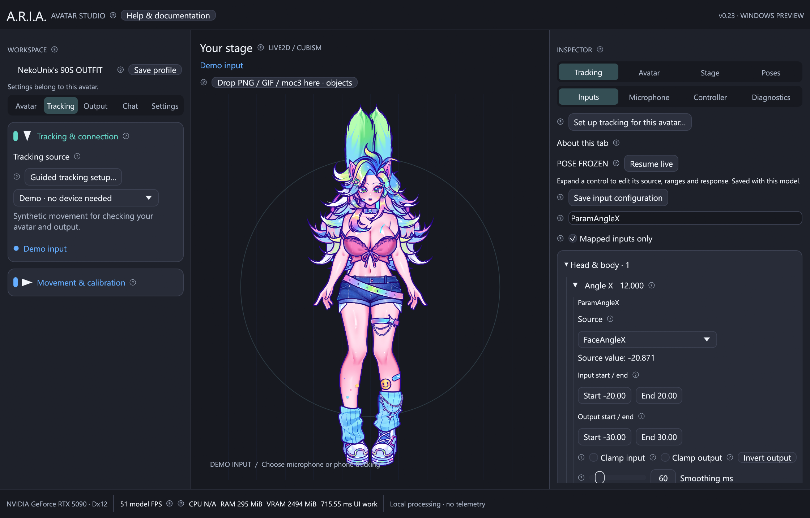

# Input controls, screenshot poses and presets

ARIA v0.6 organizes the right-hand **INPUT MONITOR** into **Inputs**, **Pose**,
**Physics**, **Expressions**, **Presets** and **Raw** tabs. Drag its left edge to widen it. These controls use
the loaded model's actual parameter names, ranges and VTS assignments. The built-in
and PNG puppets have the same workflow for their 12 standard parameters. Studio
sections and parameter categories collapse independently. Search reveals matching
categories; unfamiliar controls remain in Other controls. The tabs work with every
supported model. See [physics and model profiles](physics.md) for group tuning.
The [Expressions guide](expressions.md) covers `.exp3` files and custom shortcuts.

## Tune a movement input

1. Open **Inputs**. Search by parameter name, ID or source. **Mapped inputs only**
   shows tracking assignments; turn it off to access the complete rig, including
   manual toggles and physics outputs.
2. Expand a control. Its header and bar show the final value reaching the model.
   Choose its source, or **Manual** for a fixed base value without tracking.
3. Set **Input start / end** to the source values that should span the movement.
   Set **Output start / end** to the corresponding model values. For example,
   FaceAngleX input -20 to 20, output -30 to 30, gives full head rotation within
   a smaller physical turn. Start/end may be reversed; input start and end cannot
   be equal. **Invert output** swaps the output endpoints.
4. Adjust response:

   | Control | Effect |
   | --- | --- |
   | Clamp input | Stops extrapolating beyond the configured input span |
   | Clamp output | Keeps the mapped result between its output endpoints |
   | Smoothing ms | Higher values soften jitter and add response delay |
   | Dead zone | Ignores a fraction of the input span around its midpoint |
   | Response curve | 1 is linear; higher values soften the center while preserving endpoints |
   | Step | Quantizes values in native parameter units; 0 is continuous |

5. Click **Save input configuration** to write the current model configuration
   immediately, or save a named preset under **Presets**. Normal app autosave and
   closing also save the current controls. The original VTS/model files are never edited.

Stepping runs after smoothing, so live values stay on the selected steps. It uses
the rig minimum as its origin and also applies to manual sliders. Native parameter
limits always apply. Physics may drive a parameter after tracking; use a held
manual input or a full pose freeze when a parameter must remain fixed.

The left-side global gains, mirroring, axis correction and smoothing still apply
before the per-control mapping. These settings and neutral calibration save with
the active model's profile. Recalibrate after changing your phone setup.

## Hold a pose for screenshots

1. Open **Pose** and enable **Pose mode / manual inputs**. ARIA captures the current
   final model pose, including its physics state, and freezes it immediately.
2. Keep **Freeze all animation for a picture** enabled for a completely still
   avatar. Tracking, smoothing, breathing and physics cannot change the captured
   parameter values. Use individual sliders or type values to pose the face/body.
   Search or turn off **Mapped inputs only** to expose additional rig controls.
3. For a mixture of fixed and live movement, turn off **Freeze all animation**.
   Check **Hold** beside each control you want to fix. The other inputs stay live;
   held drivers can still influence unheld physics chains. Held outputs cannot be
   overwritten by physics. Uncheck Hold to release that individual parameter.
4. **Capture current pose** freezes the current complete pose again. **Resume live**
   disables the held inputs and restarts movement; the saved values remain available
   for later editing. Physics resets on mode changes to avoid resuming old momentum.

A full freeze preserves the exact captured values, even when stepping is enabled.
Changing a slider then applies its chosen step. Both the studio and the separate
OBS output window display the same held model.

### Export a transparent image

For a loaded Live2D avatar, select **Save transparent PNG…** in the Pose tab. The
export contains the rendered avatar with alpha and no studio UI or background.
It uses the model render target (longest side 2048 pixels), not the window size or
UI zoom. Translucent edges are converted to straight alpha for image editors.
The avatar can also be captured using the existing OBS output window.

Direct PNG export currently requires Live2D. The PNG/Mica preview can still be
posed and captured through the output window. A save failure appears in the input
monitor. The export is a snapshot, not an animation or a screen recording.

## Save and recall presets

Under **Presets**, enter a name and optionally select a shortcut, then choose:

- **Save movement:** saves input sources/ranges, stepping, smoothing, response,
  global mapping, physics settings, manual values and partial held inputs. A full
  screenshot freeze is released when recalling a movement preset.
- **Save pose:** saves the above settings plus every final parameter value as a
  complete frozen pose. Applying it holds the exact saved pose.

Select a saved item and use **Apply selected**. **Replace selected** updates its
contents using the current settings while keeping its movement/pose type.
**Rename / assign key** changes its name and shortcut without replacing the pose.
**Delete selected** removes it. Names and shortcuts cannot duplicate another item
in the same model's list. Up to 128 presets are supported per model.

Preset changes save immediately to ARIA's local application settings. The active
model's inputs, held pose, physics and shortcut settings restore when it is reopened.
Configuration identity follows the `.moc3` content, so moving the same export to
another folder retains its settings; a newly exported/different moc gets its own
configuration. Each PNG puppet uses its own image-content identity; Mica has a
separate configuration. **Save profile** also saves tracking setup, zoom, background,
frame-rate target and calibration for the current model.

**Export selected preset…** creates a versioned JSON file for backup or sharing.
**Import preset…** validates it against the current model, then adds it to the list
without applying it. Imported shortcuts start unassigned. Model mismatches, unknown
parameters, invalid numbers/ranges and files larger than 2 MiB are rejected. Preset
files contain controls and parameter values, not SDK binaries or model artwork.

## Windows hotkeys

Expressions have freely selectable modifier/key combinations in their own tab.
See [expression shortcuts](expressions.md#assign-your-own-keyboard-shortcut).
The expression, preset and pose controls share one global-hotkey enable switch.
Expression selections also save in movement presets and appear in frozen poses.

Assign **Ctrl+Alt+F1–F11** to presets. Assigning a key enables **Enable global hotkeys
(Windows)**; that checkbox can suspend all registrations. While enabled,
**Ctrl+Alt+P** freezes the current pose or resumes live movement. Preset shortcuts
work while another app is focused, as long as ARIA is running.

ARIA uses a dedicated Windows message thread with
[RegisterHotKey](https://learn.microsoft.com/en-us/windows/win32/api/winuser/nf-winuser-registerhotkey)
and no keyboard hook. Held keys do not repeatedly trigger a preset. Registrations
are removed when disabled, when changing models, or when ARIA closes. F12 is omitted
because Windows reserves it for debuggers. If a shortcut is already registered by
another app, the Presets tab reports the conflict; choose another key, or disable
and re-enable hotkeys after freeing it. Preset buttons continue to work.

Only the Windows global-hotkey path is implemented. These shortcuts are separate
from VTube Studio's phone hotkey numbers, which remain diagnostic data.
