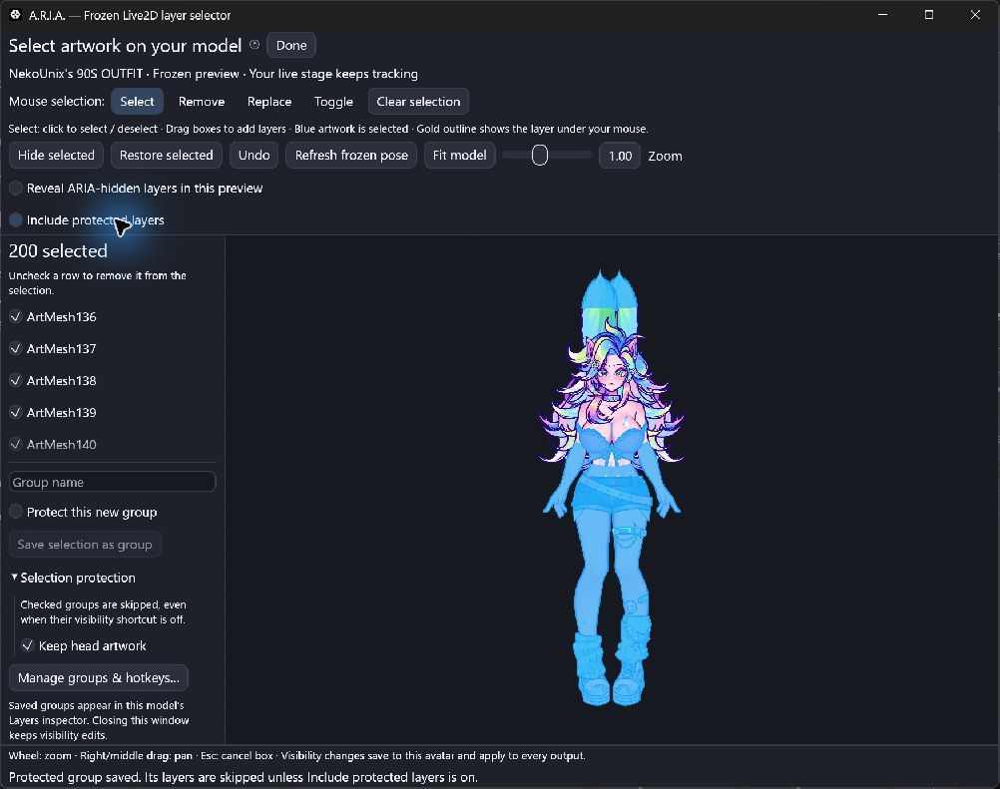

# Live2D layers, transparency and saved looks

The frozen selector, blue highlights and protected groups are included in v0.31.0-alpha.1.

Open **Inspector → Avatar → Layers** with a Live2D avatar loaded. The list comes
from that avatar's exported ArtMeshes, with parent part names from its display
information file when available. It works with any supported export; it does not
depend on Odette's parameter names or artwork. Original PSD layers that were
merged or omitted during export cannot be recovered from a moc3.

1. Click **Select layers…** above Your stage or in this inspector. In the
   separate window, **Select** mode lets you click artwork to select/deselect it or draw multiple boxes
   with the left mouse button, without holding Shift. Your live model keeps
   tracking while this preview stays frozen. **Remove**, **Replace** and
   **Toggle** offer explicit mouse-only alternatives. Use **Hide selected**,
   **Restore selected**, or **Undo**. Wheel to zoom and right/middle drag to pan;
   **Refresh frozen pose** takes a new snapshot. Read the
   [complete mouse guide](live2d-customization.md#select-several-layers-with-your-mouse).
2. Drag a row's opacity slider, or apply **Hide selected**, **Half opacity** or
   **Restore selected** to the selection. Zero removes that layer from the picture;
   it does not delete any model data. One retains its authored opacity.
3. Enter a name and choose **Create group from selection**. The new group starts
   inactive with zero opacity. Check its name to hide its members.
4. Expand **Group settings & shortcut** to change its opacity, edit its membership,
   rename it using **Edit selected layers → Save group selection**, or delete it.
5. Open **Hotkeys & actions**, find the group, click **Record…**, press a
   combination and **Save shortcut**. The shortcut toggles that group. New
   duplicate assignments are rejected. Use [action nodes](actions.md) to combine
   groups with expressions, image changes and other avatar actions.

Selection uses mesh triangles, including transparent texture areas. Use
**Reveal ARIA-hidden layers in this preview** to select artwork hidden by ARIA
opacity or groups without changing its visibility on the live model. Artwork
hidden by authored parameters stays hidden until you change those parameters
and refresh the pose. Collapsed layers can be picked from the main list.
The optional **On stage** picker has its own **Include hidden layers** option.
Selected visible artwork is blue in the frozen preview. The hovered mesh has a
gold outline, with its ID and selection state in the tooltip. Click again to
deselect it, or use the selection for hide/restore and saved hotkey groups.
Highlights never enter OBS output, PNG exports or your saved layer colors.

Save a group with **Protect this new group** to exclude its members from future
clicks, boxes and list selections. Manage saved protection through **Selection
protection** in the frozen window or **Protect from selection** in group settings.
**Include protected layers** explicitly allows picking those members; switching
it off removes them from the current selection. Protection is independent of
group visibility and saves per avatar. See the [step-by-step protection
guide](live2d-customization.md#protect-layers-from-selection).

**Selected layer colors** applies or restores a multiply tint. White preserves
texture colors; multiplication cannot recolor black artwork. See the
[appearance guide](live2d-customization.md) for per-model controls and saved looks.

Layer edits save in the avatar's content-based profile. Appearance-only looks
recall layer settings and appearance values without replacing tracking or physics. Movement and pose presets
include the individual opacities, group membership and active states. Shortcuts
belong to the avatar, independent of the currently applied preset. Global hotkeys
currently work on Windows; buttons are available on all platforms.

The displayed percentage is the effective user opacity multiplier. Overlapping
groups use the lowest opacity, so two half-opacity groups still give 50%, not 25%.
The model's own animated opacity is multiplied by this value. An active group can
keep a layer hidden even after **Restore selected**. **Disable groups affecting
selected layers** disables entire overlapping groups, including their other members. **Show all layers** clears
individual overrides and disables all groups. Layers hidden by the model's own
parameters or expressions remain hidden until those controls reveal them.

Clipping mask geometry is retained even when its visible layer is hidden. This
preserves dependent artwork such as eyes and face shading. Hiding layers cannot
reveal artwork that was never exported. No source files, texture atlases, physics
or parameter assignments are changed. Hidden meshes continue to be evaluated by
Core, and their atlas memory is retained; this is an appearance feature, not a
model-memory reduction tool.

Changes also apply while a pose is frozen, in all OBS outputs and PNG exports.
The renderer skips unchanged frozen frames. Up to 128 named groups and 8,192
exported layers are supported; absent saved IDs are skipped and reported in the
group settings.

See [Live2D import](live2d.md), [anchor editing](model-folders-and-pins.md) and
[presets](input-controls.md).
