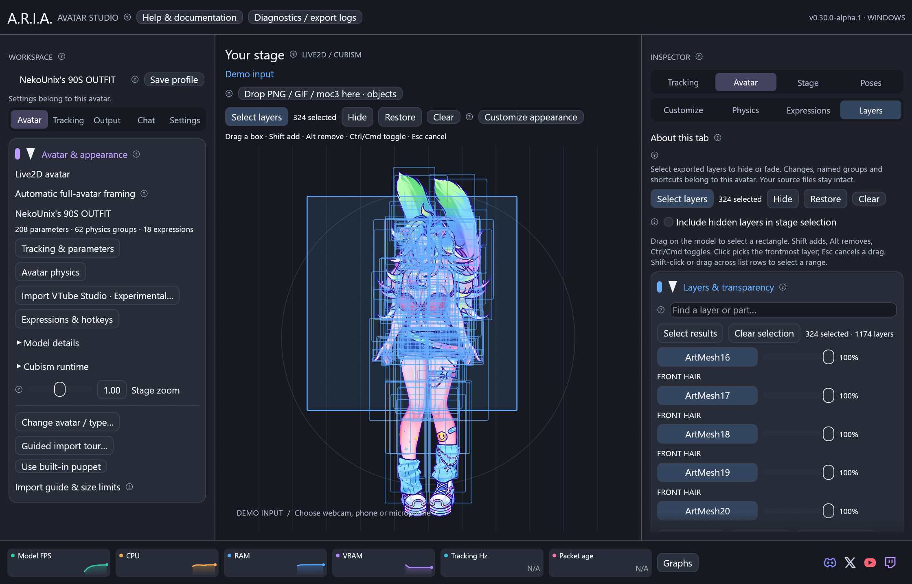

# Live2D layers, transparency and saved looks

Open **Inspector → Avatar → Layers** with a Live2D avatar loaded. The list comes
from that avatar's exported ArtMeshes, with parent part names from its display
information file when available. It works with any supported export; it does not
depend on Odette's parameter names or artwork. Original PSD layers that were
merged or omitted during export cannot be recovered from a moc3.

1. Turn on **Select layers** above Your stage and drag a rectangle over the
   artwork. Shift adds, Alt removes, Ctrl/Cmd toggles; Escape cancels the drag.
   A click selects the frontmost mesh. Alternatively, search the list, click
   individual rows, Shift-click or drag across row buttons for a range, or use
   **Select results** to select all matching rows. Turn selection mode off to
   resume dragging pinned objects.
2. Drag a row's opacity slider, or apply **Hide selected**, **Half opacity** or
   **Restore selected** to the selection. Zero removes that layer from the picture;
   it does not delete any model data. One retains its authored opacity.
3. Enter a name and choose **Create group from selection**. The new group starts
   inactive with zero opacity. Check its name to hide its members.
4. Expand **Group settings & shortcut** to change its opacity, edit its membership,
   rename it using **Edit selected layers → Save group selection**, or delete it.
5. Choose modifiers and a main key, then use **Assign chosen shortcut** on the
   intended group. The shortcut toggles that group. Conflicts with poses,
   presets, expressions, objects, image actions or effects are rejected.

Selection uses deformed mesh triangles, including their transparent texture
areas. Hidden meshes are excluded unless **Include hidden layers in stage selection**
is enabled; collapsed zero-area layers can still be picked from the list. Stage
selection outlines never enter OBS output or PNG exports.

**Selected layer colors** applies or restores a multiply tint. White preserves
texture colors; multiplication cannot recolor black artwork. See the
[appearance guide](live2d-customization.md) for per-model controls and saved looks.

Layer edits save in the avatar's content-based profile. Appearance-only looks
recall layer settings and appearance values without replacing tracking or physics. Movement and pose presets
include the individual opacities, group membership and active states. Shortcuts
belong to the avatar, independent of the currently applied preset. Global hotkeys
currently work on Windows; buttons are available on all platforms.

The displayed percentage is the effective user opacity multiplier. Overlapping
groups use the lowest opacity, so two half-opacity groups still give 50%, not 25%.
The model's own animated opacity is multiplied by this value. An active group can
keep a layer hidden even after **Restore selected**. **Disable groups affecting
selected layers** disables entire overlapping groups, including their other members. **Show all layers** clears
individual overrides and disables all groups. Layers hidden by the model's own
parameters or expressions remain hidden until those controls reveal them.

Clipping mask geometry is retained even when its visible layer is hidden. This
preserves dependent artwork such as eyes and face shading. Hiding layers cannot
reveal artwork that was never exported. No source files, texture atlases, physics
or parameter assignments are changed. Hidden meshes continue to be evaluated by
Core, and their atlas memory is retained; this is an appearance feature, not a
model-memory reduction tool.

Changes also apply while a pose is frozen, in all OBS outputs and PNG exports.
The renderer skips unchanged frozen frames. Up to 128 named groups and 8,192
exported layers are supported; absent saved IDs are skipped and reported in the
group settings.

See [Live2D import](live2d.md), [anchor editing](model-folders-and-pins.md) and
[presets](input-controls.md).
