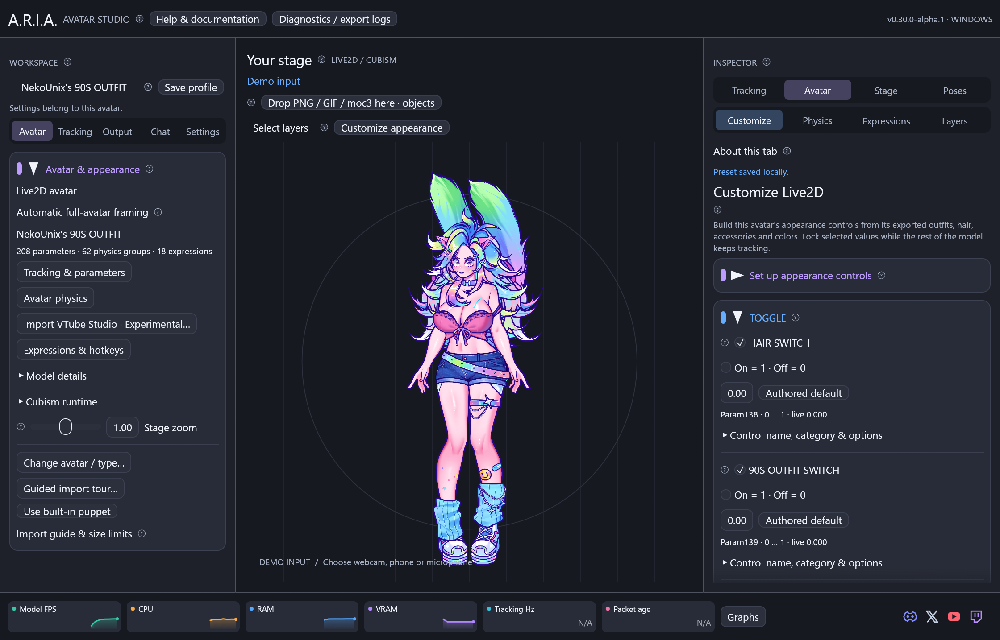

# Live2D avatar import and native runtime



## Customizable models

Open **Inspector → Avatar → Customize** to choose the model's exported outfit,
hair and accessory controls. ARIA reads their names, ranges and authored folders;
you can also add any raw parameter manually. Lock values, create named choices
and save appearance-only looks with shortcuts. Follow the [customization guide](live2d-customization.md).

## Layers and reusable looks

Use **Select layers** above the stage to drag a rectangle over artwork, then
hide or restore the selection. **Inspector → Avatar → Layers** can fade or tint
exported ArtMeshes, create
model-specific groups and assign visibility hotkeys. See the [layer guide](live2d-layers.md).

## Pinnable Live2D objects

Drop `.moc3` or `.model3.json` files onto **Your stage** to add independent
Live2D accessories. The main avatar stays loaded. Each object has its own
parameters, optional tracking and physics, placement, mesh pins and visibility
hotkey. Use **Stage objects & toggles → Live2D object** to configure it.
Keep the matching manifest and texture folders together, or supply a bare
`.moc3`'s atlas PNGs in index order under **Object texture setup**.

New objects receive the live tracking inputs automatically, using their own mappings and
optional physics. Turn off **Animate object from tracking** for a static pose that
still follows its pin. Previously saved static objects retain that choice. Pose presets,
all three outputs and transparent PNG export include these objects. See
the in-app **?** for the detailed workflow and resource limits. To replace
the main avatar, use **Avatar & appearance → Import Live2D avatar** (or
**Change avatar / type → Live2D** when an avatar is already loaded).

ARIA evaluates `.moc3` models through **ARIA's Rust core** and renders
ArtMeshes with wgpu. You need the exported model
and its texture images. A moc3 contains the rig, not the texture artwork.

## 1. Built-in runtime

ARIA Core is included on Windows, Linux and macOS. No SDK download, DLL picker,
or runtime path is required. Old saved Core paths and `ARIA_CUBISM_CORE` do not
select or load code. Update ARIA itself to update the runtime.

Each model runs through the in-process Rust evaluator. GPU geometry is used when
the model supports the current GPU plan, with Rust CPU geometry as its fallback.
The evaluator does not yet add offscreen or advanced blending support to ARIA's renderer.
See [runtime and distribution](aria-core-runtime.md) and
[native platform limitations](platforms.md).

## 2. Open the avatar

Keep the exported folder structure intact. A typical export looks like:

```text
MyAvatar/
  MyAvatar.model3.json
  MyAvatar.moc3
  MyAvatar.4096/
    texture_00.png
    texture_01.png
  MyAvatar.physics3.json
```

In the importer, select **Choose Live2D export…** and choose `MyAvatar.model3.json`.
Review the detected files, then click **Import Live2D avatar**. The manifest supplies
the exact texture index order. ARIA does not copy, modify, or upload your model files.

Selecting `MyAvatar.moc3` in the avatar picker also works (dropping it on the
stage creates a separate pinnable object): ARIA searches the same folder for a
single `.model3.json` that references that moc3. The filenames do not need to match.
If multiple manifests reference it, open the desired manifest explicitly.

**A bare moc3 without a manifest:** the import dialog offers **Add texture atlases…**.
Select the atlas PNGs, then use **Up / Down** to put them in the model's index order
(0, 1, 2, …). Review the numbered list and click **Load avatar**. File-picker ordering
is not assumed to be correct. ARIA detects missing atlas indices, but cannot infer
whether you supplied the correct artwork in the correct order.

Successful imports show the avatar name, mesh count, mapped parameter count, Core
version and decoded atlas size. The studio badge changes to **LIVE2D / CUBISM**.
Loading errors preserve the current avatar and appear in the controls panel.
**Use built-in puppet** restores Mica. **Change avatar / type → PNG / GIF** opens
the image-avatar import guide. Live2D's Avatar Inspector shows Physics and
Expressions; the image-avatar action editor is hidden while Live2D is active.
Opening another Live2D avatar replaces the current one after loading succeeds.

## 3. Animate it

**Demo** animates the model immediately. The existing [iPhone VTube Studio setup](tracking.md#iphone-vtube-studio)
feeds the same rig: choose the phone source, enter the phone address, connect and
calibrate. No desktop VTS WebSocket authentication token is involved.

ARIA looks for `<moc filename stem>.vtube.json` beside the manifest and imports
its tracking assignments automatically. Keep this file when moving a model from
VTube Studio. Supported input names include face angles, individual eyes, brows,
mouth open/smile, MouthX, MouthFunnel, MouthShrug, MouthPressLipOpen, MouthPucker,
CheekPuff, and automatic breathing/blinking. Custom output IDs use the saved
input/output ranges, including reversed ranges, clamps and smoothing amounts.
Warnings identify unsupported inputs or missing rig parameters.

Without a profile, the 12 [standard parameters](tracking.md#mapping) bind by ID,
with additional body Y/Z and breathing bindings where present. Other parameters
keep their exported defaults. Values always clamp to the native rig's limits.

Click **Model parameters…** to open **Inspector → Tracking → Inputs**. Search IDs or names
from `.cdi3.json`, edit ranges/clamps/smoothing/stepping/curves, or choose **Manual**.
Raw `ARKit:` inputs are also available. Edits save with this model and override its
initial VTS assignments when reopened; the original profile is never modified.
**Pose** holds individual parameters or freezes the complete avatar for PNG export.
**Presets** saves movement configurations and screenshot poses with Windows hotkeys.
See the [input controls guide](input-controls.md). **Expressions** discovers and
plays the avatar's `.exp3.json` / `.exp3` files with per-model custom shortcuts;
see [expressions](expressions.md). VTS hotkey assignments, VTS's active expression
state and items are not imported. Calibration, global smoothing, gains and mirroring
precede binding.

These are ARIA filters over raw tracking, not an exact recreation of VTS's
proprietary face processing. VTS smoothing amounts become a time constant of
4 ms per unit (0–100). See [input formulas](tracking.md#model-specific-inputs).

### Secondary motion

The manifest's `.physics3.json` loads automatically. ARIA evaluates its authored
weighted inputs, normalization, particle lengths, delay, mobility, acceleration,
output scale/reflection and weight. Chains retain momentum: a head turn pushes
hair/ears/tail/clothing, which follow and settle. The authored FPS sets a fixed
simulation step with interpolated inputs and outputs, independent of UI FPS.
Later groups can use earlier groups' outputs. Automatic breathing continues at
rest, including when tracking is lost, and feeds physics where the rig connects it.

Use **Inspector → Avatar → Physics** for global and individual group enable, strength,
inertia, response speed, gravity and wind. Groups and their names come from each
avatar's export. **Settle motion** clears momentum. To hold a physics output, use
**Pose** controls; physics otherwise runs after tracking. Physics controls persist
with each model and are included in movement/pose presets. See [the physics guide](physics.md).
The profile's physics enable flag and per-group strength multipliers are honored;
VTS's global strength/wind/dragging settings and legacy solver mode are not reproduced.

Models need an authored physics file for secondary motion. ARIA does not guess
which custom rig IDs mean hair or clothing. Missing/invalid files produce a visible
warning and leave the avatar usable. Bare moc imports have no physics/profile metadata.

Open **A.R.I.A. Output** for OBS as described in the [Windows guide](windows.md).
The studio and all output windows share the rendered avatar texture and live parameter state.
Use green screen plus OBS Chroma Key when your capture method does not retain alpha.

## Command-line launch

Pass the model path directly:

```powershell
.\aria-desktop.exe 'C:\Avatars\MyAvatar\MyAvatar.model3.json'
```

From source:

```powershell
cargo run --locked --release -p aria-desktop -- 'C:\Avatars\MyAvatar\MyAvatar.moc3'
```

Launching with a model argument does not automatically connect to a phone.
The built-in ARIA Rust core is used for every Live2D import.

## Compatibility and limits

| Supported | Details |
| --- | --- |
| Native rig evaluation | Checked moc version, consistency validation, aligned model storage |
| Mesh rendering | Ordered triangles, atlas UVs, opacity, single/double-sided culling |
| Clipping | Multiple mask sources, regular/inverted masks; invisible mask sources still contribute texture alpha |
| Colors/blending | Multiply/screen colors; normal, legacy additive and multiplicative blending |
| Tracking | VTS profile import, named/custom/raw inputs, editable ranges, manual controls |
| Physics | Version 3 particle chains; authored FPS, weights, normalization, reflection and per-group multipliers |
| Input limits | 20 MiB manifest/physics/profile/display JSON; 10 MiB expressions; 1280 MiB moc; 1–32 atlases; each atlas at most 81920px per source edge, 1280 MiB compressed and 5120 MiB decoded; 10 GiB retained atlas storage. All ceilings apply together. Textures beyond the device limit are fitted once to the GPU, preserving UVs and original files. Larger imports can use more RAM/VRAM |
| Render target | Transparent offscreen texture, longest side 2048px, shared with studio/output; UI zoom scales it |

**Not yet implemented:** `.motion3.json` playback,
`.exp3.json` playback, `.pose3.json` processing, motion events/audio, model3 layout
overrides, VTS item attachments, or Cubism 5.3 offscreen parts/advanced blending.
Models using offscreen parts or advanced blend modes are rejected with a compatibility
message. Export using standard compatible ArtMesh blending to use this renderer.
The independent Rust physics solver is not a byte-for-byte Cubism Framework or
VTS implementation. Expression values apply before physics; motion3/pose3 playback
remains separate from physics and is not implemented.

Atlas MiB is `width × height × 4` summed over textures. It is not measured process
VRAM; model memory, output/mask textures, uploads, and driver overhead are additional.
Large models can briefly pause the UI while importing; use a release build for normal use.

## Troubleshooting

- **Unsupported moc version:** update ARIA. External SDK libraries cannot change
  the bundled runtime or renderer capabilities.
- **Consistency check failed:** re-export the avatar with Cubism Editor or obtain a
  valid export from its author. ARIA does not attempt to revive rejected files.
- **Missing texture or unexpected artwork:** retain the manifest's subfolders;
  for bare imports verify every atlas index. Do not substitute the model thumbnail.
- **Mouth/eyes do not respond:** inspect actual IDs and assignments under
  **Model parameters…**, then verify tracking meters and face-found status.
- **Static hair:** check that the referenced physics file loaded, secondary motion
  is enabled, and strength is above zero. The group/output counts should be visible.
- **Missing toggles:** open **Expressions** and import missing `.exp3.json` files.
  Assign shortcuts in ARIA; VTS keyboard assignments are not imported. If the avatar
  has no expression file for a toggle, use manual parameter controls.
- **Blank/wrong-size model:** check the model's exported canvas/origin and parameter
  defaults. Models relying on motion/pose/layout setup may need those features added.

See [validation](validation.md) for the actual model and GPU checks performed.


## Bringing existing VTube Studio customizations

The **Experimental** [VTube Studio importer](vtube-studio-import.md) reads a matching
`.vtube.json` and local supporting files. Review categories before Apply. Missing
files or actions appear as repairable entries in ARIA's guide. The source app does
not need to run. Use [diagnostic reports](diagnostics.md) for avatar-specific issues.
