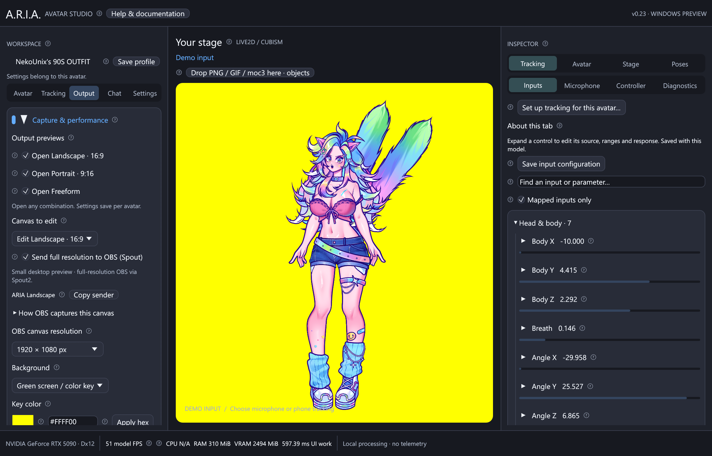

# OBS output: landscape, portrait and Freeform

For Twitch and YouTube chat under the portrait preview, open **Streaming chat**.
The [chat companion](streaming-chat.md) supports either service or both with
independent transparency and background colors. It is a separate native window;
chat does not change the avatar Spout canvas. Add the companion as a separate
Window Capture source if it should appear on stream.

ARIA v0.25 Alpha provides three independent outputs. The visible windows are compact
previews; OBS receives a separate full-resolution GPU texture through the platform-specific native output.

| Output | OBS sender | New-profile canvas | Preview pixels |
| --- | --- | --- | --- |
| Landscape · 16:9 | ARIA Landscape | 1920×1080 | 480×270 |
| Portrait · 9:16 | ARIA Portrait | 1080×1920 | 270×480 |
| Freeform | ARIA Freeform | 1280×720 | 480×360, resizable |

All three can run together, with separate positions, scales, backgrounds, keys,
resolutions and framing locks. They share the same Live2D model render and atlases;
additional outputs allocate canvas textures, not another copy of the avatar.
PNG puppets and Mica also support all three outputs.

## Open and frame the windows

1. Expand **Studio Controls → Capture & performance** and enable any combination of
   output toggles.
2. Choose **Edit Landscape · 16:9**, **Portrait · 9:16**, or **Freeform**.
3. Click the model inside its output window and drag to position it. The other
   output keeps its own framing.
4. Scroll the mouse wheel over the canvas to scale the avatar, or expand
   **Framing & preview size** and use **Model scale**. Double-click the
   model or choose **Center model** to recenter. **Reset framing** also restores
   scale to 1.0. **Lock model framing** prevents dragging and wheel scaling.
5. Select the **OBS canvas resolution**: 640×360, 960×540, 1280×720, 1920×1080,
   2560×1440 or 3840×2160 for landscape; portrait reverses those dimensions.
   This menu is independent of **preview edge**, which defaults to 480 pixels.
6. For Freeform, enter the OBS canvas width and height (64–4096 pixels each).
   Under framing, enter the window width and height, or drag its native window
   edges. The preview fits the canvas inside the window without stretching;
   any unused preview space is excluded from the OBS texture.

**Keep the windows small to save desktop space. OBS still receives the selected
full canvas resolution via the platform-specific native source.** Window Capture only sees the small
preview; stretching it in OBS does not increase the source's actual resolution.
The UI explains this alongside the resolution controls. **Keep this output on top**
is optional. Preview dimensions are client pixels and exclude the title bar.

Dragging the native title bar moves the window on your desktop. Dragging the model
moves the artwork within the capture. No controls or selection outlines are painted
into the output. Closing one window leaves the others running and unregisters its
native sender. Minimize previews when desired; leave ARIA running for tracking.

All layouts save with the current avatar. Drag release and applied settings save
automatically after a short quiet period; **Save output layouts** and **Save profile** also
save them. Switching avatars restores that avatar's layouts. Existing v0.6 profiles
seed the layouts from their previous background, zoom and on-top settings. v0.7
profiles retain their existing two canvas resolutions and framing, gaining a new
Freeform layout and compact previews. Outputs start closed when ARIA starts.

## Choose a background

Each output has **Studio background** (opaque dark), **Green screen / color key**
(opaque solid color, initially `#00FF00`), and **Transparent**.
The studio preview shows the selected output's background; preview zoom is separate
from each output's Model scale.

### Custom hex color

Select **Green screen / color key**, enter six hexadecimal RGB digits, such as
`#FF00FF`, and press **Apply hex**. The `#` is optional and either letter case works.
Incomplete or invalid text does not replace the applied color. You can also use
the color swatch. **Copy hex** copies the applied color, ready for OBS.

In OBS, add a **Chroma Key** effect filter to that capture source. Set **Key Color
Type → Custom** and enter the same hex. Begin with low Similarity and increase only
as needed; Smoothness and Spill Reduction also affect edges. See the
[official OBS Chroma Key guide](https://obsproject.com/kb/chroma-key-filter).

### Automatic color detection

**Detect safer color** analyzes the avatar and applies a suggested key to the
selected canvas. It checks the current rendered model and all loaded atlas colors,
including hidden artwork. PNG avatars include idle and talking images. Transparent
padding and pixels with alpha below 16/255 are ignored.

ARIA compares saturated candidates against a compact 5-bit-per-channel avatar color
table, selecting the greatest minimum Cb/Cr chroma distance. This uses the kind of
separation measured by [OBS's chroma-key shader](https://github.com/obsproject/obs-studio/blob/master/plugins/obs-filters/data/chroma_key_filter_v2.effect).
Color-detection readback happens only when requested; the Linux native output has its own asynchronous readback.

For example, a green key can remove green eyes or clothing along with the background.
A color farther from the artwork reduces that overlap. The chosen hex appears in
the field and can be copied into OBS.

There may be no perfectly safe key for a multicolored avatar. This is a best-fit
suggestion, not a guarantee: high OBS similarity, translucent edges, compression,
later color changes and expressions can still lose detail. ARIA reports when it
finds little separation. Inspect hair, eyes, clothing and active expressions in
OBS, lower similarity if needed, and rerun detection after changing artwork or
colors. This explanation is also available in the panel under **How automatic
color detection works**.

## Full-resolution capture in OBS

| Platform | OBS source | Transfer |
| --- | --- | --- |
| Windows | Spout2 Capture (separate plugin) | GPU texture sharing, same adapter |
| macOS | Syphon Client (built into OBS) | Metal/Syphon GPU texture sharing |
| Linux | ARIA Canvas (Alpha), included plugin | Local shared memory with bounded asynchronous GPU readback |

### Windows Spout2

1. Install the [OBS Spout2 plugin](https://github.com/Off-World-Live/obs-spout2-plugin/releases)
   with its Windows installer, then restart OBS. ARIA's sender is built in and
   needs no separate Spout DLL. The plugin is a separate download, not in ARIA's ZIP.
2. Open the desired ARIA outputs and leave **Send full resolution to OBS (Spout)**
   enabled. The status below the settings reports the actual sender name and size.
3. In OBS add **Spout2 Capture** for each output. Choose **ARIA Landscape**,
   **ARIA Portrait**, or **ARIA Freeform** under **Spout Senders**. With multiple
   ARIA instances, names can have a process-ID suffix; use the status's exact name.
4. For transparent output, choose **Composite mode → Premultiplied Alpha**
   (plugin v1.12). No chroma filter is needed. For color-key output, add a Chroma
   Key filter using that canvas's hex. Studio output is opaque dark.
5. Transform each source inside the appropriate OBS scene. Changing ARIA's canvas
   resolution changes the source dimensions; recheck your OBS transform afterward.

ARIA and OBS must use the **same graphics adapter**. On a multi-GPU PC, select
matching per-app GPU preferences under **Windows Settings → System → Display →
Graphics**, then restart both applications. ARIA's footer identifies its adapter.
Spout requires ARIA's **DirectX 12** backend; Vulkan fallback keeps local previews
available but reports Spout as unavailable. Use **Retry OBS output** after resolving
an error, or close/reopen the output. Sender-list contention skips frames instead
of blocking tracking.

The selected resolution is the **canvas** resolution. Artwork detail still depends
on the exported textures and ARIA's shared Live2D render, currently capped at a
2048-pixel long edge. Increasing the canvas does not invent missing model detail.
Higher resolutions increase GPU memory and fill cost: a 3840×2160 RGBA texture is
about 31.6 MiB, and each sender also needs its shared destination texture.

## Window Capture fallback

Without the OBS plugin, add **Window Capture** and select the matching
**A.R.I.A. Output** window. Capture its client area and disable **Capture Cursor**.
Keep that preview visible if the capture method stops updating when minimized.
This captures only its preview resolution. Native window transparency depends on
OBS's capture method; use a solid color key if alpha appears black or inconsistent.

## Rendering and scheduling

ARIA renders Cubism once per model update and composites each enabled canvas on
the GPU. Spout uses D3D11On12 on wgpu's queue, with no per-frame CPU pixel readback
or image encoding. Unchanged Live2D poses reuse their existing texture; CPU mesh,
vertex and style buffers are reused. Extra UI repaints cannot advance simulation
beyond the FPS target. Closed outputs release their canvas and shared textures.

The optional **Windows performance → High process priority** setting gives ARIA
CPU scheduling preference during contention. It is off by default and applies to
this application on this PC. It can help scheduling delays but cannot eliminate
GPU overload or guarantee hitch-free frames. It can also reduce other apps'
responsiveness. High is the strongest class offered here; Realtime could starve
Windows and OBS. Disabling the setting restores Normal priority. Details are in
the [Windows guide](windows.md#windows-priority-and-performance).

Implementation references: [Spout sender metadata and names](https://github.com/leadedge/Spout2/blob/master/SPOUTSDK/SpoutGL/SpoutSenderNames.h),
[frame synchronization](https://github.com/leadedge/Spout2/blob/master/SPOUTSDK/SpoutGL/SpoutFrameCount.cpp),
[official DirectX 12 bridge](https://github.com/leadedge/Spout2/blob/master/SPOUTSDK/SpoutDirectX/SpoutDX/SpoutDX12/SpoutDX12.cpp).

## macOS Syphon

Use the complete **ARIA Alpha.app** bundle: it contains the official Syphon
framework built from a pinned revision. Open an output, leave **Send full
resolution to OBS (Syphon)** enabled, then add **Syphon Client** in OBS and choose
ARIA's matching sender (including its process ID). Enable transparency and disable
**Allow alpha channel transparency correction** if offered: ARIA already supplies
premultiplied alpha. Studio/key backgrounds remain opaque. See the
[official Syphon framework](https://github.com/Syphon/Syphon-Framework).

Each canvas is published from wgpu's Metal command queue. Syphon copies to a shared
IOSurface on the GPU, without per-frame CPU readback. Up to three command buffers
can be pending; a busy GPU skips publication instead of blocking the UI. Keep the
app bundle intact. **Retry OBS output** reloads a failed sender. Source builds use
`sh scripts/build-syphon.sh` and the framework path described in [platform setup](platforms.md).
Alpha builds are ad-hoc signed, not Developer ID signed or notarized.

## Linux ARIA Canvas

Install **aria-obs-canvas** alongside **aria-alpha** using the Fedora or Arch
packages in [Releases](https://github.com/NekoUnix/A.R.I.A/releases). The portable
Linux archive includes `install-obs-linux.sh`; run it from the extracted folder to
install the plugin for your user, then restart **native OBS 30 or newer**.

1. Open ARIA's output and enable **Send full resolution to OBS (ARIA Canvas)**.
2. Add **ARIA Canvas (Alpha)** in OBS; choose the matching sender. Close/reopen
   properties to refresh its list. All three outputs can run at the same time.
3. Select **Transparent** in ARIA for alpha. The plugin composites premultiplied
   alpha directly; no Chroma Key or alpha-correction filter is needed.
4. Resolution changes reconnect automatically. After restarting ARIA, select the
   new process's sender. Closing an output makes its source transparent.

Run both apps as the same desktop user. The plugin works independently of X11 or
Wayland screen capture. This alpha transport uses local `/dev/shm` files, no network
port or video encoding. One asynchronous staging buffer per canvas bounds queued
GPU readback; publication is capped at 60 FPS and unchanged canvases reuse their
last frame. It is **not zero-copy**: GPU-to-CPU readback, shared memory and an OBS
texture upload add bandwidth and latency. Start with 1080p/30 FPS when needed.
A 4096×4096 canvas needs 64 MiB of shared memory plus GPU/readback/receiver storage.
Insufficient shared-memory space reports an error; lower resolution and retry.

The packaged plugin targets distribution-native OBS. **Flatpak/Snap OBS is not
supported by this installer** because its plugin ABI and filesystem sandbox need
a matching extension. Window/Screen Capture remains the fallback. The full
[plugin source and protocol](../native/linux-canvas/README.md) are included.
