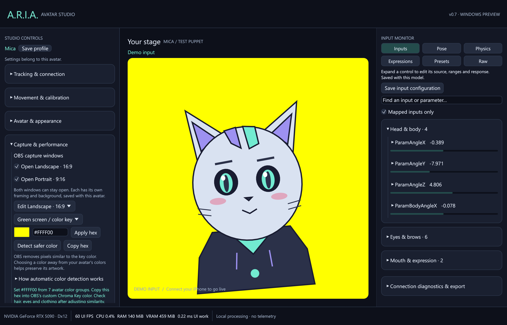

# Landscape and portrait OBS output

ARIA v0.7 provides two independent capture windows:

| Toggle | Window title | Default canvas |
| --- | --- | --- |
| Open Landscape · 16:9 | A.R.I.A. Output — Landscape 16:9 | 960×540 |
| Open Portrait · 9:16 | A.R.I.A. Output — Portrait 9:16 | 540×960 |

Both can run at the same time, sharing the live avatar and tracking while keeping
separate positions, scales, backgrounds, key colors, sizes and position locks.
Both sample the same Live2D render texture; the second window does not load another
copy of the model or its atlases. PNG puppets and Mica also support both windows.

## Open and frame the windows

1. Expand **Studio Controls → Capture & performance** and enable either or both
   output toggles.
2. Choose **Edit Landscape · 16:9** or **Portrait · 9:16** to configure that canvas.
3. Click the model inside its output window and drag to position it. The other
   output keeps its own framing.
4. Expand **Framing & window size** to adjust **Model scale**. Double-click the
   model or choose **Center model** to recenter. **Reset framing** also restores
   scale to 1.0. **Lock model position** prevents accidental dragging.
5. Choose a pixel size: 640×360, 960×540, 1280×720 or 1920×1080 for landscape,
   with dimensions reversed for portrait. The window keeps that aspect ratio;
   use this size menu instead of dragging its edges. Choose a smaller portrait
   size if it is taller than your display. **Keep this output on top** is optional.

Dragging the native title bar moves the window on your desktop. Dragging the model
moves the artwork within the capture. No controls or selection outlines are painted
into either output. Closing one window leaves the other running.

Both layouts save with the current avatar. Drag release and applied settings save
automatically; **Save output layouts** and the main **Save profile** button also
save them. Switching avatars restores that avatar's layouts. Existing v0.6 profiles
seed both layouts from their previous background, zoom and on-top settings.
Capture windows start closed when ARIA starts.

## Choose a background

Each output has **Studio background** (opaque dark), **Green screen / color key**
(opaque solid color, initially `#00FF00`), and **Transparent (experimental)**.
The studio preview shows the selected output's background; preview zoom is separate
from each output's Model scale.

### Custom hex color

Select **Green screen / color key**, enter six hexadecimal RGB digits, such as
`#FF00FF`, and press **Apply hex**. The `#` is optional and either letter case works.
Incomplete or invalid text does not replace the applied color. You can also use
the color swatch. **Copy hex** copies the applied color, ready for OBS.

In OBS, add a **Chroma Key** effect filter to that capture source. Set **Key Color
Type → Custom** and enter the same hex. Begin with low Similarity and increase only
as needed; Smoothness and Spill Reduction also affect edges. See the
[official OBS Chroma Key guide](https://obsproject.com/kb/chroma-key-filter).

### Automatic color detection

**Detect safer color** analyzes the avatar and applies a suggested key to the
selected canvas. It checks the current rendered model and all loaded atlas colors,
including hidden artwork. PNG avatars include idle and talking images. Transparent
padding and pixels with alpha below 16/255 are ignored.

ARIA compares saturated candidates against a compact 5-bit-per-channel avatar color
table, selecting the greatest minimum Cb/Cr chroma distance. This uses the kind of
separation measured by [OBS's chroma-key shader](https://github.com/obsproject/obs-studio/blob/master/plugins/obs-filters/data/chroma_key_filter_v2.effect).
GPU readback only happens when you request detection, not on ordinary frames.

For example, a green key can remove green eyes or clothing along with the background.
A color farther from the artwork reduces that overlap. The chosen hex appears in
the field and can be copied into OBS.

There may be no perfectly safe key for a multicolored avatar. This is a best-fit
suggestion, not a guarantee: high OBS similarity, translucent edges, compression,
later color changes and expressions can still lose detail. ARIA reports when it
finds little separation. Inspect hair, eyes, clothing and active expressions in
OBS, lower similarity if needed, and rerun detection after changing artwork or
colors. This explanation is also available in the panel under **How automatic
color detection works**.

## Add both sources in OBS

1. Keep both ARIA outputs open and not minimized.
2. Add two **Window Capture** sources, selecting the landscape title for one and
   portrait title for the other. Rename the sources to distinguish them.
3. Capture the client area or crop away the native title bar. Disable **Capture
   Cursor** to keep the pointer out while adjusting your model.
4. For color-key backgrounds, add a Chroma Key filter to each source using the
   matching canvas's custom hex. The two colors can differ.
5. Put each source in the desired scene. If capture is blank, try OBS's Windows 10
   capture method and keep the window visible rather than minimized.

Native window transparency does not guarantee that OBS preserves alpha. If it
becomes black or inconsistent, use a solid color key and Chroma Key. No OBS plugin
is required for these capture windows.
