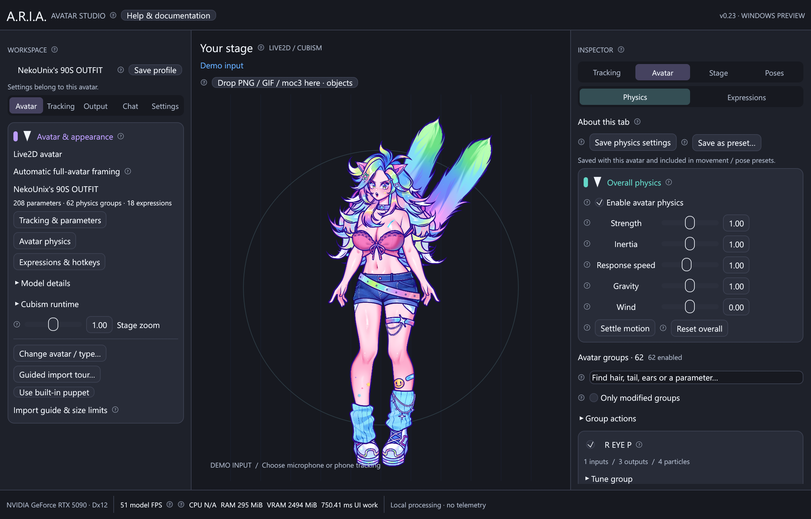

# Physics and model profiles

ARIA provides the same studio tools for every supported avatar. The Inputs,
Pose, Physics, Expressions, Presets and Raw tabs are shared UI; their parameter lists, limits,
names and physics groups come from the currently loaded model. No group list or
parameter mapping is hardcoded to the development test model.

## Tune the whole avatar

Open **Inspector → Avatar → Physics**, or **Avatar & appearance → Configure avatar
physics…**. Expand **Overall physics** and enable **Enable avatar physics**.

Choose **Bouncy · expressive rebound** for longer hair/accessory swings and a
clearer return bounce. It is the default for new avatars. **Natural** settles more
quickly; **Authored · legacy ARIA** preserves the previous ARIA solver for existing
saved profiles. Old profiles are not silently retuned: select Bouncy and save to
opt in. These styles apply to Live2D-compatible particle rigs; VRM/GLB use their
separate spring-bone solver.

Natural and Bouncy run at 120 fixed steps per second, interpolate tracking inputs
and rendered outputs, and express velocity/damping in time-based units. Bouncy
reduces the authored mobility's damping exponent to retain more momentum; it
does not simply multiply the final deformation. Both modes preserve chain lengths,
bound velocity after tracking jumps, dissipate energy even at maximum inertia,
and settle on resume after a pause longer than 250 ms. Scratch buffers are reused
instead of cloning parameter vectors at every substep.

Start with Bouncy, Strength 1, Inertia 1 and Response speed 1. Lower Inertia for
shorter swings; reduce Strength if hair or clothing hits its authored limits.
Individual group controls let you keep lively hair while calming clothing or ears.
Switching styles settles the simulation so old momentum cannot kick the new solver.

These are independent ARIA improvements, not Cubism Framework code or VTube Studio
physics modes. Tests compare against ARIA's previous solver; no universal visual
superiority over Live2D's implementation is claimed.

| Control | Effect |
| --- | --- |
| Strength | Scales the output amplitude; 1 keeps the imported amplitude |
| Inertia | Scales retained momentum; lower settles sooner, higher swings longer |
| Response speed | Scales authored particle response; below 1 is slower, above 1 faster |
| Gravity | Scales the restoring force in the rig's gravity direction |
| Wind | Adds gentle horizontal force; negative pushes one way, positive the other |

Overall and group strength, inertia, response and gravity multiply. Their defaults
are 1. Wind is additive, defaults to 0, and is added to the authored wind. Inertia
scales particle mobility and is capped at 1 at the particle level to avoid adding
energy indefinitely. The imported VTS group output multipliers remain part of the
baseline. Native parameter limits still apply at every output.

**Settle motion** clears momentum for the avatar. **Reset overall** restores the
global settings imported when this avatar loaded, leaving group adjustments intact.
Physics edits preview live unless the model is frozen in Pose mode.

## Tune an individual group

**Avatar groups** lists the groups from the loaded `.physics3.json` in their authored
order. Names come from `Meta.PhysicsDictionary`; an absent name falls back to the
group ID. The search box matches names, IDs and connected input/output parameters.

1. Use the checkbox on a group card to enable or disable only that group. Disabled
   groups do not write their physics outputs; the underlying tracking/manual values
   can still move those parameters.
2. Expand **Tune group** for its strength, inertia, response speed, gravity and wind.
3. Expand **Authored inputs & outputs** to inspect which parameters drive the chain,
   which parameters it moves, and its imported output multiplier.
4. **Reset this group** removes its tuning overrides. The authored rig is preserved.

Modified groups are marked and can be filtered with **Only modified groups**.
**Group actions** contains Enable all, Disable all and Reset all groups. Global
physics must also be enabled for the groups to run.

Changes to an independent group leave other groups alone. Authored dependencies
still apply: a group can drive a parameter used by a later group, so downstream
motion may change naturally. ARIA preserves authored evaluation order.

## Save settings per model

**Save physics settings** saves the current avatar's global and group controls
immediately. **Save profile** at the top of the studio saves the complete active
model profile. Regular autosave and normal app exit save it too.

Each avatar independently retains:

- Its actual parameter bindings, ranges, stepping, response, manual values and holds.
- Global and per-group physics tuning, saved poses, presets and shortcut assignments.
- Movement gains, mirror/axis controls, smoothing and neutral calibration.
- Tracking source, sender address and ports, zoom, background, target FPS and output
  always-on-top preference.

Switching avatars remembers the outgoing profile and restores the incoming one.
The tracking connection is disconnected on a switch; click Connect tracking to
connect to that model's saved sender. The OBS window open/closed state is a session
action. ARIA Core is built in; old Cubism DLL paths are ignored.

Identity uses the `.moc3` contents, so relocating the same export keeps its profile.
A different moc gets a different profile. PNG/JPEG puppets use their own decoded
image-content identity; the built-in Mica puppet has a separate identity. Two copies
of identical model content intentionally share a profile. Recalibrate after changing
the phone position, orientation or sender, even when a saved calibration exists.

Existing v0.4 physics settings load with neutral defaults for the new controls.
If a physics sidecar changes without a new moc, unknown saved group IDs are retained
but inactive, and the panel reports how many are absent. Newly added groups use their
authored defaults. Controls never overwrite the avatar's model, VTS or physics files.

### Presets and hotkeys

**Save as preset…** opens Presets. A movement or pose preset includes all global and
group physics settings together with input tuning. Assign a Windows shortcut or
export/import its JSON using the [preset workflow](input-controls.md#save-and-recall-presets).
Imported presets must match the current model identity and pass range validation.

## Compatibility

An avatar needs a valid referenced physics3 export for this panel to show groups.
An avatar without one shows an empty state and its other controls continue to work.
ARIA does not invent physics chains from parameter names. Input/Pose categories
are presentation hints only; unrecognized IDs remain available in **Other controls**.
Turn off **Mapped inputs only** to see all native parameters.

The solver adjusts the exported particle rig. It is not Cubism Editor's full physics
authoring interface and does not rewrite particle topology or output assignments.
ARIA uses an independent Rust solver; exact equivalence with VTube Studio or every
Cubism Framework mode is not claimed. See [compatibility](live2d.md#compatibility-and-limits)
and Live2D's [physics information reference](https://docs.live2d.com/en/cubism-editor-manual/check-the-physics/).
