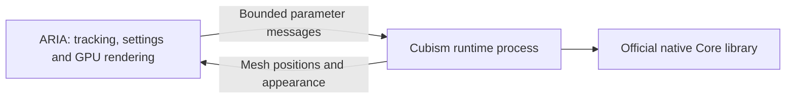

# Native platforms and the Cubism runtime host

Windows x64 is the packaged release target. Linux and macOS have native build/test
jobs and runtime-library selection; graphical, audio-device and licensed Core
execution on those systems still need native-machine acceptance testing.

## What runs where

| Component | Windows | Linux | macOS |
| --- | --- | --- | --- |
| Main Rust application | DX12; Vulkan fallback | Vulkan | Metal |
| Cubism Core runtime process | Official x64 `.dll` | Official x86_64 `.so` | Official `.dylib`/`.bundle` matching the Mac |
| PNG/GIF and VRM | Implemented and Windows-tested | Native implementation; hardware validation pending | Native implementation; hardware validation pending |
| iPhone/JSON tracking protocol | Tested with local sender | Portable UDP implementation | Portable UDP implementation |
| Spout, global hotkeys, High process priority, usage counters | Windows integrations | Not implemented; use app controls and window capture | Not implemented; use app controls and window capture |
| Persistent Twitch/YouTube credentials | Windows DPAPI | OS credential store planned | Keychain support planned |
| Camera setup helper / NVIDIA bridge | Windows tooling | Native installer/adapter validation planned | Native installer planned; NVIDIA RTX unavailable |

## A separate runtime process



The app starts one hidden worker per Live2D model. Core memory and native pointers
stay in that worker; ARIA keeps ordinary Rust mesh data. The same desktop executable
can run worker mode, so a portable install does not need another service or daemon.
The standalone `aria-cubism-host` executable is also built for integration testing.

Communication uses private standard-input/output pipes and a versioned binary
protocol, with no listening network port. Texture atlases stay in the main GPU
renderer; static mesh topology transfers only at load. Loading has a 30-second
timeout; a stopped frame has a two-second timeout. On failure the worker is stopped
and the affected model reports an error. Reload the model to start a new worker.
Unloading a model closes its worker and owned resources.

This process container provides crash isolation, **not Windows emulation or an OS
security sandbox**. A Windows DLL cannot run natively in a Linux/macOS process or
become portable by placing it in a folder or ordinary container. Use the matching
Core library from the official SDK. Wine-based Windows DLL execution is not included.
Only load a trusted official SDK; the child runs under your user account.

## Select the SDK

In guided Live2D import choose **Cubism Core library** or **Choose extracted SDK
folder**. ARIA finds the library for its OS and architecture. If a saved Windows
path still points into an intact cross-platform SDK, ARIA can find its native
sibling. A copied Windows DLL alone is insufficient.

Typical SDK paths are:

- Windows: `Core/dll/windows/x86_64/Live2DCubismCore.dll`
- Linux: `Core/dll/linux/x86_64/libLive2DCubismCore.so`
- macOS: `Core/dll/macos/libLive2DCubismCore.dylib`, or an architecture subfolder
  in newer SDK layouts.

Check the SDK's [official platform file list](https://github.com/Live2D/CubismNativeSamples/blob/develop/Core/README.md)
for your download. ARIA does not bundle the proprietary library. A `.lib`/`.a`
static archive or Android `.so` is not the desktop runtime library.

## Build on Linux or macOS

Install Rust through rustup, Git and CMake. The repository pins the compiler;
`cargo build --locked --workspace` builds the desktop, CLI and runtime host.

On Ubuntu 24.04 install native build dependencies first:

```sh
sudo apt-get update
sudo apt-get install -y build-essential cmake pkg-config libasound2-dev libudev-dev libssl-dev libxkbcommon-dev libwayland-dev libx11-dev libxcursor-dev libxi-dev libxrandr-dev libgl1-mesa-dev
git clone https://github.com/NekoUnix/A.R.I.A.git
cd A.R.I.A
cargo build --locked --release --workspace
./target/release/aria-desktop
```

On macOS install Xcode Command Line Tools (`xcode-select --install`) and CMake,
then clone and run the same Cargo commands. A native graphical session and suitable
GPU driver are needed; a successful headless CI build is not a graphics test.
Signing/notarization and Linux/macOS distribution packages are planned.

Developers can set `ARIA_CUBISM_HOST` to an absolute, trusted `aria-cubism-host`
executable from the same build for native integration tests. Normal users can
leave it unset. See [validation](validation.md) for the tested boundary.
