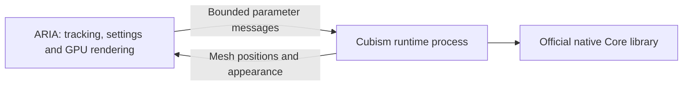

# Native platforms and the Cubism runtime host

The v0.35.0-alpha.1 release provides Windows x64, Linux x64, macOS Apple Silicon
and macOS Intel packages. Every app and archive is labeled **Alpha**. Native builds
and protocol tests do not replace acceptance testing on physical GPUs, webcams,
phones and every model. See [validation](validation.md) for the tested boundary.

## What runs where

| Component | Windows | Linux | macOS |
| --- | --- | --- | --- |
| Main Rust application | DX12; Vulkan fallback | Vulkan | Metal |
| Cubism Core runtime process | Official x64 `.dll` | Official x86_64 `.so` | Official `.dylib`/`.bundle` matching the Mac |
| PNG/GIF and VRM | Implemented and Windows-tested | Native implementation; hardware validation pending | Native implementation; hardware validation pending |
| iPhone/JSON tracking protocol | Tested with local sender | Portable UDP implementation | Portable UDP implementation |
| Native OBS canvas output | Spout2 GPU sharing | ARIA Canvas plugin; asynchronous readback/shared memory | Syphon Metal GPU sharing |
| Global hotkeys, High process priority, usage counters | Windows integrations | Not implemented; use app controls | Not implemented; use app controls |
| Persistent Twitch/YouTube credentials | Windows DPAPI | OS credential store planned | Keychain support planned |
| Camera setup helper / NVIDIA bridge | Windows tooling | Native installer/adapter validation planned | Native installer planned; NVIDIA RTX unavailable |

## A separate runtime process



The app starts one hidden worker per Live2D model. Core memory and native pointers
stay in that worker; ARIA keeps ordinary Rust mesh data. The same desktop executable
can run worker mode, so a portable install does not need another service or daemon.
The standalone `aria-cubism-host` executable is also built for integration testing.

Communication uses private standard-input/output pipes and a versioned binary
protocol, with no listening network port. Texture atlases stay in the main GPU
renderer; static mesh topology transfers only at load. Loading has a 30-second
timeout; a stopped frame has a two-second timeout. On failure the worker is stopped
and the affected model reports an error. Reload the model to start a new worker.
Unloading a model closes its worker and owned resources.

This process container provides crash isolation, **not Windows emulation or an OS
security sandbox**. A Windows DLL cannot run natively in a Linux/macOS process or
become portable by placing it in a folder or ordinary container. Use the matching
Core library from the official SDK. Wine-based Windows DLL execution is not included.
Only load a trusted official SDK; the child runs under your user account.

## Select the SDK

In guided Live2D import choose **Cubism Core library** or **Choose extracted SDK
folder**. ARIA finds the library for its OS and architecture. If a saved Windows
path still points into an intact cross-platform SDK, ARIA can find its native
sibling. A copied Windows DLL alone is insufficient.

The download button opens the same official Native SDK license/download page on
each OS, with an OS-specific label. The linked library list documents architecture
folders. Typical SDK paths are:

- Windows: `Core/dll/windows/x86_64/Live2DCubismCore.dll`
- Linux: `Core/dll/linux/x86_64/libLive2DCubismCore.so`
- macOS: `Core/dll/macos/libLive2DCubismCore.dylib`, or an architecture subfolder
  in newer SDK layouts. ARIA suggests `macos/arm64` on Apple Silicon and
  `macos/x86_64` on Intel.

The newer SDK also lists experimental Linux ARM64 under
`Core/dll/experimental/linux/ARM64`; ARIA can find that library when built for
ARM64 Linux, but that hardware target has not been validated.

Check the SDK's [official platform file list](https://github.com/Live2D/CubismNativeSamples/blob/develop/Core/README.md)
for your download. ARIA does not bundle the proprietary library. A `.lib`/`.a`
static archive or Android `.so` is not the desktop runtime library.

## Build on Linux or macOS

Install Rust through rustup, Git and CMake. The repository pins the compiler;
`cargo build --locked --workspace` builds the desktop, CLI and runtime host.

On Ubuntu 24.04 install native build dependencies first:

```sh
sudo apt-get update
sudo apt-get install -y build-essential cmake pkg-config libasound2-dev libudev-dev libssl-dev libxkbcommon-dev libwayland-dev libx11-dev libxcursor-dev libxi-dev libxrandr-dev libgl1-mesa-dev
git clone --branch v0.35.0-alpha.1 https://github.com/NekoUnix/A.R.I.A.git
cd A.R.I.A
cargo build --locked --release --workspace
./target/release/aria-desktop
```

On macOS install Xcode Command Line Tools (`xcode-select --install`) and CMake,
then clone and run the same Cargo commands. A native graphical session and suitable
GPU driver are needed; a successful headless CI build is not a graphics test.
Developer ID signing/notarization remains planned. Alpha bundles have local ad-hoc signatures.

Developers can set `ARIA_CUBISM_HOST` to an absolute, trusted `aria-cubism-host`
executable from the same build for native integration tests. Normal users can
leave it unset. See [validation](validation.md) for the tested boundary.

## Install an Alpha release

Download the archive/package matching your architecture from
[Releases](https://github.com/NekoUnix/A.R.I.A/releases). Verify its SHA-256 against
`SHA256SUMS.txt`. These are unsigned community Alpha packages, not distribution
repository packages. Cubism Core and private avatar files are not included.

| System | Artifact | Launch |
| --- | --- | --- |
| Windows x64 | `aria-0.35.0-alpha.1-windows-x64.zip` | Extract, run `aria-desktop.exe` |
| Linux x64 | `aria-0.35.0-alpha.1-linux-x64.tar.gz` | Extract, run `./aria-desktop` |
| macOS Apple Silicon | `aria-0.35.0-alpha.1-macos-arm64.zip` | Extract, open `ARIA Alpha.app` |
| macOS Intel | `aria-0.35.0-alpha.1-macos-x64.zip` | Extract, open `ARIA Alpha.app` |
| Fedora x64 | `aria-alpha-0.35.0.alpha.1-1.x86_64.rpm` | Install with DNF; launch ARIA Alpha |
| Arch x64 | `aria-alpha-0.35.0alpha.1-1-x86_64.pkg.tar.zst` | Install with pacman; launch ARIA Alpha |

For complete [Ubuntu, Fedora and Arch installation instructions](linux.md),
including runtime dependencies, checksum verification, optional OBS installation,
updates and removal, use the Linux guide. The examples below install both the app
and its optional OBS plugin. GitHub normalizes `~` to `.` in Fedora download
filenames; the RPM's internal version remains `0.30.0~alpha.1`.

Linux binaries target glibc 2.39 or newer (Ubuntu 24.04+, recent Fedora and current
Arch), with ALSA, OpenSSL 3, Wayland/X11 libraries, libxkbcommon and a Vulkan driver.
Fedora and Arch packages declare runtime dependencies. OBS is optional for the app;
its **aria-obs-canvas** package is installed separately. Plugin packages are built
against Fedora 44 and current Arch OBS 32+ respectively. The portable plugin is
built against Ubuntu 24.04's native OBS 30 (`libobs.so.0`); other distributions
should use their matching package or compile the included source against their OBS.

```sh
# Fedora: run in the downloaded release folder
sudo dnf install ./aria-alpha-0.35.0.alpha.1-1.x86_64.rpm ./aria-obs-canvas-0.35.0.alpha.1-1.x86_64.rpm

# Arch: run in the downloaded release folder
sudo pacman -Syu
sudo pacman -U ./aria-alpha-0.35.0alpha.1-1-x86_64.pkg.tar.zst ./aria-obs-canvas-0.35.0alpha.1-1-x86_64.pkg.tar.zst
```

The application installs under `/opt/aria-alpha`, with CLI/desktop launch links in
`/usr/bin`. The native OBS plugin installs under `/usr/lib64/obs-plugins` on Fedora
or `/usr/lib/obs-plugins` on Arch. Existing profiles stay in your user data folder;
package removal does not delete them. Upgrade using the same package-manager command.
For portable installs, run `sh install-obs-linux.sh` to add the plugin for your user.

macOS requires macOS 13+ and Metal. Move **ARIA Alpha.app** into Applications.
Because it is not notarized, macOS may require **System Settings → Privacy &
Security → Open Anyway** after your first attempt. Keep the app's internal
`Contents/Frameworks/Syphon.framework` intact. Audio/camera permission prompts are
specific to your chosen inputs. Windows-only RTX tooling, global hotkeys and
credential encryption are not implemented on macOS/Linux.

## Reproduce native packages

After `cargo build --locked --release --workspace` on Ubuntu 24.04, build the
portable Linux OBS plugin as shown in [its README](../native/linux-canvas/README.md).
Install `rpm`, `zstd` and Docker, then run `sh scripts/build-linux-obs-packages.sh`
to compile separate plugins against Fedora 44 and current Arch OBS headers and
libraries. Finally run `python3 scripts/package-native.py linux` (Python 3.11+).
OBS library filenames differ between distributions; copying Ubuntu's plugin into
all packages is insufficient. Each plugin package records its build's OBS version.

For macOS run `sh scripts/build-syphon.sh`, then `python3 scripts/package-native.py
macos`. This builds Syphon at an immutable revision and bundles it; it does not
install a global framework. For source execution set `ARIA_SYPHON_FRAMEWORK` to
the absolute `target/syphon-build/Build/Products/Release/Syphon.framework` path.
The **Alpha packages** workflow builds all four OS/architecture combinations and
retains the installer artifacts. Publishing a release requires all packages to
finish successfully and have checksums; an incomplete matrix is not a release.
