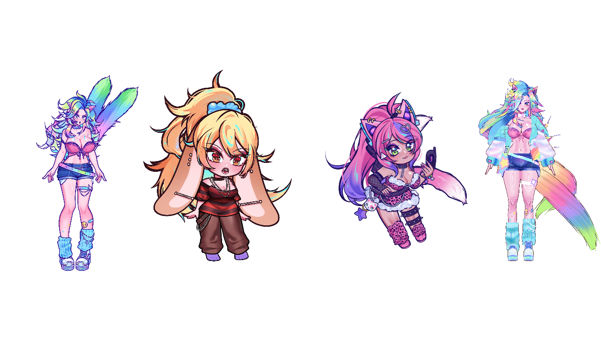

# Multiple avatars and Profiles

Use **Workspace → Profiles** to put Live2D, PNG/GIF and VRM avatars together in
OBS. Each avatar has its own editing stage and saved settings. The three output
windows combine all the profiles you have checked.

## Names and editing tabs

Click an outlined tab above the stage to edit that avatar. The active tab has an
accent border. **Rename…** beside the stage name changes the same display name as
**Profiles → Name, tracking & order**. Tabs, inspector, tracking sources and preview
selectors update together; saved action references keep their profile IDs. Source
asset filenames are unchanged. **Stage tools & customization** below the name
expands the connection status, object tools and Live2D layer controls.

## Add your first avatar

1. Open **Profiles** near the top of the left sidebar.
2. Click **+ Add avatar…**. The guided importer opens.
3. Choose **Live2D**, **PNG/GIF** or **VRM** and follow its file instructions.
   For Live2D, select the complete model export and the official Cubism Core
   library for your computer. The [README](../README.md#3-choose-your-avatar)
   includes the platform download links and exact library-selection instructions.
4. Finish the import. The avatar appears in the profile list and becomes the
   editing stage. Existing saved rig settings for that avatar are restored.
5. Use **Save profile** after configuring it. Normal autosaves also save changes.

Your source files stay where you imported them from. Keep their folders intact.
Profiles are local ARIA settings; they do not copy, upload or bundle your models.

## Load several avatars

Repeat **+ Add avatar…** for every avatar you want. Successful imports add a
profile while keeping the other loaded avatars running. Each profile checkbox
means **loaded into the OBS scene**:

- **Checked:** its model, tracking response, physics, image animation and effects
  keep running, even while another stage is being edited.
- **Unchecked:** its runtime and owned input devices are released. Its name,
  settings and canvas placements remain saved for the next time you check it.

Any combination of supported avatar types can be loaded. There is no fixed
avatar-count limit; your computer's available memory and rendering performance
determine a practical limit. Start with two and watch the resource graphs.

Reopening ARIA loads previously checked profiles one at a time. Output windows
start closed. Connect the source tracker explicitly after startup. A missing file
or failed import leaves the other avatars running and gives that entry a retry
message. Restore its files to the saved location and click **Retry load**.

## Know which avatar you are changing

Click **Edit** beside a loaded profile, or click its name in the **Edit stage**
tabs above the center preview. The name appears in three places:

| Area | What it changes |
| --- | --- |
| Workspace **Editing avatar** | Avatar import/settings and the selected avatar's tracking connection |
| **Stage · avatar name** | That avatar's pins, attached objects and layer selections |
| Inspector with the avatar name | That avatar's mappings, physics, poses, expressions, customization, image actions, controller and microphone settings |
| **Output** | Shared canvas resolution/background and the selected output avatar's placement |

Switching the editing stage does not reopen or reset another model. Layer groups,
protected layers, expressions, image states, VRM motions and props stay with their
own profile. Machine theme/runtime settings, FPS target, API service and streaming
chat accounts belong to the workspace.

Under **Name, tracking & order**, rename a profile to something short and easy to
recognize. Renaming does not rename the source files.

## Arrange the shared OBS scene

1. Click **Output** and open **Landscape**, **Portrait** and/or **Freeform**.
2. Click an avatar inside a preview and drag it. Only that avatar moves in that
   output. The separate editing stage and other output formats keep their framing.
3. Scroll over an avatar to resize it. Double-click it to center it.
4. When avatars overlap, choose the desired name in the preview's avatar menu.
   Then drag that avatar, or scroll to change its size. The menu explicitly targets
   that avatar; choose a different name to target another overlapping model.
5. Under **Profiles → Name, tracking & order**, use **Send back** or **Bring
   forward** to change overlap order. Later profiles in the list draw in front.
6. **Ctrl+Shift+click** an avatar to lock or unlock its framing in that output
   (**Cmd+Shift+click** on macOS). Other avatars remain movable. Right-click the
   preview for centering, resetting, unlocking an offscreen selection and window options.
7. Click **Save output layouts**. Dragging and settings edits also autosave after
   a short quiet period.

Landscape, portrait and Freeform keep separate positions and scales for each
avatar. These are now workspace layouts: selecting another editor tab does not
replace the shared composition. Legacy single-avatar framing initializes the
first profile's placement. Additional preview formats reuse the loaded avatar
textures instead of creating another complete model runtime.

Keep the previews small. **Native OBS output still receives the full chosen
canvas resolution**, with every loaded avatar and its props/effects. Preview
targeting menus and outlines do not enter native output. Ordinary **Window
Capture** records the small preview, including any visible preview controls.
See the [OBS guide](obs-output.md) for Spout2, Syphon and Linux ARIA Canvas setup.

## Share one face tracker or use separate inputs

A newly added profile follows the previously loaded avatar's face tracker by
default. This lets one phone or camera animate several avatars without opening
another listener or competing for the same webcam.

1. Edit the source avatar and connect its tracker under **Tracking**.
2. Open **Profiles → Name, tracking & order** for another avatar.
3. Choose **Follow source name** under **Face tracking**.
4. Edit the follower to tune its input ranges, smoothing, mouth response, physics
   and expressions. Its calibration remains independent of the source avatar.
5. Keep the source profile checked. Unloading or disconnecting it removes face
   input from its followers. Their local microphone/manual behavior still works.

To animate avatars from different people, choose **Own connection** for each
source profile. Connect each phone/camera explicitly. Separate phone receivers
need distinct PC receive ports, and separate webcams need different devices.
ARIA shows connection errors instead of silently substituting another source.

Following shares face packets. Microphone and gamepad settings remain individual
to each avatar; enable and configure them in that avatar's inspector. Avatar
tracking guides, VBridger equations and VTube Studio parameter mappings still
apply to the avatar being edited. **VTube Studio and VBridger imports remain
Experimental.**

## Hotkeys, effects, images and API

Global shortcuts on all loaded profiles remain available while switching stage
tabs. A shortcut assigned on several profiles triggers every matching action.
Use different key combinations when you want only one avatar to react. Per-avatar
input rules, attached Live2D tracking, image actions and throw/spray simulations
continue when their stage is in the background.

The bread footer button affects the avatar being edited. Its bread appears with
that avatar in the shared outputs. Existing API commands also target the editing
profile; API status includes a `workspace` roster with profile IDs, loaded state
and tracking relationships. [API reference](api.md).

## Save, remove and troubleshoot

- **Save profile** saves the current avatar's changes and the workspace's loaded
  profile state. Each avatar keeps its own settings after restarting ARIA.
- **Remove from list** unloads that profile and removes its roster entry and
  canvas placements. It keeps source assets and legacy per-model saved settings.
- If avatars overlap completely or disappear outside the frame, select their
  name in the output preview and use **Center model** / **Reset framing**.
- If performance drops, uncheck unused profiles, lower the workspace FPS target,
  reduce OBS canvas resolution or lower GIF playback memory. More live avatars
  require more memory and frame time than one avatar.
- Use **Diagnostics / export logs** for an issue report. It now describes all
  loaded avatars, their parameters and relevant errors, so include which profile
  and output showed the issue. Review the report before posting it to GitHub or
  a Discord ticket. [Diagnostic report guide](diagnostics.md).

The mixed renderer was exercised on Windows with two supplied Live2D models,
the supplied animated GIF and the supplied VRM together. Cross-platform builds
and automated tests do not substitute for testing your own devices and models.

## v0.33 engine and tracking update

The engine now exchanges each live profile's settings without cloning camera
preferences or all OBS layouts on every handoff. It keeps the same independent
stage behavior and workspace-owned output layouts, frame-rate target and window
policy. [Performance measurements and scope](performance.md).

The VTS head-tilt correction reaches every profile following that source. Saved
neutral poses, lean ranges and movement presets migrate independently, including
unchecked avatars. Remove any manual lean inversion you previously added to
compensate for the old behavior; [upgrade instructions](tracking.md#vts-head-tilt-after-upgrading-to-v033).
