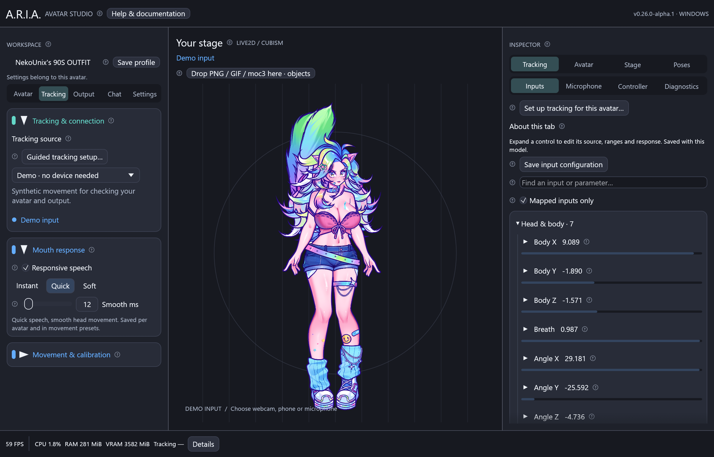
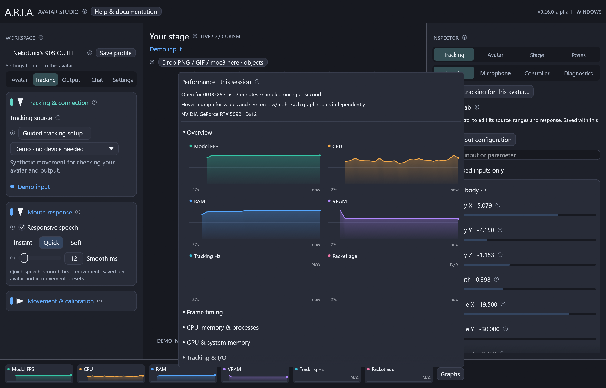

# Responsive speech and performance — v0.26 Alpha



## Speed up VTube Studio mouth movement

1. Connect the phone under **Tracking**, then open **Mouth response**.
2. Leave **Responsive speech** enabled and start with **Quick (12 ms)**.
3. Say “pa-pa-pa”, alternate opening and closing your lips, and watch the avatar.
4. Use **Instant (0 ms)** for no ARIA mouth easing, or **Soft (35 ms)** if noise
   causes flicker. Custom smoothing is available from 0 to 200 ms.
5. Save a movement preset to recall that avatar's response alongside its mappings.

The new setting defaults on for existing profiles. It filters mouth input once,
after personal range calibration. The normal movement smoothing and additional
VTS-imported binding smoothing no longer accumulate on supported mouth inputs.
The binding inspector explains the override and retains the original setting.
Turn **Responsive speech** off to restore the previous filtering behavior.

Supported inputs: `MouthOpen`, `ParamMouthOpenY`, `JawOpen`, `MouthPressLipOpen`,
`ARKit:jawopen`, `ARKit:mouthclose`. Other custom inputs keep their filters.
Head/eye movement stays smooth. Authored ranges, output inversion, curves,
expressions, physics, parameter holds and frozen screenshots are preserved.
Microphone control retains its own response settings. Attached Live2D objects
receive the main avatar's already-filtered tracking stream.

```text
Phone / webcam → latest packet → personal mouth range → mouth response
               → rig mapping → expressions / pose / physics → rendered avatar
```

At a steady 60 FPS, a 12 ms filter reaches over 93% of a step in two updates
(about 33 ms); closing behaves symmetrically. This is a filter property tested
with synthetic inputs, not a measured phone-to-screen latency guarantee.

The [official VTube Studio UDP example](https://github.com/DenchiSoft/VTubeStudioBlendshapeUDPReceiverTest)
specifies one packet per phone frame, typically around 60 Hz. Its subscription
`time` field is a duration, not FPS. ARIA cannot request a higher phone sampling
rate through that protocol. A 60 or 120 FPS model target reduces opportunities to
wait for the next model update, provided the computer can sustain it.
Set that target under **Output → Capture & performance → FPS target**.

## Read the bottom bar



The current development build replaces the numeric footer with six colorful
mini graphs: **FPS, CPU, RAM, VRAM, tracking Hz and packet age**. Click **Graphs**
for a scrollable view of all counters in collapsible groups. The published
v0.26.0-alpha.1 release predates this graph update.

- Hover along a graph for the actual sampled value, its session time/age, the
  latest value, and **Session low / Session high**.
- The graph retains at most **two minutes / 121 samples**. Low/high include all
  valid one-second samples for the entire time this ARIA instance is open.
- Switching models, freezing a pose, hiding the detailed view or reconnecting
  tracking does not clear the extrema. Closing and reopening ARIA resets them.
- Gaps and **N/A** mean unavailable, not zero. Missing readings do not change
  the extrema, and long pauses are not connected by invented lines.
- Every graph scales independently; its tooltip includes units and the vertical
  scale. Colors identify metrics, not warning thresholds. Hover values are real
  samples rather than interpolated measurements.
- Session extrema describe the sampled readings, not unmeasured peaks between
  one-second samples. History is kept in bounded memory and is not saved to disk.

| Counter | Meaning |
| --- | --- |
| CPU / RAM | Desktop plus directly owned Cubism and camera/setup workers; CPU normalized across logical processors; RAM sums working sets. |
| Private commit / system RAM | Owned processes' committed memory, and machine-wide available / total physical RAM. Shared resident pages may be counted twice. |
| VRAM / budget / shared | ARIA's local GPU allocation, DXGI budget and shared/non-local allocation; not GPU utilization. |
| Process I/O | Read/write bytes per second, including files, pipes and network; not disk throughput. |
| Open handles | Sum of handles held by directly owned processes. |
| Frame average / p95 | Last 120 model-update intervals, including stalls. Slow updates exceed 1.5× the selected frame budget. |
| Tracking Hz / age | Accepted packet rate and time since local arrival. Neither is camera-to-screen latency. |
| Accepted / rejected / ignored | Receiver health counters; invalid, stale or wrong-sender packets never drive the avatar. |

OS counters refresh at 1 Hz. Unavailable counters and rates awaiting a second
sample show **N/A**; process/system queries currently support Windows and GPU
allocation requires DXGI. Camera worker descendants are not enumerated.
The statistics remain local and are also exposed to authorized clients through
the optional [control API](api.md).

## Efficiency changes

- Tracking snapshots are copied on model ticks, not on each UI layout/pointer repaint.
- Model timing retains scheduled deadlines and skips missed slots after stalls.
- Live2D layer opacity is calculated when visibility settings change, then reused.
- Performance history is bounded and expanded graphs are only laid out while open.

For low FPS, first check output resolutions and active canvases, then avatar atlas
size and other GPU-heavy programs. A smaller preview window does not lower OBS
canvas resolution. Windows High priority can help CPU scheduling contention, but
does not increase tracking capture rate or GPU capacity.

Responsive speech and the original numeric counters are included in **0.26.0-alpha.1**;
the graph update currently requires building this source branch. Download published packages
from [Releases](https://github.com/NekoUnix/A.R.I.A/releases/tag/v0.26.0-alpha.1). See [Windows builds](windows.md), [Linux installs](linux.md)
and [platform packages](platforms.md) for the appropriate installation path.
