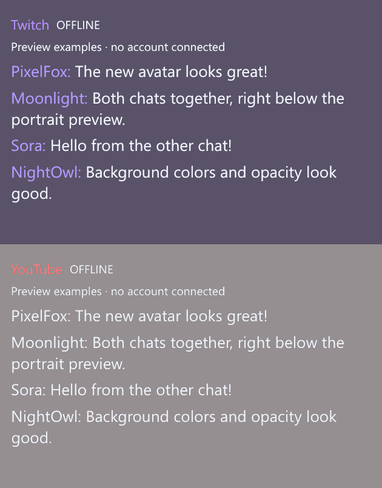

# Twitch and YouTube chat on Windows

Open **Streaming chat** in the studio's left panel. Enable either service or both,
then **Open chats below portrait**. The native chat companion follows the 9:16
preview and stacks the enabled panels beneath it. Turn **Follow portrait preview**
off to position the chat window independently.

Each service has its own **Transparency & colors** section:

- **Whole chat opacity** fades text and background together.
- **Background opacity** fades only the background; text stays readable.
- **Background** offers a color picker and `#RRGGBB` input.
- **Text**, username colors, text size and panel height control readability.
- **Chat width** sets the common width; **Keep chat on top** is independent of
  the avatar output's window preference.

The content can be fully transparent. The Windows title bar remains separate.
These appearance settings save per avatar. Streaming accounts are shared across
avatars and never enter model presets or templates.

## First-time Twitch setup

This source build does not include a publisher-owned OAuth client. Before its
first sign-in, register a **Public** application in the
[Twitch developer console](https://dev.twitch.tv/console/apps), then enter its
**Client ID** in **Twitch → Account setup**. If registration asks for a redirect
URI, `http://localhost` can be used; this device flow does not consume a redirect.
Do not provide a Twitch client secret.

Click **Sign in to Twitch** and complete the official activation page in your
normal browser. ARIA displays the device code and a link to reopen the page.
It requests `chat:read` to read chat. A blank channel selects your own Twitch
channel; enter a channel name or Twitch URL to read a different channel.

The implementation uses Twitch's documented
[Public device authorization flow](https://dev.twitch.tv/docs/authentication/getting-tokens-oauth/#device-code-grant-flow)
and [secure IRC WebSocket interface](https://dev.twitch.tv/docs/chat/irc/).
Access tokens validate on connection and at least hourly; refresh tokens rotate.

## First-time YouTube setup

1. Create or choose a Google Cloud project and enable **YouTube Data API v3**.
2. Configure Google Auth Platform consent. In Testing, add your Google account
   as a test user. Public use may require Google's verification process.
3. Create an OAuth client of type **Desktop app** in
   [Google Cloud credentials](https://console.cloud.google.com/apis/credentials).
4. Download its JSON, then choose **YouTube → Account setup → Import Google
   Desktop credentials JSON**. Web application credentials are not accepted.
5. Click **Sign in to YouTube**. Choose the Google account/channel and consent in
   the official browser page. ARIA requests `youtube.readonly`.
6. Leave the target blank for your single active broadcast, or paste a live
   video's URL/ID. Watch URLs, `youtu.be` and `/live/` links work. A channel URL
   does not identify a particular live chat. With simultaneous broadcasts,
   choose one explicitly.

Google sign-in follows its
[desktop OAuth flow with PKCE and loopback callbacks](https://developers.google.com/identity/protocols/oauth2/native-app).
The temporary listener binds only to `127.0.0.1` on an available port and checks
a random state. Account passwords and browser cookies never pass through ARIA.
Chat availability is resolved through
[liveBroadcasts](https://developers.google.com/youtube/v3/live/docs/liveBroadcasts/list)
or the selected video's `activeLiveChatId`.

YouTube API calls use your selected project's quota. The current client uses
[liveChatMessages.list](https://developers.google.com/youtube/v3/live/docs/liveChatMessages/list),
honors `pollingIntervalMillis` and uses a minimum five-second gap. Long sessions
can exhaust project quota. Quota, permission, disabled-chat and ended-broadcast
errors appear in the panel and stop further polling. The newer server-streaming
`streamList` transport is not implemented in this version.

## Remember, disconnect and sign out

**Remember login** stores tokens encrypted with Windows DPAPI for the current
Windows user. The Google Desktop client secret is protected separately. Credentials
are stored in local application preferences, never in exported avatar presets,
artwork templates, repository files or portable ZIPs. Settings copied to another
Windows account cannot unlock the login.

After restarting, click **Connect** to reuse a remembered login. There is no
automatic account connection merely from launching ARIA or loading an avatar.
Uncheck Remember login to clear persisted tokens while retaining the current
session until app exit or sign-out. **Disconnect / cancel** stops reception or
pending sign-in; **Connect** resumes it. After changing a target, disconnect and
reconnect to apply the target.

**Sign out** clears the local service session and messages. To revoke provider
permission too, use [Twitch Connections](https://www.twitch.tv/settings/connections)
or [Google third-party connections](https://myaccount.google.com/connections).
Expired/revoked credentials may require a fresh sign-in.

## Display and OBS behavior

The companion is a read-only native viewer with up to 200 retained messages per
service. It processes message deletions and user-ban events. Chat text is plain
text, including textual emote codes; it cannot invoke avatar actions. Native emote
images, badges, polls, message composition and moderation UI remain available
through **Open official chat to type / moderate** in the platform's browser chat.
Hiding the viewer keeps connections alive; Disconnect or app exit stops them.

The companion is separate from the avatar's Spout canvas. It does not alter the
portrait sender's resolution, alpha or artwork. For an on-stream chat overlay,
add **A.R.I.A. Chat — Twitch + YouTube** as a separate OBS Window Capture source
and crop its title bar. Window Capture alpha depends on the selected capture
method, so check it in OBS. The avatar can continue using its existing Spout source.

The circled **?** controls in Streaming chat open detailed offline explanations.
The development screenshot scenario uses labeled sample messages and does not
sign in or transmit messages. Real-account verification requires registered
client credentials, provider access and the account owner's consent.
