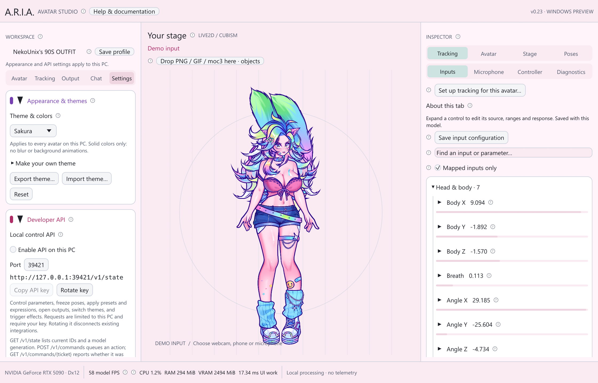

# Themes and custom palettes

Open **Settings → Appearance & themes**. The six built-in palettes are **Sonoma
Dark, Sonoma Light, Sakura, Ocean, Forest and High Contrast**. Selection applies
immediately to panels, cards, controls, headings, help and category accents.
Themes are global UI preferences; switching avatars preserves the selected palette.

Expand **Make your own theme**, enter a name, and edit any swatch. The picker exposes
RGB/hex controls; a hex readout is also shown beside every swatch. Set background,
panels, cards, accent, text, secondary text, borders, and the four category colors.
**Light controls** chooses the built-in icon style. A contrast notice appears if
main text against cards falls below a 4.5:1 ratio; check other surfaces visually too.

**Save custom theme** creates or updates the named reusable palette. Up to 32 custom
palettes are stored. Unsaved edits to the active palette also persist through normal
app autosave. **Delete saved custom theme** removes its saved library entry without
surprising you by changing the active colors. **Reset** selects Sonoma Dark.

**Export theme…** writes a small JSON file. **Import theme…** applies a validated
theme; save it to add it to the picker. Names contain 1–64 characters; files are
limited to 8 KiB and contain RGB triplets, with no code or external resources.
Use [the theme template](../templates/themes/my-theme.json) to create one in an editor.

Palettes use solid colors, no blur, no animated decoration and no additional render
targets. Fonts are loaded once. Studio output follows the theme background;
transparent and chroma-key backgrounds keep their output configuration.

The [control API](api.md) can select any built-in or saved custom theme by name.
