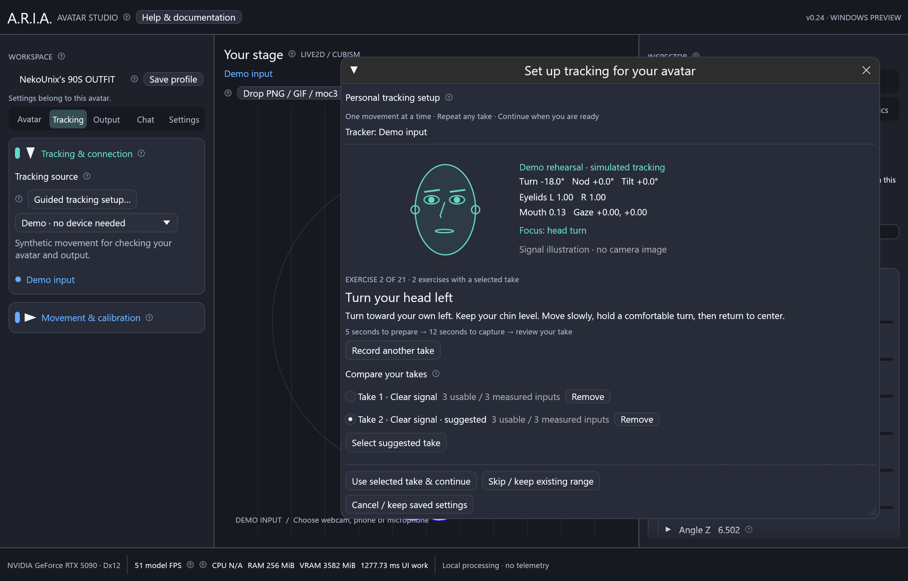

# Personal tracking setup



ARIA can learn how you move and fit those movements to the active avatar's
tracking inputs. The guide works with Live2D, VRM and PNG/GIF profiles. It uses
imported model assignments and preserves authored output limits, directions,
expressions and physics. Unrecognized custom controls remain available for manual
assignment in the Inputs inspector.

The illustration uses a synthetic test capture; personal setup requires a real tracker.

1. Import your avatar, then choose **Set up personal tracking**. You can also open
   **Tracking → Tracking & connection → Guided tracking setup** or use the button
   in **Inspector → Tracking → Inputs**.
2. Connect a face tracker. For a local webcam, choose MediaPipe or NVIDIA RTX,
   follow [camera setup](webcam.md), and press **Start camera**. For iPhone VTube Studio, enable **3rd Party PC Clients**
   on the phone, enter its IPv4 address and request port in ARIA, and connect.
   For iFacialMocap choose **iPhone · iFacialMocap**, enter the phone's IPv4 address,
   start with both ports at **49983**, and connect using the [phone setup guide](ifacialmocap.md).
   Keep both devices on a reachable network. See [Windows setup](windows.md) for
   connection and firewall troubleshooting. Demo and microphone-only mode cannot
   calibrate your facial movement; microphone sensitivity has its own controls.
3. Check **Only exercises used by this avatar's assignments** to keep the guide
   focused on your rig. Clear it to include other available signals for image
   actions or future assignments. Put your camera at eye level with even lighting.
4. Capture one exercise at a time. First hold your relaxed **neutral** pose with
   eyes naturally open and lips closed. Head turns, chin up/down, tilts, each
   eyelid, individual expressions and each gaze direction then get separate pages.
   There is no combined head/expression capture and no automatic page advance.

   The default preparation countdown is **5 seconds**. Neutral records **8 seconds**;
   each movement records **12 seconds**. Expand **Capture timing** to choose a
   3–10 second countdown and 8–30 second movement capture. The guide pauses when
   face tracking is lost, and only fresh packets advance the recording timer.

   After each take, stay on that page to compare it, **Record another take**, or
   **Use selected take & continue**. Keep up to **five takes per exercise**; remove
   one to make room for another. **Select suggested take** favors usable signals
   with clear movement above resting noise. You can select a different take. Only
   the selected take contributes to calibration; unrelated exercises are untouched.
   Skip unavailable or uncomfortable movements to retain existing behavior.
5. Review the results. Expand a signal to see which actual model parameters it
   drives. Edit **Low / Rest / High** if necessary. Deselect a new range to retain
   its saved behavior. Use **Retake an individual exercise** for signals marked **Needs review**.
   Changing the selected neutral take clears this draft's movement takes, because
   they were recorded against a different resting pose; you then recapture them.
6. Enable **Preview new calibration on stage**. Move or collapse the guide window
   to see the avatar; toggle preview off to compare. Check relaxed pose, both head
   directions, nodding, eyelids, lip sync and eye gaze. Resume live movement if a
   screenshot pose is active. Microphone mouth control can override camera/phone lip sync.
7. Choose **Save calibration for this avatar**. It is persisted immediately for
   the current model. **Movement & calibration → Use personal tracking calibration**
   bypasses or restores the saved calibration. Save a movement preset to name the
   configuration, export it, or assign a preset hotkey.

The circled **?** buttons provide offline instructions and an input-flow diagram.
Closing or cancelling the guide discards its temporary preview. Changing the model,
tracker connection settings, assignments or global mapping also cancels the draft.
The **live illustrated face** shows head turn/nod/tilt, left/right eyelids,
head-independent eye gaze, brows and mouth values from the active tracker. It is a
vector signal illustration, not a webcam image or detected landmark overlay. It
works with iPhone VTube Studio, JSON, MediaPipe and NVIDIA tracker inputs. It dims
and shows a waiting message when face tracking is lost. Unsupported signals cannot
be inferred from the illustration; use the exercise's live input list and take
quality to check what your tracker supplies.

No camera video, face images or take histories are saved. Temporary scalar samples
are bounded in memory and discarded when the guide closes. The saved configuration
contains only the selected calibration ranges, so presets stay small.

## How the ranges work

Measurements are captured before global smoothing and head/mouth display clipping.
The median of the selected neutral take and 2nd/98th percentiles of the
selected movement takes reject isolated tracking
spikes. A noisy neutral capture or movement too small relative to resting noise is
flagged instead of amplified. Each side of a signed signal must move sufficiently.

For example, your head measurements **−18 / 4 / 46** become the standard input
**−30 / 0 / 30**. Each side is scaled separately so your resting position remains
centered. Eye openness rests at 1 and mouth openness at 0. Values beyond the learned
limits are clamped, and the normal smoothing setting still applies.

```text
Tracker → Personal range and neutral → Standard input
        → Model's existing assignments → Expressions and physics → Avatar
```

This fits personal movement to ARIA's input vocabulary, then respects the model's
existing mappings. Artist-defined narrow input ranges may still need tuning in
Inputs. The guide cannot invent a missing tracker signal or infer the meaning of
every arbitrary rig parameter. Unmapped clothing and physics parameters often
should remain unmapped. PNG/GIF avatars respond through their configured image
actions and movement controls; calibration does not add facial geometry to artwork.

Run setup again after changing camera position, tracker, head/mouth gain or axis
settings. The one-click neutral-pose control disables the previous personal ranges
because their origin has changed. New movement presets include the calibration;
older presets restore the calibration they were saved with. Skipped inputs retain
their existing settings; redoing neutral restarts the baseline for all exercises.


Take suggestions are a starting point, not a guarantee that a movement was performed
correctly. The score rewards usable signal coverage and motion above neutral noise,
with a capped range reward so exaggerated extremes are not preferred indefinitely.
Each signed input still needs both directions to produce a valid range. For example,
if both head-turn takes move in the same direction, the final input remains marked
for review. Confirm the resulting behavior on your actual avatar before saving.

## Mouth response after calibration

In v0.26 source builds, **Tracking → Mouth response → Quick** applies one 12 ms
mouth filter after learned ranges. It avoids accumulating global and imported
binding delay. Instant, Soft and custom choices save with the avatar/presets.
The illustrated calibration face displays raw measurements; use the model preview
to judge final response. [Speech setup and packet-rate diagnostics](responsiveness.md).

## Use a VBridger configuration

Choose **Import / edit VBridger config** from the Tracking page to use the
[VBridger editor](vbridger.md). Imported channels replace ordinary derived
tracking and personal calibration. While the import is enabled, the range-guide
button opens the editor so you can tune its raw input offsets and curves.
Disable imported tracking to resume the ordinary step-by-step range guide.

## Upgrading VTS head-tilt calibration

v0.33 fixes the lean direction at VTube Studio input. Saved ARIA VTS calibrations
and movement presets migrate automatically; each profile stays independent.
If you added a manual **Invert roll (tilt)** or reversed input/output range to
work around the old direction, remove that workaround first. Keep Mirror only if
you want mirrored movement. Calibrate your neutral pose, then use the separate
left-shoulder and right-shoulder exercises to check your comfortable ranges.
Review custom Experimental VBridger equations and separately imported older
movement-preset files after upgrading, because their intended reversal is unknown.
