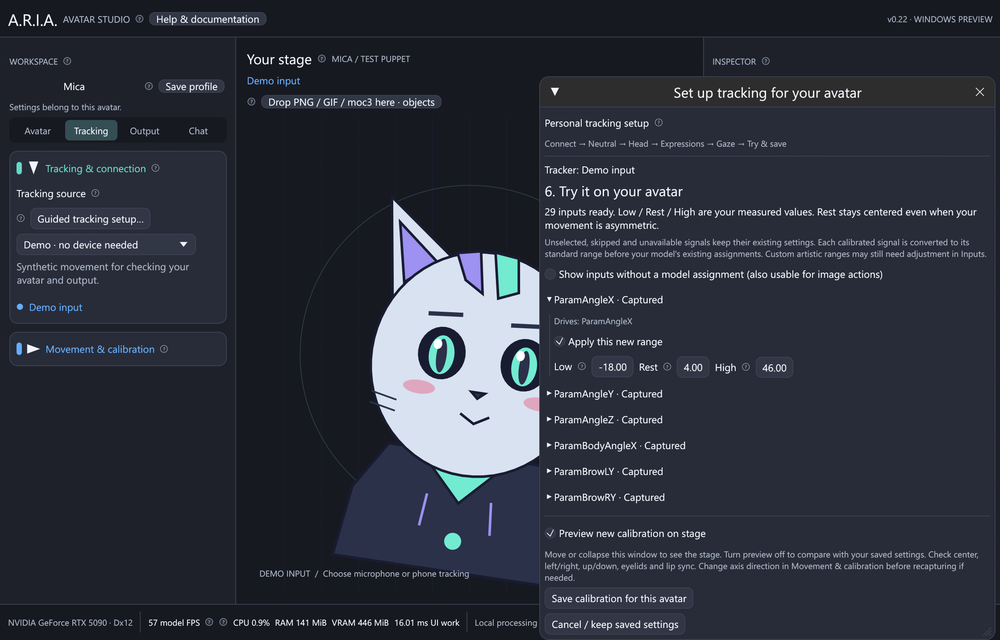

# Personal tracking setup

ARIA can learn how you move and fit those movements to the active avatar's
tracking inputs. The guide works with Live2D, VRM and PNG/GIF profiles. It uses
imported model assignments and preserves authored output limits, directions,
expressions and physics. Unrecognized custom controls remain available for manual
assignment in the Inputs inspector.



The illustration uses a synthetic test capture; personal setup requires a real tracker.

1. Import your avatar, then choose **Set up personal tracking**. You can also open
   **Tracking → Tracking & connection → Guided tracking setup** or use the button
   in **Inspector → Tracking → Inputs**.
2. Connect a face tracker. For iPhone VTube Studio, enable **3rd Party PC Clients**
   on the phone, enter its IPv4 address and request port in ARIA, and connect.
   Keep both devices on a reachable network. See [Windows setup](windows.md) for
   connection and firewall troubleshooting. Demo and microphone-only mode cannot
   calibrate your facial movement; microphone sensitivity has its own controls.
3. Sit at your usual distance with the camera at eye level and even lighting.
   Capture **neutral** with eyes naturally open, lips relaxed and closed, and
   eyebrows at rest. Each capture has a three-second preparation countdown.
4. Follow the head, expression and gaze exercises. Neutral takes three seconds,
   head movement eight, expressions ten, and gaze six. Hold comfortable limits
   briefly and repeat. Progress pauses when face tracking is lost. Skip an exercise
   your tracker does not support; weak signals are left unchanged.
5. Review the results. Expand a signal to see which actual model parameters it
   drives. Edit **Low / Rest / High** if necessary. Deselect a new range to retain
   its saved behavior. Retry a movement for signals marked **Needs review**.
6. Enable **Preview new calibration on stage**. Move or collapse the guide window
   to see the avatar; toggle preview off to compare. Check relaxed pose, both head
   directions, nodding, eyelids, lip sync and eye gaze. Resume live movement if a
   screenshot pose is active. Microphone mouth control can override phone lip sync.
7. Choose **Save calibration for this avatar**. It is persisted immediately for
   the current model. **Movement & calibration → Use personal tracking calibration**
   bypasses or restores the saved calibration. Save a movement preset to name the
   configuration, export it, or assign a preset hotkey.

The circled **?** buttons provide offline instructions and an input-flow diagram.
Closing or cancelling the guide discards its temporary preview. Changing the model,
tracker connection settings, assignments or global mapping also cancels the draft.
No raw face recording is saved: the stored configuration contains only ranges.

## How the ranges work

Measurements are captured before global smoothing and head/mouth display clipping.
The median resting pose and 2nd/98th movement percentiles reject isolated tracking
spikes. A noisy neutral capture or movement too small relative to resting noise is
flagged instead of amplified. Each side of a signed signal must move sufficiently.

For example, your head measurements **−18 / 4 / 46** become the standard input
**−30 / 0 / 30**. Each side is scaled separately so your resting position remains
centered. Eye openness rests at 1 and mouth openness at 0. Values beyond the learned
limits are clamped, and the normal smoothing setting still applies.

```text
Tracker → Personal range and neutral → Standard input
        → Model's existing assignments → Expressions and physics → Avatar
```

This fits personal movement to ARIA's input vocabulary, then respects the model's
existing mappings. Artist-defined narrow input ranges may still need tuning in
Inputs. The guide cannot invent a missing tracker signal or infer the meaning of
every arbitrary rig parameter. Unmapped clothing and physics parameters often
should remain unmapped. PNG/GIF avatars respond through their configured image
actions and movement controls; calibration does not add facial geometry to artwork.

Run setup again after changing camera position, tracker, head/mouth gain or axis
settings. The one-click neutral-pose control disables the previous personal ranges
because their origin has changed. New movement presets include the calibration;
older presets restore the calibration they were saved with. Skipped inputs retain
their existing settings; redoing neutral restarts the baseline for all exercises.
