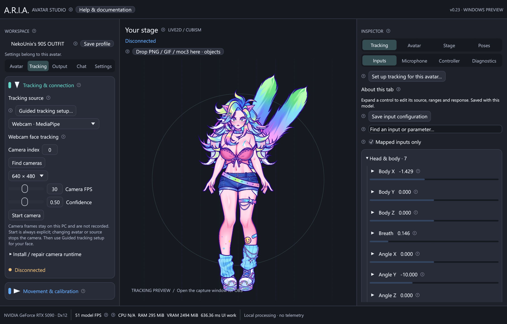

# Tracking inputs



## iPhone VTube Studio

For local cameras, choose **Webcam · MediaPipe** or **Webcam · NVIDIA RTX** and
follow [Webcam setup](webcam.md). These use an owned local inference process,
not the UDP connection described below. The same [guided calibration](tracking-setup.md)
and per-avatar input controls apply to all sources. Use [the control API](api.md)
for scripted poses, parameters and outputs; external high-rate face data still uses
the ARIA JSON tracking protocol below.

A.R.I.A. implements the public **third-party iOS tracking UDP interface** documented
by [DenchiSoft](https://github.com/DenchiSoft/VTubeStudioBlendshapeUDPReceiverTest).
It is independent of the VTube Studio desktop API on TCP/WebSocket port 8001.
You do not need the desktop VTS app, plugin authentication, or a VTS model on the PC.

1. Connect the iPhone and Windows PC to the same trusted LAN. Avoid a guest Wi-Fi
   network with client isolation. Ethernet and Wi-Fi can be on the same LAN.
2. Start VTube Studio on the iPhone. Open its camera preview at least once to
   initialize tracking, grant camera access, and confirm it finds your face.
3. Open the first settings tab and enable **3rd Party PC Clients**. Older app
   versions may label this area for VSeeFace. Find the phone's IPv4 address in its
   IP list; note the request port shown there.
4. Grant iOS **Local Network** access to VTube Studio if prompted. Keep it running
   in the foreground and keep the phone powered during a long session.
5. Choose **iPhone · VTube Studio** in A.R.I.A. Enter the phone IPv4 address,
   request port (normally `21412`), and PC receive port (default `11125`). Click
   **Connect tracking**.
6. Permit the Windows executable on your trusted **Private** network if prompted.
   See [the scoped firewall helper](windows.md#windows-firewall) if needed.
7. Wait for **Tracking live**. Face the phone in your resting pose and click
   **Calibrate neutral pose**. Test head turns, tilt, blinks, brows and mouth motion.

Device-side instructions and the LAN/USB distinction are described in the official
[VTube Studio third-party streaming guide](https://github.com/DenchiSoft/VTubeStudio/wiki/Sending-data-to-VSeeFace).
A.R.I.A.'s integration supports LAN UDP only; it does not implement USB pairing.

### What crosses the network

Every second, A.R.I.A. sends this UTF-8 JSON datagram to the phone's request port:

```json
{"messageType":"iOSTrackingDataRequest","time":5.0,"sentBy":"A.R.I.A.","ports":[11125]}
```

The receive port is taken from the UI, not hardcoded to 11125. The five-second
subscription is renewed while connected. Disconnect closes the receiver and
stops renewal; the phone's old subscription then expires. The phone sends data
back to the IP from which it received the request, at the advertised receive port.

The official [payload definition](https://github.com/DenchiSoft/VTubeStudioBlendshapeUDPReceiverTest/blob/main/Assets/VTubeStudioBlendshapeDataReceiver/VTubeStudioRawTrackingData.cs)
uses **PascalCase** fields and a list of `{ "k": name, "v": value }` blendshape
entries. The parser handles that format, preserves both eye rotations and head
position, and ignores future unknown fields. The test fixture independently
spells out the published shape; it is not only a serializer round-trip test.

```json
{
  "Timestamp": 1724000000123,
  "FaceFound": true,
  "Hotkey": -1,
  "Rotation": {"x": 4.0, "y": 358.5, "z": -6.0},
  "Position": {"x": 0.01, "y": -0.02, "z": 0.4},
  "EyeLeft": {"x": 0.0, "y": 5.0, "z": 0.0},
  "EyeRight": {"x": 0.0, "y": 5.0, "z": 0.0},
  "BlendShapes": [
    {"k": "EyeBlinkLeft", "v": 0.25},
    {"k": "EyeBlinkRight", "v": 0.0},
    {"k": "JawOpen", "v": 0.7}
  ]
}
```

### Mapping

| Output parameter | Input |
| --- | --- |
| `ParamAngleX/Y/Z` | Horizontal/vertical/lean after protocol conversion, neutral offset, gain and optional inversion |
| `ParamEyeLOpen/ROpen` | One minus left/right blink |
| `ParamMouthOpenY` | Jaw open minus half mouth-close, then mouth gain |
| `ParamMouthForm` | Average smile minus average frown |
| `ParamBrowLY/RY` | Inner-up plus corresponding outer-up minus brow-down |
| `ParamEyeBallX/Y` | Paired directional eye-look blendshapes |
| `ParamBodyAngleX` | A smaller scaled yaw value, available for future renderers |

The built-in puppet demonstrates head, eyelid, mouth, gaze and brow parameters.
The PNG puppet uses head movement and a mouth-open threshold for sprite switching.
Body yaw is exposed but is not an independent deforming PNG/body rig. All input
blendshapes are retained in Raw view, but not all 52 currently drive the test avatar.
Raw eye rotation and position are retained for later mapping; gaze currently uses
blendshapes. Hotkey values are diagnostic only, not automatic avatar actions.

Angles are degrees. Rotation wrapping is handled around 0/360. Missing blendshapes
default to zero; coefficients are clamped to 0–1. Mirror reverses horizontal head,
roll and gaze movement and exchanges left/right eyes and brows. Smoothing uses a
time-based exponential filter, so behavior is consistent at different render rates.

In v0.3 the VTS adapter routes wire Rotation X to horizontal head rotation and
wire Y to vertical rotation, fixing the crossed controls reported in the previous
build. It converts to ARIA's internal pitch/yaw/roll X/Y/Z convention. Roll stays Z.
The simulator applies the inverse conversion when sending VTS packets. ARIA JSON
v1 retains **X = pitch/up-down, Y = yaw/left-right, Z = roll/lean**. Axis tests use
independent single-axis VTS packets and also verify neutral calibration.

### Model-specific inputs

Adjacent `.vtube.json` assignments override standard bindings for their output IDs.
The saved output IDs and ranges determine which custom parts of a rig move; no
model-specific parameter names are hardcoded into ARIA.

| Named input | ARIA derivation before the profile's range mapping |
| --- | --- |
| FaceAngleX/Y/Z | Calibrated, gained, smoothed horizontal/vertical/lean angles |
| EyeOpenLeft/Right | Standard filtered eye-open values |
| EyeLeftX / EyeRightX | Half of out-left minus in-left / in-right minus out-right |
| EyeLeftY / EyeRightY | Half of up minus down for the corresponding eye |
| MouthOpen / MouthSmile | Standard filtered mouth-open / nonnegative smile |
| Brows | Average filtered left/right brow height, clamped 0–1 |
| MouthX | mouthRight minus mouthLeft |
| MouthFunnel / MouthPucker / CheekPuff | Corresponding raw blendshape |
| MouthShrug | Average mouthShrugUpper and mouthShrugLower |
| MouthPressLipOpen | jawOpen minus average mouthPressLeft/Right |
| Breath | Four-second smooth 0–1 breathing cycle |
| AutoBlink | Periodic brief eyelid closure for profiles enabling automatic blinking |

These formulas approximate named VTS tracking inputs from the public raw packet;
VTS's face processing/filter algorithms are not part of that protocol. Custom
bindings use their own time-based smoothing. Mirror exchanges eyes and reverses
horizontal mouth/gaze values as well as the standard head mapping. On face loss,
raw custom inputs return to zero through their binding filters while breathing continues.

No valid frame for **one second**, or `FaceFound: false`, makes the avatar ease
toward neutral. The receiver keeps renewing while signal is lost and accepts
new frames automatically. Packet age uses the PC's monotonic receive clock, so
different phone/PC wall clocks do not create false stale reports. Older nonzero
sender timestamps are ignored while the stream is fresh; after a gap, a restarted
sender can begin a new timestamp sequence. Calibration must be redone if the
phone's pose/orientation or sender changes.

## External tools: ARIA JSON v1

Select **External tool · ARIA JSON** and set the allowed sender IP. Use `127.0.0.1`
for a tool on the same PC. Click **Connect tracking**. The receiver does not send
subscriptions in this mode; the tool sends UTF-8 JSON directly to the PC receive
port. This is A.R.I.A.'s own schema, not an assertion of compatibility with every
tracking product. Other trackers require a small adapter that emits this format.

Required fields are `version`, `face_found`, `rotation` and `blend_shapes`:

```json
{
  "version": 1,
  "timestamp": 1724000000123,
  "face_found": true,
  "rotation": {"x": 4, "y": -10, "z": 2},
  "blend_shapes": {"jawOpen": 0.7, "eyeBlinkLeft": 0, "eyeBlinkRight": 0}
}
```

Optional fields: `position`, `eye_left`, `eye_right` (each an `{x,y,z}` object),
`hotkey` (integer), and `timestamp` (Unix milliseconds, unsigned). Timestamp zero
or omission disables sender-order checking. Positions and eye rotations retain
the sender's coordinate values. Blendshape names are case-insensitive after
decoding. Unknown fields/names are tolerated. Limits: 16 KiB per packet, at most
128 blendshapes, names 1–64 bytes, and finite numbers only.

Only packets from the configured sender IP are accepted. Loopback peers bind a
loopback-only listener; explicit LAN peers bind an IPv4 LAN listener. Source ports
are not restricted because a phone can use a different data port from its request
port. UDP is unencrypted and IP filtering is not cryptographic authentication.
Use trusted networks; no internet port forwarding is needed.

## Simulator and headless diagnostics

Use separate terminals for sender and receiver. From the source repository:

```powershell
# Terminal 1: emulate an iPhone, including subscription expiration.
cargo run --locked -p aria-cli -- simulate-vts --seconds 120
```

```powershell
# Terminal 2: receive and print mapped values for 20 seconds, without a GPU.
cargo run --locked -p aria-cli -- listen --sender 127.0.0.1 --seconds 20
```

Or connect the desktop app to `127.0.0.1`, request port `21412`, receive port
`11125`. Do not run the headless receiver and desktop receiver on the same port.
For a second receiver, change its `--listen-port`, for example to `11126`.

For an external JSON sender:

```powershell
# Desktop: select External tool / ARIA JSON, sender 127.0.0.1, receive 11125, Connect.
cargo run --locked -p aria-cli -- send-json --target 127.0.0.1:11125 --seconds 120
```

Physical phone, headless mode:

```powershell
cargo run --locked --release -p aria-cli -- listen --sender 192.168.1.42 --request-port 21412 --listen-port 11125 --seconds 30
```

Replace the address with your phone's actual IP. The `listen` command exits with
an error if it receives no valid packets. With a bundle replace `cargo run --locked
-p aria-cli --` with `./aria-cli.exe`. Use `--help` on any subcommand for options.
Ctrl+C terminates CLI tools; the desktop **Disconnect** button closes its socket
and stops its worker cooperatively.

Physical iPhone testing is a separate acceptance check from simulator tests.
See [validation](validation.md) for the current evidence and remaining checks.

## Vertical head direction in v0.12

VTube Studio wire rotation X is horizontal, Y is vertical and Z is lean. ARIA
maps these to internal yaw, **negative vertical pitch**, and roll respectively.
Positive wire Y now drives negative model pitch; negative wire Y drives positive
model pitch. ARIA JSON already uses internal pitch/yaw/roll and is unchanged.
Saved VTS neutral-pitch offsets migrate once with the sign correction. Imported
per-avatar parameter ranges are preserved. If you previously compensated with
Invert pitch, review that option and recalibrate while looking straight ahead.

## VBridger equations and extra channels

The **experimental** [VBridger config editor](vbridger.md) imports `.vbridger` files per avatar and
provides input/output curves, offsets, delay, smoothing, steps and expressions.
Existing trackers continue to send raw tracking to ARIA. The optional ARIA JSON
`parameters` object accepts up to 128 named, finite values in ±1,000,000 for
visemes, body channels and declared plugin inputs. Names are case-sensitive;
the 16 KiB UDP packet limit still applies. VTS packets have no such extra object.
