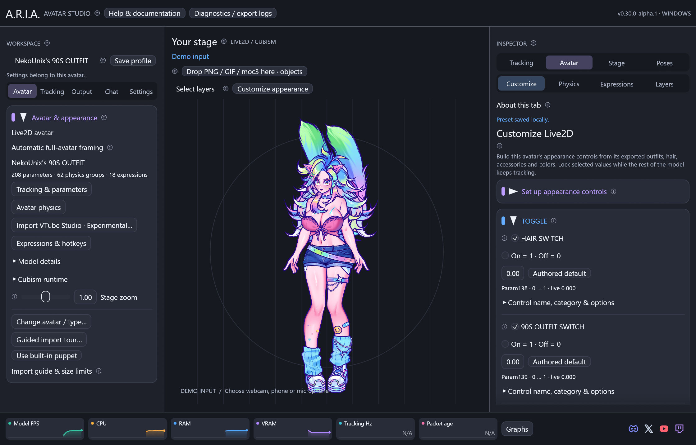

# Validation



This file records checks for the development builds. The Windows CI workflow
is the repeatable MSVC build/test path; its status belongs to a specific commit.

## v0.30 Live2D selection and appearance — 2026-09-14

- 219 standard Rust tests, workspace/all-target/all-feature strict Clippy,
  formatting and offline repository checks. Older profiles load with empty
  appearance settings; values and named choices validate against model ranges.
- Real egui pointer press/move/release selects multiple meshes; Escape restores
  the previous selection. Geometry checks cover overlapping render order, hidden
  layers, rotated/scaled models, empty bounding-box corners and edge crossings.
- Appearance preset hotkey dispatch and export/import preserve current mapping,
  physics, frozen pose, expressions and curated control names. Foreign-avatar
  imports are rejected and imported keyboard assignments are cleared.
- Native Cubism/GPU checks on the owner's full Odette export (208 parameters,
  1,174 meshes) and OilBun export (109 parameters, 284 meshes): stage rectangle
  selection hid and restored 350 and 190 meshes respectively, with pixel-exact
  restoration. Appearance switches `Param139` and `Param27` changed real rendered
  artwork while head tracking continued; releasing them restored the original image.
- Native Windows UI captures exercise the customization inspector and a real
  pointer drag through the app. The capture fails if the drag selects fewer than
  two meshes. Profiles are isolated; supplied artwork sources are never committed.

Run native checks on Windows with a local GPU, the appropriate Cubism library in
`ARIA_CUBISM_CORE`, a built `aria-cubism-host`, and `ARIA_TEST_MODEL` pointing to
your complete model export. Set `ARIA_TEST_APPEARANCE_PARAMETER` to an exported
appearance switch that changes artwork and has CDI folder metadata:

```sh
cargo test --locked -p aria-desktop --all-features native_appearance_override -- --ignored --nocapture
cargo test --locked -p aria-desktop --all-features native_marquee_selection -- --ignored --nocapture
```

Screenshot scenarios are `customization` and `layer-selection`. Selection uses
ArtMesh geometry, not per-pixel alpha/mask picking. Physical input latency and
interactive macOS/Linux hardware behavior are not measured by these Windows tests.

## v0.29 Experimental VTube Studio import — 2026-09-13

### Browser-link hotfix

The desktop deliberately disables the UI framework's default features; its
`links` feature must be explicitly enabled for native hyperlinks and OpenUrl
commands. The repository contract now checks this feature. It covers the shared
dispatch used by social icons, online help, Cubism downloads, support tickets and
OAuth sign-in on Windows, Linux and macOS.

To exercise the actual operating-system browser launcher on an interactive
desktop with a default browser configured:

```sh
cargo build --locked -p aria-desktop --features screenshots
python scripts/check-browser-links.py target/debug/aria-desktop.exe
```

On Linux/macOS, use `target/debug/aria-desktop` without `.exe`. The isolated demo
issues the same OpenUrl command as the app's links; a temporary localhost server
must receive a request from the browser. The app captures a frame and closes.
Close the browser's local success tab afterward. This test sends no data to an
external service and the smoke hook is absent from normal release builds.

Passed on Windows with the actual native ARIA app and a browser request received
by the local server. All 210 workspace tests and strict Clippy passed after the
feature change. Interactive Linux/macOS browser acceptance remains unverified.

### Import and diagnostics checks

- 210 standard workspace tests passed locally. New checks cover sidecar validation,
  shortcut conversion, motion curves and part opacity, frame-folder sorting,
  transactional local repairs, scene toggling and readable/redacted report export.
  Strict all-target/all-feature Clippy and formatting passed on Windows GNU.
- The opt-in native collection check imported all 15 supplied model profiles,
  validated persisted settings, executed available native actions, rendered frames
  and restored the previous profile with Undo. Both Odette profiles resolved all
  six item scenes. PNG/GIF, PNG frame folders and independent Live2D scene objects
  loaded and updated through the actual GPU/Cubism worker path.
- An isolated native screenshot/report exercise uses the owner's Odette export.
  The report includes its parameter, mesh, texture and physics metadata; the injected
  diagnostic test event is explicitly synthetic. No model files or reports are
  committed. Report tests preserve error codes/rig IDs while removing tested private
  paths and credential fields, including recovered previous-session data.
- Import and repair execute only ARIA behaviors. Missing originals cannot be
  reconstructed from a filename. VTS-specific camera, solver, gesture, service and
  plugin behaviors are not guaranteed equivalent; use the repair/calibration controls.
  VTube Studio import and VBridger import remain **Experimental**.
- Physical phone/controller/network acceptance and arbitrary third-party avatars
  remain outside these checks. Linux/macOS native builds and package tests run in
  CI; that is distinct from interactive acceptance on those operating systems.

## Avatar customization upgrade — 2026-09-13 source build

- 166 standard Rust tests passed locally, plus strict workspace/all-target/all-feature
  Clippy and formatting. Simulated pointer input verifies anchor dragging keeps
  an object's rendered center, size and angle unchanged; locked objects cannot drag.
- Six opt-in integration checks passed on Windows with an NVIDIA GeForce RTX 5090
  using DX12: clipping/blending with hidden masks and half-opacity layers; Odette
  fully hiding/restoring with pixel-identical recovery on a frozen pose; independent
  tracked Live2D attachments; the supplied NekoUnity2 VRM with gesture, spring and
  frozen-pose restoration; generated VRM 0/1 rendering/morphs; and native/worker
  frame parity with stable layer IDs and worker-exit handling.
- Regression tests cover group overlap, persistence and hotkey conflict/dispatch,
  per-model isolation, motion settings migration/validation, gesture completion,
  loops, smooth stopping, finite angles and frame-rate-independent idle movement.
- Unedited native screenshots show the new layer controls with Odette and the
  waving NekoUnity2 VRM with idle/gesture controls. Isolated profiles preserve the
  owner's settings. Debug resource readings are not release benchmarks.
- New features have not had physical Linux/macOS desktop acceptance or arbitrary
  avatar/costume coverage. Gesture collisions are not simulated. Tracking tests
  use supplied scalar inputs, not new physical-phone or webcam measurements.
  The published v0.25.0-alpha.1 packages predate these source changes.

## v0.25 Alpha native outputs — 2026-09-13

- Windows: 160 standard Rust tests, strict Clippy and formatting passed locally.
  The native Spout test also passed: an independent DX11 receiver opened the DX12
  sender at landscape, portrait and Freeform dimensions and verified alpha and
  resource cleanup. Odette rendered in the Alpha output-controls screenshot using
  a separate profile and the native Cubism worker.
- The first Linux CI pass compiled the app and native OBS plugin, passed the Rust
  suite and cross-process transport test, and produced portable, RPM and Arch
  archives. Artifact inspection verified their checksum, source/licenses and
  absence of private avatars or SDK binaries. The app/plugin dependency split and
  Arch metadata path were tightened before final release checks.
- Both Mac architectures compiled the bridge and official pinned Syphon framework.
  The first bundle-signing attempt exposed a resource-layout error; packaging now
  keeps only executables in MacOS and places documentation under Resources.
- The final [Alpha packages workflow](https://github.com/NekoUnix/A.R.I.A/actions/workflows/alpha-build.yml)
  runs Linux Vulkan readback checks, a real libobs receiver/render/reconnection
  check, a native Syphon Metal pixel test, and Fedora/Arch package installation.
  Its result and the release notes record the final source revision's outcomes;
  earlier build results are not substitutes for that revision's checks.
- Linux tests use software graphics/Xvfb. macOS tests use the runner's Metal
  device and the official Syphon server surface. These do not establish acceptance
  on every physical GPU or a user's OBS scene. Real-device webcam/phone, RTX,
  controller and proprietary Core limitations remain as documented below.

## Local verification on 2026-09-12

### Individual tracking exercises and repeat takes — 2026-09-13 development update

- **160 Rust tests passed**, with twenty environment-dependent checks opt-in.
  Strict all-target/all-feature Clippy and formatting passed.
- Guided captures isolate each movement's input family. Tests cover asymmetric
  left/right ranges, selecting and removing takes, capped history, flat/noisy
  signals, duplicate packets, tracking loss and clock gaps, and changing neutral.
- Finishing a take waits on the same page. Only explicit Continue/Skip advances;
  retaking a movement preserves unrelated manual review edits. Closing discards
  temporary takes and face samples without modifying the saved profile.
- The illustrated face has independent head turn/nod/tilt and finite-value guards.
  It uses incoming tracking values and vector drawing, with no second camera feed
  or video texture. Quality is computed when a take finishes, not every UI frame.
- A native check verified **23 calibrated input assignments** against the supplied
  Odette Cubism model. The updated guide screenshot shows a labeled synthetic
  two-take rehearsal with the same avatar, not physical phone/camera validation.
- SDK links were checked against the official Native SDK download and library list.
  Buttons use an OS label and shared official download page; guidance distinguishes
  Windows x64, Linux x64, Apple Silicon and Intel Mac. The resolver also recognizes
  the SDK's experimental Linux ARM64 directory; that hardware target is untested.

### v0.24 first-release fixes verified on 2026-09-13

- **151 Rust tests passed**, including custom PNG/GIF selection, replacement,
  quantities, saved paths, asynchronous bursts, failed-file diagnostics and retry.
  Strict all-target/all-feature Clippy passed. Twenty environment-dependent tests
  remain opt-in after the new native checks were added.
- A native demo-avatar regression rendered seven custom assets in one burst: PNG,
  animated GIF, GLB, glTF, OBJ, FBX and the supplied independent Live2D model.
  This validates the selected-file playback path; an exact file from the reported
  failed demo was not supplied, so it does not establish compatibility with that file.
- The separate Cubism worker matched direct Core vertex deformation over minimum
  and maximum parameter frames on the supplied model. Terminating that worker
  returned a recoverable error without crashing the parent test process.
- The native Windows desktop rendered the supplied Odette model through its own
  worker mode; the current workspace screenshot above records that build.
- Protocol tests reject bad headers/versions, oversized or truncated messages and
  trailing data. SDK-layout tests resolve native Windows/Linux/macOS siblings and
  reject a Windows-only DLL when no native sibling exists.
- Linux and macOS native builds and regression tests passed in GitHub CI. Strict
  lint also checks platform-specific code; Windows-only test helpers are excluded
  from other targets. Graphical and native SDK execution on those operating
  systems remains unverified locally; this Windows host has no installed WSL distro
  or macOS runtime. See [platform support](platforms.md) and the per-commit CI results.

### v0.24 public release and dependency compatibility

- **147 Rust tests passed**, with eighteen environment-dependent tests ignored.
  Formatting and strict Clippy passed across all targets and features after the
  egui/eframe 0.36, wgpu 30 and Windows bindings migration. Headless UI checks
  explicitly discard unused texture deltas; native outputs consume root textures.
- Four additional native DX12 checks passed: Live2D clipping/blending/culling/draw
  order, Spout transfer with alpha to an independent DX11 receiver and cleanup,
  generated VRM 0.x/1.0 rendering and morphs, and the supplied VRM's tracking,
  expressions, springs and frozen poses.
- MediaPipe 1.0.1 installed in a clean Python 3.12 x64 environment and detected a
  face with pose and expressions in Google's public portrait fixture. Setup/repair
  also upgraded an older ARIA environment, removed obsolete protobuf/JAX packages,
  passed `pip check` and repeated real inference successfully. The lock has twenty
  distributions, down from twenty-seven. Three Python conversion tests passed.
- Native captures verified the supplied Odette Live2D avatar and the separate
  help window after the UI migration. The workspace image above is from this build.
- Documentation links, JSON, pinned Actions, camera pins and package versions
  passed repository checks. The public `main` ruleset and security reporting
  settings were read back from GitHub; CI results remain specific to their commit.
- Physical camera/controller/phone and NVIDIA SDK hardware limitations listed
  below still apply. Debug screenshots are visual checks, not performance results.

### v0.23 cameras, themes and control API

- **147 Rust tests passed**, with eighteen environment-dependent tests ignored.
  Workspace formatting and strict Clippy passed with all targets/features.
  Three Python conversion tests passed for independent pitch/yaw/roll, NVIDIA
  coefficient ordering, invalid native results and face-loss packets.
- MediaPipe 0.10.21 performed real CPU inference on Google's public `portrait.jpg`
  fixture and returned a detected face, pose and expression values. Windows
  DirectShow enumeration found the installed virtual cameras, including NVIDIA
  Broadcast and OBS. The shipped setup/repair script completed with the pinned
  FaceLandmarker SHA-256 check and imported its installed dependencies successfully.
- Native HTTP tests controlled the supplied Odette Live2D model: actual held
  parameter values, release, freeze, expressions, all three outputs and theme
  changes. Invalid native ranges/IDs and stale generations were rejected; missing
  authentication failed. The test confirmed queued commands through result tickets.
- Native screenshots cover Odette Live2D, custom/theme pages, camera/RTX/API setup,
  inputs, controller support, physics, expressions, effects, pins, outputs and chat.
  The guided review screenshot is a deterministic rehearsal, not a recorded human
  calibration session. Supplied VRM and GIF avatars are included in current docs.
- The optimized portable ZIP passed CRC, required-file and template checks; Python
  caches, raw avatars and SDK DLLs are excluded. Its CLI reported 0.23.0, and the
  packaged desktop launched with supplied VRM, Live2D and GIF avatars using a
  system-only PATH and isolated preferences. The test profile persisted on exit.
  All 17 new PNG screenshots decoded and relative links in 26 guides resolved.
- **Not hardware-validated:** physical webcam tracking and NVIDIA GPU inference.
  This machine exposed virtual cameras only and had no NVIDIA AR SDK Core/feature
  packages. The optional NVIDIA bridge source and loader are present; its native
  SDK build and FaceExpressions inference still require validation with those
  packages. A missing bridge produces the expected diagnostic without CPU fallback.

The older entries below record their own builds. Their former policy of excluding
private-avatar screenshots was superseded by the owner's explicit v0.23 request
to illustrate Git documentation with the supplied models. Raw avatar files remain
excluded; see [screenshot provenance](images/README.md).

### v0.22 personal tracking setup

- **143 default tests passed**, with eighteen environment-dependent tests ignored.
  Formatting and strict Clippy passed across workspace targets/features.
- Regression coverage includes asymmetric resting poses, full head/mouth values
  before clipping, outliers, noisy/flat signals, missing/duplicate packets, tracking
  loss, retained model output inversions, cancellation, retries/skips, old settings,
  and serialization of per-avatar ranges and their original head reference.
- A full deterministic tour reached review through the capture state machine.
  The native Cubism check separately verified **21 learned assignments** on the
  supplied Vespera model. These use generated tracking traces; no physical iPhone
  calibration session was available during these checks.
- Native Windows UI checks covered the connection guide and review screen on Mica
  and the supplied Live2D avatar. The latter also exported a transparent PNG.
  Only a Mica illustration is included in the documentation; private avatar files
  and screenshots remain outside the repository and portable package.

### v0.21 Live2D controller input

- **135 default tests passed**, with seventeen environment-dependent tests ignored.
  Formatting and strict Clippy passed across workspace targets/features.
- Added regression coverage for all 33 Nyarupad signals, the three raw face aliases,
  authored inverted ranges, stick-axis independence, drift filtering, button pulse
  decay, quick taps, latched hand animation, and neutral disconnected/disabled input.
  Saved rigs/presets migrate once; existing customized assignments survive.
- A separate native SDL test attached process-local virtual controllers, selected
  devices, moved axes/pressed buttons, switched pads, disconnected a chosen pad,
  and checked neutral behavior. No system driver or virtual input device was installed.
  The background-input hint was verified with no SDL window owning focus.
- The supplied Vespera export imported all 43 VTS assignments without warnings,
  including its 15 controller bindings. Native Cubism parameters followed the
  controller samples. Its ControllerArms expression changed the actual mesh
  geometry/visibility and enabled the separate controller-arm set.
- Native UI inspection verified the controller panel, imported pose shortcut and
  the visible controller arms. Transparent export succeeded. The public guide image
  uses only Mica; private model screenshots remain outside the repository/bundle.
- No physical controller was connected during these checks. Xbox, PlayStation,
  Switch, Bluetooth, unusual adapters and custom mapping files still need a physical
  hardware matrix; SDL support is not a guarantee for every proprietary device.

### v0.20 nested exports, full-body rendering and shared pins

- Formatting and strict Clippy passed for every workspace target/feature.
  **129 default tests passed**, with sixteen environment-dependent tests ignored.
- The library importer discovered and loaded all four extracted exports then
  present in the supplied Friend Models folder: 1, 14, 4 and 5 texture atlases,
  with 167, 284, 455 and 220 ArtMeshes respectively. Nested folders, apostrophes,
  whitespace before extensions and relative atlas paths remained intact.
- Native DX12 tests rendered every export and checked that all visible vertices
  stayed inside the fitted view at minimum/maximum head and body angles. The
  original mask, inverted-mask, blending, culling and draw-order GPU test passed.
  Exported images were inspected for complete bodies, hair, feet, wings and tails.
- Initial fitting ignores hidden off-canvas meshes; newly visible geometry can
  expand the view. A regression checks that it never shrinks on following frames.
  The existing transparent texture dimensions and GPU allocation count are retained.
- Five VRM checks passed, including generated VRM 0.x/1.0 surface selection,
  serialized pins that follow morphs and camera changes, invalid-index rejection,
  and the supplied avatar's skinning, expressions, springs and frozen poses.
- GIF attachment tests compare the pin position to the actual painted artwork
  during translation, rotation and nonuniform scaling in three canvas shapes.
  Pointer events verify that a pinned GIF accessory remains draggable.
- Native UI previews verified the folder chooser, category colors and pinned
  objects on the supplied GIF and VRM, including transparent composition exports.
  Private avatars/screenshots stay local. The public screenshot shows only Mica.

### v0.19 primary VRM avatars

- Formatting and strict Clippy passed for all workspace targets/features.
  **126 default tests passed**, with fifteen environment-dependent tests ignored
  by default. The optional VRM GPU tests were then run separately.
- Imported the user's local VRM 0.x in place: **54 humanoid bones, 70 expressions,
  28 spring groups, 64,557 unique vertices and 42 draw sections**. Material sections
  reuse three geometry buffers rather than duplicating their shared accessors.
- Five VRM tests passed on Windows DX12: generated 0.x/1.0 import and GPU morph
  rendering, malformed/truncated/external-resource rejection, fixed-step springs
  at 60/120 Hz, and the supplied avatar's animated skinning/expressions/pose flow.
  Head yaw and pitch change independent axes with the correct sign. Generated
  fixtures cover old sphere-offset conversion and VRM 1.0 capsule metadata.
- The native test assigns a custom expression hotkey through the actual input
  monitor, toggles it through the action handler, checks its fade and release,
  and validates serialized shortcut/profile data. This checks application routing;
  it does not synthesize a physical Windows keypress or connect a physical phone.
- Frozen updates skip further GPU draws and leave the image byte-identical. Saved
  pose reload restores joint matrices bit for bit and identical morph weights.
  A fresh DX12 draw permits less than 0.1% changed color channels at overlapping
  transparent edge samples; uninterrupted frozen frames require exact equality.
- The provided avatar's textures, geometry and default 1152 × 1536 MSAA canvas
  account for approximately **414.8 MiB** of application GPU allocations. The
  process GPU metric also includes window/compositor/driver resources. In the
  native UI check it ran near the selected 60 FPS with about 0.3–0.5% process CPU
  on this machine's RTX 5090. These are observations, not performance guarantees.
- Inspected the native full-body and portrait views, spring groups and embedded
  expression controls. Captured the guided importer and all three output formats.
  Public documentation uses the built-in puppet/import guide; private VRM art is
  excluded from the repository and package. `scripts/test-vrm.ps1` repeats the
  optional local DX12 checks using a caller-supplied VRM path.

### v0.18 guided import and large GIF playback

- Formatting and strict Clippy passed for every workspace target and feature.
  **122 default tests passed**, with thirteen environment-dependent tests ignored
  by default. Coverage includes background success/failure, file-role suggestions,
  duplicate selection, per-avatar budget migration and preset storage, contextual
  Inspector tabs, source identity, transparency, timing and texture accounting.
- Loaded all four supplied Odette GIFs on the Windows DX12 GPU. Each has a
  3500 × 2500 logical canvas and 63 frames; each retains **255.9 MiB** at
  **1221 × 872** with the default 256 MiB budget. The test keeps the entire set
  resident, checks frame selection and duration, and completed imports in about
  6–7 seconds per file on this machine. These timings are observations, not guarantees.
- Loaded a temporary valid GIF padded to **441,795,190 bytes**, ten times the
  largest supplied file, through the same GPU importer. Padding tests the file-size
  ceiling; it does not simulate increased image detail. Budget calculations cover
  35000 × 25000 canvases and 630-frame animations. Those very large source canvases
  were not allocated in the native test and still require sufficient working RAM.
- Rendered the supplied **full Version 4 Live2D model**, including its 18 atlases,
  208 parameters, 62 physics groups and 18 expressions. The native frozen-avatar
  regression verified that 60 unchanged updates skip Core/GPU work and an edited
  parameter refreshes the model before returning to the frozen state.
- Inspected native screenshots of the type chooser, PNG/GIF preparation,
  Live2D preparation, loaded GIF action library and full Live2D physics page.
  Image avatars show Artwork & actions; Live2D shows Physics and Expressions.
  The published screenshot uses bundled Mica artwork. Private GIF/model art and
  the proprietary Core DLL remain outside the repository and package.
- `scripts/test-local-assets.ps1` repeats the optional local asset tests from
  user-supplied paths. Large GIF playback is fitted once at import; it does not
  promise full-resolution GPU residency for every accepted source file.
- The native action regression observed all eight starter GIF frames, animated
  stage/throw GIFs and byte-identical transparent exports while frozen. The extracted
  v0.18 portable app started with both the full model and the supplied inactive GIF
  using a system-only Windows PATH and isolated preferences. ZIP CRCs, template
  references and the absence of private artwork/SDK binaries were verified.

### v0.17 large imports and compact workspace

- Formatting and strict Clippy passed for every workspace target and feature.
  **117 default tests passed**, with twelve environment-dependent tests ignored
  by default. New import regressions load a 40960×80 PNG padded past the former
  32 MiB file limit, retain source identity and geometry across GPU limits, account
  for uploaded bytes, and verify transparency without color bleeding. A 3 MiB
  model manifest loads in both inspection and runtime paths; the new 20 MiB bound
  still rejects an over-limit file.
- The native DX12 clipping/blending test also passed explicitly. It now uploads
  an 81920×80 atlas through the actual renderer, verifies fitting notes and retained
  memory, and reads back the expected translucent color. Existing masks, inverted
  clipping, blending, culling and draw-order checks remain part of that test.
- Native Windows captures verified the reorganized Avatar, Tracking, Output,
  Chat, PNG/GIF and Physics pages, including the user's local Live2D model and its
  29 physics groups. GIF avatar/accessory/throw playback still advances, and a
  frozen composited PNG remains byte-identical with transparent areas.
- A short release-build comparison used fresh settings and the built-in Mica
  avatar, with 8 seconds of warmup and about 12 seconds sampled per version.
  v0.16 / v0.17 machine-normalized CPU was 0.235% / 0.241%; average working RAM
  was 116.9 / 115.6 MiB and private commit was 487.1 / 484.7 MiB. This single-host
  smoke comparison found similar overhead; it is not a general performance benchmark.
- Size ceilings are not allocations. Larger loaded content can require more RAM
  and VRAM. Device texture limits still apply; oversized source artwork is fitted
  once at import. No full 1280 MiB moc3 export was available for a native Core test.
  The test model and Cubism Core remain local and are excluded from the package.

### v0.16 Twitch / YouTube chat companion

- Formatting and strict Clippy passed for all workspace targets/features.
  **114 default tests passed**; twelve environment-dependent tests are ignored
  in the default run. New tests cover PKCE's standard vector, callback path/host/
  state validation, duplicate callback rejection, token rotation, cancellation,
  target URL validation, IRC tags and control-message parsing, moderation deletion,
  deduplication and bounded history. The actual eframe RON storage test restores
  distinct chat appearances per avatar while keeping account setup global.
- Two additional native tests passed explicitly: Windows DPAPI protected/unlocked
  synthetic login data, and a loopback HTTP fixture exercised Twitch's pending
  device-code response and YouTube's quota error. No real credentials were used.
- Native DX12 chat previews exercised Twitch-only, YouTube-only, both services,
  transparent backgrounds and whole-chat opacity. At 175% display scale the
  combined viewport was 630×805; a single service was 630×403. Corner alpha was
  184 for Twitch and 115 for YouTube; halving Twitch opacity yielded 92 while
  YouTube remained unchanged. Fully transparent backgrounds had alpha-zero corners
  while opaque message text remained visible.
- Native viewport assertions verified that chat follows below a moved portrait
  preview, disappears while the portrait is minimized, and returns on restore.
  The chat is separate from avatar scene rendering and Spout textures.
- These UI checks use explicitly labeled synthetic messages. Live Twitch/Google
  OAuth consent, real chat reception, provider quota and public-app verification
  require registered client credentials and authorized accounts and were **not
  tested against real accounts** in this run. See [setup](streaming-chat.md).

### v0.15 image actions, GIFs and microphone

- Formatting and strict Clippy across all targets/features passed. **104 default
  tests passed**, with ten environment-dependent tests ignored. New checks cover
  GIF frame selection/timing, decoded budgets, action priorities, input ranges,
  interrupted fades, freeze, animation endpoints, template import/export, shortcut
  conflicts and microphone gate/routing. The real eframe RON storage test also
  restores distinct image and microphone settings for two avatar profiles.
- A separate Windows microphone test opened the default input, received **151 audio
  callbacks**, measured finite amplitudes and closed the stream on disable. Samples
  were not saved. The native microphone panel showed the live level and talking gate.
- Native DX12 previews observed all **eight frames** of the starter GIF, plus a GIF
  stage object and independently animated thrown GIFs. Freeze produced byte-identical
  transparent PNGs before and after a pause, including animated objects and throws.
- OBS 32.2.1/Spout2 1.12 received the image scene at **1920×1080**, **1080×1920** and
  **1536×1024**, preserving transparent corners and visible artwork. The short check
  reported zero skipped render frames; this is not a general performance guarantee.
- PNG/GIF action artwork is a flat image puppet. Tracking-driven Live2D parameters
  still use the existing rig, and microphone input feeds the same mapping path.
  GIF disposal/transparency uses image-rs; GIF audio and speech recognition are absent.

### v0.14 impact deformation

- Formatting and strict Clippy across all targets/features passed. **98 default
  tests passed**, with nine environment-dependent tests ignored. New coverage
  exercises legacy settings migration, finite bounds, overlapping dent geometry,
  independent copies, contact timing, exact recovery, freeze, clear, dent lifetime
  after particle removal, resolution scaling, texture coordinates and alpha.
- Native Windows/DX12 editor previews verified Mica and the local Live2D avatar,
  including a separate thrown moc3 copy. The Live2D comparison changed **438,419
  avatar pixels** and **104,853 object pixels**. Clearing deformation restored
  the original render byte-for-byte; transparent corners remained alpha zero.
  Public documentation screenshots use only Mica; private artwork stays local.
- A stage run rendered **148 effect particles**, including PNG, independent moc3,
  GLB, glTF, OBJ and FBX props. Assertions confirmed avatar dents, independent
  object deformation and both throwing and spray attachment behavior.
- Isolated OBS 32.2.1 with Spout2 1.12 captured the deformed scene at **1920×1080**,
  **1080×1920** and **1536×1024**, retaining transparent corners and opaque avatar
  pixels. This short run reported zero skipped render frames; it is not a general
  performance guarantee. Source geometry and rig parameters are unchanged: these
  are reversible display dents, including on the rendered appearance of 3D props.

## Local verification on 2026-09-11

### v0.9 contextual documentation

- Formatting and Clippy across all targets/features with warnings denied passed.
  **58 default tests** passed. Five new help tests cover topic links, lazy context
  creation, hover text, mouse/keyboard activation, navigation history, independent
  native-window closing, and vertical layout/wrapping of all **46 articles** at
  both the 700-point minimum and 880-point default help-window widths.
- Native Windows/wgpu screenshots at 175% desktop scaling verified the studio,
  expanded input controls, capture controls, range and physics diagrams, plus
  actual parameter context and physics/expression panels with the local Live2D
  test avatar. The initial article layout defect found by screenshots was fixed
  and covered by the article-layout regression test.
- The offline guide is compiled into the executable. Avatar-specific context is
  generated when clicked, not every frame. The help viewport is separate from
  the three capture viewports; closing help does not issue a root/output close.
  Public screenshots use Mica or generic help text; private model art remains local.
- This release changes documentation and UI layout. It does not reimplement
  tracking, physics, expression blending, rendering or the Spout bridge. The v0.8
  OBS interoperability checks below remain historical evidence, not a new v0.9
  end-to-end OBS run.

### v0.8 compact previews and full-resolution OBS output

- Formatting, Clippy for every target/feature with warnings denied, and **53 default
  tests** passed on Windows x64. New cases cover wheel scaling in all three aspect
  ratios, framing locks, multiple layout passes, resolution/preview independence,
  Freeform fitting, legacy two-canvas RON migration, per-model Freeform settings,
  and capping simulation during rapid UI repaints.
- A separate D3D11 receiver opened ARIA's DX12/Spout GPU textures at **1920×1080**,
  **1080×1920**, and **1536×1024**. It verified dimensions, BGRA values and alpha,
  plus unique sender names and cleanup without removing another sender.
- An isolated **OBS 32.2.1** with the upstream **Spout2 plugin 1.12.0** captured all
  three simultaneous senders with the real test avatar. Native source screenshots
  retained those full dimensions, alpha-zero corners, and opaque avatar pixels,
  using **Premultiplied Alpha** composite mode. Only test-owned portable settings,
  sources and processes were used. Private model screenshots remain local.
- All three native preview windows were then minimized (verified by viewport
  state), while OBS continued receiving full-resolution avatar frames and alpha.
  Changing Freeform controls resized the native client from **480×320 to 600×400**;
  a simultaneous canvas change reached OBS at **2048×1024** without reselecting
  the sender. This caught and fixed an old-callback overwrite of requested sizes.
- The real model's compact Freeform preview was **480×320** while its OBS source
  was **1536×1024**. The source receives an offscreen GPU canvas, not a scaled
  window screenshot. The shared Live2D artwork render remains capped at 2048 pixels.
- Optional native checks passed for clipping, normal/add/multiply blending,
  colors, masks, culling, draw order, real Core deformation and mesh allocation
  reuse. A frozen-avatar check skipped 60 unchanged Core/GPU updates, refreshed
  after editing a held parameter, then skipped the unchanged pose again.
- The Windows priority test successfully applied High and Normal to its own test
  process and restored the original priority afterward. High remains off by default.
- These tests validate the changed behavior, not a universal performance multiplier
  or a guarantee against dropped frames under arbitrary CPU/GPU load.

### v0.7 dual OBS output and custom key colors

- Formatting, Clippy across all targets/features with warnings denied, and all
  **48 default tests** passed on Windows x64. The optional native GPU rendering
  test also passed after sharing the PNG readback path with color analysis.
- Real egui pointer-event tests drag both landscape and portrait canvases through
  repeated layout passes, verify one normalized movement with no accumulated jump,
  report drag release for persistence, and preserve placement while locked.
- Both layouts retain independent offsets, backgrounds, keys and scale through
  actual eframe RON profile persistence. Model switching restores distinct layouts.
  Tests cover old settings migration, invalid numeric values, window independence,
  and all supported 16:9/9:16 dimensions.
- Key-color tests cover mixed-case and invalid hex, transparent padding, inclusion
  of additional artwork, avoidance of existing artwork colors and the case where
  no well-separated key exists. The color scan runs only on request, with a compact
  table collected during atlas loading.
- Native release screenshots with both windows enabled verified **960×540**
  landscape and **540×960** portrait clients with different model placement and
  scale. The supplied model's automatic key was **#FF3C00**; screenshot pixels
  matched that exact opaque color, while portrait retained its dark studio color.
  The Mica controls screenshot uses only the original built-in artwork.
- Both transparent output clients also retained their exact dimensions, alpha-zero
  background pixels and visible opaque model pixels in native GPU screenshots.
- Actual OBS filter tuning/capture-method acceptance remains a user/device check;
  automatic key selection is explicitly explained as a best-fit suggestion.

### v0.6 expressions and custom keyboard shortcuts

- Formatting, Clippy across all targets/features with warnings denied, and all
  **42 default tests** passed on Windows x64. Five optional tests require a GPU,
  an interactive Windows session and/or locally supplied Cubism files.
- Expression tests verify Add/Multiply/Overwrite math, native range clamping,
  default blend/fade values, interrupted fades, clean release without cumulative
  drift, partial-hold priority and exact frozen poses. Invalid files are rejected
  and missing target IDs are reported. Discovery merges manifest references with
  unlisted expression files, preserves display names, deduplicates files and
  rejects references outside the avatar directory.
- The supplied model's **three unlisted expressions** loaded and each changed its
  corresponding native parameter and rendered mesh state. The test used the same
  expression actions as keyboard shortcuts, verified saved selections/assignments,
  preserved vertex/color/opacity state while frozen, and restored the underlying
  values and appearance after each expression faded out.
- A temporary **Ctrl+Shift+F24** Windows registration dispatched an expression action
  through the owned worker queue, detected a competing registration and released
  the shortcut on shutdown. The test injected only a message into its own worker;
  it did not synthesize keyboard input into another app.
- Custom modifier/key combinations, expression selections and imported paths
  remain separate for two models after actual eframe RON storage round-trips.
  Duplicate expression/preset/pose shortcut assignments are rejected.
- Release UI checks exercised the real model's Expressions tab, its active blend,
  shortcut editor, the no-Live2D empty state and the built-in Mica studio. Private
  avatar assets and screenshots are excluded from the repository and app package.

### v0.5 studio organization and per-avatar physics

- Formatting, Clippy across all targets/features with warnings denied, and all
  **36 default tests** passed on Windows x64.
- Synthetic rigs with arbitrary group IDs/display names verify metadata discovery,
  independent group amplitude/muting, global amplitude, and changes to inertia,
  response speed, gravity and wind. Unrelated group trajectories remain identical.
  Extreme supported settings and repeated enable/disable transitions remain finite
  and bounded by native parameter limits. Duplicate group IDs are rejected.
- Two distinct model profiles round-trip through eframe's actual RON storage format
  and retain separate tracking sources/addresses, gains, zoom, backgrounds, FPS,
  calibration, poses and group tuning. Physics controls also round-trip in movement
  presets. Legacy v0.4 physics fields load with neutral defaults for new controls.
- The supplied Live2D rig still passes its native integration test: 25 imported
  assignments, 29 groups, 93 output assignments and 92 moving physics parameters.
  Serialized screenshot poses remain vertex-identical under changing live inputs.
- Direct3D 12 screenshots verify the themed studio, parameter categories and
  global/group physics cards using the real model. Private model screenshots remain
  local. Names shown in those cards come from the avatar's own physics dictionary.
- These checks cover the implemented model format and controls, not every possible
  avatar export or device; remaining compatibility/phone acceptance is listed below.

### v0.4 input controls, screenshot poses and presets

- All **31 default tests** passed on Windows x64. Formatting and Clippy across
  all targets/features passed with warnings denied. Four optional tests require
  native Windows hotkeys, a GPU and/or user-supplied Cubism runtime/model files.
- Control tests cover input/output endpoints, dead zones, response curves,
  stepping, exact full freezes, partial holds and returning to live movement.
  Preset serialization and actual input-monitor shortcut dispatch restore tuning,
  global mapping and complete poses. Invalid ranges, model mismatches and duplicate
  hotkey assignments are rejected.
- The supplied rig's 25 imported VTS assignments and 29 physics groups still pass
  the native integration test. After serializing and restoring its complete final
  pose, changing tracking/physics inputs across 120 updates left Core vertices
  exactly identical. Editing a frozen head parameter then deformed the meshes.
- The opt-in Windows hotkey test registered a temporary Ctrl+Alt+F11 shortcut,
  dispatched a message to its own worker queue, detected a conflicting second
  registration, and verified registration succeeds after the first worker closes.
  It does not synthesize keystrokes or type into other applications.
- Direct3D 12 smoke runs with the real model verified the expanded Inputs editor,
  Pose and Presets panels, including readable controls under a light Windows theme,
  and actual GPU PNG readback. The exported **1757 × 2048** PNG contains transparent
  background pixels, translucent edge pixels and opaque artwork. Independent
  launches exporting the same frozen values produced identical PNG hashes.
- Private model assets, screenshots and local settings are excluded from the
  repository and portable bundle. Physical-phone and broader device acceptance
  checks remain below.

### v0.3 rig mapping, physics and resource bar

- Formatting, Clippy across all targets/features with warnings denied, and all
  **26 default tests** passed on Windows x64. Three optional tests require a real
  GPU and/or user-supplied Cubism runtime/model files.
- The supplied model imported **25 VTS assignments** with no missing or unsupported
  inputs. Every assignment's input endpoints changed its actual native parameter
  within that parameter's range, including custom mouth and cheek controls.
- Its authored physics file loaded **29 groups / 93 output assignments**, with
  no missing input/output IDs. During ten seconds of simulated movement all **92
  distinct physics output parameters** varied; every value remained finite and
  within the native limits, and applying the final pose deformed actual Core meshes.
- Independent single-axis VTS packets verify horizontal, vertical and roll output
  isolation and calibration. ARIA JSON's existing pitch/yaw/roll contract is preserved.
- Physics tests verify a push continues after the driver stops, eventually settles,
  disables cleanly, and remains close at 30/60/120 Hz. Invalid particle indices and
  delay values are rejected. Importer tests cover optional sidecar discovery/errors.
- Windows CPU-time normalization and real working-set/private-memory queries passed.
  A release screenshot on the RTX 5090 showed **CPU 0.7%, RAM 285 MiB, VRAM 958 MiB**
  at **59 UI FPS** with the user's model, mappings and physics enabled. These are
  one-second samples from a smoke run, not a benchmark or guaranteed resource budget.
- Release screenshot checks also verified the separate green output window and
  live loopback VTS tracking applied to the model: **491 valid packets, zero
  rejected, 9 subscription requests** at capture. Smoke tracking uses an available
  loopback port so it can coexist with a running app, and fails without a fresh face frame.
- Private model assets and screenshots remain local and excluded from distribution.

### v0.2 moc3 implementation

- Rust 1.98.1 Windows x64: formatting, Clippy with all targets/features and warnings
  denied, and **17** default tests passed. Two extra tests require local runtime/GPU
  dependencies and are explicitly ignored in ordinary CI.
- The opt-in native integration test passed with official **Cubism Native 5-r.5 /
  Core 6.0.1** and a user-supplied avatar. It loaded, changed parameters, verified
  actual vertex deformation, and unloaded/reloaded three times.
- The opt-in GPU test passed on Direct3D 12. Synthetic quads verify draw ordering,
  regular/inverted clipping (including invisible/zero-opacity mask sources), normal
  alpha blending, additive/multiplicative blending, multiply/screen colors and culling.
  It reads back GPU pixels and compares them with expected results. No proprietary
  assets are needed for this test.
- The user's actual model rendered **441 meshes and ten 4096px atlases**, totaling
  640 MiB decoded atlas storage. All 12 standard tracking IDs were detected.
- Native screenshot smoke runs verified `.model3.json` import with demo animation,
  direct `.moc3` selection with matching-manifest discovery, real loopback VTS UDP
  tracking applied to the avatar, and the separate green-screen output viewport.
  The private model and its screenshots are excluded from the repository/package.
- Synthetic importer tests cover exact texture ordering, differently named matching
  manifests, ambiguous manifests, missing textures, bounded reads and path escapes.

### v0.1 foundation checks

- Rust 1.98.1, Windows x64 GNU toolchain: format check, Clippy (all targets and
  all features, warnings denied), and all **13** core/model/tracking tests passed.
- Separate CLI processes: VTS phone simulator to receiver delivered **169** valid
  packets and **3** subscription requests during a three-second observation.
- Separate ARIA JSON sender to receiver delivered **171** valid packets and **0**
  subscription requests during a three-second observation.
- The desktop started on a real Windows Direct3D 12 adapter. Native GPU screenshots
  verified the demo studio, studio with simulated VTS input, and separate output
  viewport. The default 60 FPS target was observed in the studio after correcting
  egui's predicted-frame-time adjustment. This is a smoke check, not a benchmark.
- [Studio screenshot](images/studio.png) and [green output screenshot](images/output.png)
  show the actual app. Physical-phone and OBS acceptance remain listed below.
- The optimized desktop/CLI release build and portable ZIP packaging completed
  locally. The ZIP includes documentation and dependency license files. GitHub CI
  independently builds the documented Windows MSVC configuration.

## Automated coverage

- VTS decoding from a fixture spelling the documented PascalCase keys, `{k,v}`
  blendshapes, raw eye rotations and unknown future fields.
- Malformed/unrelated JSON, unsupported schema versions, excessive packet size,
  coefficient clamping and non-finite number rejection.
- Actual loopback UDP request/reply, recurring subscription requests, malformed
  packet handling, stale detection, recovery and prompt receiver shutdown/rebind.
- Old packet ordering and occupied-port errors.
- Neutral calibration across Euler 359°/1° wrapping, mirror/asymmetric blink,
  range clamping, face-loss neutral pose and frame-rate-independent smoothing.
- Model3 version validation, missing files and external/path-traversal references.

Additional local integration checks (not run by normal CI). Tests that import a
Live2D avatar use the standalone worker from the same build:

```powershell
cargo build --locked --workspace
$env:ARIA_CUBISM_HOST = (Resolve-Path .\target\debug\aria-cubism-host.exe).Path
```

Then run the appropriate check:

```powershell
# Uses synthetic quads; requires a working GPU, no SDK.
cargo test --locked -p aria-desktop gpu_clipping -- --ignored --nocapture

# Uses your local SDK and licensed model; neither is downloaded by the test.
$env:ARIA_CUBISM_CORE = 'C:\Tools\CubismSdkForNative-5-r.5\Core\dll\windows\x86_64\Live2DCubismCore.dll'
$env:ARIA_TEST_MOC = 'C:\Avatars\MyAvatar\MyAvatar.moc3'
cargo test --locked -p aria-live2d real_core -- --ignored --nocapture

# Requires a model with adjacent VTS profile and referenced physics file.
$env:ARIA_TEST_MODEL = 'C:\Avatars\MyAvatar\MyAvatar.model3.json'
cargo test --locked -p aria-desktop local_rig_assignments -- --ignored --nocapture

# Registers a temporary Ctrl+Alt+F11 key; requires interactive Windows.
cargo test --locked -p aria-desktop native_registration -- --ignored --nocapture
```

Run from the repository root:

```powershell
cargo fmt --all --check
cargo clippy --locked --workspace --all-targets --all-features -- -D warnings
cargo test --locked --workspace
cargo build --locked --release --workspace
```

For a screenshot smoke build (development aid, not a hardware-independent test):

```powershell
cargo build --locked -p aria-desktop --features screenshots
$env:ARIA_SCREENSHOT_TO = "$PWD\aria-smoke.png"
.\target\debug\aria-desktop.exe
Remove-Item Env:ARIA_SCREENSHOT_TO
```

The feature enables A.R.I.A.'s wgpu screenshot-and-exit hook. A real graphics adapter and
interactive Windows desktop are required. Ordinary release packages do not enable
this feature. Check the resulting image for layout and the reported adapter.
Use `ARIA_SMOKE_SCENARIO=help-ranges` or `help-physics` for the separate native help
viewport; `help-parameter` includes the first loaded parameter's actual context.
Any bundled topic ID can follow `help-` to select another article. These tests use
the screenshot feature's repaint hook; the normal help window repaints on demand.
Set `ARIA_SMOKE_SCENARIO=vts` to connect to a running loopback VTS simulator, or
`ARIA_SMOKE_SCENARIO=output` to capture the separate green-screen output window.
The VTS smoke scenario selects an available receive port and advertises that port
to the simulator; normal app connections still use the user's configured port.
Smoke runs use default settings and do not overwrite saved app preferences.
For Live2D smoke runs, also set `ARIA_CUBISM_CORE` and `ARIA_TEST_MODEL` (a manifest
or moc3 path). A model-load failure fails the run instead of capturing the fallback
puppet. `ARIA_SMOKE_DELAY_SECONDS=7` allows additional settling time after import.
The `inputs`, `pose` and `presets` scenarios prepare example configurations and
open the corresponding monitor tab. Set `ARIA_SMOKE_AVATAR_PNG` to a local PNG
path to exercise transparent model export as well as the UI screenshot. These
scenarios do not register global shortcuts or overwrite normal saved settings.
The `physics` scenario opens overall/group controls for the loaded avatar;
`physics-group` expands its first actual group with overall controls collapsed.
Omitting `ARIA_TEST_MODEL` exercises the built-in puppet and empty physics state.

Output smoke scenarios also include `output-freeform`, `output-resize` (changes
the Freeform preview to 600×400 and canvas to 2048×1024 after two seconds), and
`capture-minimized` (opens and then minimizes all three previews, asserting native
minimized state while senders continue). `ARIA_SMOKE_OUTPUT=0`, `1`, or `2` selects
the output screenshot target. These hooks require the `screenshots` feature;
normal portable builds do not run them or change user layouts automatically.

## Manual acceptance still required on the intended setup

1. Physical iPhone running the user's VTube Studio version, permissions and Wi-Fi.
   Confirm valid packets, head directions, blinks, mouth, gaze, calibration and
   recovery after backgrounding/reopening the phone app.
2. Windows Firewall helper on the user's Private network, then removal of that rule.
   The app never applies it automatically.
3. Final OBS scenes/filter settings on the intended streaming setup. Full-resolution
   Spout was tested above; Window Capture fallback alpha and custom chroma-key
   similarity still depend on capture method and artwork.
4. Different DPI/display combinations and older supported GPUs.

5. Additional real rigs and export versions, particularly models requiring pose,
   complex physics, motions, custom layout or Cubism 5.3 advanced rendering. Unsupported
   features are listed in [the compatibility guide](live2d.md#compatibility-and-limits).

Simulator success is evidence for the documented protocol and receiver lifecycle;
it is not evidence of a completed physical iPhone test. The model and GPU smoke
checks are not a performance benchmark or a full Cubism conformance suite.

## v0.26 Alpha response and resource update

Validated on Windows with Rust 1.98.1:

- 171 workspace tests, strict all-feature Clippy and formatting checks.
- Three tracking-worker Python tests.
- Six explicit native checks: clipping/blending/opacity rendering; frozen Live2D
  refresh and layer edits; independent attached models; the supplied NekoUnity2
  VRM's tracking/springs/freeze; VRM 0/1 GPU fixtures; and Cubism worker parity/exit.
- Speech step tests cover opening/closing through standard and raw VTS aliases,
  personal calibration, unchanged head smoothing, 400 ms imported binding settings,
  old-profile migration, saved response, inversion, frozen poses and frame rates.
- Resource tests exercise Windows process/system queries, an actual owned child,
  first-sample/unreadable counters, worker exit and bounded frame history.

One parallel run hit the API test's 200 ms request deadline. The isolated test and
complete serial suite passed; the production timeout was not relaxed. Documentation
screenshots use isolated profiles with the owner's full Odette model. Native checks
and synthetic speech timings do not establish physical iPhone/network latency or
cross-platform hardware performance. Resource/process counters are Windows-specific;
unsupported counters display N/A.

## v0.27 Alpha experimental VBridger update

Local Windows validation with Rust 1.98.1 includes 195 workspace tests, strict
all-target/all-feature Clippy, formatting and repository contracts. The supplied
AdvancedARKitSettings file and ten installed VBridger defaults parse and evaluate
without skipped equations; identical duplicate VMC rows are merged with notices.
No third-party configs are copied into the repository.

The optional native check imports 34 outputs into the owner's full Odette model,
connects 26 assignments, verifies mouth input changes Cubism geometry and confirms
that freezing preserves the exact pose. Set `ARIA_TEST_VBRIDGER`, `ARIA_TEST_MODEL`
and `ARIA_CUBISM_CORE`, then run:

```sh
cargo test --locked -p aria-desktop experimental_import_drives_native_model -- --ignored --nocapture
```

For local config coverage, set `ARIA_TEST_VBRIDGER` to a file and optionally
`ARIA_TEST_VBRIDGER_DIR` to a folder containing `.vbridger` files, then run:

```sh
cargo test --locked -p aria-core vbridger -- --nocapture
```

Tests cover bounded/non-executable equations, dependencies, legacy/V2 curves,
delay/smoothing/steps, head axes, face loss, external numeric inputs, persistence,
export round trips and actual UI Apply/Cancel/Undo interactions. The native
screenshot scenario `vbridger` previews the import with an isolated profile.
VBridger timing parity, standalone input-curve files, native application reimport
of ARIA exports and physical tracking-device acceptance remain unverified. See
[the Experimental compatibility guide](vbridger.md).

## v0.28 Alpha iFacialMocap update

Local Windows validation with Rust 1.98.1 includes **200 passing workspace tests**
(22 hardware/fixture checks remain opt-in), strict all-target/all-feature Clippy,
formatting and repository contracts. Receiver tests exercise the documented UDP
start request, legacy and v2 packets, blendshape aliases, independent head axes,
malformed/oversized packets, stale recovery, no repeated starts during a healthy
stream, cooperative shutdown and release of the socket. Profile tests round-trip
separate iFacialMocap settings per avatar and preserve existing VTube Studio ports.

The optional native VBridger test above now decodes iFacialMocap mouth packets
before evaluating the supplied config against the owner's full Odette model:
34 outputs, 26 connected assignments, changed geometry and exact frozen poses.
The `ifacialmocap` screenshot scenario additionally receives live UDP from ARIA's
local simulator and asserts fresh tracking while rendering that model in the
native Windows app. The published screenshot labels this simulated phone clearly.

These checks do not establish physical iPhone direction, latency, network or
cross-platform hardware acceptance. On a real phone, verify head directions,
blink/gaze/mouth ranges, calibration and reconnection after backgrounding the app.
iFacialMocap UDP has no explicit face-found flag; ARIA uses packet freshness.
TCP, Bluetooth and recording transfer are not implemented. See the
[setup and protocol guide](ifacialmocap.md) for the supported interface and limits.
