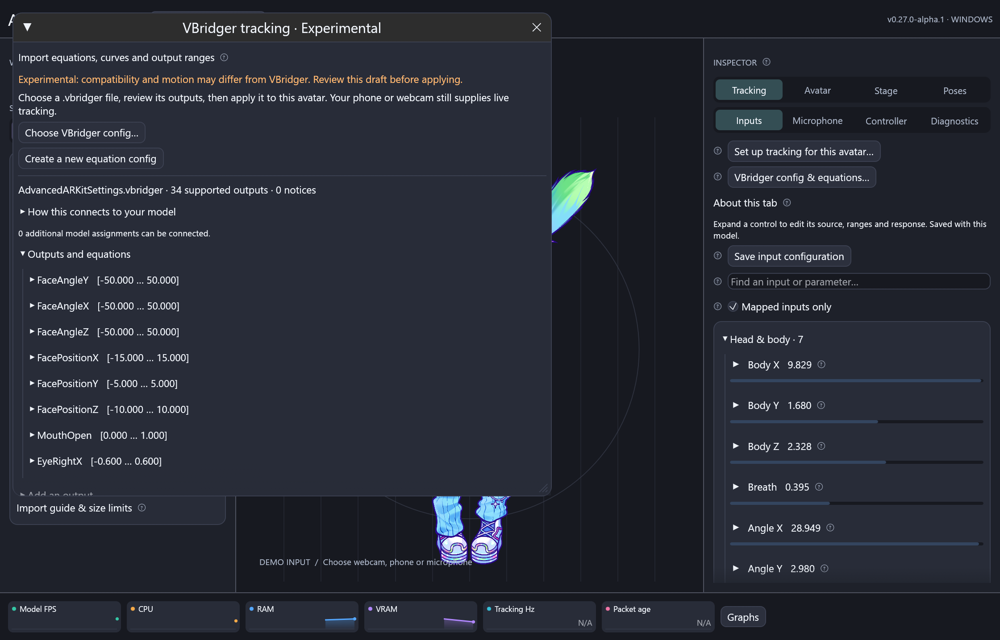

# VBridger tracking configs (Experimental)

**Experimental in v0.27.0-alpha.1:** import VBridger equations and edit tracking
configuration for each avatar. It works through ARIA's existing Live2D, PNG/GIF and VRM
parameter mappings; a config does not add missing tracking hardware or rigging.



## Import and connect

1. Load your avatar and connect an [iPhone/external tracker](tracking.md) or
   [webcam](webcam.md).
2. Open **Tracking → Import / edit VBridger config**, or **Inspector → Tracking →
   Inputs → VBridger config & equations**.
3. Choose a `.vbridger` file. Review its output names, ranges, equations, target
   parameters and any compatibility notices. Expanding a row opens its editor.
4. Click **Apply supported outputs to this avatar**. Cancel/close leaves the rig
   unchanged. Saved settings are per model and included in movement presets.
5. Check **Live imported values** and the missing-input list. Test up/down,
   left/right, lean, closed/open mouth and blinks separately. The pitch/yaw/roll
   correction switches never interchange axes.
6. For unmatched outputs, select their names in the model parameter's **Source**
   menu and tune input/output ranges. The import preserves customized mappings
   and can restore missing VTS assignments from the avatar's `.vtube.json`.

**Edit saved settings** opens a draft. **Apply** validates and saves it.
**Undo last import** restores the previous complete rig configuration. Use
**Poses → Presets** to save named movement configurations and assign hotkeys.
The imported channels replace ARIA's built-in gains, mirroring and personal range
calibration; ordinary model mappings, physics, expressions, pose controls and
responsive mouth smoothing still apply. Disable imported tracking to run the
ordinary personal range wizard, or tune imported input curves in this editor.

## Editable configuration

| Area | Controls |
| --- | --- |
| Outputs | Enable/disable, equation, min/default/max, face requirement, add/remove |
| Input response | Per-channel offsets; capture resting blendshape zero; input curves |
| Curves | Draggable keys, cubic tangents, weights, clamp/loop/ping-pong, linear/S presets, copy/paste |
| Delay | Per-output enable and milliseconds, up to 5 seconds |
| Smoothing | Per-output enable and 0–1 retention amount |
| Stepped animation | Trigger, target, absolute falling threshold, hold time, add/remove/sort, five-step preset |
| Tracking loss | Additional last-face hold time, then reset face-dependent outputs |
| External channels | Named numeric inputs and fallbacks for tool-supplied tracking |
| Storage | Per-avatar persistence, movement presets/hotkeys, complete JSON export and V2 output export |

Processing order is input offset/curve, equation, output curve/range, delay,
smoothing, steps, model mapping. The editor includes circled **?** articles.
These controls follow the concepts in the
[official modifier documentation](https://github.com/PiPuProductions/VBridger-Documentation/wiki/2.-VBridger-Base-Version#e-modifiers).

Supported expression operators: `+ - * / ^`, parentheses, unary signs, comparisons,
`&&`, `||`, and `!`. Functions: `sin cos tan asin acos atan atan2 sinh cosh tanh
abs sqrt log log10 exp round floor ceil sign min max clamp approx lerp if rand time`.
`if` supports quoted conditions/branches and evaluates only the selected branch.
Output references are ordered by dependency; raw ARKit aliases take precedence.
See the [official equation reference](https://github.com/PiPuProductions/VBridger-Documentation/wiki/3.-Editor-DLC#supported-mathematical-functions).

## Compatibility and limits

| Config / feature | Support |
| --- | --- |
| Supplied AdvancedARKitSettings | All 34 outputs imported and exercised locally |
| Encoded/plain V2 files | Supported |
| Legacy encoded JSON and `m_Curve` keys | Supported, with clamp infinity mode |
| Installed Advanced ARKit V2, V3, PlusVolume and Stepped presets | Imported, including expanded vector axes and steps |
| Installed PNGTuber and VisemesARKit presets | Imported; phoneme channels require external input |
| Installed VMC face/head configs | Imported as named numeric channels; no native VMC transport or automatic bone routing |
| Identical duplicate outputs | Merged with a notice; conflicting duplicates reject the file |
| Standalone VBridger input-curve files | Unverified; use editable input curves and ARIA complete JSON exports |
| Private/future modifiers or unknown functions | Reported; affected output is skipped |
| Old nonempty `stepDetails` arrays | Unverified; resave as V2 `stepDetails2` |

The local compatibility checks use the provided file and the ten installed
default configs without copying those third-party files into the repository.
Parsing/evaluation checks are not a guarantee of identical motion in VBridger.
Smoothing uses elapsed-time-adjusted lerp relative to 60 Hz. `time` and `rand`
use ARIA's simulation clock; random sequences and exact filter timing differ.
The original `faceSend` flag is retained for V2 export as metadata and does not
configure ARIA network routing. ARIA provides its own explicit face requirement.

Input offsets/curves, external declarations, axis corrections and face-loss
settings are included by **Export complete config** (`.json`). **Export .vbridger
outputs only** writes encoded V2 equations and output modifiers, with vector
channels expanded to scalars. Native VBridger reimport of ARIA-generated files
still needs an application-level compatibility check; ARIA round trips are tested.

Import limits: 2 MiB, 256 expanded outputs, 4096 bytes/512 nodes per equation,
64 curve keys and 64 steps per output, and 128 declared external inputs.
Malformed imports do not replace the current rig. Equations cannot run scripts,
read files, or make network requests. Delay history is bounded and runtime state
is reset when switching profiles/presets.

## External input example

ARIA's microphone provides `volume` from `MicLevel`. It does not classify phonemes.
A tool can send exact-name values in the optional `parameters` object of an
ARIA JSON packet, alongside normal tracking:

```json
{
  "version": 1,
  "face_found": true,
  "rotation": {"x": 0, "y": 0, "z": 0},
  "blend_shapes": {"jawOpen": 0.4},
  "parameters": {"volume": 0.7, "viseme_AA": 0.8, "viseme_SIL_abs": 0, "ChestX": 2.5}
}
```

VBridger-style `eyeBlink_L`/`eyeBlink_R` inputs resolve to raw ARKit left/right
shapes. Head inputs are separate pitch/yaw/roll coordinates relative to the
current neutral head origin. Missing shapes use zero; absent `viseme_SIL_abs`
uses one so the installed hybrid viseme/ARKit equations retain their face fallback.
External channel names are case-sensitive. Packets allow 128 additional numeric
channels, each finite and within ±1,000,000, under the existing 16 KiB UDP limit.
