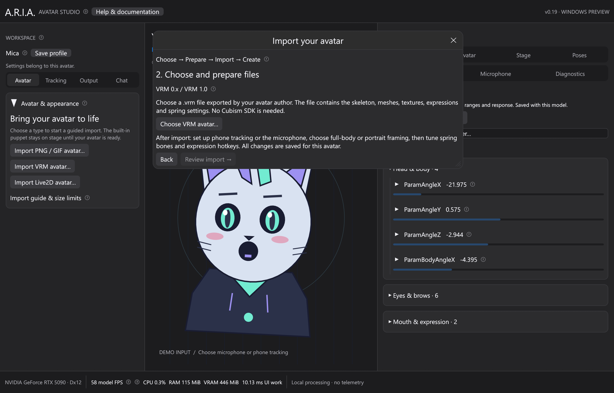

# VRM avatars on Windows

ARIA v0.19 supports primary VRM 0.x and VRM 1.0 avatars. The Rust runtime reads
the embedded humanoid, skins, facial morphs, textures and spring bones. Windows
renders them using wgpu/DX12. Unity and Cubism Core are not required for VRM.

## Import and run

1. Extract `aria-0.20.0-windows-x64.zip` and run `aria-desktop.exe`.
2. Open **Avatar & appearance → Import VRM avatar…**. If another avatar is active,
   use **Change avatar / type… → VRM 3D avatar**.
3. Choose a `.vrm` file, review its author, declared license and rig summary,
   then select **Import VRM avatar**. The file remains in its original location.
   Loading runs in the background with progress and cancellation. A failed import
   leaves the active avatar intact. Dropping a `.vrm` onto the stage opens this guide.
4. Open **Avatar → View** in the Inspector to choose full body or portrait framing,
   camera orbit/elevation, lighting, outlines and render quality.
5. Select **Save profile** to keep your settings. Camera, physics, mappings,
   expressions, shortcuts, poses and microphone settings belong to this avatar.

You can also supply a file at launch:

```powershell
.\aria-desktop.exe "C:\path\to\your-avatar.vrm"
```

From a source checkout, after installing the Windows Rust/C++ tools described
in [windows.md](windows.md):

```powershell
cargo run --locked --release -p aria-desktop -- "C:\path\to\your-avatar.vrm"
```

ARIA remembers the last VRM path and reopens it on the next launch. Moving the
file requires choosing its new location. Profiles use the content of the file
as their identity; re-exporting or editing the VRM creates a new identity.



## Phone tracking and microphone

Select **Tracking → VTube Studio (iPhone)** and follow the existing
[phone connection guide](tracking.md). Head yaw, pitch and roll drive separate
axes; the neck shares part of the head rotation. Calibrate while looking forward.
Eye opening drives blink morphs. Mouth opening drives the A/aa expression.
Gaze uses the exported eye bones or directional look expressions. Named ARKit
custom expressions get matching input bindings when the file exports them.
All bindings, ranges, response curves, stepping and holds remain editable in Inputs.

For microphone-only use, open **Tracking → Microphone**, choose a device and
enable talking control. Input amplitude drives mouth opening; this is not speech
recognition or phoneme detection. Automatic blinking is optional under VRM View.
The exporter must provide the relevant blink/mouth expressions for them to animate.

The initial arm position is relaxed by 65° from the exported T-pose. **Relax arms**
in Inputs/Pose controls ranges from 0° to 85°. Camera controls change the viewing
angle independently of tracking. Face tracking does not provide full-body or hand
tracking; untracked humanoid bones retain the authored pose and relaxed arms.

## Expressions, physics and poses

**Avatar → Expressions** lists embedded presets and custom expressions. Toggle
them, select one and assign your own shortcut. Use global hotkeys when another
app has focus. VRM expressions use `VRMExpression:<index>` parameters with friendly
names and weights from 0 to 1. Existing expression blending fades toggles over
0.15 seconds. Binary expressions switch at weights above 0.5. VRM 1.0 overrides
can block/reduce automatic blinking, mouth opening or gaze.

**Avatar → Springs** lists the actual groups from the imported file. Global and
group settings control enable, strength, inertia, stiffness/response, gravity and
side wind. Defaults apply the author's stiffness, drag, gravity and collision
radii. Click a group's circled **?** for its authored values. Settle motion resets
momentum; individual or overall reset buttons restore the original modifiers.
The solver uses fixed 60 Hz steps with sphere/capsule collision constraints.

**Poses → Pose controls** holds individual parameters or freezes the final pose,
including the spring rotations and automatic blink state, which are stored in
saved pose presets. Frozen frames skip further animation/rendering
until something changes. Camera adjustments and edits to held pose parameters
still refresh the avatar. **Presets** can save movement/pose configurations with
hotkeys. **Export PNG** uses the transparent avatar and stage composition.

## OBS and performance

Landscape, portrait and freeform outputs use the existing output controls,
Spout senders, backgrounds, chroma-color selection, dragging and mouse-wheel zoom.
They all share one transparent 3D render; they do not simulate three independent
avatars. Their camera angle is shared, while output position and scale are separate.
PNG/stage objects and throw/spray effects remain available. VRM surface pins follow the clicked triangle through skinning, morphs and camera
changes. Choose a pin point in Stage objects, then drag to adjust its offset.
Accessories are flat stage overlays with front/behind ordering; they do not
become 3D props or receive per-pixel depth occlusion.

VRM quality sets the transparent canvas height: 512, 1024, 1536, 2048, 3072 or 4096
pixels, with a 3:4 aspect ratio and four-sample anti-aliasing. Higher quality uses
more GPU memory and rendering time. The default 1152 × 1536 canvas consumes about
61 MiB for its color, depth and anti-aliasing attachments, plus the avatar assets.
OBS resolution is configured separately and remains full size even when its
desktop preview is small. The bottom bar reports process CPU, RAM and GPU memory.

Mesh accessors shared by materials remain shared. Skinning runs on the GPU;
only morph meshes whose expression weights change are uploaded again. Textures
are decoded once per referenced image and CPU texture copies are released after
GPU upload. Lower canvas quality or frame rate when sharing the GPU with a game.

## Compatibility in this release

- VRM 0.x and 1.0 embedded GLB files; triangle meshes, joint weights, inverse-bind
  transforms, sparse/regular morph accessors, expression weights and bone/expression
  eye look. The two versions' facing directions are normalized at import.
- MToon-style base/shade/normal/emissive/matcap textures, tint/rim colors, cutout and
  alpha blending, double-sided/cull modes and world-space outlines. Rendering is an
  approximation and can differ from Unity's MToon appearance.
- VRM 0 secondary-animation chains and VRM 1 spring joints with sphere/capsule
  colliders. Not full physical body simulation, cloth simulation or rigid-body hits.
- No material-color/texture-transform expression binds, node-constraint evaluation,
  embedded animation playback, UV animation, outline-width textures, screen-space
  outline modes, full PBR lighting or extended inside/plane colliders. Unsupported
  required extensions fail import; detected optional expression/constraint features
  appear in Model details. A `.glb` without VRM humanoid metadata is not accepted
  as a primary VRM avatar.
- Limits: 512 MiB file; 32 MiB JSON; 2 GiB decoded texture data; texture source
  dimensions up to 16384, fitted to the GPU limit (at most 8192); two million unique
  vertices, six million indices, 4096 nodes, 256 materials/expressions/spring groups.
  Valid files within these bounds still need sufficient RAM and GPU memory.

The author-defined license and permissions in each avatar still apply. ARIA does
not copy or publish imported avatars. The test artist's avatar and SDK binaries
are not included in the source or release package.

## Repeatable local verification

```powershell
.\scripts\test-vrm.ps1 -Vrm "C:\path\to\your-avatar.vrm"
```

This runs generated VRM 0.x/1.0 parser, malformed-file and spring tests, renders
both generated versions on DX12, then imports the supplied file in place and
checks tracking, expressions and frozen frames. See [validation.md](validation.md)
for the measured local results. Normal workspace tests do not require private art.

Format references: [VRM 0.x](https://github.com/vrm-c/vrm-specification/tree/master/specification/0.0),
[VRM 1.0](https://github.com/vrm-c/vrm-specification/tree/master/specification/VRMC_vrm-1.0),
[spring bones](https://github.com/vrm-c/vrm-specification/tree/master/specification/VRMC_springBone-1.0),
[MToon](https://github.com/vrm-c/vrm-specification/tree/master/specification/VRMC_materials_mtoon-1.0).
