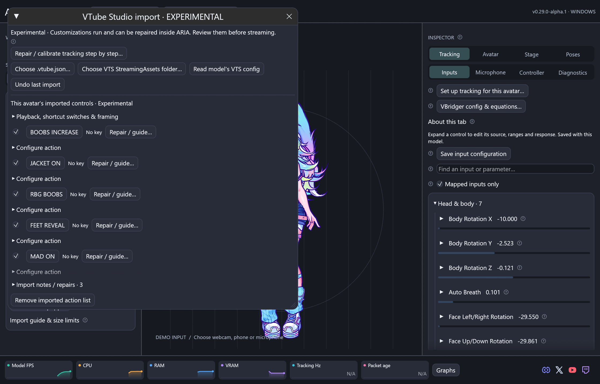
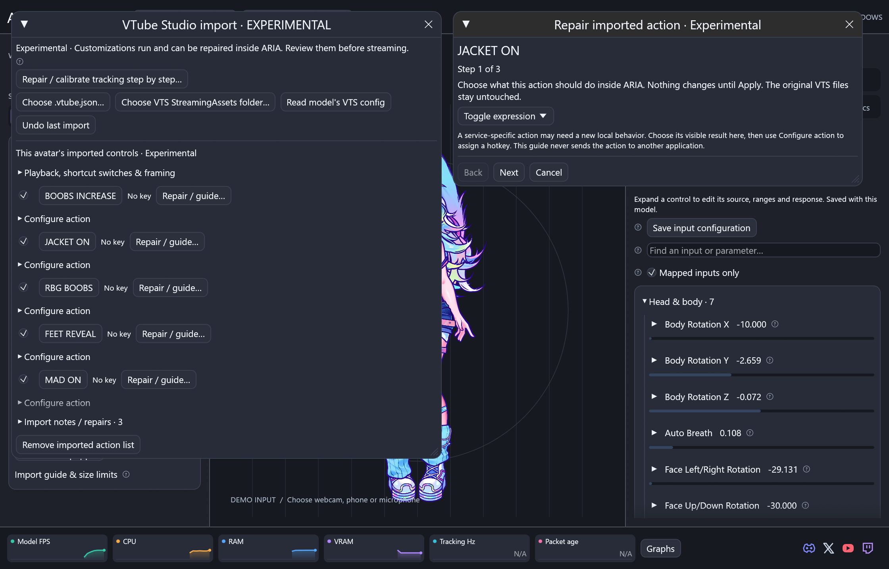

# VTube Studio import — Experimental



This feature transfers customizations into ARIA. Keep a backup of the original
VTube Studio model folder. ARIA reads the export without modifying it.

## Before you begin

1. Install the current ARIA Alpha and the correct native Cubism Core for your
   operating system. Follow the [README setup instructions](../README.md#first-time-setup).
2. Keep the `.moc3`, `.model3.json`, `.vtube.json`, texture folders,
   `.exp3.json`, `.motion3.json` and `.physics3.json` files together.
3. For item scenes, keep the VTube Studio `StreamingAssets` folder structure:

```text
StreamingAssets/
  Live2DModels/Your avatar/...
  ItemScenes/Your scene.itemscene.json
  Items/Your image.png
  Items/Your animation/1.png, 2.png, ...
  Items/Your Live2D item/item.model3.json, ...
```

The original app does not need to run. No imported action is sent to it.

## Import one model

1. Open **Avatar & appearance**, choose **Live2D**, and follow the guided import.
   Select the `.model3.json`, `.moc3`, model folder or matching `.vtube.json`.
2. After the avatar loads, open **Import VTube Studio · Experimental**. A model
   that has not imported customizations offers its sidecar automatically.
3. Click **Read model's VTS config** or **Choose .vtube.json**. The config must
   belong to the loaded avatar. Selecting a file previews it; it does not apply it.
4. Review actions, expressions and notices. Select the categories to transfer.
   Framing and whole-model sway are optional because VTS and ARIA cameras differ.
5. Click **Apply selected customizations**. The settings save for this avatar.
   **Cancel preview** discards the preview. **Undo last import** restores the
   ARIA profile and physics multipliers from before the import.

Reimporting replaces this avatar's previous VTS action list when that category is
selected. Existing ARIA shortcuts remain; conflicting imported keys become buttons
until reassigned. Original model exports are not overwritten.

## Use and adjust the imported controls

Click an action button to test it. **Configure action** edits the name, shortcut,
enabled/global state, duration and expression fade. Windows supports number-row
and numpad keys separately, modifiers, mouse buttons and multi-key chords such as
W + CapsLock. Global keys need the per-avatar global master switch. On macOS and
Linux, imported key handling is limited to keys exposed to the focused ARIA window;
assign another local shortcut when necessary. Phone screen buttons use the incoming
VTS tracking packet's hotkey ID. Repeat packets do not repeatedly toggle an action.

Expression hold and automatic expiration pause with frozen poses. Motion playback
supports linear, Bezier, stepped and inverse-stepped curves; parameter, part-opacity,
eye-blink/lip-sync group and model-opacity tracks. **Stop animation / return to idle**
ends a triggered clip. Idle and lost-tracking animations are model-owned.

Physics strength/wind and group multipliers use ARIA's solver. Proprietary VTS
filters, legacy physics timing and camera coordinates are not pixel-identical.
Use **Physics** for fine tuning and the optional stage framing/sway controls to
match your preferred look. Both this importer and VBridger import are Experimental.

## Repair a missing or incompatible customization



Every imported action has **Repair / guide…**. It stays inside ARIA:

1. Choose the intended local behavior: expression, motion, item scene, model move,
   clear expressions, hide items or physics toggle.
2. Locate its files or choose the replacement setting. Keep expressions and motions
   inside the avatar folder. Item files may live in your own artwork library.
   Select an animation folder for a PNG/JPG sequence, or a Live2D item export.
3. Review and click **Apply and test in ARIA**. No change is applied if validation
   fails. Close/cancel to keep the previous configuration.

For complete original scenes, choose the correct **VTS StreamingAssets folder**,
then read the config again. ARIA prefers `Items` over staging/cache copies. A
missing file cannot be reconstructed from its name; locate your original or choose
replacement artwork. Under **Objects**, drag imported items into place and use
**Pick pin** to correct an anchor. Pins use mesh and vertex identities; changes to
the model export may require repinning.

For tracking problems, click **Repair / calibrate tracking step by step…**. The
existing illustrated calibration guide handles one variable at a time and lets
you repeat takes. Use Inspector input mappings for unusual custom parameter IDs.
Account credentials and external service authorization are not imported. Assign
an ARIA hotkey/input or use ARIA's [authenticated API](api.md) for your own code.

## Report a problem

Click **Diagnostics / export logs**, describe the steps and export the report.
It includes model-specific metadata, recent errors and import notices. Attach it
to the GitHub issue or Discord ticket linked after export. See [diagnostics](diagnostics.md).
Share screenshots only when you have permission; never upload a paid model or SDK.

## Technical references

The adapter reads local JSON and executes ARIA's native controls. Format references:
[VTS public documentation](https://github.com/DenchiSoft/VTubeStudio) and
[Cubism motion3 specification](https://github.com/Live2D/CubismSpecs/blob/master/FileFormats/motion3.json.md).
Compatibility is validated against local exports; no third-party model assets
or proprietary VTS/Cubism runtime code are distributed with this feature.
