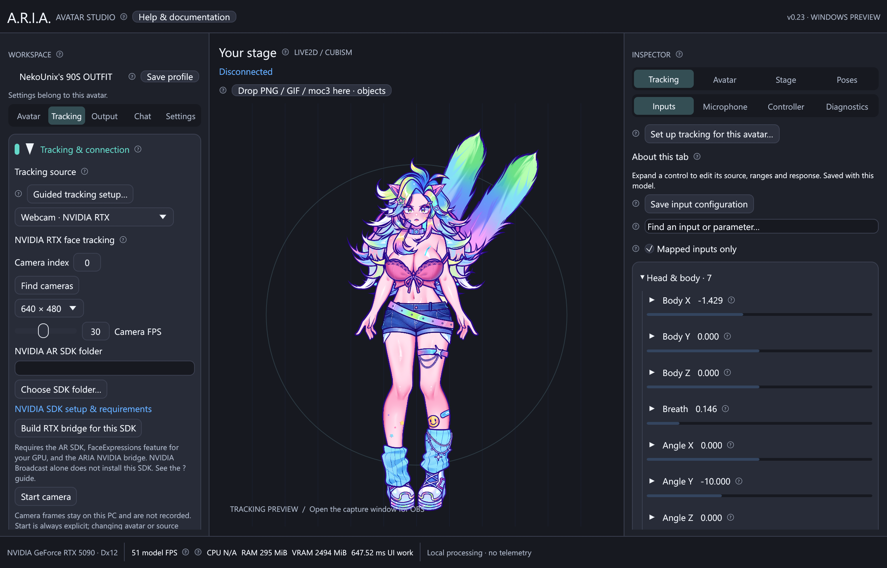

# Webcam and NVIDIA RTX tracking


Open **Tracking → Tracking source** and choose **Webcam · MediaPipe** or
**Webcam · NVIDIA RTX**. Both feed the same input mappings, expressions and
[personal calibration guide](tracking-setup.md) used by iPhone tracking. They work
with Live2D, VRM and PNG/GIF avatars. Start is explicit; importing another avatar,
changing source or closing ARIA stops capture. Video stays in an owned local
process and is neither recorded nor uploaded.

## Standard webcam: first setup

1. Install **Python 3.12 x64** from [Python for Windows](https://www.python.org/downloads/windows/),
   including the Python launcher. Restart ARIA if the launcher was just installed.
2. Expand **Install / repair camera runtime** and click **Install webcam runtime**.
   This creates an isolated environment at `%LOCALAPPDATA%\ARIA\tracking`, installs
   the versions in `tracking/requirements-lock.txt`, and downloads Google's
   FaceLandmarker model with a pinned SHA-256 check. Internet is needed only for setup.
   Your system Python packages are not changed. A failed setup can be retried.
   Use a dedicated ARIA runtime folder. Repairing an older installation removes
   the obsolete protobuf/JAX/scientific packages that MediaPipe 1 no longer needs.
3. Click **Find cameras** and select a device. An index can also be entered manually.
   Windows DirectShow supplies the device list. Start with **640 × 480, 30 FPS**.
4. Press **Start camera**. The avatar moves when a face is detected. Use **Stop camera**
   to release the camera before opening it in another application.
5. Run **Guided tracking setup**: neutral pose, head movement, face expressions,
   gaze, then review and save. Repeat for each avatar or camera position.

If you already have an environment, choose its `Scripts/python.exe` under Advanced;
`face_landmarker.task` must be in that environment's root. Developer setup:

```powershell
./scripts/setup-webcam.ps1
# Or choose an existing base interpreter and isolated destination:
./scripts/setup-webcam.ps1 -Python 'C:\Python312\python.exe' -Destination 'C:\ARIA-camera'
```

The Rust app remains native; the optional Python worker runs MediaPipe inference
and OpenCV capture. Only finite, bounded tracking numbers cross its stdout pipe.
There is one latest-frame mailbox, no video backlog, and no tracking network port.
Face loss is explicit; a stalled worker loses freshness after one second.

## NVIDIA RTX: SDK-backed inference



This is an **optional experimental SDK integration**. NVIDIA Broadcast can supply
a virtual camera, but Broadcast alone does not install the facial inference SDK.
ARIA does not switch to CPU inference under an RTX label when the SDK is missing.

1. Install the standard camera runtime above; both backends share OpenCV capture.
2. Sign in to NVIDIA NGC and obtain [NVIDIA AR SDK Core](https://catalog.ngc.nvidia.com/orgs/nvidia/maxine/resources/ar_sdk_core/-).
   Download the Windows x64 package and extract it to a writable folder, for example
   `C:\SDKs\NVIDIA-AR`. Access is governed by NVIDIA's program and license terms.
3. Follow [NVIDIA's installation guide](https://docs.nvidia.com/maxine/ar/latest/WindowsARSDK/InstalltheARSDK.html).
   Install matching **nvARFaceExpressions**, **nvARLandmarkDetection** and
   **nvARFaceBoxDetection** features for your GPU using the SDK's `install_feature.ps1`.
   Core alone contains no feature models. Keep the package's directory structure.
   Install the driver required by your SDK release; use NVIDIA's hardware list.
4. Install Visual Studio 2022 C++ Build Tools and CMake. Select the SDK root in
   ARIA and click **Build RTX bridge for this SDK**, or run:

   ```powershell
   ./scripts/build-nvidia-bridge.ps1 -Sdk 'C:\SDKs\NVIDIA-AR'
   ```

   This compiles the small C++ bridge against **your SDK headers and libraries**
   and installs `aria-nvar.dll` into that SDK root. It does not download, bundle
   or redistribute NVIDIA binaries. Ambiguous core import libraries are rejected
   by CMake; use a clean SDK tree with matching x64 features.
5. Select **Webcam · NVIDIA RTX**, choose your camera and SDK root, then Start.
   Initial model loading can take longer than subsequent frames. SDK errors are
   shown in the camera panel. Check feature versions and GPU compatibility first.

The bridge requests head quaternion, face bounding boxes, landmarks and the
53-coefficient FaceExpressions layout. ARIA converts it to canonical pitch/yaw/roll
and named blendshapes, merging paired brow-inner-up and cheek-puff values for
existing ARKit-style bindings. Unknown coefficient layouts are rejected.

**Validation boundary:** MediaPipe inference was tested with Google's public face
fixture; installed Windows virtual cameras were enumerated. The NVIDIA bridge's
source and coefficient/axis conversions are implemented, but native SDK compilation
and RTX inference require the SDK and feature packages and were not verified on
this development machine. No physical webcam was connected during validation.

## Tuning and troubleshooting

| Control / symptom | What to do |
| --- | --- |
| Camera index | Device indices can change when hardware or virtual cameras change. Refresh the list. |
| Resolution / FPS | These are requested modes; drivers can negotiate alternatives. Higher values cost more CPU/GPU time. |
| Confidence | MediaPipe detection threshold, 0.10–0.99. Start at 0.50; it does not control movement strength. |
| Face not found | Face the camera in even lighting. Check that a virtual camera is actually producing a human face. |
| Camera unavailable | Allow desktop camera access in Windows privacy settings; release exclusive capture in other apps. |
| Tracking is backwards | Check pitch/yaw/roll inversion in Movement, then repeat guided calibration. |
| Weak or excessive motion | Calibrate this avatar. Tune input ranges only after checking neutral and comfortable extremes. |
| Signal lost | Reconnect the camera, stop/start capture, and inspect the worker's message. Stale poses are not reused. |
| Talking conflicts | Disable microphone mouth override when you want camera-based mouth motion. |
| NVIDIA load error | Verify the bridge, all three matching features, NVIDIA driver, GPU support and SDK model paths. |

Camera device, resolution, rate and confidence are per-avatar preferences. Interpreter
and SDK paths are machine preferences. A Python worker never opens its own UI window.
Neither camera backend supplies reliable tongue-out tracking. Precise facial matching
depends on camera quality, lighting, the model's rig and personal calibration.

See [MediaPipe's official FaceLandmarker guide](https://ai.google.dev/edge/mediapipe/solutions/vision/face_landmarker/python)
for its outputs and [NVIDIA's sample implementation](https://github.com/NVIDIA-Maxine/AR-SDK-Samples/tree/main/apps/ExpressionApp)
for the native feature contract. [Third-party notices](../THIRD_PARTY.md) cover the
separately installed runtimes.
